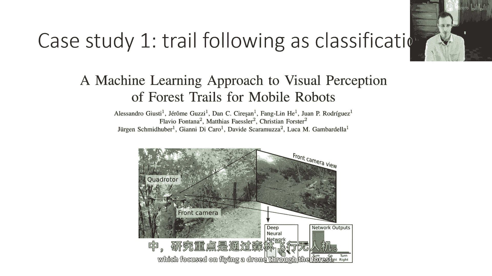
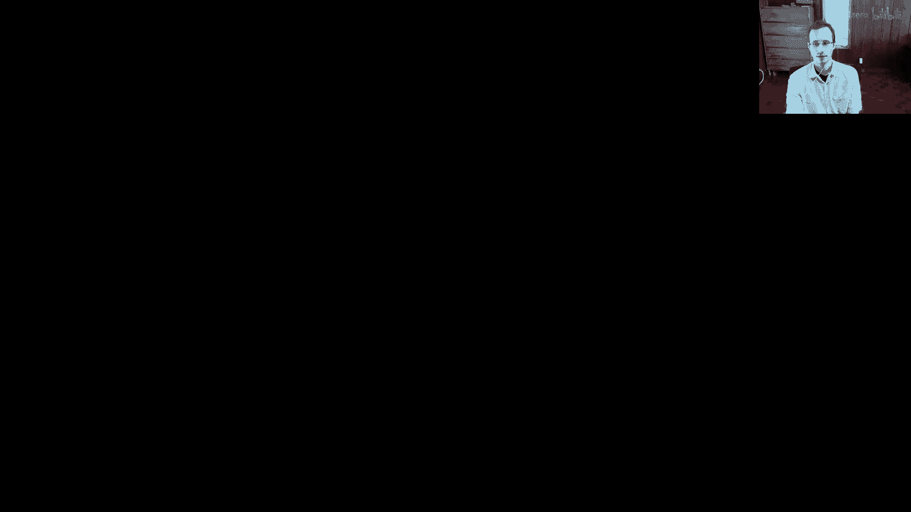
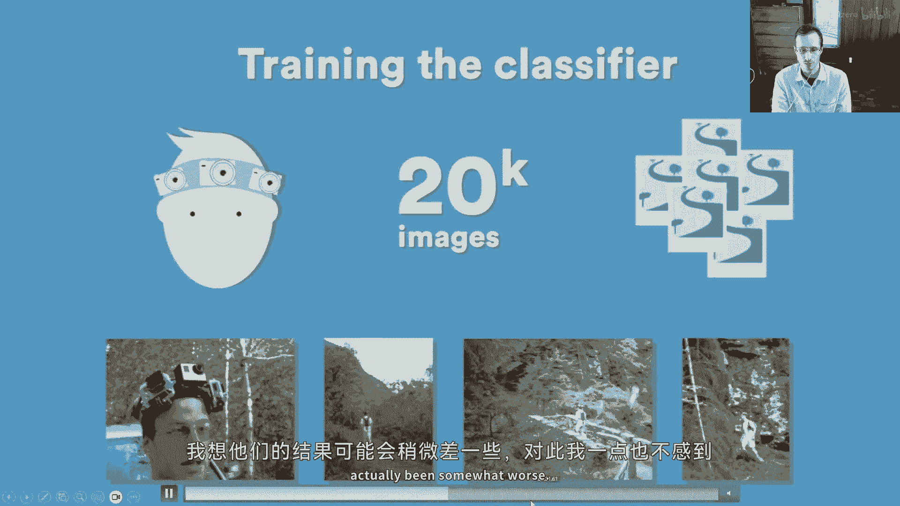
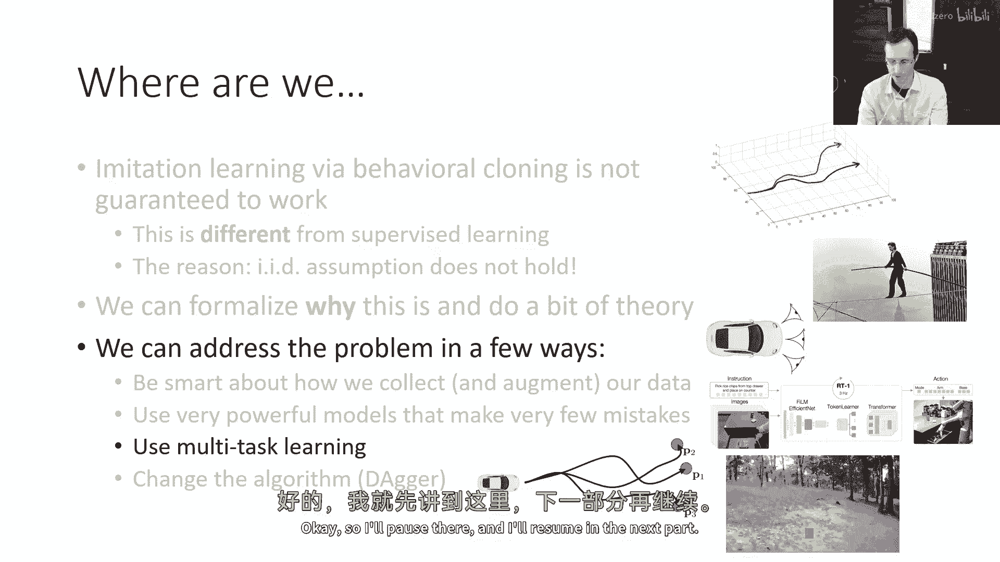

# 6：模仿学习（第三部分） 🧠

在本节课中，我们将学习如何通过一系列实用技巧来改进行为克隆，使其在实际应用中更有效。我们将探讨如何通过巧妙的数据收集、使用强大的模型以及改变算法本身来应对模仿学习中的挑战。

---





## 使行为克隆更有效的方法

上一节我们讨论了行为克隆的理论局限，本节中我们来看看如何通过一些实用方法来解决这些问题。



### 数据收集与增强

行为克隆的困难在于累积错误。如果数据集中只包含完美的专家轨迹，一旦策略犯了一个小错，就会进入一个未见过的状态，导致性能下降。然而，如果数据集中本身就包含了一些错误以及专家对这些错误的纠正，那么策略就能学会如何从错误中恢复。

以下是利用这一洞察的几种方法：

1.  **故意引入错误**：在数据收集过程中，可以有意地让专家犯一些错误，并记录下他们如何纠正。这样，策略就能学习到在多种状态下（包括非理想状态）应采取的正确行动。
2.  **数据增强**：利用领域知识创建额外的“假”数据。例如，在自动驾驶中，可以使用多个摄像头（如前、左、右）的视角，并将侧方摄像头的画面标记为转向动作，从而模拟车辆处于不同位置时的状态。

这两种技巧的目标是一致的：为策略提供更多样化的状态示例，特别是那些专家可能不会主动访问、但策略在执行时可能误入的状态。

#### 案例研究：森林无人机导航

在一篇关于森林无人机导航的论文中，研究人员没有直接驾驶无人机，而是让人戴着装有三个摄像头的帽子在徒步路线上行走。他们将前方摄像头的画面标记为“直行”，左方摄像头的画面标记为“右转”，右方摄像头的画面标记为“左转”。这种简单的数据增强方法显著提升了模仿学习的性能。

#### 案例研究：机器人操作

另一篇关于机器人操作的论文使用了一个廉价且不精确的机械臂。在演示过程中，人类操作者不可避免地会犯错误。然而，正是这些错误和随后的纠正数据，使得训练出的策略能够很好地从干扰和错误中恢复。

---

## 技术解决方案：提升模型表达能力

除了改进数据，我们还可以通过使用更强大的模型来直接降低拟合误差（ε），从而减少累积错误的影响。策略无法完美拟合专家行为的原因主要有两个：**非马尔可夫行为**和**多模态行为**。

### 处理非马尔可夫行为

人类的行为往往依赖于整个历史观察，而不仅仅是当前状态（即非马尔可夫）。例如，司机在注意到盲区有车后，即使回头看向前方，其后续驾驶行为也会受到影响。

**解决方案**：使用能够处理历史观察序列的策略表示。我们可以使用序列模型，如LSTM或Transformer。

```python
# 伪代码示例：使用LSTM处理观察历史
observation_history = [frame_t-2, frame_t-1, frame_t]
encoded_history = [encoder(frame) for frame in observation_history]
lstm_output = lstm(encoded_history)
action = policy_head(lstm_output)
```

**注意**：使用历史观察有时可能加剧数据中的虚假相关性（例如，将“刹车灯亮”与“需要刹车”错误关联，而忽略了“前方有行人”这一真实原因）。这被称为因果混淆问题。

### 处理多模态行为

在某些状态下，可能存在多个合理的行动（例如，在树前可以选择向左或向右绕行）。如果策略使用简单的单峰分布（如高斯分布）来输出连续动作，它会将“向左”和“向右”的样本平均，得到一个“直行”的错误动作。

以下是几种处理多模态行为的方法：

1.  **高斯混合模型 (GMM)**：让神经网络输出多个高斯分布的均值、协方差和混合权重。这允许策略表示多个模式。
    *   **公式**：策略输出参数 `{ (μ_i, Σ_i, w_i) }`，其中 `i=1...K`，动作分布为 `π(a|s) = Σ_i w_i * N(a | μ_i, Σ_i)`。
2.  **潜变量模型 (如条件变分自编码器, CVAE)**：为策略网络引入一个额外的随机输入 `z`（潜变量）。网络学习根据不同的 `z` 输出不同的行动模式。训练时需要特殊技巧（如CVAE）使 `z` 与模式相关联。
3.  **扩散模型**：借鉴图像生成领域。训练时，向真实动作添加噪声，并训练网络去噪。测试时，从纯噪声开始，通过多步迭代去噪生成动作。这种方法能生成非常复杂的分布。
4.  **自回归离散化**：将高维连续动作的每个维度离散化成多个“桶”。然后使用序列模型（如Transformer）自回归地预测每个维度的离散值。这类似于语言模型预测下一个词。
    *   **过程**：`P(a|s) = P(a_0|s) * P(a_1|s, a_0) * P(a_2|s, a_0, a_1) ...`

#### 案例研究

*   **扩散模型**：在机器人操作任务中，使用扩散模型作为策略，可以从图像输入去噪生成动作轨迹，成功完成抓取、涂抹等复杂任务。
*   **潜变量模型**：结合Transformer，使用一个“风格”潜变量来解释人类演示中的变化，提高了策略的灵活性和表达能力。
*   **自回归离散化 (RT-1)**：谷歌的RT-1模型将机器人的每个动作维度离散化，使用一个以图像和语言指令为条件的Transformer模型，自回归地预测动作序列，从而能够执行多种语言指令下的任务。

---

## 总结



本节课我们一起学习了如何改进模仿学习中的行为克隆方法。我们首先探讨了通过**精心设计数据收集**（引入错误与纠正）和**数据增强**来提供更鲁棒的训练数据。接着，我们分析了策略拟合不佳的两个核心原因：**非马尔可夫行为**和**多模态行为**。针对前者，我们可以使用**序列模型**来处理历史信息；针对后者，我们可以采用**高斯混合模型**、**潜变量模型**、**扩散模型**或**自回归离散化**等更强大的模型来表示复杂的动作分布。这些技术使得模仿学习能够处理更现实、更复杂的任务。