# 7：模仿学习 第4部分 🧠

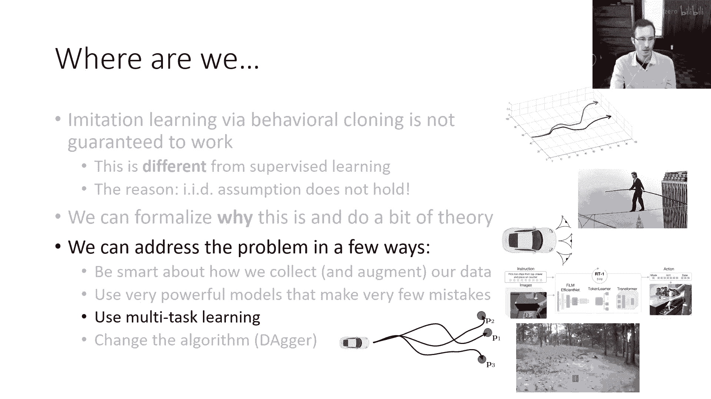

在本节课中，我们将要学习几种算法方法，这些方法可以提升行为克隆的性能。我们将首先探讨多任务学习如何使模仿学习变得更有效。

---

## 多任务学习与目标条件行为克隆 🎯

上一节我们讨论了行为克隆面临的复合误差问题。本节中我们来看看一种改进方法：多任务学习。这初看可能有些矛盾，但事实证明，同时学习多个任务有时能让模仿学习变得更容易。

假设你想训练一个代理，例如让车辆驶向特定地点 `p1`。你可能拥有许多驶向地点 `p1` 的演示数据，并训练一个给定状态 `s` 的策略 `π(a|s)`。这是一件相当直接的事情。但我们之前讨论过，如果你希望训练出的策略足够鲁棒，以减少复合误差的影响，你可能需要专家数据中包含一些错误及从错误中恢复的状态。

如果你没有这种“不完美”的专家数据，但拥有专家尝试驾驶到许多不同地点的数据，你可以这样做：训练一个策略，该策略接收**期望目标位置**作为额外输入。获取这个目标位置的方法是，查看人类专家在轨迹中最后实际到达的状态。然后，你将训练一个策略以达到任何目标位置 `p`。

这种方法的有趣之处在于：如果专家尝试去许多不同的位置，他们将访问许多不同的状态。通过将策略条件化于目标位置，你仍然能得到针对目标 `p1` 的策略，但你会获得更多的训练数据。更重要的是，你能从许多不同的状态获取数据，这些状态可能是专家如果只追求最优到达 `p1` 时不会访问到的。

在训练时，你可以进行**目标条件行为克隆**。你可能收到一系列轨迹，甚至没有明确说明专家意图。它们只是一系列状态和动作。你假设专家所做的任何事情，都是达到其最终实际状态的好例子。因此，你将每个轨迹的最后一个状态作为策略的额外输入，并训练策略去采取专家在轨迹中采取的动作。

这将为你提供覆盖更广的训练状态，并有望提供许多可供学习纠正的实例。在这种情况下，尽管你仍然会遭受分布偏移（即可能进入不熟悉的状态），但对于你指定的特定目标，该状态可能对其他目标而言是熟悉的。另一个好处是，你可以利用那些并非最优的数据（例如专家未能到达位置 `p1`，但在其他位置成功了），并从中学习。

以下是目标条件行为克隆的核心步骤：
1.  对于每个演示轨迹，获取其最终状态作为目标 `g`。
2.  对于轨迹中的每个时间步 `t`，将状态 `s_t` 和目标 `g` 一同作为策略的输入。
3.  最大化演示中动作 `a_t` 的对数概率，给定状态 `s_t` 和目标 `g`。

其目标函数可以表示为：
`max_θ Σ_t log π_θ(a_t | s_t, g)`
其中 `g` 是轨迹的最终状态。

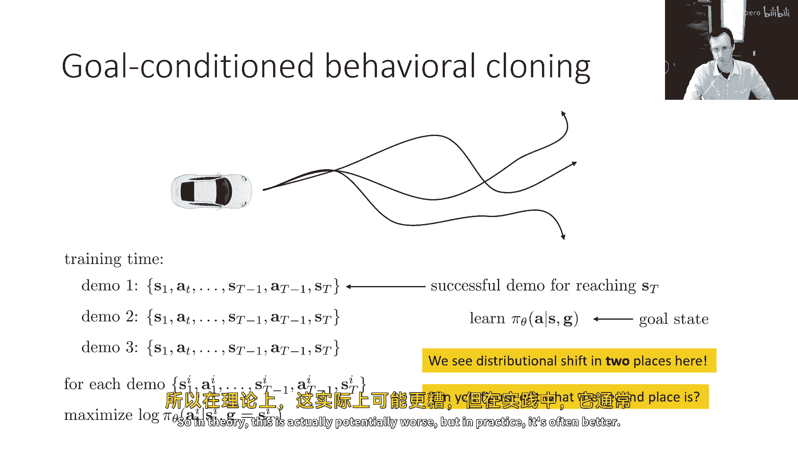

这里需要注意一点：尽管在实践中这通常效果更好，但在理论上，这种方法实际上存在两个分布偏移问题。除了之前讨论的策略状态分布 `p_π(s)` 与数据分布 `p_data(s)` 之间的偏移外，还存在第二个偏移源。这部分留作思考题，我们可以在课堂上进一步讨论。

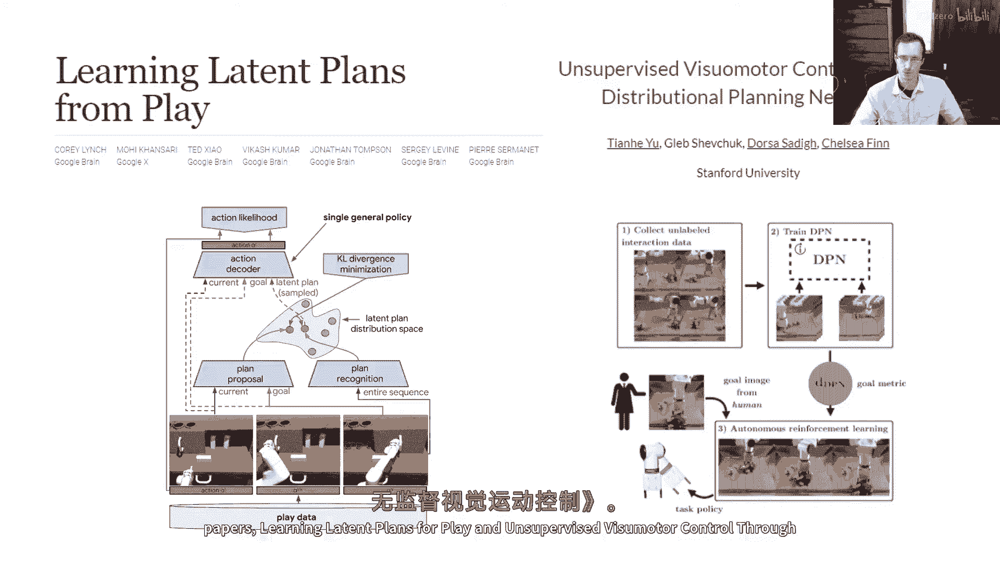

---

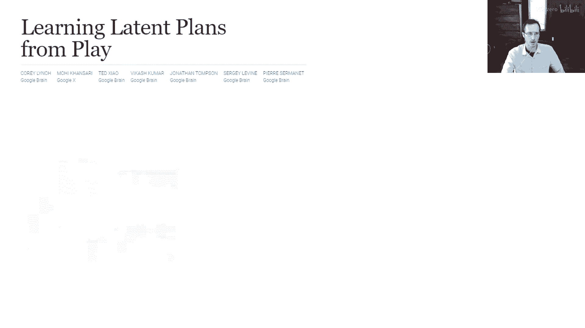

## 实践案例：从玩耍中学习 🕹️

现在，让我们看看一些已经应用了目标条件行为克隆的研究工作。这个方法可以说由《通过隐式规划网络学习玩耍》和《无监督视觉运动控制中的隐式规划》这两篇论文广泛推广。

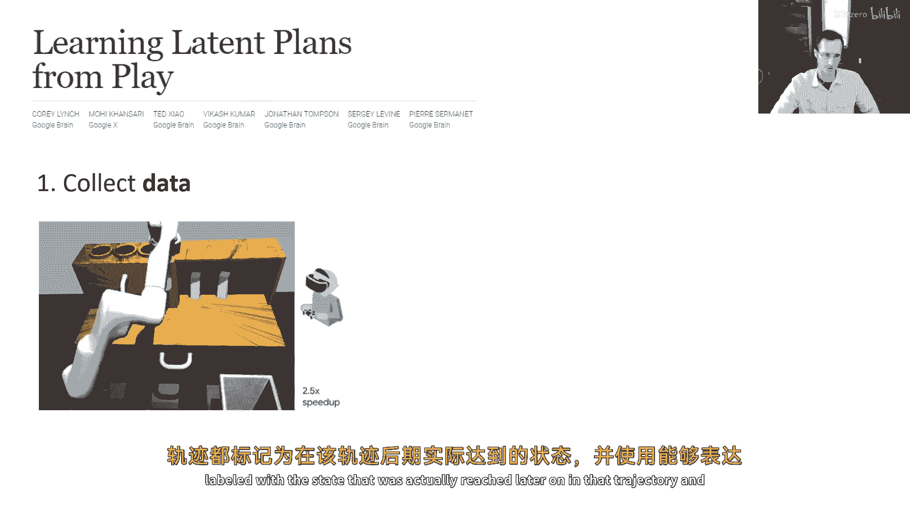

我将先谈谈《从玩耍中学习隐式规划》。其核心概念是收集数据：让人类在环境中随意玩耍，而不是执行特定任务。在这个数据集中，人们使用VR控制器控制模拟机器人，执行各种随机但有意愿的行为。这当然覆盖了许多不同的状态。

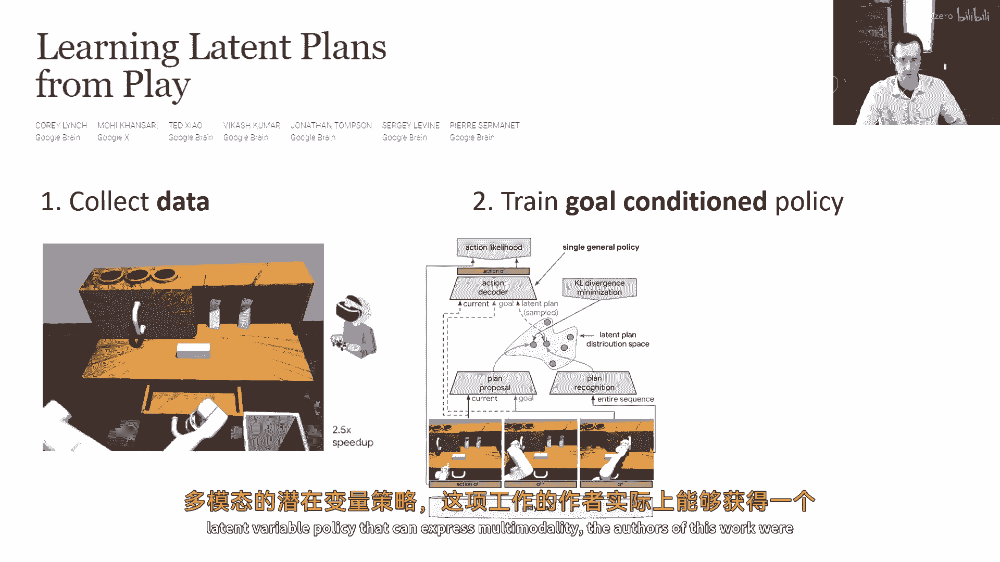

在这种数据上训练策略，将很难遇到分布外的状态，因为几乎所有合理状态都在数据中出现过，或至少非常相似。但当然，每个轨迹在执行什么任务并不明确。通过处理这些数据并执行**目标重标记**——将每个轨迹标记为“达到其最终实际达到的状态”——然后使用能够表达多模态的隐变量策略进行训练，这项工作的作者能够获得可达到广泛目标的有效策略。

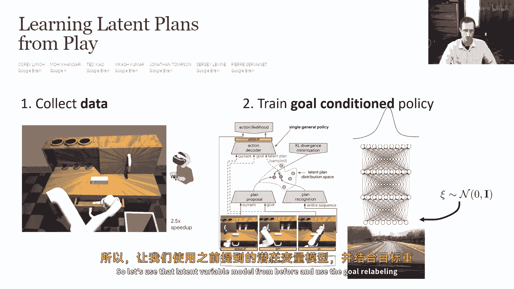

你可以得到一个策略，当你给它一个目标（例如门关闭的状态或抽屉打开的状态），机械臂会自动执行相应操作。因此，你可以看到它在单一策略中执行了相当多的行为。

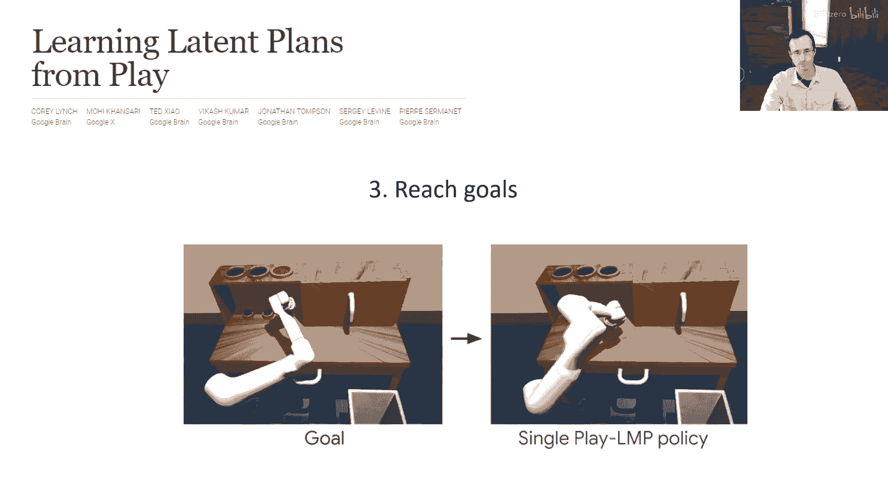

---

## 在线自我改进与大规模应用 🚀

与这些目标条件行为克隆方法相关的一件有趣的事情是，你可以用它们作为**在线自我改进**的方法，这与强化学习的精神非常相似。想法是：你可以从一个随机策略开始，将这些随机策略产生的数据视为“达到实际所达状态”的演示，对这些随机轨迹达到的状态进行重标记，然后用它来改进策略，接着再次运行改进后的策略。

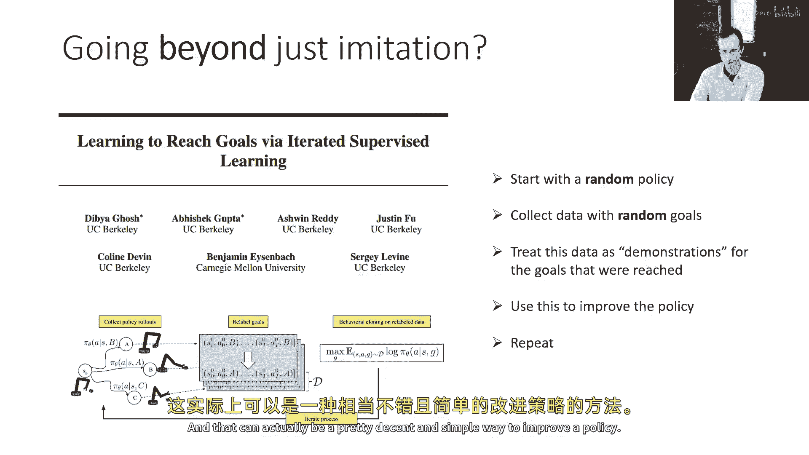

其思想是：最初策略主要执行随机动作，然后它学习到导致实际达到某些状态的行为，在下一次迭代中它可以变得更有目的性。这个方法仅迭代应用“目标重标记的模仿学习 -> 数据收集 -> 更多重标记 -> 更多模仿”的循环，这实际上可以成为一种相当不错且简单的方法来改进策略。

这些目标条件行为克隆方法的另一个优点是**可扩展性**强，因此可以在大规模上应用。

下一个案例研究来自论文《One Policy to Control Them All》。这项工作开发了一种用于驾驶地面机器人的策略（还不是自动驾驶汽车，但是小规模地面机器人），并且可以泛化到许多不同类型的机器人。它是一种目标条件模仿学习方法，输入当前观察、目标图像以及历史观测（以处理部分可观测性问题），然后输出动作。

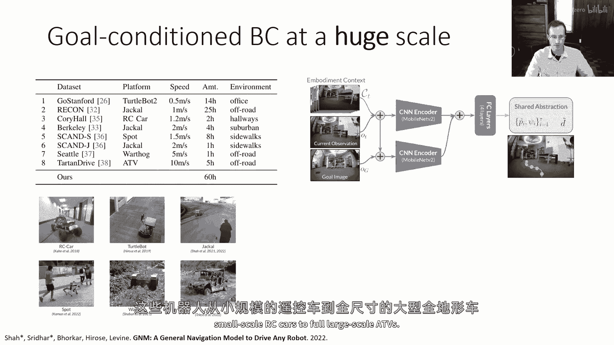

它在大规模的机器人数据上训练，这些数据来自许多不同类型的机器人，从小型遥控车到全尺寸自动驾驶车辆。这个策略的酷之处在于，它可以泛化到从未训练过的新类型机器人上，例如视频中的无人机。通过从大量不同车辆上训练，它可以在没有任何针对无人机训练的情况下控制无人机。它使用了我们讨论过的一些想法：目标重标记技巧，以及通过拼接帧或序列模型（如Transformer）来处理历史信息。

最后想提及的一篇论文是《Hindsight Experience Replay》（后视经验回放），它引入了一个非常相似的原则。我们稍后会更详细地讨论离策略强化学习，这里只想提到这篇论文，因为它在这个研究背景下经常出现。它并非在做目标条件行为克隆，而是将这种“后视”重标记方法应用于离策略RL和演员-评论员方法中。这也是一个被广泛使用的想法。

---

## 总结 📝

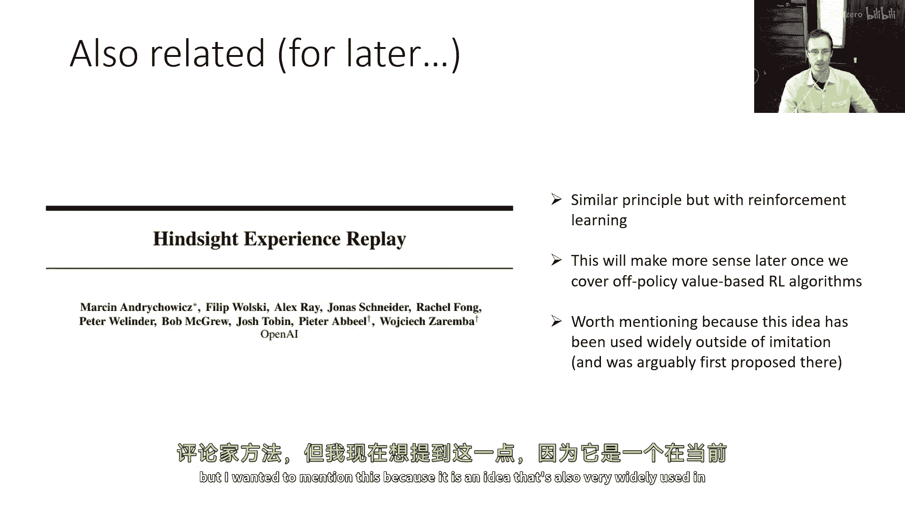

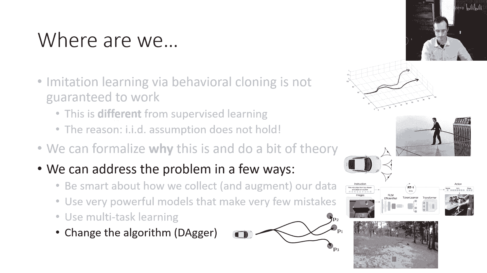

本节课中我们一起学习了如何通过算法改进行为克隆。我们重点探讨了**多任务学习**和**目标条件行为克隆**，通过将策略条件化于目标状态，利用更丰富的数据来提升策略的鲁棒性和泛化能力。我们还通过《从玩耍中学习》和《One Policy to Control Them All》等案例，看到了这些方法在实践中的应用，包括从非结构化数据中学习以及实现跨机器人的策略泛化。最后，我们了解到这种目标重标记的思想甚至可以用于策略的在线自我改进，并与强化学习中的后视经验回放概念相联系。