# 8：模仿学习（第五部分）🔧

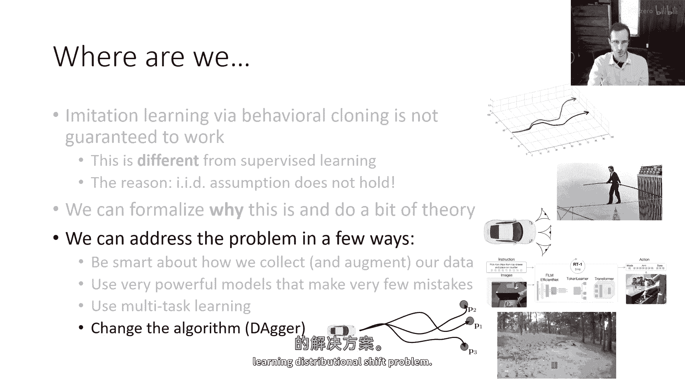

在本节课中，我们将要学习一种名为“DAgger”的算法。该算法旨在为模仿学习中的分布偏移问题提供一个更原则性的解决方案。我们将详细探讨其工作原理、实施步骤以及其优缺点。

---

## 分布偏移问题回顾 📊

上一节我们介绍了模仿学习中因策略犯错而导致的分布偏移问题。本节中我们来看看如何通过改变数据收集策略来解决这个问题。

分布偏移问题的核心在于：策略在训练时遇到的状态分布 `P_data` 与策略在测试时遇到的状态分布 `P_pi_theta` 存在系统性差异。之前讨论的方法主要集中于改进策略，使其减少错误，从而让 `P_pi_theta` 更接近 `P_data`。

但我们可以反过来思考：能否改变 `P_data`，使其更好地覆盖策略实际访问的状态？换句话说，我们能否让 `P_data` 等于 `P_pi_theta`？

为了实现这一点，我们需要收集比初始演示更多的数据。关键问题在于：应该收集哪些数据？这就是DAgger算法试图回答的问题。

---

## DAgger算法详解 🎯

DAgger算法的核心思想是：与其在策略优化上做文章，不如在数据收集策略上变得更聪明。其目标是收集数据，使得训练数据来自策略实际运行时遇到的状态分布 `P_pi_theta`，而非初始的 `P_data`。

以下是DAgger算法的具体步骤：

1.  **初始训练**：仅使用初始的人类演示数据训练策略。
2.  **运行策略**：在现实世界中运行当前策略，并记录策略所观察到的所有状态。
3.  **人工标注**：请求人类专家检查这些记录的状态，并为每个状态标注出正确的动作。
4.  **数据聚合**：将新标注的数据集与原始数据集合并。
5.  **重新训练**：使用聚合后的新数据集重新训练策略。
6.  **重复循环**：重复步骤2至5。

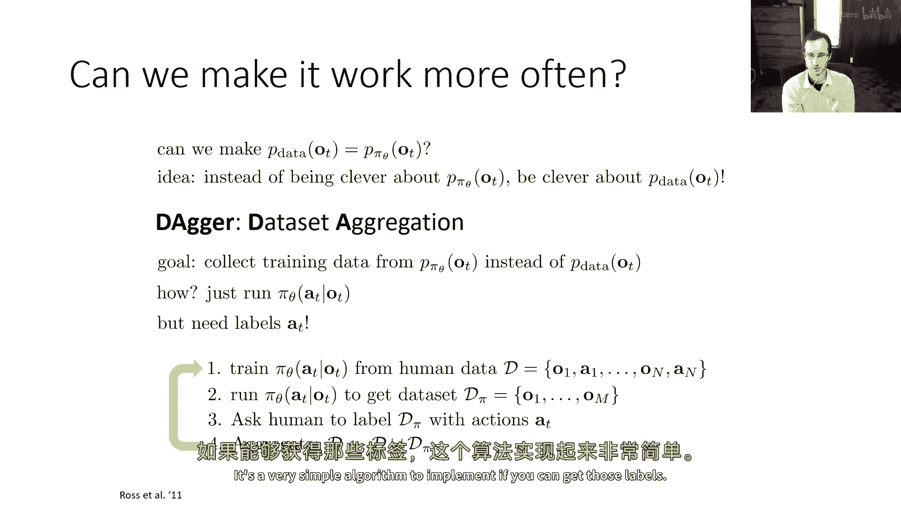

通过这个循环，每次迭代都会运行策略，收集其观察到的状态，并由人类标注。可以证明，最终数据集中状态的分布将收敛到策略运行时实际观察到的分布 `P_pi_theta`。

直觉上，每次迭代收集的数据分布都比上一次更接近策略的真实分布。只要每一步都能更接近，最终就会达到一个策略能够有效学习的稳定分布。随着收集的数据越来越多，数据集最终将由来自正确分布 `P_pi_theta` 的样本主导。

如果能够获得人工标注，这个算法的实施就非常简单。

---

## DAgger的应用实例与挑战 🚁

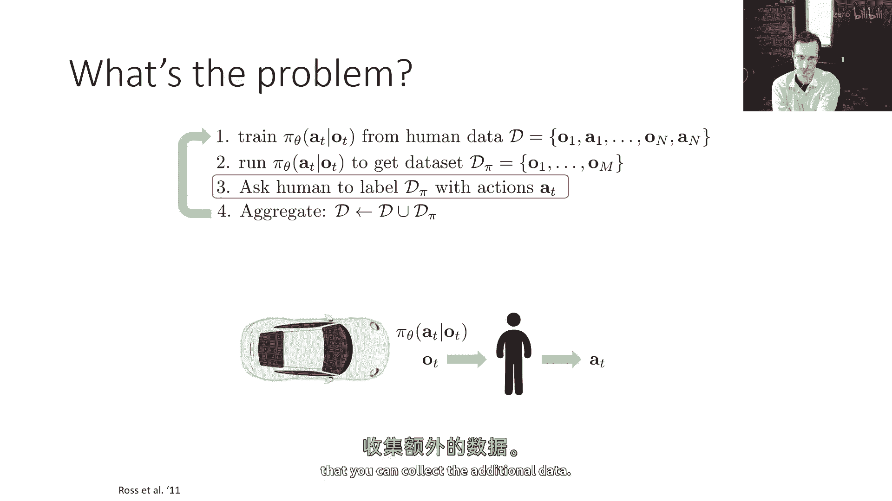

在原始的DAgger论文中，研究者使用该算法控制无人机穿越森林。他们通过DAgger迭代收集数据，并让人工离线查看图像，通过鼠标界面指定应采取的动作。经过几次迭代，无人机能够相当可靠地飞行并避开树木。

然而，DAgger方法也存在挑战，主要集中在第三步——人工标注。有时，让人工在事后检查图像并输出正确动作并不自然。在实际操作中（如驾驶汽车），人类的决策是一个包含反应时间的连续过程。因此，离线获取的人工标签可能不如人类实时操作时自然。DAgger的许多改进版本都试图缓解这一挑战。

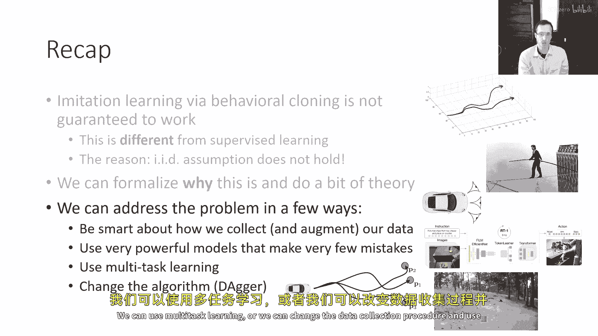

尽管如此，DAgger的基本版本确实缓解了分布偏移问题。理论上，它可以推导出线性于时间步长 `T` 的误差界限，而不是行为克隆中的二次界限。但这以引入“能够收集额外数据”这一强假设为代价。

---

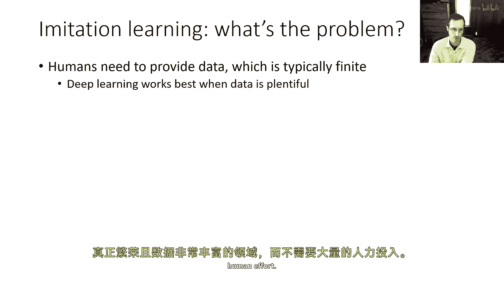

## 模仿学习解决方案总结 📝

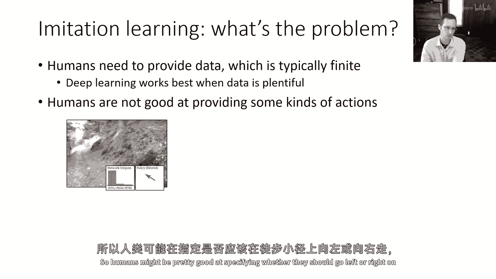

至此，我们已经介绍了一系列解决行为克隆挑战的方法：

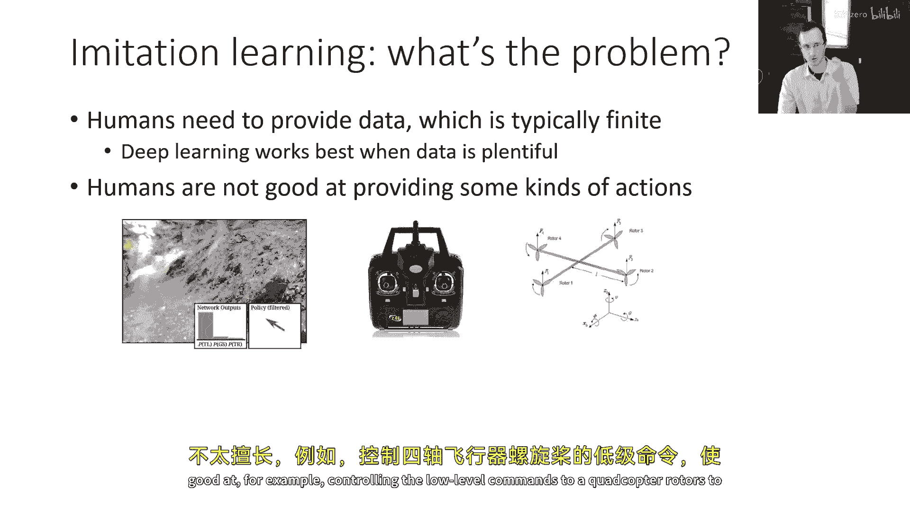

*   我们可以通过更智能的数据收集和增强来改进。
*   我们可以使用更强大的模型来减少错误。
*   我们可以利用多任务学习。
*   我们可以改变数据收集过程，使用DAgger算法。

---

## 模仿学习的局限性与强化学习的引入 🚀

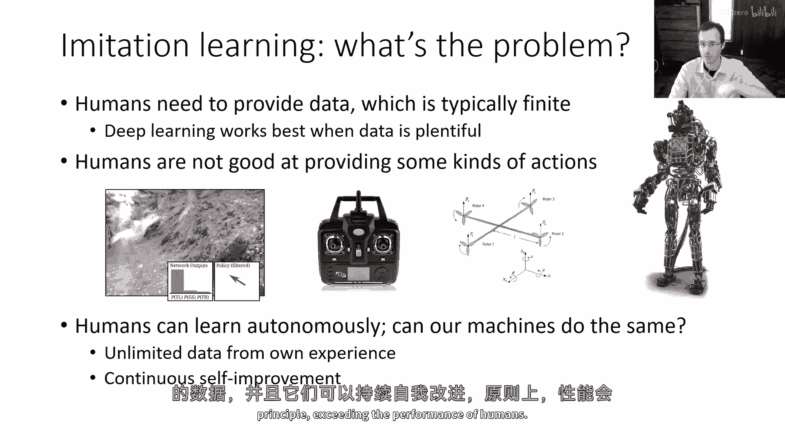

最后，我们简要探讨为什么模仿学习本身可能不够，以及为什么需要本课程后续的强化学习内容。

首先，模仿学习需要人类提供数据。虽然深度学习在数据丰富的环境下表现最佳，但要求人类提供大量数据可能是一个重大限制。如果算法能够自主收集数据，我们就能进入一个数据极其丰富且无需过多人类努力的领域，这正是深度学习真正繁荣的地方。

其次，人类并不擅长提供某些类型的动作。例如，人类可能擅长指定在步道上向左还是右转，或者通过遥控器控制四旋翼无人机。但对于控制直升机旋翼的低级指令以完成复杂特技，或者控制人形机器人的所有关节，对人类来说就困难得多。对于更特殊的机器人（如大型机器蜘蛛），找到能熟练操作的人类几乎不可能。

我们开发基于学习的控制方法，最令人兴奋的潜力之一是实现**涌现行为**——即机器表现出超越人类设计或示范能力的行为。在这种情况下，**自主学习**变得非常理想。从原则上讲，机器可以从自身经验中获取无限数据，并持续自我改进，理论上能够超越人类的性能。

为了开始思考这个问题，我们需要引入新的术语和符号，并准确定义我们的目标。如果目标不再是单纯的模仿，而是做好其他事情，我们追求的是什么？

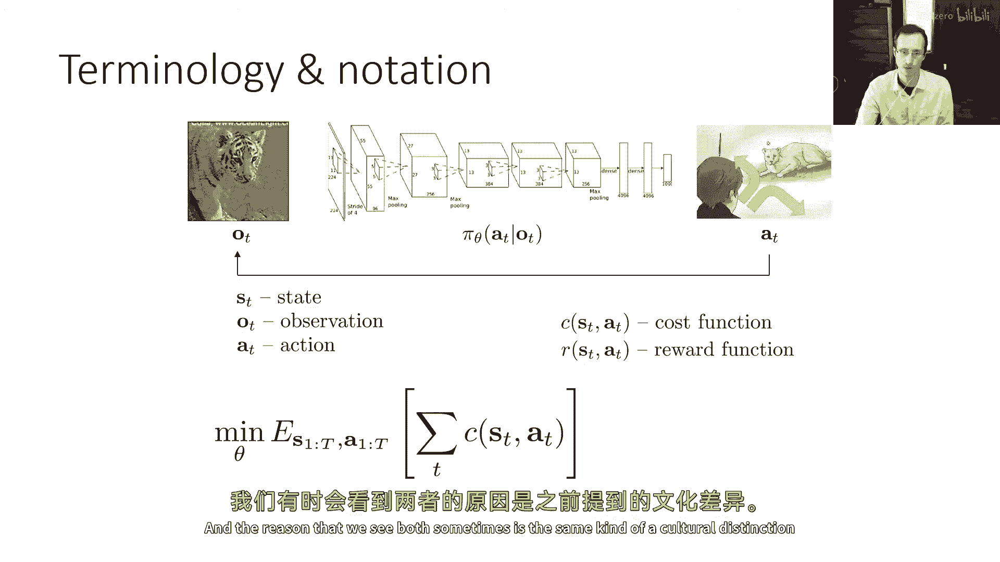

我们可能不想仅仅匹配专家数据集中的动作，而是希望实现某种期望的结果。例如，在“老虎”问题中，我们希望最小化被老虎吃掉的概率。我们可以用数学来表达这个目标：最小化落入“被老虎吃掉”状态 `s‘` 的概率。

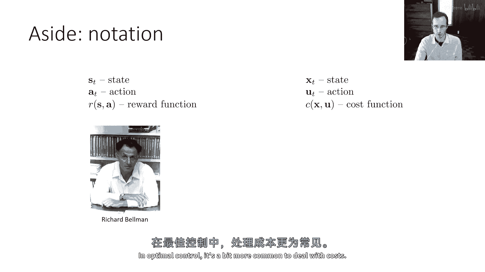

更一般地，我们可以将其表述为最小化某个**成本函数** `C(s, a)` 的期望值。成本函数定义了任意的控制任务，例如避免危险或到达目的地。有时我们也使用**奖励函数** `R(s, a)`，它本质上是成本函数的相反数（`C = -R`）。这两种表述是等价的，只是文化或领域习惯不同。

值得注意的是，我们之前讨论的模仿学习也可以精确地用这个框架来描述。用于模仿的“奖励”可以是对数概率，其对应的“成本”就是负对数概率。但成本函数框架更具表达性，它可以定义我们真正关心的目标（如到达目的地、避免事故），并使用这些目标来训练智能体。

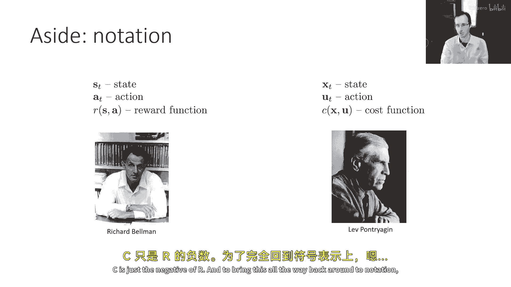

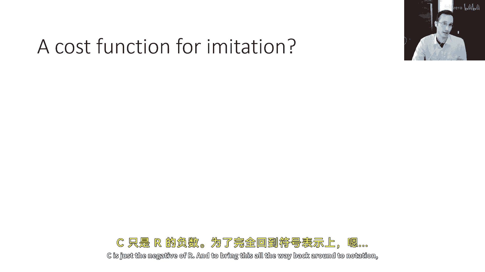

---

## 本节课总结 ✨

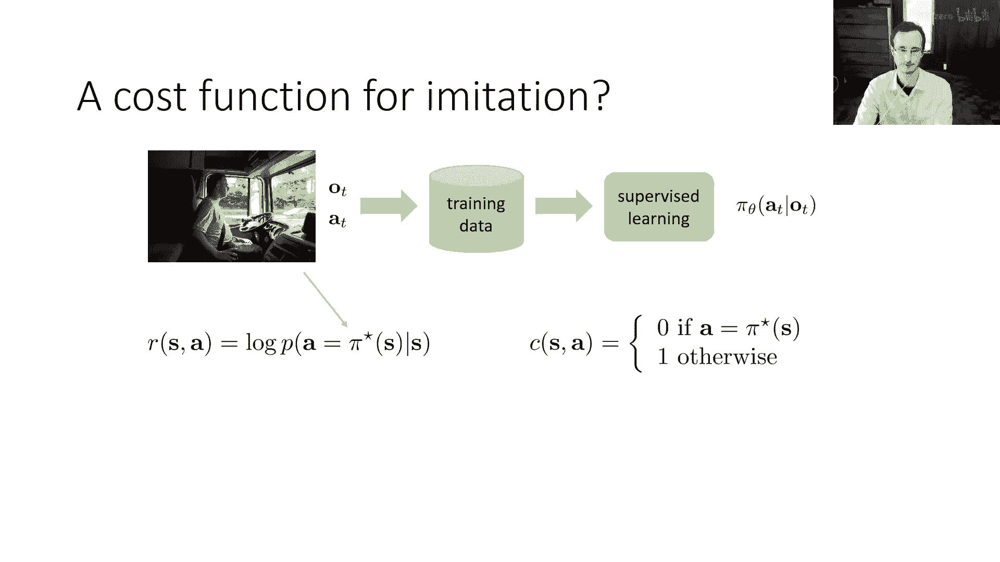

本节课我们一起学习了DAgger算法，它是一种通过智能地收集人工标注数据来解决模仿学习中分布偏移问题的方法。我们回顾了分布偏移问题，详细讲解了DAgger的步骤，并讨论了其应用与挑战。最后，我们总结了解决行为克隆问题的多种思路，并指出了模仿学习的局限性，为引入以成本/奖励函数为核心的强化学习框架做好了铺垫。