# 9：马尔科夫决策过程与目标 🎯

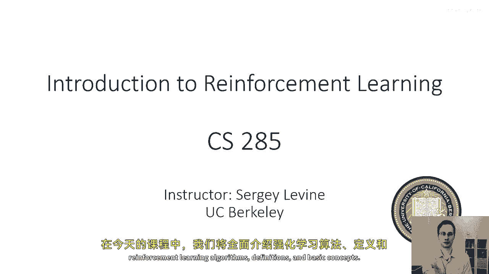

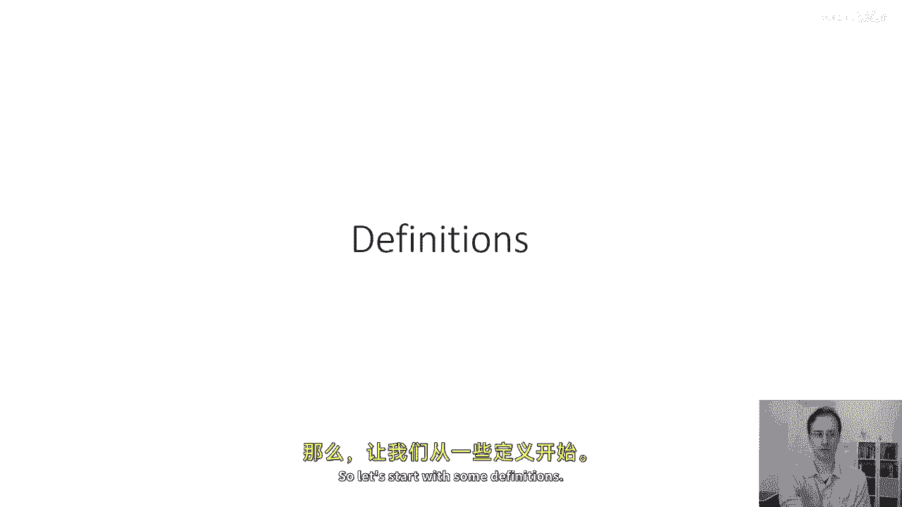

在本节课中，我们将学习强化学习的核心数学框架——马尔科夫决策过程，并明确强化学习的目标。我们将从基本定义开始，逐步构建出完整的强化学习问题形式化描述。

## 定义与基本概念 📖

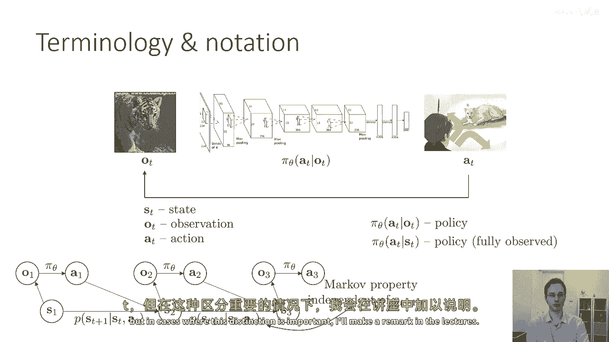

上一节我们介绍了模仿学习，本节中我们来看看强化学习的正式定义。让我们从一些核心术语开始。

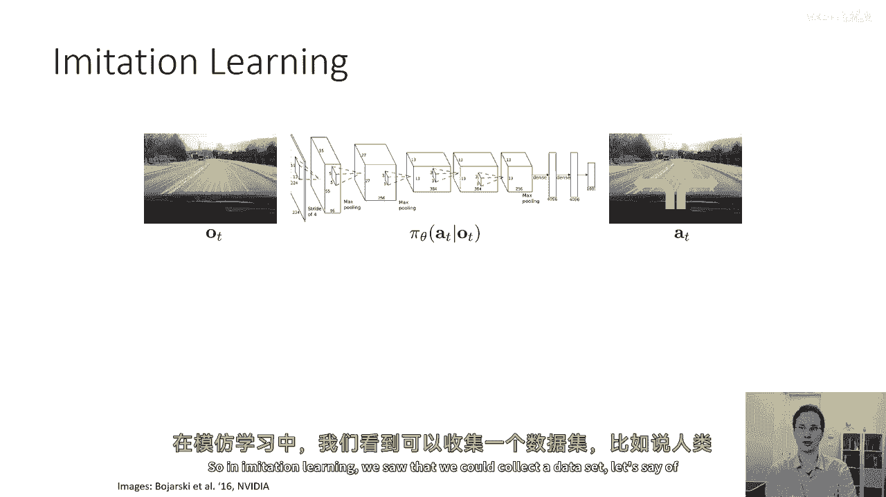

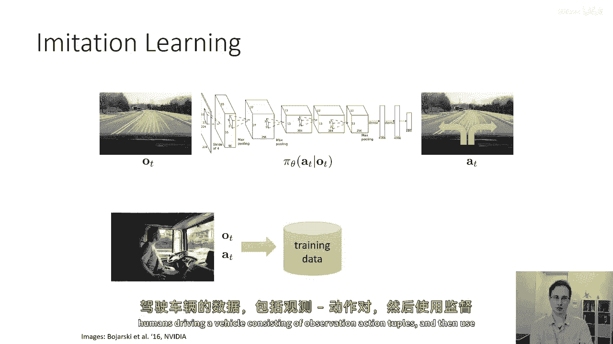

首先，我们回顾一下策略的表示。策略表示为给定观测（或状态）下动作的分布，记作 **π_θ(a_t | o_t)** 或 **π_θ(a_t | s_t)**。其中，θ 代表策略的参数，在深度强化学习中通常是一个神经网络的参数。

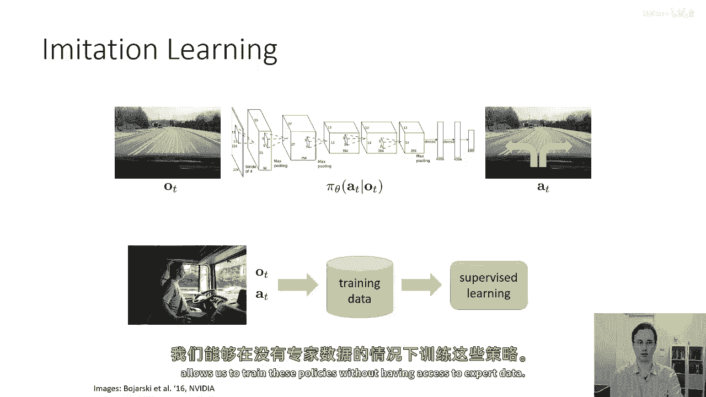

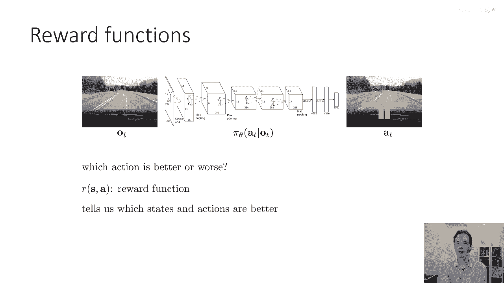

需要理解的重要定义是状态 **s_t**、观测 **o_t** 和动作 **a_t**。观测和状态通过一个图形模型关联：观测是状态的随机函数，策略连接观测和动作，转移概率（动态）连接当前状态、动作与未来状态。

状态满足**马尔科夫性质**：未来状态 **s_{t+1}** 在给定当前状态 **s_t** 的条件下，与过去状态 **s_{t-1}** 独立。这是状态与观测的主要区别：状态必须满足马尔科夫性质，而观测可能不满足。

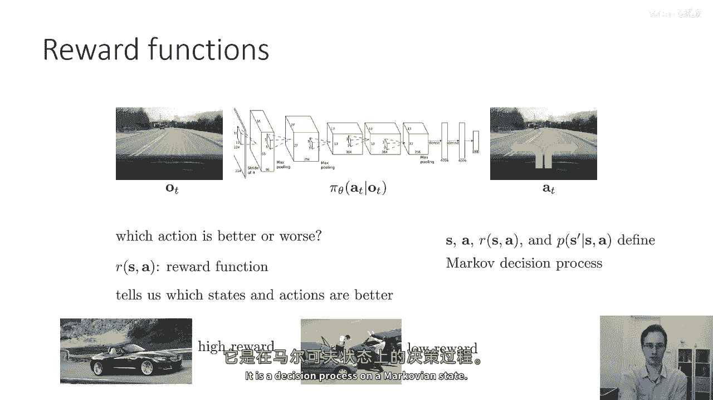

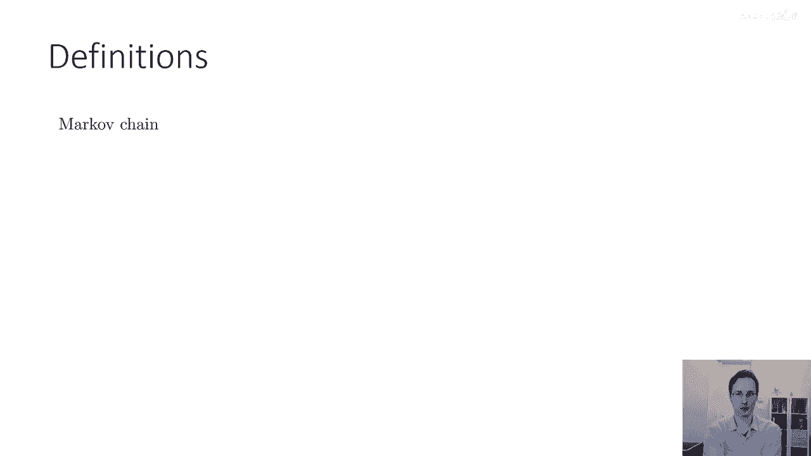

我们将讨论**完全可观测**（可访问状态）和**部分可观测**（仅可访问观测）两种情况。在部分可观测情况下，策略基于观测做出决策。

## 从模仿学习到强化学习 🔄

在模仿学习中，我们收集专家数据（观测-动作对），然后使用监督学习训练策略。本节中，我们将介绍强化学习的正式形式，它允许我们在没有专家数据的情况下训练策略。

为了实现这一点，我们需要定义策略的目标，这是通过**奖励函数**完成的。奖励函数 **r(s_t, a_t)** 是一个标量函数，它告诉我们哪些状态和动作组合更好。例如，在驾驶任务中，汽车在道路上快速行驶可能获得高奖励，而撞车则获得低奖励。

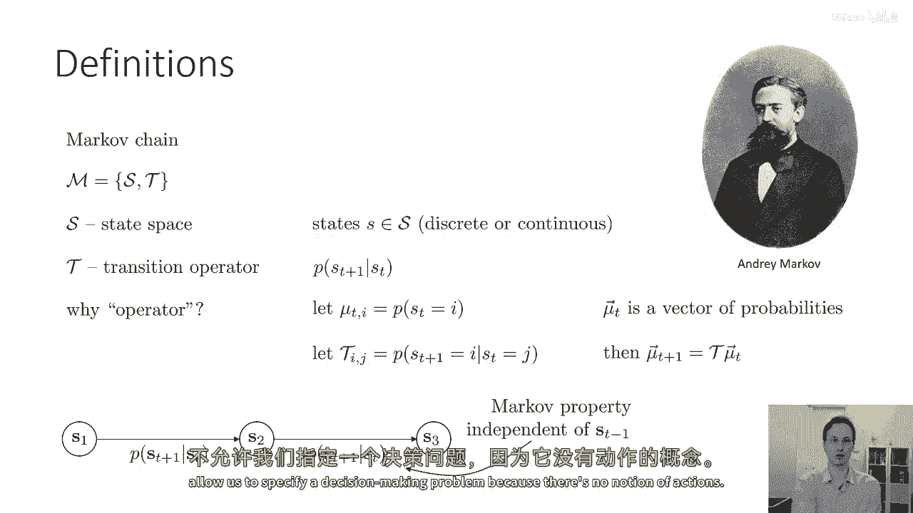

强化学习的目标不仅仅是立即获得高奖励，而是要选择能导致未来更高累积奖励的动作。这就是决策制定和强化学习的核心。

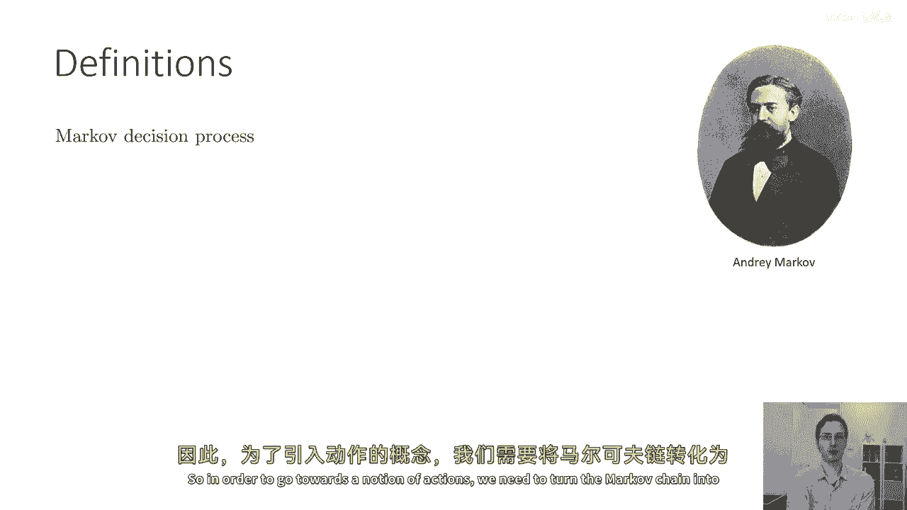

## 马尔科夫决策过程 🧩

状态、动作、奖励和转移概率共同定义了一个**马尔科夫决策过程**。让我们逐步构建其正式定义。

首先从**马尔科夫链**开始。马尔科夫链包含一个状态集合 **S** 和一个转移函数 **T**。转移函数 **T** 定义了从当前状态 **s_t** 转移到下一个状态 **s_{t+1}** 的条件概率：**p(s_{t+1} | s_t)**。在离散状态下，**T** 可以表示为一个矩阵。

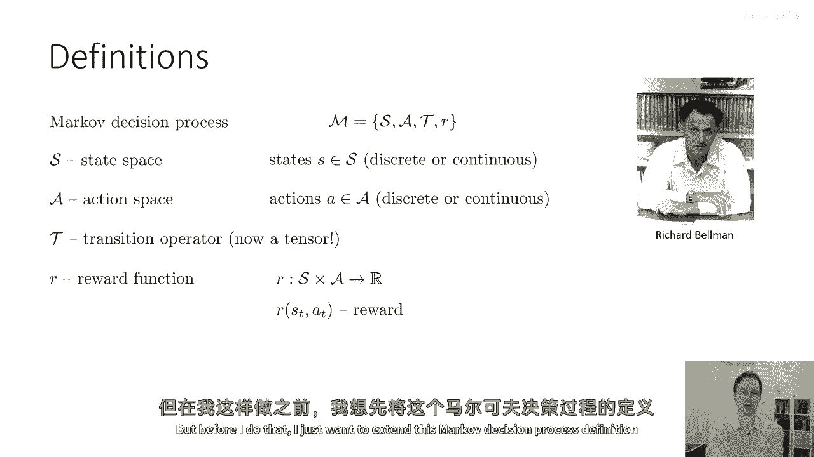

马尔科夫链本身不包含决策。为了引入决策，我们将其扩展为**马尔科夫决策过程**。MDP 在马尔科夫链的基础上增加了：
*   **动作空间 A**：一个离散或连续的集合。
*   **奖励函数 r**：从状态和动作映射到实数的函数。

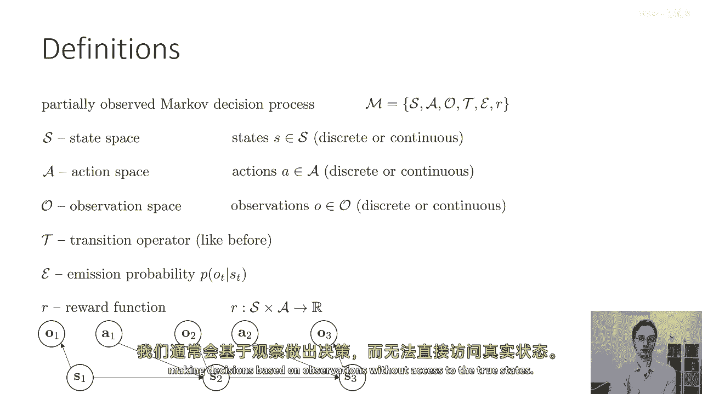

现在，转移概率依赖于当前状态和动作：**p(s_{t+1} | s_t, a_t)**。奖励函数定义了我们的目标。

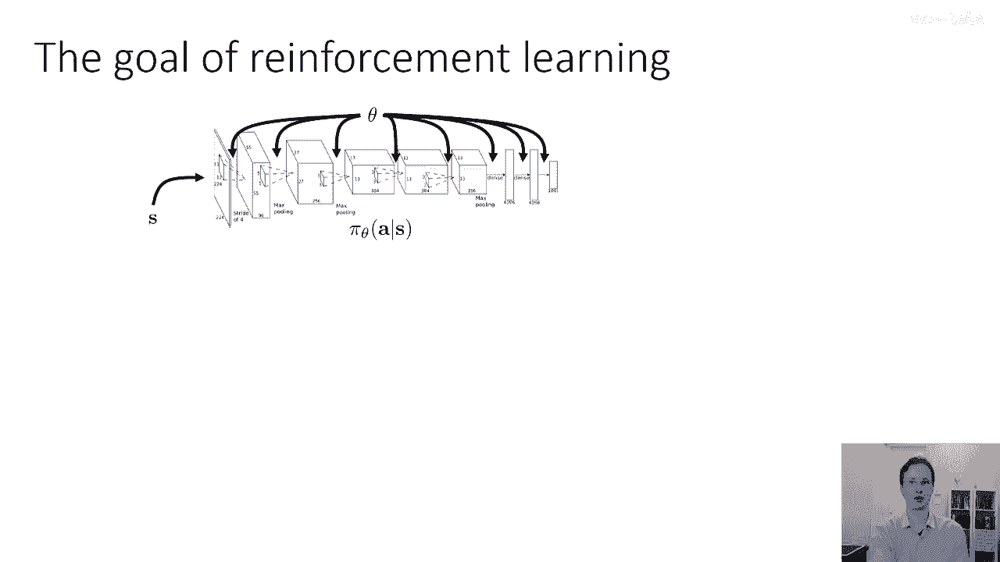

为了处理部分可观测的情况，我们进一步定义**部分可观测马尔科夫决策过程**。POMDP 在 MDP 的基础上增加了：
*   **观测空间 O**
*   **发射概率 e**：**p(o_t | s_t)**，描述给定状态下产生某个观测的概率。

在 POMDP 中，策略基于观测 **o_t** 做出决策，而无法直接访问真实状态 **s_t**。

## 强化学习的目标 🎯

现在我们已经定义了 MDP 和 POMDP，让我们为强化学习定义一个明确的目标。我们学习一个参数化的策略 **π_θ(a_t | s_t)**。

我们控制的过程如下：状态输入策略，策略输出动作，然后状态和动作输入转移概率（环境动态），产生下一个状态。

我们可以写出一个轨迹 **τ = (s_1, a_1, s_2, a_2, ..., s_T)** 的概率分布：
**p_θ(τ) = p(s_1) ∏_{t=1}^{T} π_θ(a_t | s_t) p(s_{t+1} | s_t, a_t)**

定义了轨迹分布后，强化学习的目标是找到策略参数 **θ**，以最大化轨迹上累积奖励的期望值：
**J(θ) = E_{τ ∼ p_θ(τ)} [∑_{t=1}^{T} r(s_t, a_t)]**

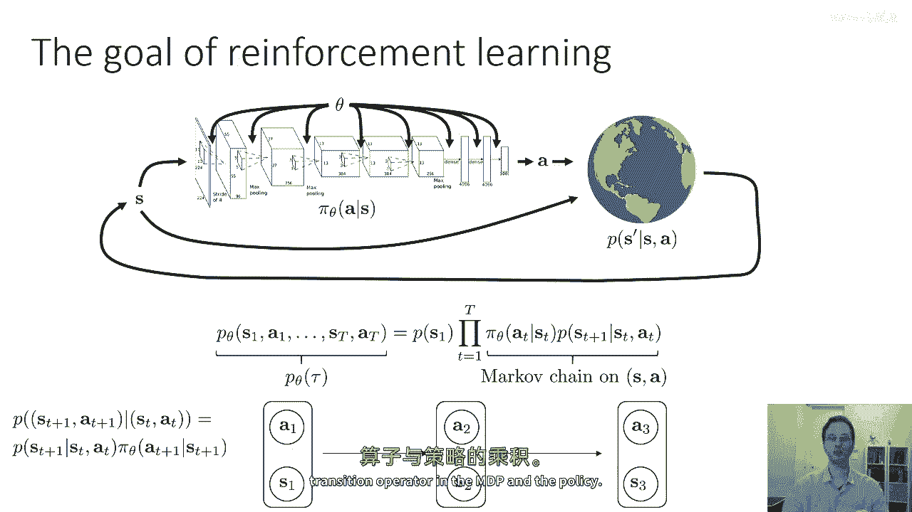

这个目标考虑了策略的随机性、环境动态以及初始状态分布。理解这个期望的含义至关重要：我们寻找的是能平均产生最高累积奖励的策略。

我们可以利用期望的线性性质，将目标重写为各时间步奖励期望的和：
**J(θ) = ∑_{t=1}^{T} E_{(s_t, a_t) ∼ p_θ(s_t, a_t)} [r(s_t, a_t)]**
这种形式在后续推导中非常有用。

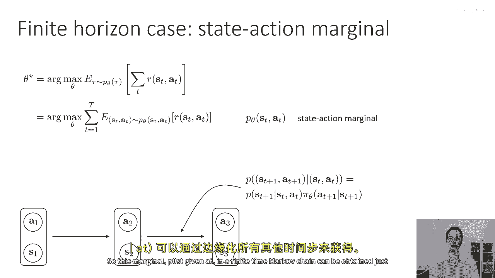

## 无限时间范围与稳态分布 ♾️

上述目标假设了一个有限的时间范围 **T**。如何将其扩展到无限时间范围（**T → ∞**）？如果奖励总是正数，累积奖励之和可能会发散到无穷大。

一种处理方法是使用**平均奖励公式**：**J(θ) = lim_{T→∞} (1/T) E_{τ} [∑_{t=1}^{T} r(s_t, a_t)]**。

关键思路是考虑由状态和动作组成的**增强马尔科夫链**。在一定的遍历性和非周期性假设下，这个链的状态-动作边缘分布 **p_θ(s_t, a_t)** 会收敛到一个**稳态分布 μ**。稳态分布满足 **μ = T * μ**，其中 **T** 是增强链的转移算子。

当时间趋于无穷时，平均奖励目标将收敛于在稳态分布 **μ** 下的期望奖励：
**J(θ) = E_{(s,a) ∼ μ} [r(s, a)]**
这为无限时间范围的强化学习提供了一个定义良好的目标。

## 期望的平滑性：关键洞见 💡

理解强化学习算法的一个关键点是：**强化学习是关于优化期望的**。

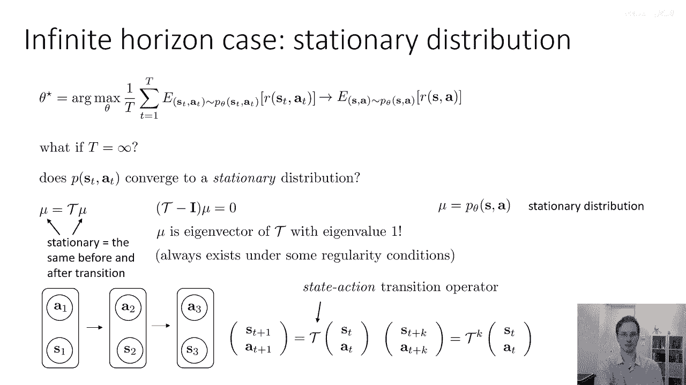

即使原始的奖励函数 **r(s, a)** 本身是不连续、不可微甚至稀疏的（例如，赢棋得1分，输棋得0分），但当我们对参数化的概率分布 **π_θ** 取期望时，目标函数 **J(θ)** 在参数 **θ** 上可能是平滑且可微的。

考虑一个简单例子：动作是二元的（例如，“保持在路上”或“掉下路”），策略以概率 **θ** 选择“掉下路”。奖励是：掉下路得 -1，保持在路上得 +1。期望奖励为：
**J(θ) = θ * (-1) + (1 - θ) * (+1) = 1 - 2θ**
这个函数在 **θ** 上是完全光滑且可微的，尽管原始奖励函数是阶跃的。

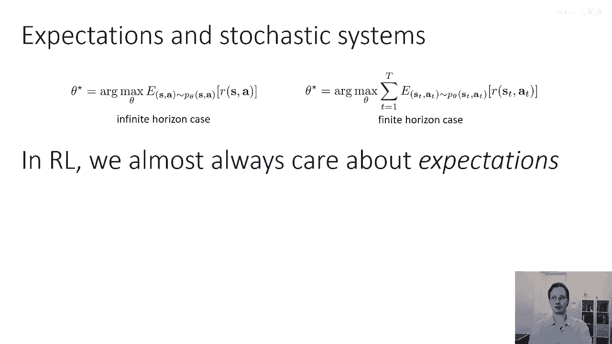

这个性质至关重要，它解释了为什么我们可以使用基于梯度的优化方法（如梯度下降）来优化看似非光滑的强化学习目标。**非光滑函数的期望，在光滑的概率分布下，其本身可以是光滑的**。

---

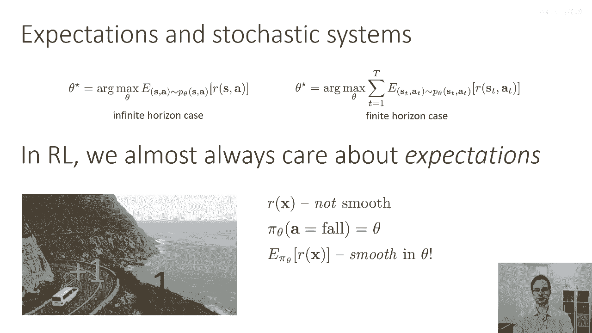

本节课中我们一起学习了强化学习的数学基础。我们定义了马尔科夫决策过程及其部分可观测版本，明确了强化学习的目标是最大化累积奖励的期望。我们还探讨了如何将目标扩展到无限时间范围，并理解了优化期望值的关键平滑性原理，这为后续学习具体的强化学习算法奠定了坚实的基础。