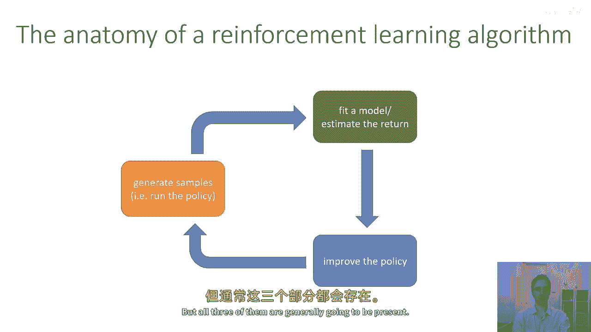
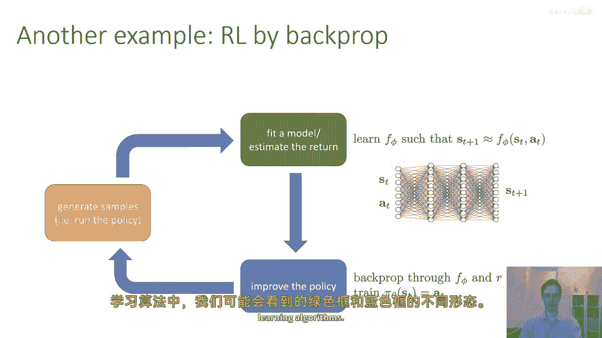
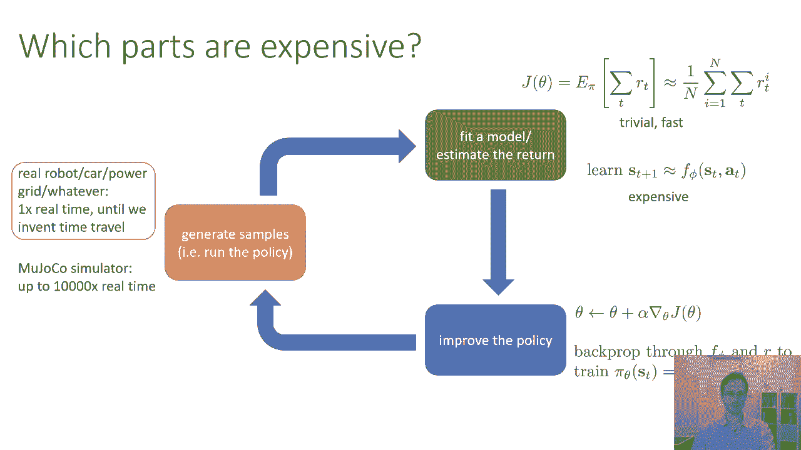

# 10：强化学习算法概述 🧠

在本节课中，我们将学习强化学习算法的通用框架。我们将了解大多数算法如何由三个核心部分组成，并探讨这些部分在不同算法中的具体实现及其计算成本。

---

## 算法通用结构 🔧

上一节我们介绍了强化学习的基本概念，本节中我们来看看算法的通用解剖结构。从高层次看，大多数强化学习算法都包含三个基本部分。

以下是这三个核心部分：

1.  **生成样本（橙色部分）**：强化学习通过试错法学习。这部分意味着在实际环境或模型中运行你的策略，与马尔可夫决策过程交互并收集数据。样本通常是轨迹，即从由策略诱导的轨迹分布中采样得到的数据序列。
2.  **评估表现（绿色部分）**：这部分对应于估计当前策略的表现。例如，评估策略获得了多少奖励，或者学习环境的动态模型。
3.  **改进策略（蓝色部分）**：这是实际优化策略、使其表现更好的步骤。完成评估后，算法会根据评估结果调整策略参数。

大多数算法都包含这三部分，尽管在不同算法中，某些部分可能非常简单，而另一些部分可能非常复杂。

---

## 算法实例分析 📊

现在，我们通过两个具体例子来看看这三部分是如何运作的。

### 策略梯度算法

在策略梯度算法中，这三个部分的具体实现如下：

*   **生成样本**：运行当前策略，生成一系列轨迹（如图中黑线所示）。
*   **评估表现**：评估这些轨迹的好坏。具体做法非常简单，仅仅是**对轨迹中获得的奖励进行求和**。这个总和（即回报）告诉我们策略的优劣。
*   **改进策略**：目标是增加好轨迹（绿色对勾）的概率，减少坏轨迹（红色叉）的概率。这通过计算策略关于奖励的梯度，并应用梯度上升来更新策略参数 `θ` 来实现。

这是一种直观的试错法：运行策略、测量好坏、然后调整策略使好的结果更可能出现。

### 基于模型的强化学习

在基于模型的强化学习方法中，这三个部分有不同的侧重点：

*   **生成样本**：同样是通过运行策略收集轨迹数据。
*   **评估表现**：这部分变得复杂。我们不是简单求和，而是**学习一个环境动态模型**。例如，训练一个神经网络 `f_φ`，使其能够预测下一个状态：`s_{t+1} ≈ f_φ(s_t, a_t)`。这个模型在橙色部分生成的数据上进行监督学习训练。
*   **改进策略**：改进策略时，我们可以将策略 `π_θ` 和学到的模型 `f_φ` 组合起来，**通过模型反向传播奖励信号**来优化策略参数。这相当于在学习的“模拟器”中规划更好的行动。

基于模型的方法将更多计算成本放在了绿色部分（学习模型）和蓝色部分（通过模型进行规划或优化）。

---

## 各部分计算成本考量 ⚖️

不同部分的计算成本差异很大，这会影响我们对算法的选择。

以下是各部分的成本分析：

*   **生成样本（橙色部分）的成本**：成本高度依赖于具体问题。
    *   如果在真实系统（如机器人、汽车）中收集数据，成本可能**极高**，因为数据必须实时获取。
    *   如果在快速模拟器（如MuJoCo）中收集数据，成本可能**很低**。
*   **评估表现（绿色部分）的成本**：成本范围也很广。
    *   如果只是对奖励求和，成本**极低**。
    *   如果是训练一个庞大的神经网络模型，成本可能**非常高**，相当于在算法循环内进行大规模监督学习。
*   **改进策略（蓝色部分）的成本**：
    *   如果只是采取一个梯度步，成本**相对较低**。
    *   如果需要通过整个模型和策略进行反向传播（如某些基于模型的方法），成本可能**很高**。

不同的算法会将计算努力分配在不同的部分。例如，我们将在下周讨论的Q学习算法，就将其主要努力放在了**绿色部分**（学习价值函数）。

---

## 总结 🎯

本节课中，我们一起学习了强化学习算法的通用框架。我们了解到，大多数算法都由**生成样本**、**评估表现**和**改进策略**三部分组成。我们通过策略梯度和基于模型学习两个例子，看到了这些部分的具体实现方式。最后，我们分析了各部分的计算成本，认识到根据实际应用场景（如真实系统还是模拟器），选择合适的算法以平衡样本效率与计算开销至关重要。