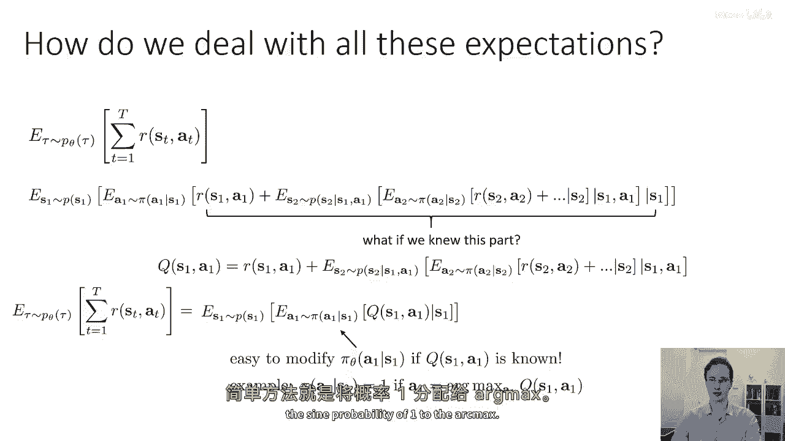
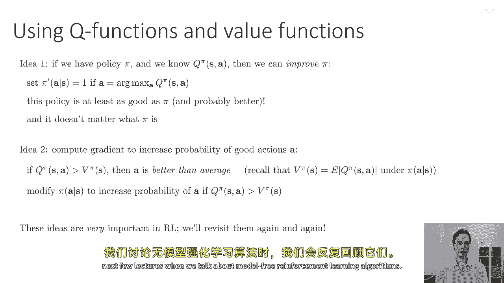
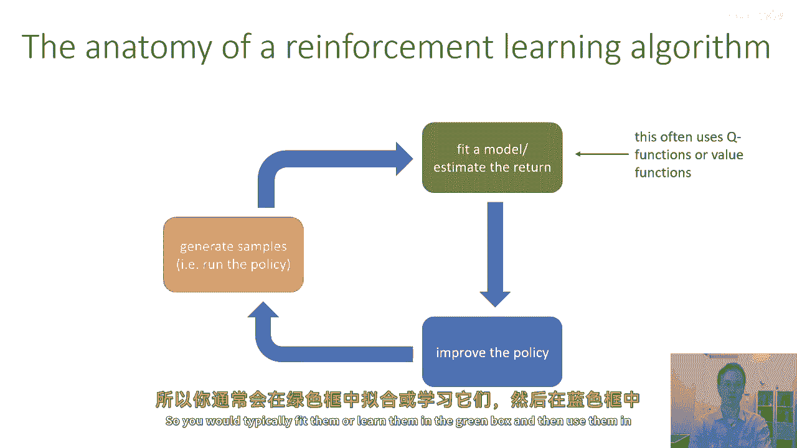
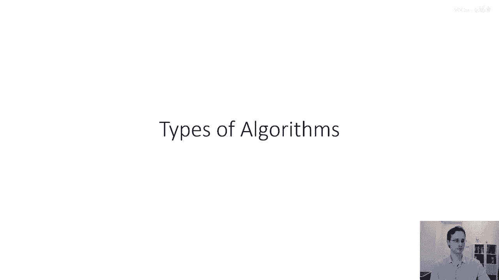

# 11：价值函数与Q函数 🎯

在本节课中，我们将学习强化学习中的两个核心概念：**价值函数**与**Q函数**。它们是评估和优化策略的关键工具，理解它们对于设计强化学习算法至关重要。

## 概述 📖

强化学习的目标通常被定义为对轨迹分布相关奖励总和的期望。本节课我们将看到，这个目标可以递归地分解，并引出价值函数和Q函数的定义。我们将探讨它们的含义、相互关系以及它们在改进策略中的重要作用。

## 强化学习目标的递归分解 🔄

上一节我们提到了强化学习的目标。本节中我们来看看如何递归地分解这个期望值。

强化学习的目标可以定义为一个期望值，即对轨迹分布相关奖励总和的预期。这等价于对每个状态-动作对的预期奖励进行时域求和。

我们可以应用概率链规则，将与该分布相关的期望值写为一系列嵌套的期望值。最外层的期望是对初始状态分布 `p(s1)` 的期望。其内部，我们有一个关于动作 `a1` 按照策略 `π(a1|s1)` 分布的期望值。

既然我们对 `s1` 和 `a1` 都有了期望，我们可以计入第一个奖励 `R(s1, a1)`。注意，这个内部关于 `a1` 的期望依赖于 `s1`。

然后，我们将添加所有未来的奖励，但这需要引入另一个期望。这个期望是关于下一个状态 `s2` 的分布 `p(s2|s1, a1)`，因此它依赖于 `s1` 和 `a1`。

在这个内部，我们还有一个关于动作 `a2` 按照策略 `π(a2|s2)` 分布的期望。之后我们可以计入奖励 `R(s2, a2)`，并继续为 `s3` 添加期望，如此递归下去，直至无穷。

## 引入Q函数 💡

上一节我们看到了目标的复杂嵌套形式。本节中我们引入一个关键概念来简化它。

如果我们有一个函数，能告诉我们从 `(s1, a1)` 开始，未来所有奖励的期望总和，那么优化第一步的策略就会变得非常简单。

让我们为这部分定义一个符号。设 `Q(s1, a1) = R(s1, a1) + E[关于s2, a2, ...的未来奖励总和]`。那么，原始的强化学习目标就可以简单地写成 `E_{s1, a1}[Q(s1, a1)]`。

这个定义的重要性在于：如果你知道 `Q(s1, a1)`，那么优化第一步的策略将非常容易。你只需要为每个状态 `s1` 选择能使 `Q(s1, a1)` 期望值最大的动作 `a1`，并将全部概率分配给这个最优动作。

## 定义Q函数与价值函数 📝

上一节我们为第一步引入了Q函数的概念。本节中我们将其推广到更一般的形式。

这个更一般的概念就是**Q函数**。Q函数可以在任何时间步 `t` 定义，而不仅仅是第一步。定义如下：
`Q^π(s_t, a_t) = E[ Σ_{t'=t}^T R(s_{t'}, a_{t'}) | s_t, a_t ]`
它依赖于策略 `π`，表示在状态 `s_t` 采取动作 `a_t` 后，遵循策略 `π` 所能获得的期望总奖励。

与Q函数密切相关的一个量是**价值函数**。价值函数 `V^π(s_t)` 定义为从状态 `s_t` 开始，然后遵循策略 `π` 所能获得的期望总奖励。

价值函数可以写成Q函数关于动作的期望值：
`V^π(s_t) = E_{a_t ∼ π(·|s_t)}[ Q^π(s_t, a_t) ]`
因为Q函数告诉你从 `(s_t, a_t)` 开始的期望总奖励，对其按策略 `π` 取期望，就得到了从 `s_t` 开始的期望总奖励。

一个重要的观察是：状态 `s1` 处的价值函数 `V^π(s1)` 的期望，就是整个强化学习的目标。这与之前将目标写为 `E[Q(s1, a1)]` 是一致的。

## Q函数与价值函数的用途 🛠️

上一节我们正式定义了这两个函数。本节中我们来看看它们为何有用。

Q函数和价值函数的核心用途在于评估和改进策略。

如果我们有一个策略 `π`，并且能够计算出它完整的Q函数 `Q^π(s, a)`，那么我们就可以改进这个策略。例如，我们可以定义一个新策略 `π'`，它在每个状态 `s` 下，都将概率1分配给能使 `Q^π(s, a)` 最大的动作 `a`。可以证明，策略 `π'` 至少和 `π` 一样好，甚至可能更好。

这是一类称为**策略迭代**算法的基础，这类算法本身又能推导出**Q学习**算法。关键在于，无论 `π` 是什么，你都可以用这种方式改进它。

此外，当我们讨论策略梯度时，也会用到这个思想。直觉是：如果 `Q^π(s, a) > V^π(s)`，那么动作 `a` 在该状态下的表现优于平均水平（因为 `V^π(s)` 是策略 `π` 下的平均表现）。因此，你可以修改策略 `π(·|s)`，增加那些Q值高于状态价值 `V(s)` 的动作的概率。这可以用于推导基于梯度的策略更新规则。

这些思想在强化学习中至关重要，在后续关于无模型强化学习算法的课程中，我们会反复用到它们。

## 在算法框架中的位置 🧩

在强化学习算法的典型框架中，Q函数和价值函数通常位于评估当前策略好坏的模块中。你会在这个模块中拟合或学习它们，以指导策略的更新。

## 总结 ✨

本节课我们一起学习了强化学习的核心评估工具：
1.  **价值函数 `V^π(s)`**：衡量从状态 `s` 开始，遵循策略 `π` 的期望总回报。
2.  **Q函数 `Q^π(s, a)`**：衡量在状态 `s` 采取动作 `a`，然后遵循策略 `π` 的期望总回报。
3.  两者关系为 `V^π(s) = E_{a∼π}[Q^π(s, a)]`。
4.  它们的主要用途是**评估策略**，并通过选择具有更高Q值的动作来**改进策略**，这构成了策略迭代、Q学习以及部分策略梯度方法的基础。

理解价值函数和Q函数是打开深度强化学习算法大门的关键钥匙。