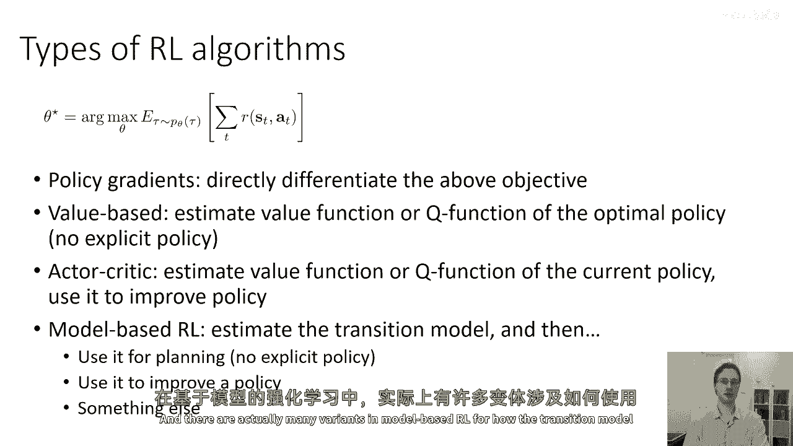
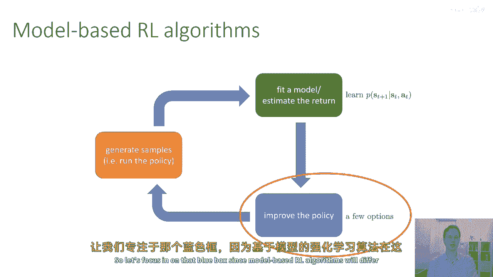
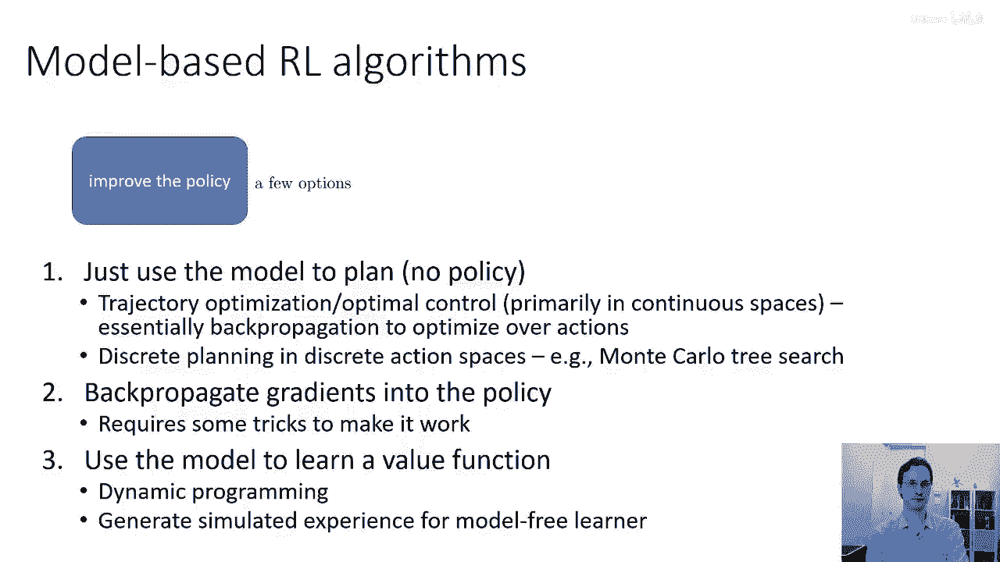
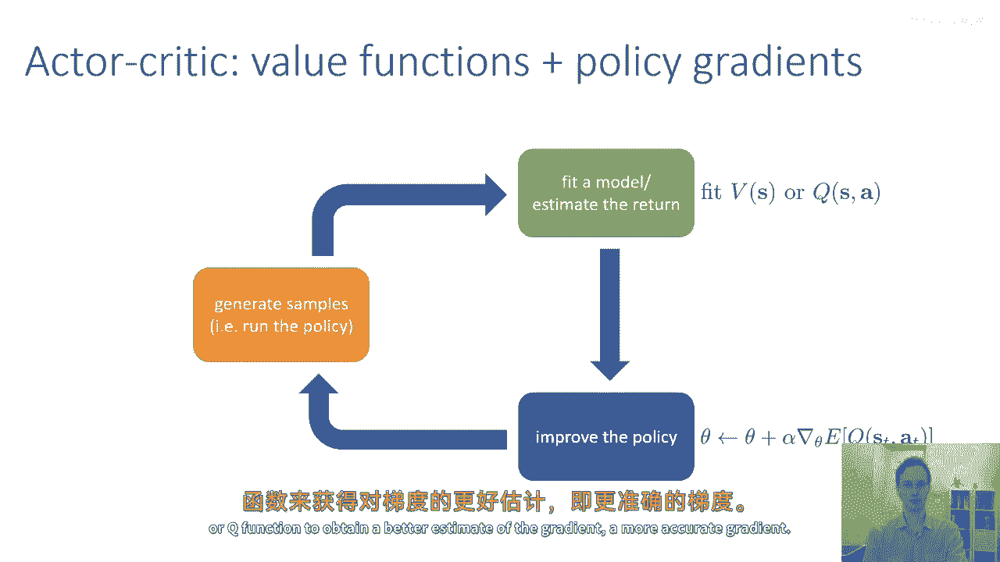
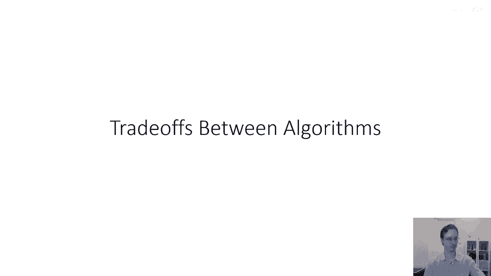

# 12：强化学习算法概览课程 🧠

在本节课中，我们将快速概览不同类型的强化学习算法。我们将了解每种算法的核心思想，以便在后续深入讨论时不会感到陌生。强化学习算法通常旨在优化之前定义的期望总奖励目标。

## 基于模型的强化学习算法 🤖

上一节我们介绍了强化学习算法的分类，本节中我们来看看基于模型的强化学习算法。这类算法的核心是学习一个关于环境的**过渡模型**。

**过渡模型**通常表示为 `p(s_{t+1} | s_t, a_t)`，即给定当前状态和动作，预测下一个状态的概率分布。这可以是一个神经网络，输入 `(s_t, a_t)`，输出对 `s_{t+1}` 的预测（概率分布或确定值）。

学习到模型后，蓝色框（即利用模型的部分）有多种实现方式。以下是几种常见的选择：

*   **直接用于规划**：例如，学习国际象棋规则后，使用蒙特卡洛树搜索等规划算法来下棋；或学习机器人物理模型后，使用最优控制方法进行轨迹优化。
*   **通过模型反向传播**：使用学习到的模型来计算奖励函数关于策略参数的梯度。这需要技巧来保证数值稳定性，例如使用二阶方法通常比一阶方法效果更好。
*   **辅助学习价值函数**：使用模型通过动态规划方法来学习一个价值函数或Q函数，进而改进策略。
*   **生成模拟数据**：使用模型为无模型强化学习算法生成额外的训练数据，这通常很有效。

## 基于价值函数的算法 💎

接下来，我们看看基于价值函数的算法。这类方法的核心是拟合对状态价值 `V(s)` 或动作价值 `Q(s, a)` 的估计。

**价值函数**通常由神经网络表示，输入状态 `s`（或状态-动作对 `(s, a)`），输出一个实数值估计。

对于蓝色框（即策略改进部分），基于价值的方法与策略梯度方法有所不同：

*   **纯价值方法**：策略被隐式地定义为选择能最大化 `Q(s, a)` 的动作，即 `π(s) = argmax_a Q(s, a)`。策略本身并非一个独立的神经网络。
*   **策略梯度方法**：策略被显式地参数化（例如为一个神经网络 `π_θ`）。蓝色框通过计算期望奖励关于策略参数 `θ` 的梯度，并执行梯度上升步骤来更新策略。梯度估计的方法将在后续课程讨论。其绿色框（数据收集）相对简单，主要涉及在环境中运行策略（或称“部署”）并累计算轨迹的总奖励。
*   **演员-批评者算法**：这是前两者的混合体。像价值函数方法一样，它拟合一个价值函数或Q函数（批评者）；像策略梯度方法一样，它对显式的策略（演员）执行梯度上升，并利用拟合的价值函数来获得更准确的梯度估计。

## 总结 📝

本节课中我们一起学习了强化学习算法的三大主要类型：
1.  **基于模型的算法**：核心是学习环境动态模型，并利用该模型进行规划、梯度计算或数据生成。
2.  **基于价值函数的算法**：核心是学习价值函数，并通常通过贪心选择（`argmax`）来隐式定义策略。
3.  **策略梯度与演员-批评者算法**：核心是直接参数化并优化策略。策略梯度直接使用轨迹奖励，而演员-批评者则引入价值函数来辅助策略梯度的估计。

理解这些基本分类将为我们后续深入探讨具体算法奠定坚实的基础。