# 13：强化学习算法概览与权衡 📊

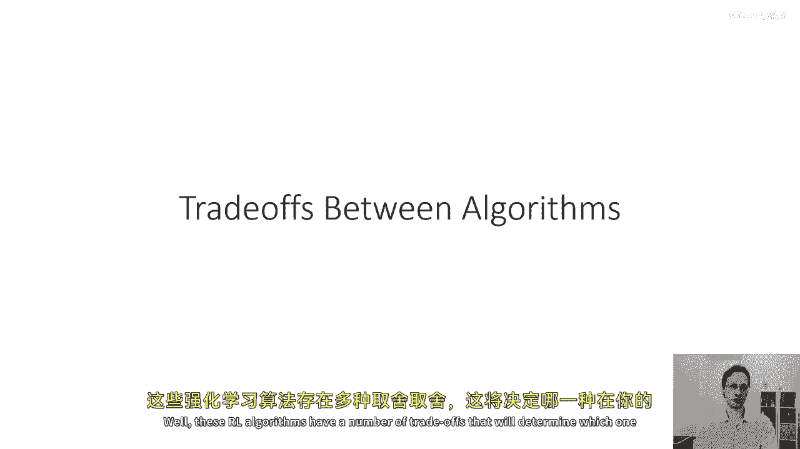

在本节课中，我们将学习为什么存在多种不同的强化学习算法，以及如何根据具体问题在这些算法之间进行权衡。我们将重点讨论样本效率、稳定性与易用性等核心概念，并了解不同算法背后的假设。

---

## 1. 为何存在多种算法？🤔

上一节我们介绍了强化学习的基本框架，本节中我们来看看为什么没有一种“万能”的算法。强化学习算法之间存在许多权衡，这些权衡决定了哪种算法在特定情况下表现最佳。

随着后续课程的深入，我们将讨论这些权衡。其中一个重要的权衡是**样本效率**，它指的是算法需要在环境中收集多少样本（即执行橙色框中的步骤）才能得到一个好的策略。

另一个权衡是**稳定性和易用性**。强化学习算法可能相当复杂，涉及许多参数和设计选择，例如如何收集样本、如何探索、如何拟合模型或价值函数、以及如何更新策略。每个选择都可能引入额外的超参数，使得针对特定问题做出正确选择变得困难。

不同的方法还基于不同的假设，例如：
*   能否处理随机环境，还是仅适用于确定性环境？
*   能否处理连续的状态和动作空间，还是仅适用于离散状态和动作？
*   能否处理有限时间步长（episodic）问题，还是能处理无限时间步长（continuing）问题？

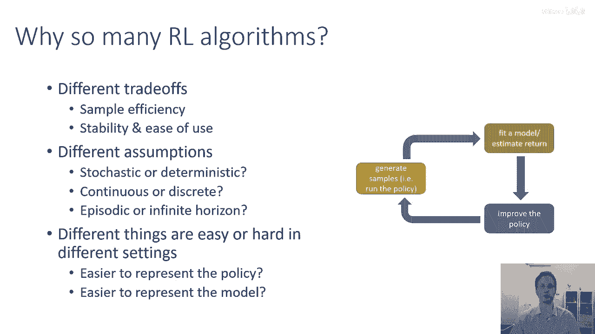

在某些设定下，直接表示策略可能更容易，即使环境动态非常复杂；而在另一些设定下，学习模型可能比直接学习策略更简单。因此，我们通常需要根据面临的具体问题来做出权衡，例如：
*   为了获得更易用或能处理随机性、部分可观测性的算法，可能选择样本效率较低的算法。
*   如果样本收集成本极高，则可能选择样本效率非常高的算法，但同时接受其可能只支持离散动作等限制。

---

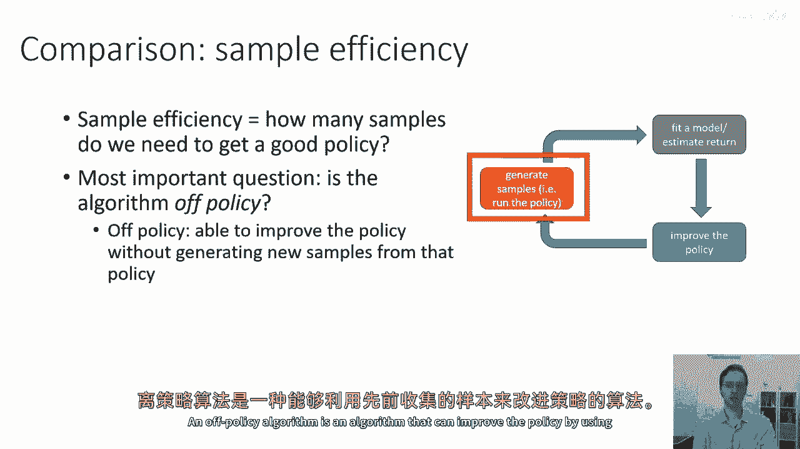

## 2. 样本效率 📈

样本效率是衡量算法性能的核心概念之一。它指的是算法需要从当前策略中采样多少次（即需要执行多少次橙色框中的步骤），才能得到一个性能良好的策略。

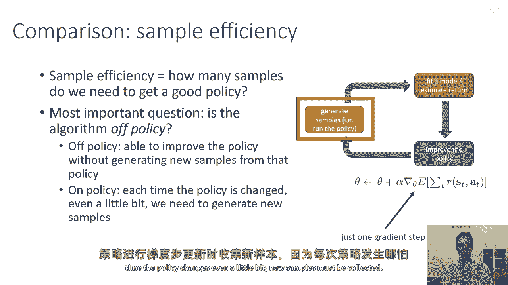

以下是决定算法样本效率的最重要因素之一：算法是**离线策略（off-policy）** 还是**在线策略（on-policy）**。

*   **离线策略算法**：可以使用过去收集的样本来改进当前策略。
*   **在线策略算法**：每次策略更新后，都必须丢弃旧样本并重新收集新数据。

因此，在线策略算法的样本效率通常远低于离线策略算法。例如，策略梯度（Policy Gradient）是一种在线策略算法，每次沿策略梯度方向更新时，都必须收集新的样本，因为策略的微小改变也会导致数据分布的变化。

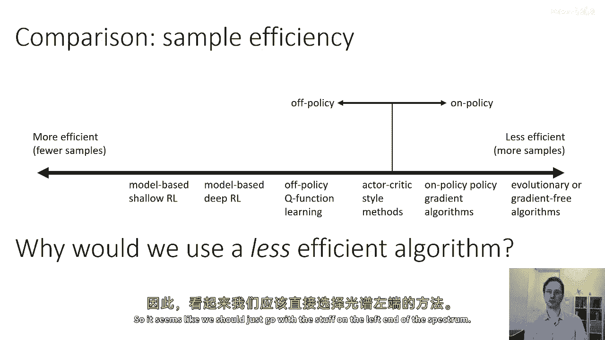

如果我们将算法按样本效率从高到低（从左到右）排列，主要的分界线就是**在线策略 vs 离线策略**。

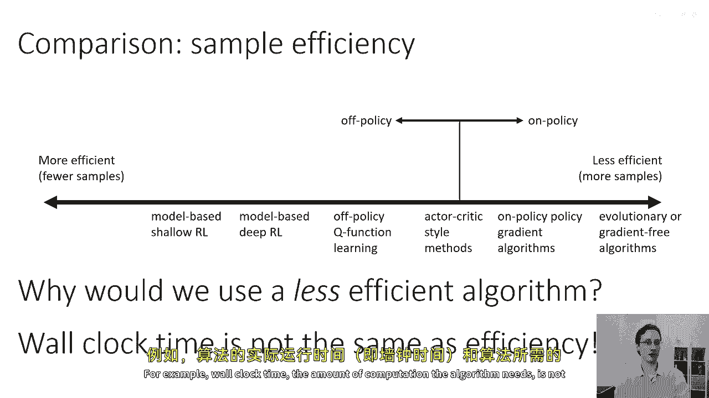

*   效率最低的（最右端）：进化策略等无梯度方法。
*   效率较低：在线策略的策略梯度算法。
*   效率中等：演员-评论家（Actor-Critic）方法（可在线也可离线）。
*   效率较高：纯粹的离线策略方法，如Q学习。
*   效率可能最高：基于模型的深度强化学习方法。

那么，为什么我们有时还会选择效率较低的算法呢？这是因为随着我们向效率更高的方向移动，其他方面的权衡可能变得不利，例如**计算时间（时钟时间）**。

算法的**样本效率**并不等同于其**计算效率**。在某些应用中，生成样本（例如在快速模拟器中运行）的成本非常低，大部分计算时间实际上花在更新价值函数、模型和策略上。在这种情况下，我们可能并不在意样本效率。

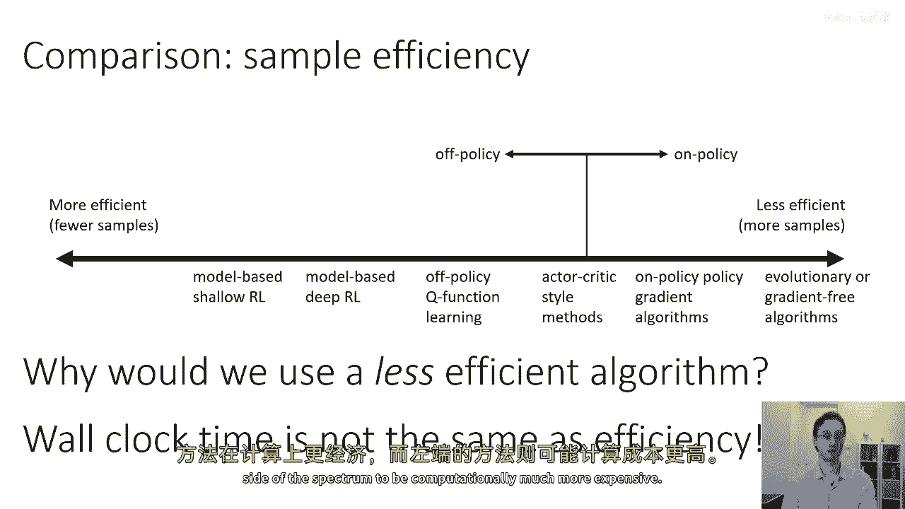

有趣的是，在这种情况下，算法的时钟时间排序可能与样本效率排序相反。如果模拟非常廉价，位于光谱右端（样本效率低）的算法在计算上可能更便宜、更快；而左端（样本效率高）的算法计算开销可能更大。

---

## 3. 稳定性与易用性 ⚖️

在讨论稳定性和易用性时，我们关注以下问题：
*   算法是否**收敛**？即运行足够长时间后，是否会稳定在一个固定解，还是会持续振荡甚至发散？
*   如果收敛，它收敛到**什么**？是强化学习目标的局部最优解，还是其他明确定义的目标？

你可能会问，为什么收敛性在强化学习中会成为一个问题？因为在监督学习或凸优化中，我们通常只关心那些保证收敛的方法。然而在强化学习中，能保证收敛的算法实际上是一种“奢侈品”。实践中许多常用方法在一般情况下并不保证收敛。

这是因为强化学习通常不纯粹是梯度下降或上升。许多算法本质上是**定点迭代（fixed point iteration）**，其收敛性保证通常只在简化的假设下成立（如表格化、离散状态），而这些假设在实践中往往不成立。

以下是不同算法类别的收敛特性：

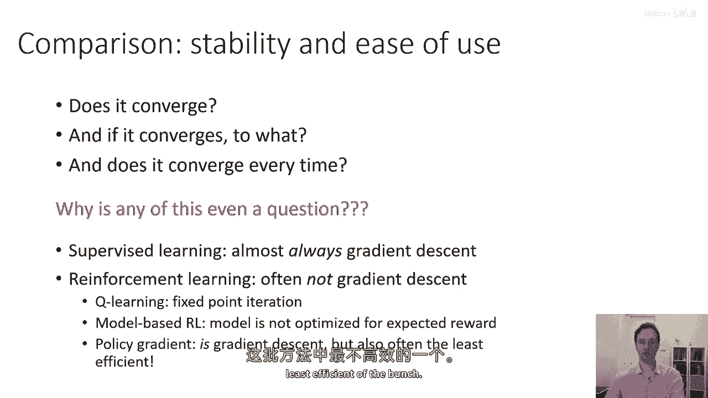

*   **Q学习**：是一种定点迭代。其收敛性在理论上是开放问题。
*   **基于模型的强化学习**：模型本身被训练以准确预测状态转移，这个训练过程是收敛的。但**没有保证**更好的模型一定会带来更高的奖励。
*   **策略梯度**：执行的是真实目标函数的梯度上升，因此理论上会收敛。但它是样本效率最低的方法之一。
*   **价值函数拟合**：是一种旨在最小化**贝尔曼误差（Bellman error）** 的定点迭代。即使价值函数预测准确，也不保证能产生高性能的策略。在最坏情况下，使用非线性函数近似器（如神经网络）的流行深度强化学习算法甚至可能不收敛。

---

## 4. 常见假设与适用范围 🎯

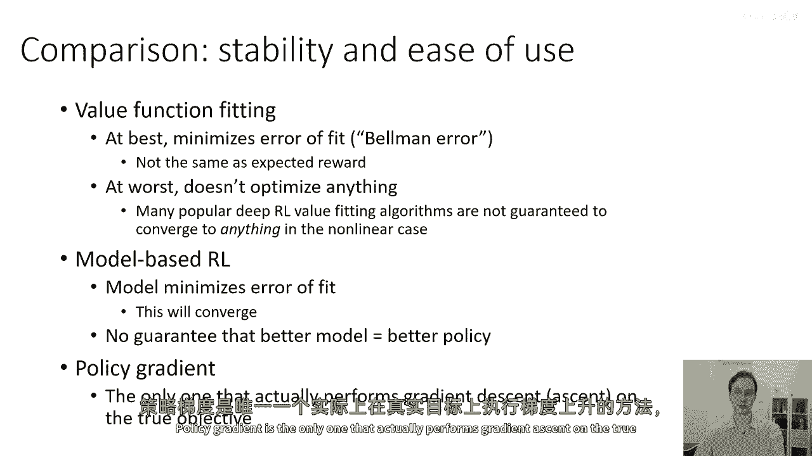

不同的强化学习算法基于不同的假设，了解这些假设对选择合适算法至关重要。

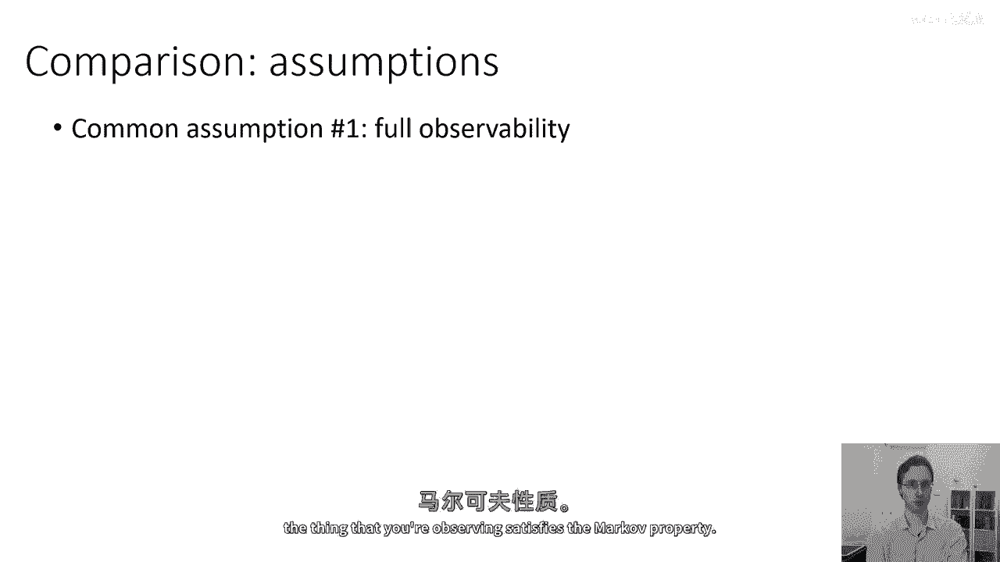

**假设一：完全可观测性**
大多数价值函数拟合方法（如Q学习）假设环境是**完全可观测的马尔可夫决策过程（MDP）**，即智能体观察到的信息足以唯一确定系统状态（满足马尔可夫性质）。在部分可观测环境（POMDP）中，这些方法可能失效，但可以通过添加循环网络或记忆机制来缓解。

**假设二：情景式学习**
许多策略梯度方法假设问题是**情景式（episodic）** 的，即智能体可以多次“重置”环境并从头开始尝试。虽然这不是大多数基于价值的方法的技术性假设，但它们在满足此条件时通常工作得更好。一些基于模型的方法也依赖此假设。

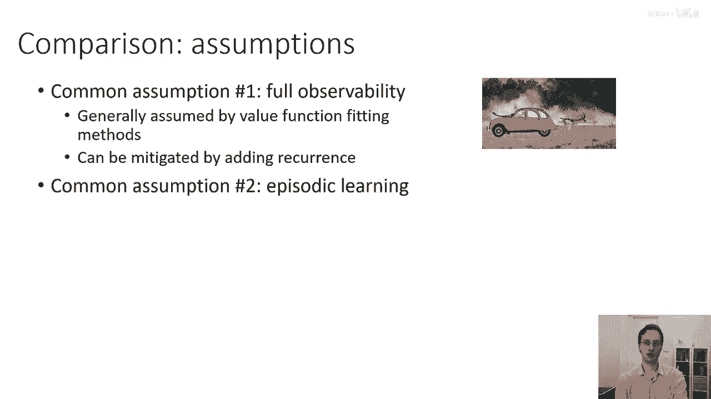

**假设三：连续性或平滑性**
在连续状态和动作空间中，一些基于价值函数的方法和许多源自最优控制领域的**基于模型的强化学习方法**，都假设环境动态是连续或平滑的。这个假设对于这些方法的良好运行至关重要。

在接下来的课程中，当我们讨论具体算法时，会明确指出其依赖的假设。请记住，不同方法对这些假设的依赖程度和严格性要求各不相同，这直接影响它们在实践中的表现。

---

## 总结 ✨

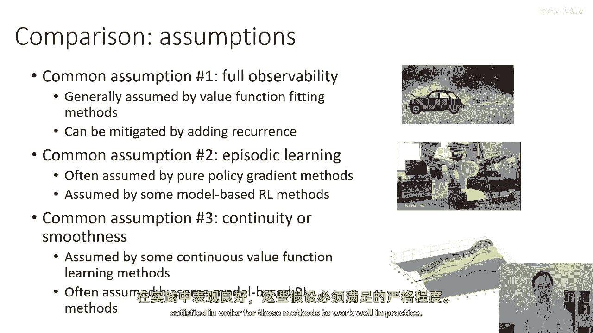

本节课中，我们一起学习了强化学习算法的多样性与核心权衡。我们了解到，没有一种算法适用于所有情况，选择时需要权衡**样本效率**、**计算时间**、**稳定性**和**易用性**。关键区别在于算法是**在线策略**还是**离线策略**。此外，不同算法基于不同的**假设**，如完全可观测性、情景式学习或环境动态的连续性。理解这些权衡和假设，是为你手头的特定问题选择最合适强化学习算法的第一步。