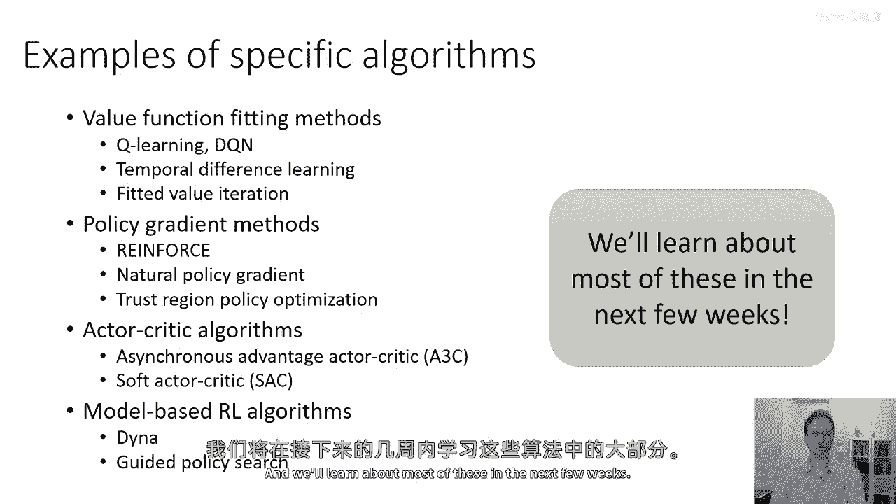
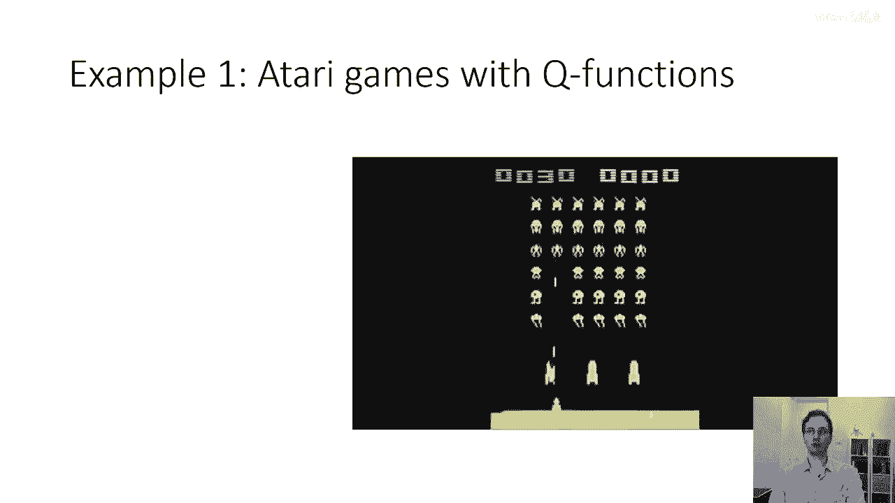
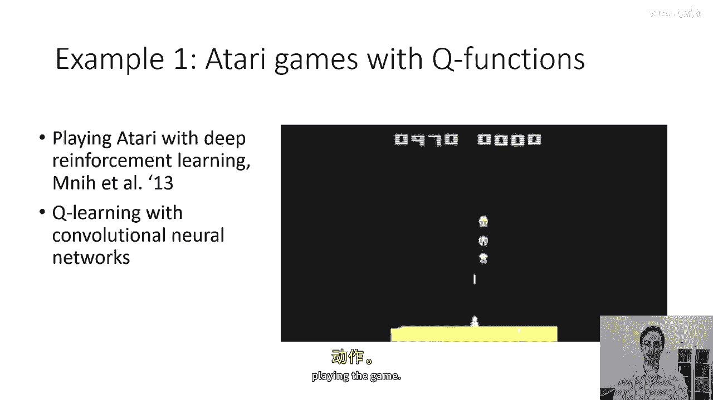
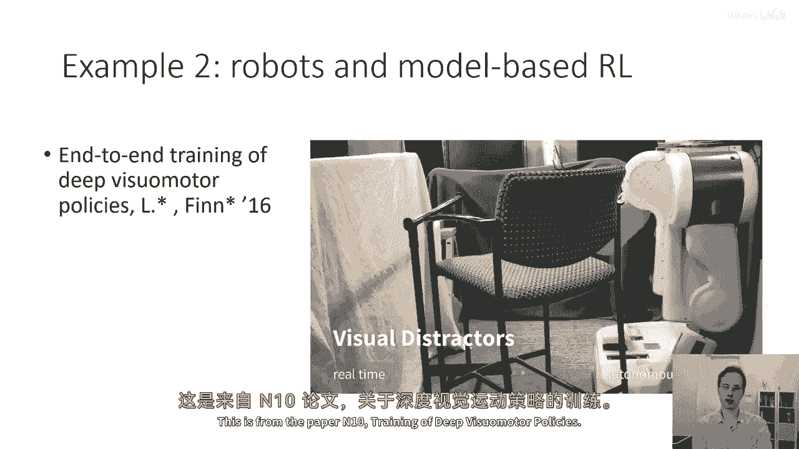
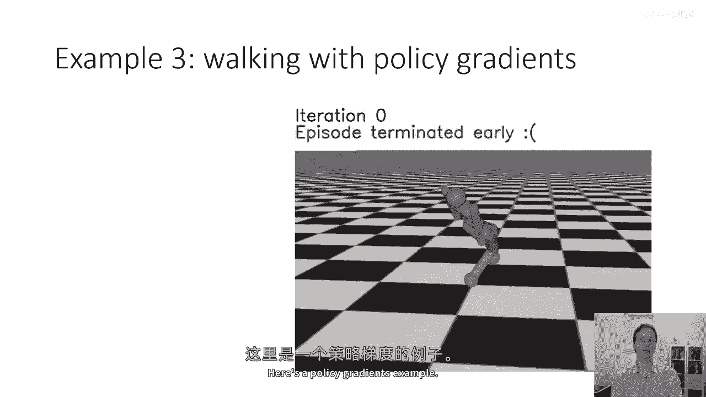
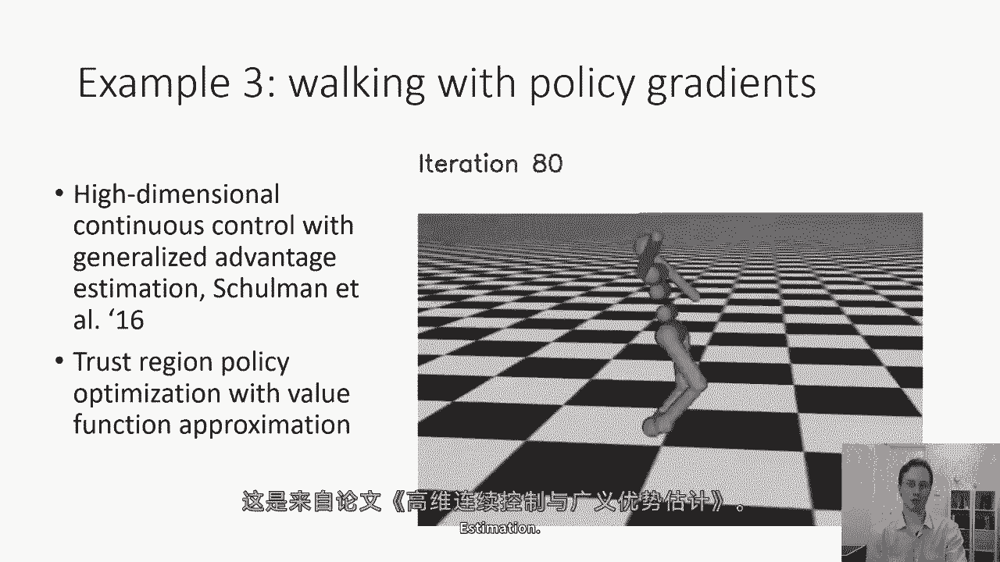
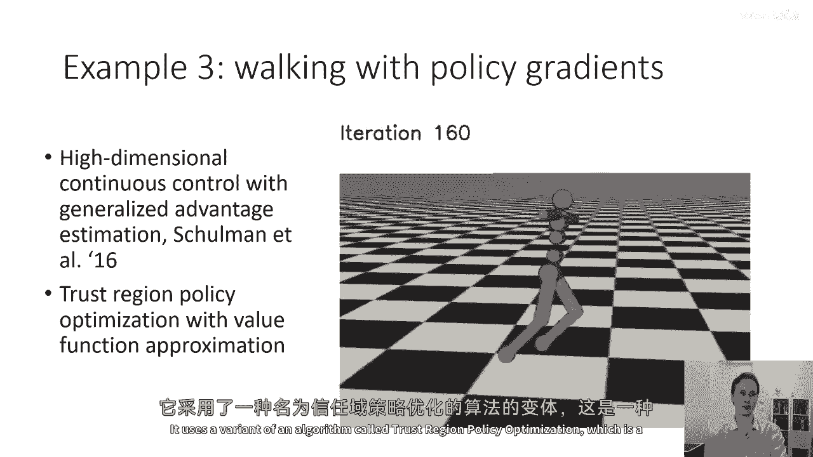
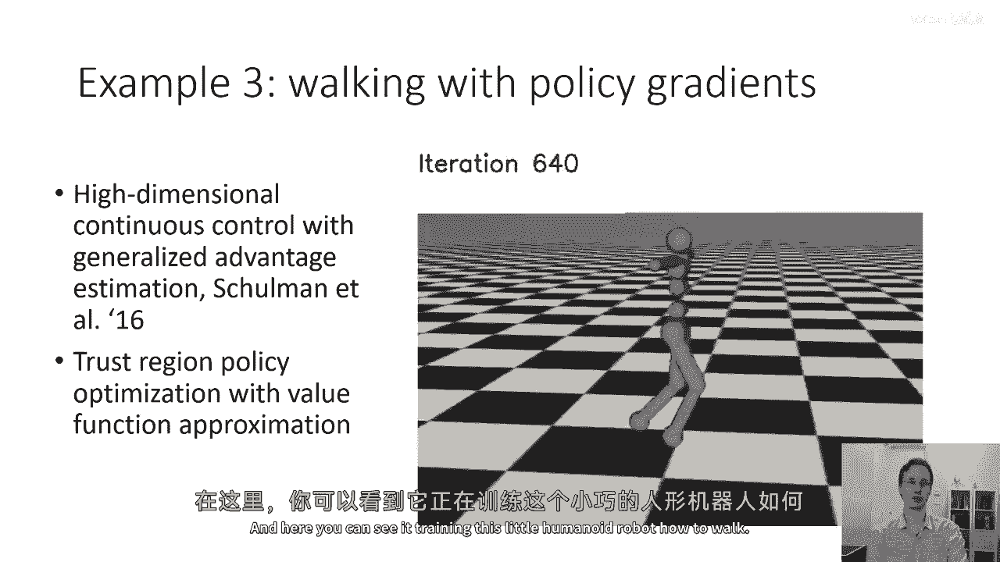

# 14：深度强化学习算法概览 🧠

在本节课中，我们将简要了解几种实际的深度强化学习算法。这部分内容旨在让你对这些算法有一个直观的认识，并预览后续课程将深入探讨的主题。我们将通过一些有趣的例子和视频来展示这些算法的应用。

---

## 算法类别简介 📚

上一节我们介绍了深度强化学习的整体框架，本节中我们来看看几种主要的算法类别。这些算法将在后续课程中详细讨论。

以下是三种主要的深度强化学习算法类别：

1.  **价值函数拟合方法**
    *   这类方法的核心是学习一个价值函数（如状态价值函数 V(s) 或动作价值函数 Q(s, a)），并通过优化价值函数来改进策略。
    *   常见算法包括：Q学习、深度Q网络（DQN）、时间差分学习（TD Learning）。
    *   核心思想通常可以表示为 **Q(s, a) ← Q(s, a) + α [R + γ max_a‘ Q(s‘, a‘) - Q(s, a)]** 这样的更新公式。

2.  **策略梯度方法**
    *   这类方法直接参数化策略 π(a|s; θ)，并通过梯度上升来优化策略参数 θ，以最大化期望回报。
    *   常见算法包括：强化学习、自然梯度、信任域策略优化（TRPO）、近端策略优化（PPO）。

3.  **演员-评论家算法**
    *   这类方法结合了价值函数和策略梯度，通常包含一个“演员”（负责选择动作的策略）和一个“评论家”（负责评估动作的价值）。
    *   常见算法包括：异步优势演员-评论家（A3C）、软演员-评论家（SAC）、深度确定性策略梯度（DDPG）。

4.  **基于模型的强化学习算法**
    *   这类方法会学习或利用环境的动态模型（即状态转移概率和奖励函数），并基于此模型进行规划或策略优化。
    *   常见算法包括：Dyna、引导策略搜索（GPS）、最大后验策略优化（MPO）、随机值梯度（SVG）。

---

## 算法实例与应用 🎮

现在，让我们通过一些具体的例子来看看这些算法在实际中是如何工作的。

### 示例一：玩雅达利游戏的Q学习

这是一个使用Q学习算法直接从像素输入学习玩雅达利游戏的例子。该算法使用卷积神经网络来估计Q值。

*   **算法核心**：Q学习（一种价值函数方法）。
*   **环境特点**：雅达利游戏属于**离散动作环境**，即动作空间是有限的、离散的集合。
*   **决策过程**：对于每个状态，神经网络会为每个可能的动作输出一个Q值。智能体通过选择具有最高Q值的动作（即 **arg max_a Q(s, a)**）来进行决策。

### 示例二：机器人技能学习的引导策略搜索

这个例子展示了机器人学习各种技能，如放置物体。它使用了基于模型的强化学习算法——引导策略搜索。

*   **算法核心**：引导策略搜索（GPS）。
*   **技术组合**：该方法结合了环境的动态模型和基于图像的卷积神经网络策略。
*   **应用**：使机器人能够执行需要精确视觉和运动协调的任务。

### 示例三：人形机器人行走的策略梯度

这个例子展示了训练一个小型人形机器人学习行走。它使用了策略梯度方法的一个变体——信任域策略优化（TRPO）。

*   **算法核心**：信任域策略优化（TRPO），这是一种演员-评论家算法。
*   **特点**：TRPO在更新策略时引入了信任域约束，以确保每次更新是稳定且有益的。它同时结合了策略函数和价值函数近似。

### 示例四：机器人抓取的Q学习

这个例子是第一节课中展示过的机器人抓取任务。有趣的是，这个结果也是由一种Q学习算法产生的，尽管其具体实现与玩雅达利游戏的例子有所不同。

*   **算法核心**：Q学习。
*   **说明**：这表明同一类算法（如Q学习）经过不同的设计和优化，可以应用于从视频游戏到复杂机器人操作等截然不同的领域。

---

## 总结 ✨

本节课中，我们一起学习了深度强化学习的几种主要算法类别及其实际应用。

我们简要介绍了：
1.  **价值函数方法**（如DQN），通过评估动作价值来学习。
2.  **策略梯度方法**（如TRPO、PPO），直接优化策略参数。
3.  **演员-评论家方法**（如A3C、SAC），结合了前两者的优点。
4.  **基于模型的方法**（如GPS），利用环境模型进行规划。

通过玩雅达利游戏、机器人操作和行走等生动例子，我们看到了这些算法如何解决不同类型的实际问题。在接下来的课程中，我们将对这些算法进行更深入、更技术性的探讨。