# 15：策略梯度基础 🧠

在本节课中，我们将要学习强化学习中的第一个核心算法——策略梯度。我们将从回顾强化学习的目标函数开始，推导出策略梯度的基本形式，并了解如何通过采样来估计和优化这个目标。

## 概述 📋

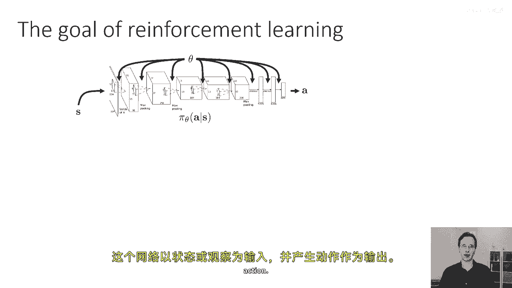

策略梯度算法是强化学习中最直接的算法之一。它通过直接对强化学习的目标函数进行求导，然后对策略参数执行梯度下降，从而使策略得到改进。本节课将详细介绍其数学基础和工作原理。

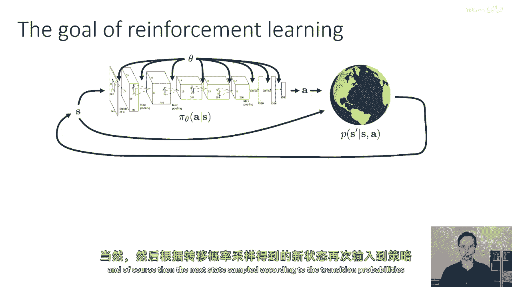

## 强化学习目标回顾 🔄

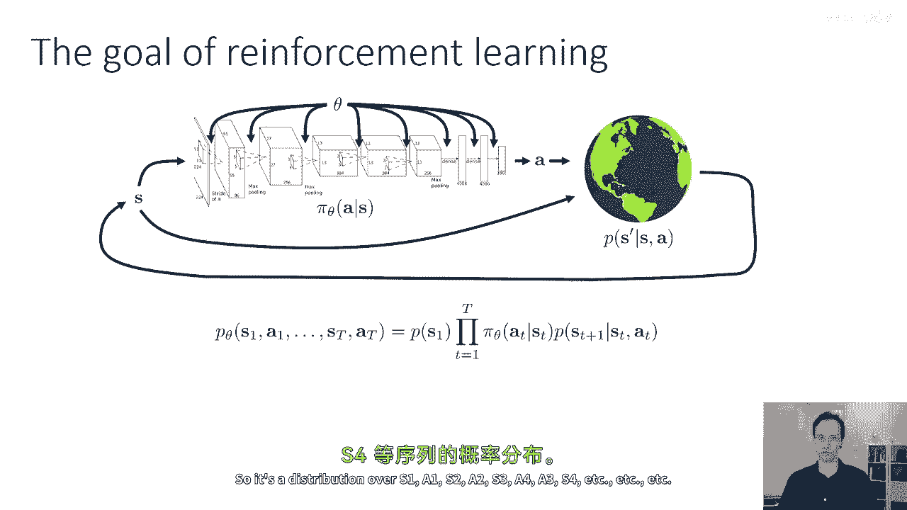

上一节我们介绍了强化学习的基本框架。本节中我们来看看如何形式化其优化目标。

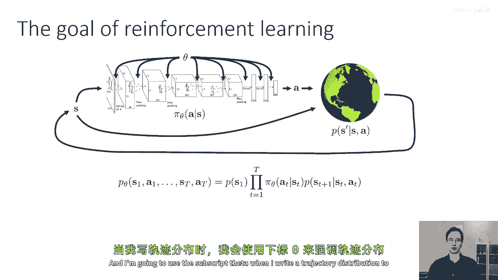

我们有一个参数为 **θ** 的策略 **π**。该策略定义了在给定状态 **s**（或观测 **o**）时，动作 **a** 的概率分布。如果策略由一个深度神经网络表示，那么 **θ** 就是网络的权重。网络以状态为输入，输出动作的概率。

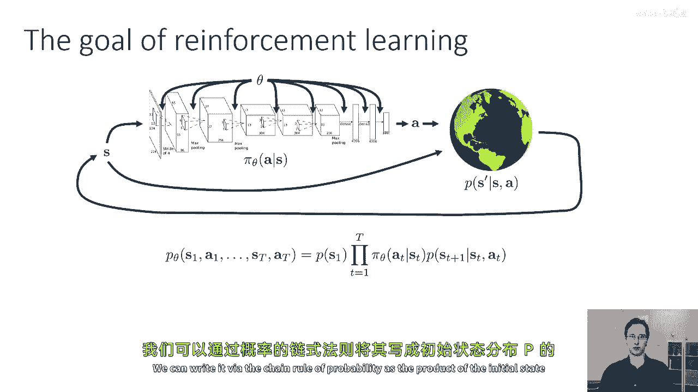

智能体与环境交互，产生一个轨迹 **τ**，它包含一系列状态和动作：**τ = (s₁, a₁, s₂, a₂, ..., s_T, a_T)**。轨迹的概率分布 **p_θ(τ)** 由初始状态分布、策略和状态转移概率共同决定：

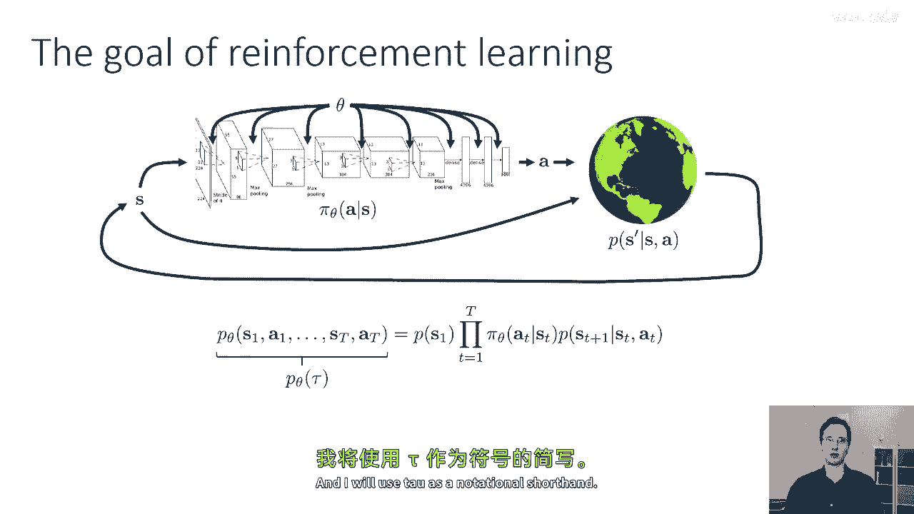

**p_θ(τ) = p(s₁) ∏_{t=1}^{T} π_θ(a_t | s_t) p(s_{t+1} | s_t, a_t)**

强化学习的目标是找到能最大化期望累积奖励的策略参数 **θ**。目标函数 **J(θ)** 定义为：

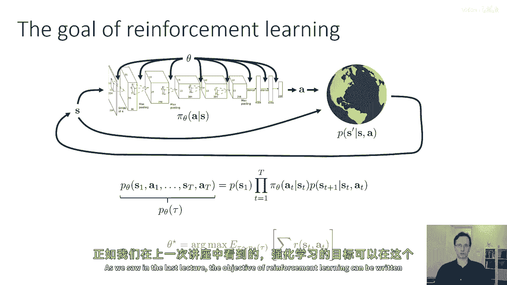

**J(θ) = E_{τ ∼ p_θ(τ)} [∑_{t=1}^{T} r(s_t, a_t)]**

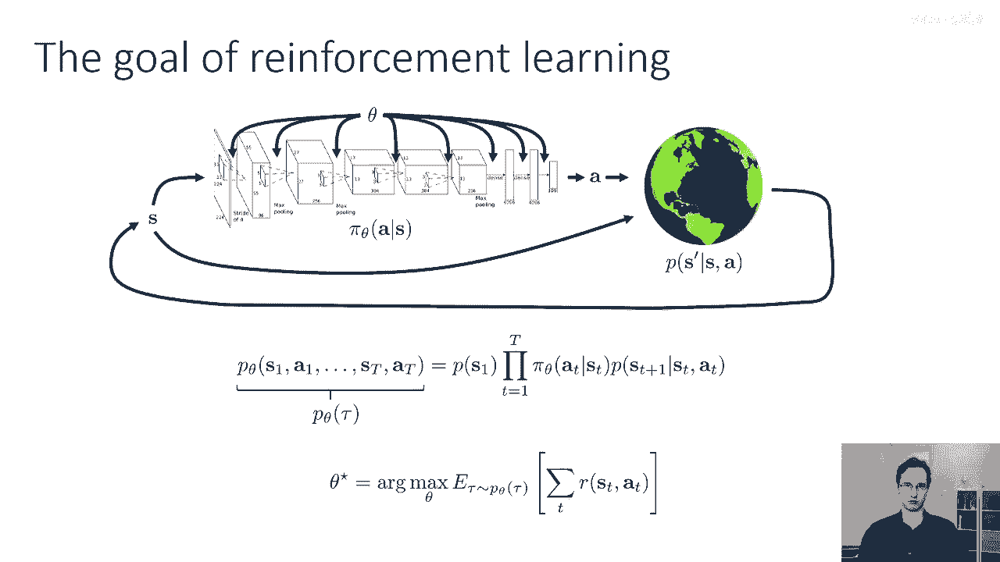

为简化符号，我们常将轨迹的总奖励记为 **R(τ) = ∑_{t=1}^{T} r(s_t, a_t)**。因此，目标函数可写为：

**J(θ) = E_{τ ∼ p_θ(τ)} [R(τ)]**

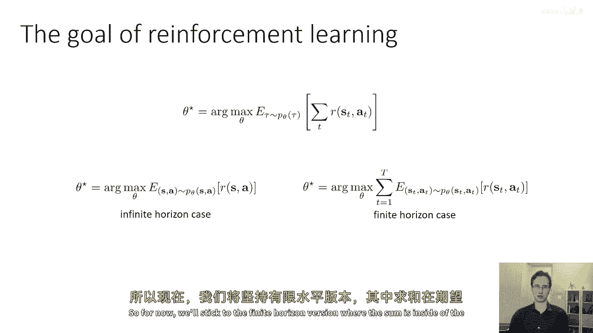

## 目标函数的评估 📊

在我们讨论如何优化目标之前，首先需要知道如何评估它。由于我们通常不知道真实的环境动态（初始状态分布 **p(s₁)** 和转移概率 **p(s_{t+1} | s_t, a_t)**），我们无法直接计算期望值。

然而，我们可以通过与真实环境交互来采样估计。以下是评估目标函数的步骤：

1.  使用当前策略 **π_θ** 在环境中运行 **N** 次，收集 **N** 条轨迹样本 **{τ⁽ⁱ⁾}**。
2.  计算每条轨迹的总奖励 **R(τ⁽ⁱ⁾)**。
3.  目标函数的无偏估计是所有样本轨迹奖励的平均值：

    **J(θ) ≈ (1/N) ∑_{i=1}^{N} R(τ⁽ⁱ⁾)**

样本数量 **N** 越大，这个估计就越准确。

## 策略梯度的推导 🧮

我们的目标不仅是评估 **J(θ)**，更是要优化它。为此，我们需要计算目标函数关于策略参数 **θ** 的梯度 **∇_θ J(θ)**。

我们从梯度的定义出发，并运用一个关键的数学技巧（对数导数法则）：

**∇_θ J(θ) = ∇_θ ∫ p_θ(τ) R(τ) dτ = ∫ ∇_θ p_θ(τ) R(τ) dτ**

利用恒等式 **∇_θ p_θ(τ) = p_θ(τ) ∇_θ log p_θ(τ)**，我们可以将上式重写为：

**∇_θ J(θ) = ∫ p_θ(τ) ∇_θ log p_θ(τ) R(τ) dτ = E_{τ ∼ p_θ(τ)} [∇_θ log p_θ(τ) R(τ)]**

现在，我们需要处理 **∇_θ log p_θ(τ)**。回顾轨迹分布的对数形式：

**log p_θ(τ) = log p(s₁) + ∑_{t=1}^{T} [log π_θ(a_t | s_t) + log p(s_{t+1} | s_t, a_t)]**

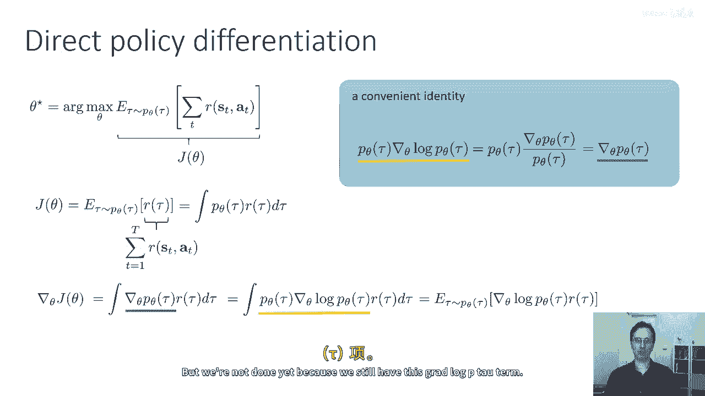

当我们对 **θ** 求梯度时，与 **θ** 无关的项（如 **log p(s₁)** 和 **log p(s_{t+1} | s_t, a_t)**）的梯度为零。因此，只剩下策略项：

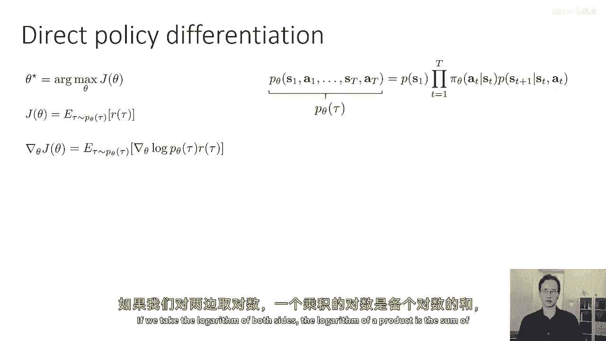

**∇_θ log p_θ(τ) = ∑_{t=1}^{T} ∇_θ log π_θ(a_t | s_t)**

将这个结果代回梯度表达式，我们得到策略梯度的核心公式：

**∇_θ J(θ) = E_{τ ∼ p_θ(τ)} [ (∑_{t=1}^{T} ∇_θ log π_θ(a_t | s_t)) R(τ) ]**

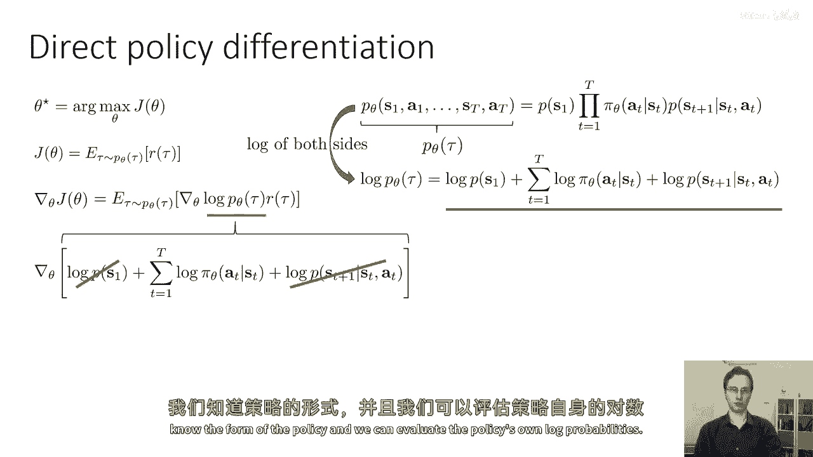

这个公式非常强大，因为期望内的所有项都是已知或可计算的：
*   **∇_θ log π_θ(a_t | s_t)**：策略模型在给定状态下对执行动作的对数概率的梯度。由于我们知道策略模型（如神经网络），我们可以直接计算它。
*   **R(τ)**：轨迹的总奖励，可以通过采样获得。

所有未知的环境动态（**p(s₁)**, **p(s_{t+1} | s_t, a_t)**）只体现在采样分布 **p_θ(τ)** 中，而我们正是通过采样来近似这个期望的。

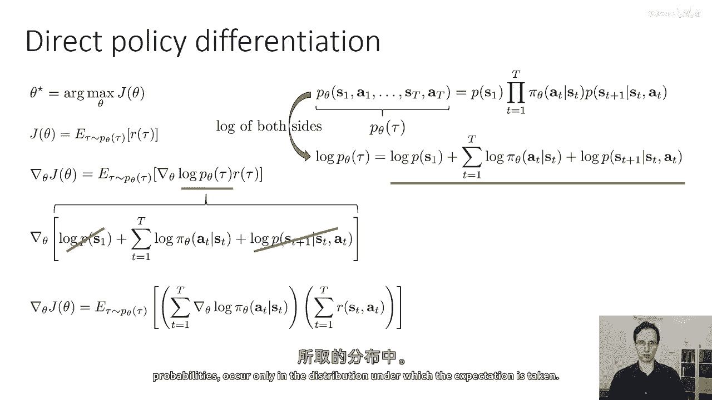

## REINFORCE 算法 ⚙️

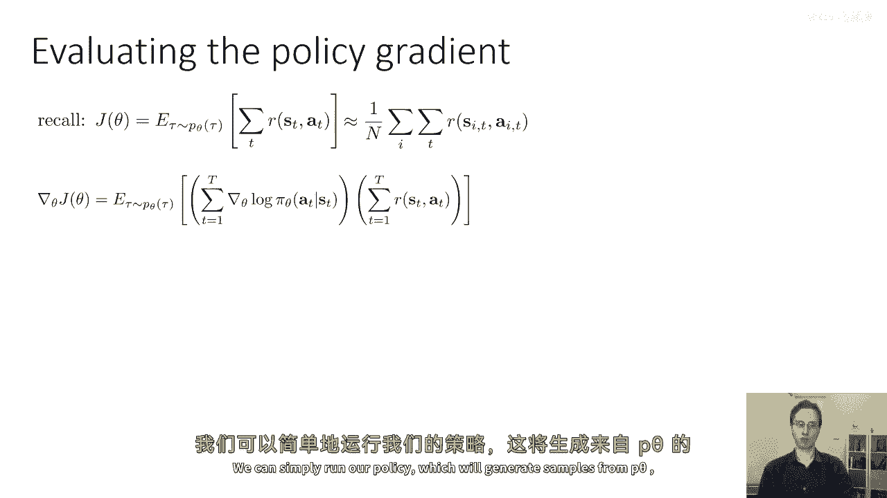

基于上述推导，我们可以得到最基本的策略梯度算法，称为 **REINFORCE** 算法。它包含以下三个步骤：

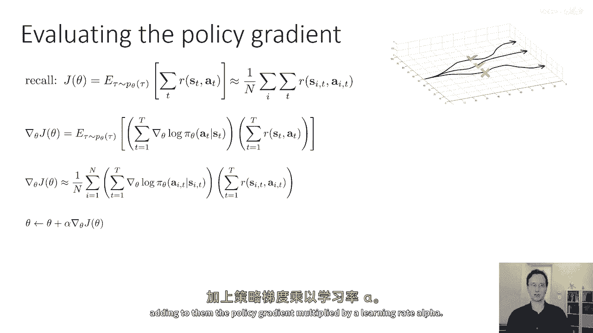

1.  **采样**：使用当前策略 **π_θ** 与环境交互，收集 **N** 条轨迹样本 **{τ⁽ⁱ⁾}**。
2.  **计算梯度估计**：对于每条样本轨迹 **τ⁽ⁱ⁾**，计算其总奖励 **R(τ⁽ⁱ⁾)**，并计算策略对数概率的梯度之和。然后，按照以下公式估计策略梯度：
    **∇_θ J(θ) ≈ (1/N) ∑_{i=1}^{N} [ (∑_{t=1}^{T} ∇_θ log π_θ(a_t⁽ⁱ⁾ | s_t⁽ⁱ⁾)) R(τ⁽ⁱ⁾) ]**
3.  **策略更新**：使用估计的梯度执行一步梯度上升（因为我们要最大化奖励）：
    **θ ← θ + α ∇_θ J(θ)**
    其中 **α** 是学习率。

这个过程直观地对应了强化学习算法的一般结构：采样（橙色）、评估（绿色）、改进（蓝色）。

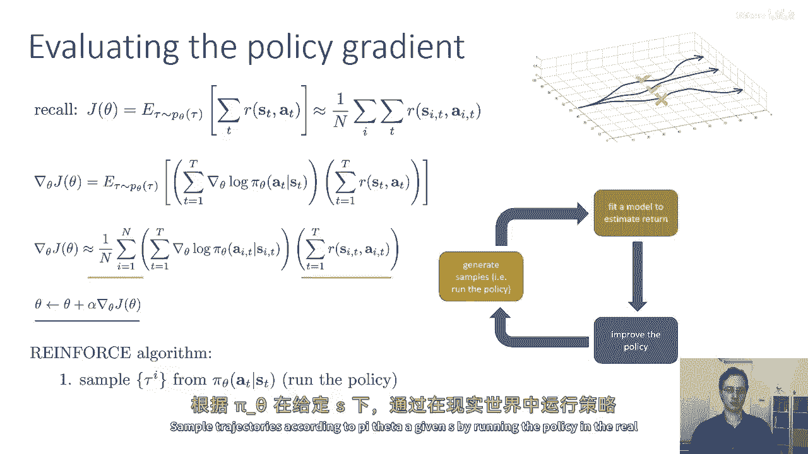

## 总结与展望 🎯

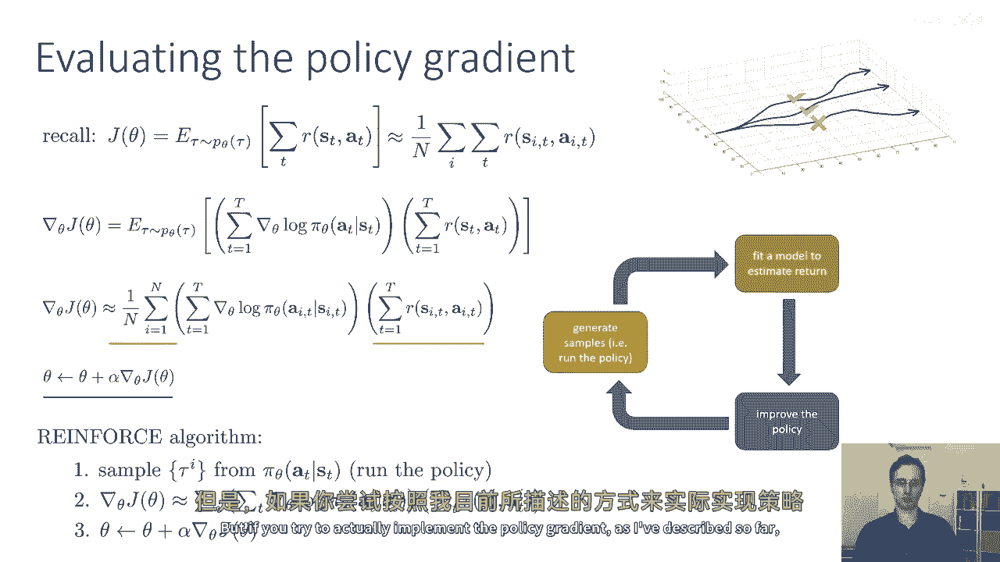

本节课中我们一起学习了策略梯度算法的基础。我们从强化学习的目标函数出发，推导出了策略梯度的核心公式，并介绍了最简单的 REINFORCE 算法实现。该算法允许我们仅通过与环境交互采样，就能估计目标函数的梯度并改进策略。

然而，直接按照上述方式实现的 REINFORCE 算法在实践中可能效果不佳，因为它存在高方差等问题。在接下来的课程中，我们将探讨对策略梯度的直观理解，并学习如何通过引入基线（Baseline）、价值函数等技巧来改进算法，使其在实际应用中更加有效和稳定。