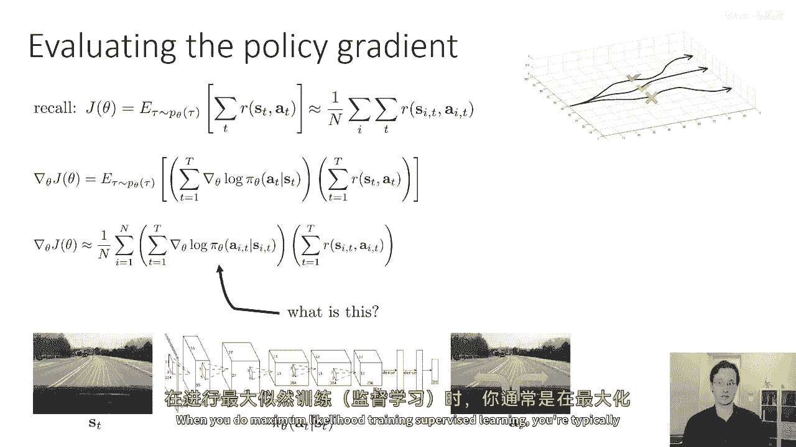
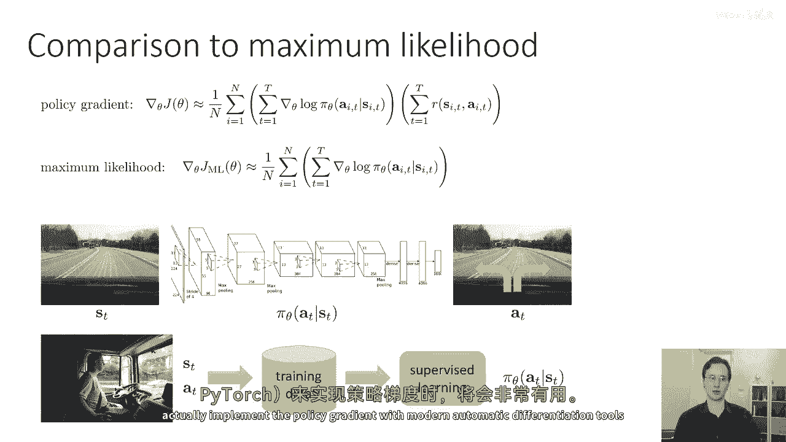
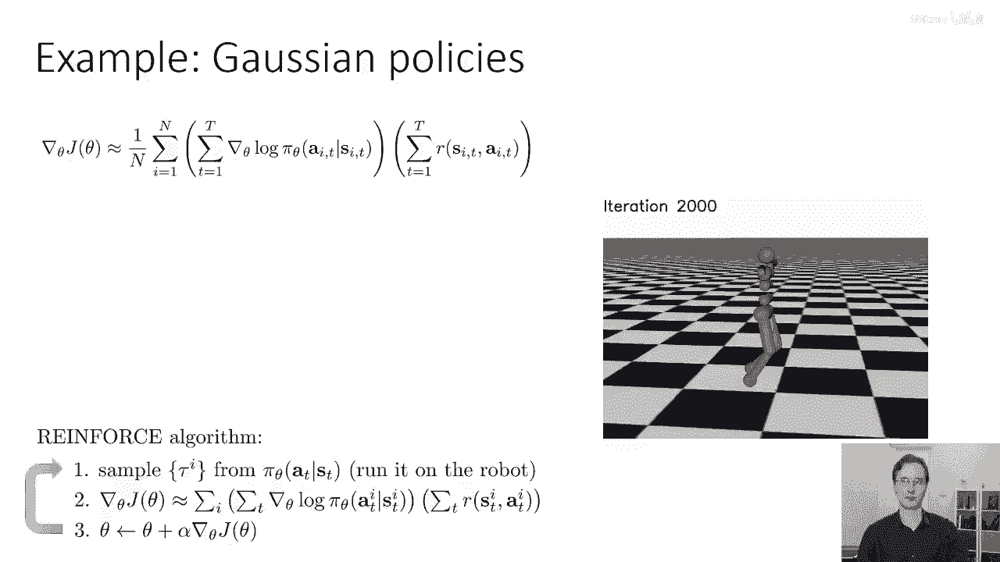
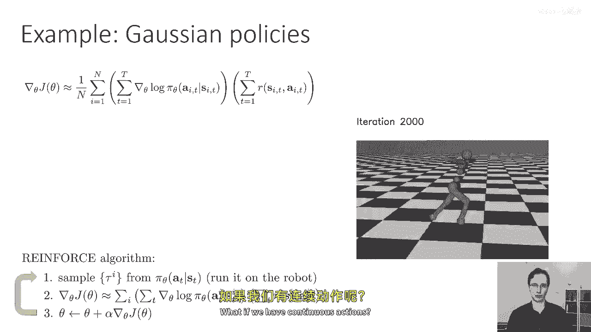
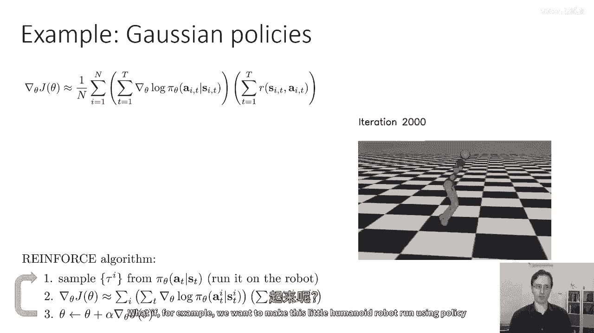
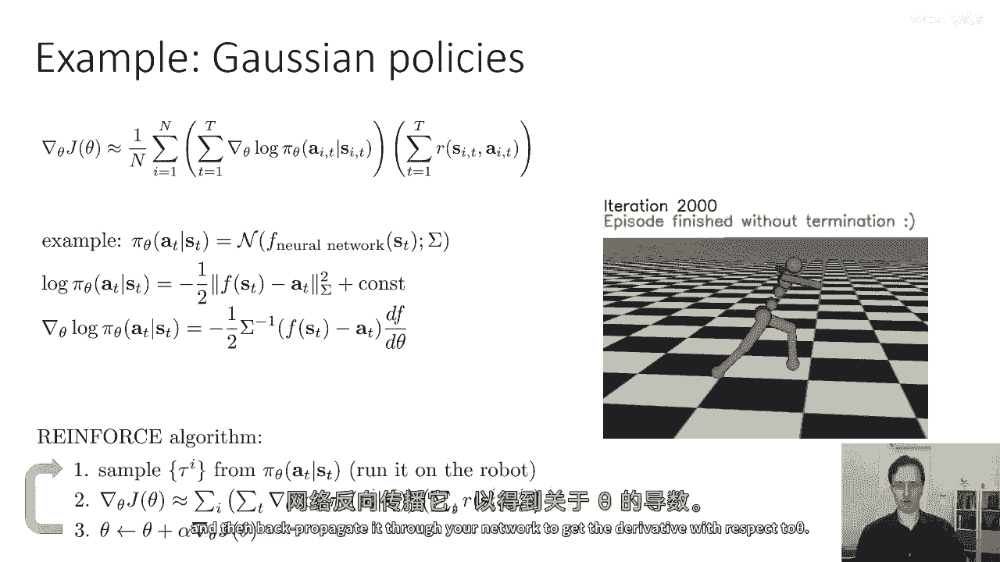
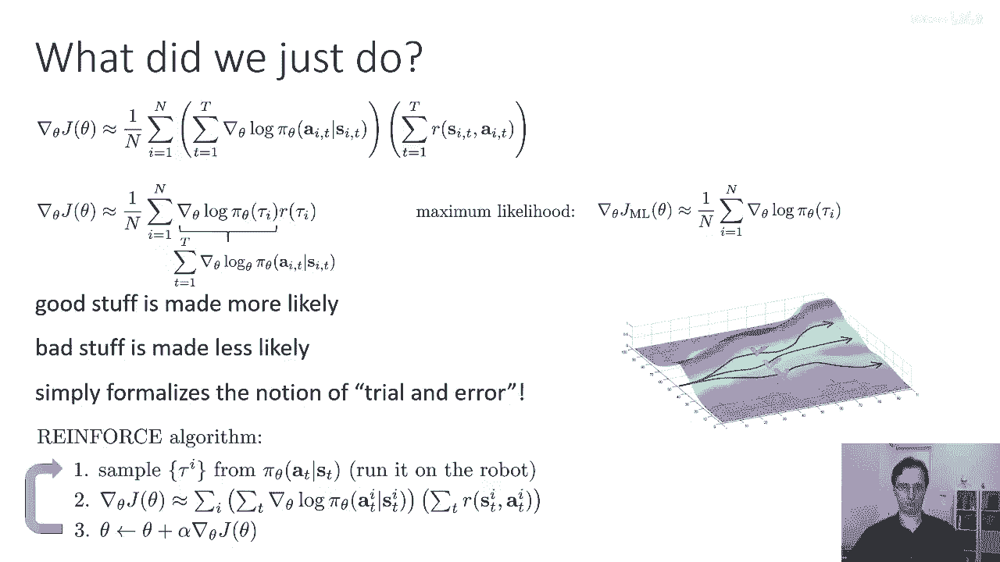
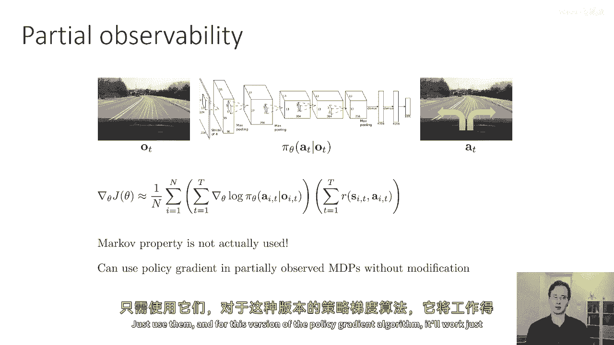
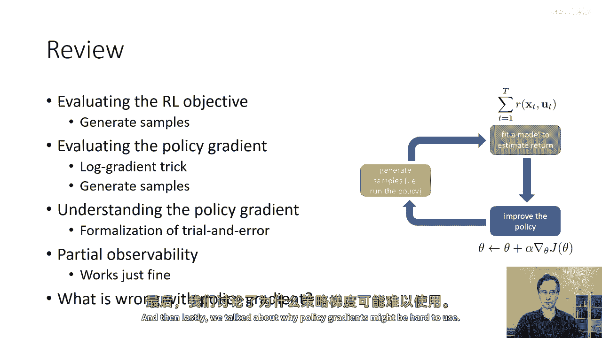

# 16：策略梯度直觉与挑战 🧠

在本节课中，我们将深入探讨策略梯度的直观含义，理解它在做什么，并分析其在实际应用中可能遇到的问题。我们将从与监督学习的对比开始，逐步构建对策略梯度的理解，并讨论其在高方差和部分可观测性方面的挑战。

---

## 策略梯度的直观理解 🔍

上一节我们介绍了策略梯度的数学推导。本节中，我们来看看策略梯度实际上在做什么。

我们之前得到的策略梯度近似表达式为：
\[
\nabla_\theta J(\theta) \approx \frac{1}{N} \sum_{i=1}^{N} \left( \sum_{t=1}^{T} \nabla_\theta \log \pi_\theta(a_t^i | s_t^i) \right) R(\tau^i)
\]
其中，\(\nabla_\theta \log \pi_\theta\) 是关键项。

### 与监督学习的对比

为了理解策略梯度，我们可以将其与监督学习中的最大似然估计进行对比。

在监督学习（例如模仿学习）中，我们收集人类专家选择的动作数据，然后通过最大化观察到的动作的对数概率来训练策略。其梯度为：
\[
\nabla_\theta J_{ML}(\theta) = \frac{1}{N} \sum_{i=1}^{N} \sum_{t=1}^{T} \nabla_\theta \log \pi_\theta(a_t^i | s_t^i)
\]

以下是两者的核心区别：
*   **监督学习（最大似然）**：简单地增加所有观测动作的对数概率，因为我们假设数据中的动作都是“好”的。
*   **策略梯度**：根据轨迹的总奖励 \(R(\tau)\) 来加权增加或减少动作的对数概率。高奖励轨迹的概率会增加，低奖励轨迹的概率会减少。

因此，策略梯度可以看作是一种**加权版本的最大似然梯度**。奖励值充当了权重的角色。

### 离散动作与连续动作

策略梯度的形式取决于动作空间是离散的还是连续的。

**对于离散动作**（例如驾驶图像映射到“左转”、“右转”）：
*   策略 \(\pi_\theta\) 输出每个动作的概率。
*   \(\log \pi_\theta\) 是所选动作的对数概率。
*   其梯度 \(\nabla_\theta \log \pi_\theta\) 是该对数概率对神经网络参数 \(\theta\) 的导数。

**对于连续动作**（例如控制人形机器人行走）：
*   策略需要输出一个连续值动作的分布，通常使用**高斯分布（正态分布）**。
*   神经网络输出分布的均值 \(\mu_\theta(s)\)，方差 \(\Sigma\) 可以是固定的或学习的。
*   动作 \(a_t\) 的对数概率公式为：
    \[
    \log \pi_\theta(a_t | s_t) = -\frac{1}{2} (a_t - \mu_\theta(s_t))^T \Sigma^{-1} (a_t - \mu_\theta(s_t)) + \text{常数}
    \]
*   其梯度 \(\nabla_\theta \log \pi_\theta\) 可以通过自动微分工具（如PyTorch）计算，核心项涉及 \((a_t - \mu_\theta(s_t))\) 对参数 \(\theta\) 的导数。

无论动作空间如何，\(\nabla_\theta \log \pi_\theta\) 项都对应于一种根据奖励调整的、加权后的最大似然梯度。

---

## 策略梯度的核心思想与形式化 ✅

综合来看，策略梯度算法在做什么？

我们可以将梯度公式更简洁地写为：
\[
\nabla_\theta J(\theta) \approx \frac{1}{N} \sum_{i=1}^{N} \nabla_\theta \log \pi_\theta(\tau^i) R(\tau^i)
\]
其中 \(\nabla_\theta \log \pi_\theta(\tau^i) = \sum_{t} \nabla_\theta \log \pi_\theta(a_t^i | s_t^i)\)。

其直观思想是：
*   采样得到一系列轨迹。
*   计算每条轨迹的奖励（可能为正、负或零）。
*   **增加高奖励轨迹**（“好”的尝试）的概率。
*   **降低低奖励轨迹**（“坏”的尝试）的概率。

因此，**策略梯度是将“试错学习”这一概念形式化为一种梯度下降算法**。它通过反复试验，并根据结果的好坏来调整策略。

---

## 处理部分可观测性 👁️

一个重要的扩展是：策略梯度能否用于部分可观测马尔可夫决策过程（POMDPs）？

在POMDP中，智能体接收的是观察（observation）而非完全的状态（state）。状态满足马尔可夫性（未来只依赖于当前状态），而一般的观察值不满足。

关键在于，**我们在推导策略梯度时，并未使用状态的马尔可夫性质**。这意味着，即使我们将状态 \(s\) 替换为观察 \(o\)，整个推导过程依然成立。轨迹的分布将变为状态、动作和观察的联合分布，但最终得到的策略梯度方程形式保持不变。

因此，**策略梯度算法可以直接应用于部分可观测环境，无需任何修改**。只需要让策略 \(\pi_\theta\) 基于观察 \(o_t\) 而非状态 \(s_t\) 来做出决策即可。

---

## 策略梯度的问题与挑战 ⚠️

然而，按照我们目前描述的基础策略梯度方法，在实际中可能效果不佳。主要问题在于其**估计方差非常高**。

### 高方差问题示例

考虑一个简单场景：横轴代表不同的轨迹（简化为标量），纵轴代表奖励。假设真实的奖励函数是一个钟形曲线，我们采样了三个轨迹。

*   **情况A**：采样轨迹的奖励值有正有负。策略梯度会降低负奖励轨迹的概率，提高正奖励轨迹的概率，这会使策略分布向右移动，这是合理的。
*   **情况B**：我们在所有奖励上**加上一个很大的常数**，使它们都变为正数。根据马尔可夫决策过程理论，给奖励函数加上一个常数不会改变最优策略。然而，对于策略梯度估计器来说，现在所有样本的奖励都是正的，因此它会倾向于提高**所有**轨迹的概率（尽管提高幅度不同）。这可能导致策略更新方向与情况A不同。

### 高方差的后果

对于有限的样本数量，奖励值的微小偏移（如加上常数）会导致策略梯度估计值发生巨大变化。这使得学习过程非常不稳定，收敛缓慢，甚至难以收敛。

**核心问题**：虽然当样本数量趋于无穷时，策略梯度估计是无偏的，但对于有限的样本，其方差过高，实用性差。

因此，**策略梯度算法的大部分研究和改进都围绕着如何有效降低方差**。在接下来的课程中，我们将介绍一些用于降低方差的关键技术。

---

## 本节总结 📝

本节课中我们一起学习了：
1.  **策略梯度的直观理解**：它可被视为一种**加权最大似然**方法，根据轨迹的奖励来调整动作概率，形式化了“试错学习”。
2.  **不同动作空间的处理**：对于离散和连续动作，核心都是计算 \(\nabla_\theta \log \pi_\theta\)，在连续情况下常假设动作服从高斯分布。
3.  **对部分可观测性的兼容性**：策略梯度天然适用于POMDPs，只需将策略的输入从状态改为观察。
4.  **策略梯度的核心挑战**：基础形式的策略梯度**估计方差极高**，对有限样本敏感，这使其在实际应用中面临困难，也引出了后续对降低方差方法的需求。

在下一讲中，我们将开始探讨解决这些挑战、使策略梯度真正实用的方法。