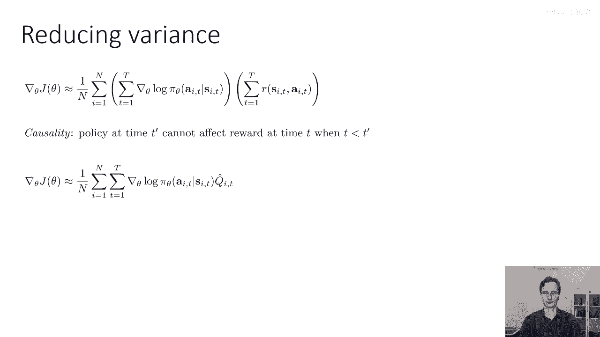
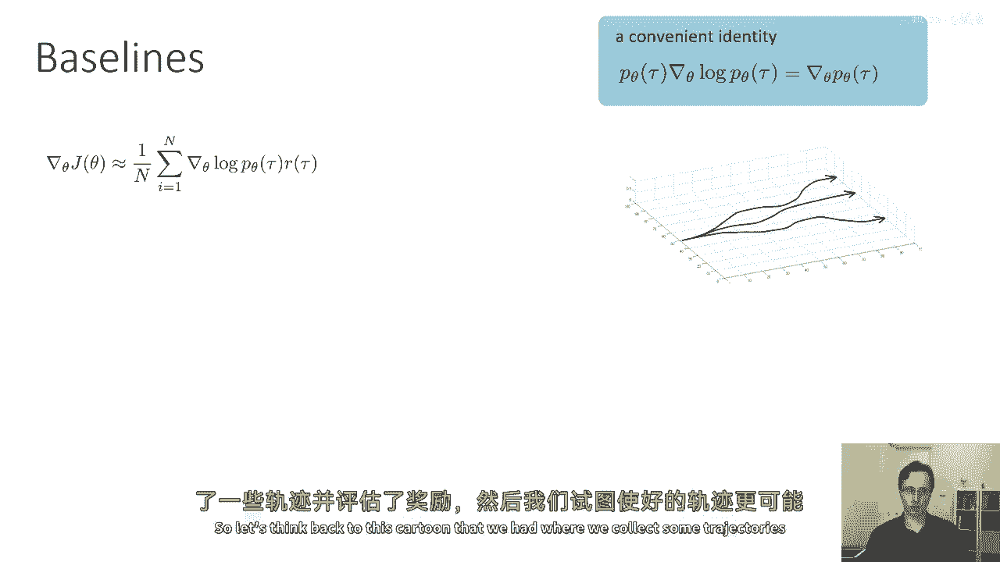
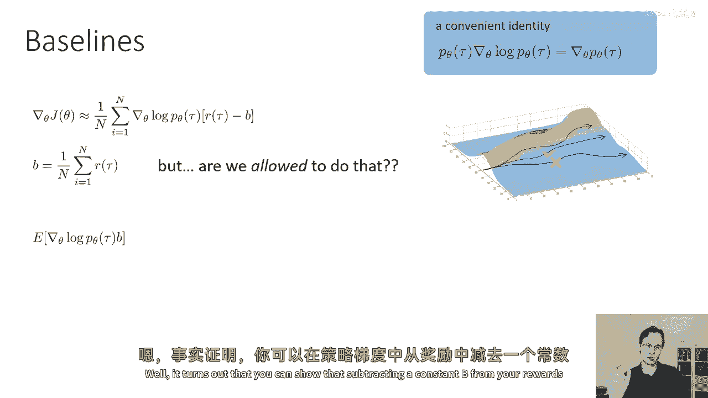
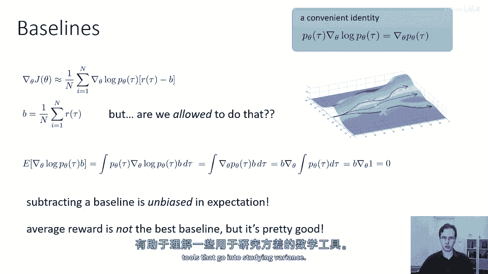
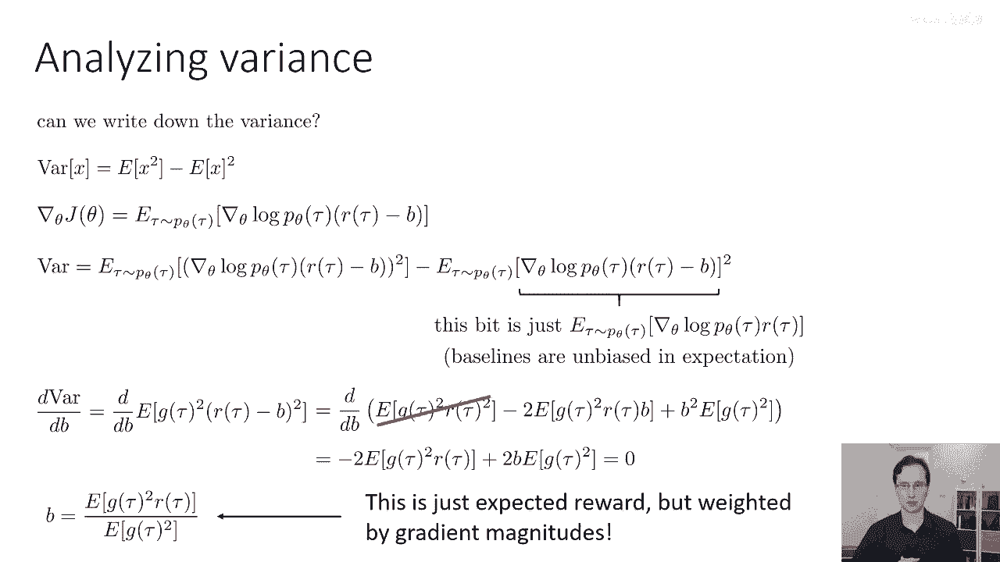
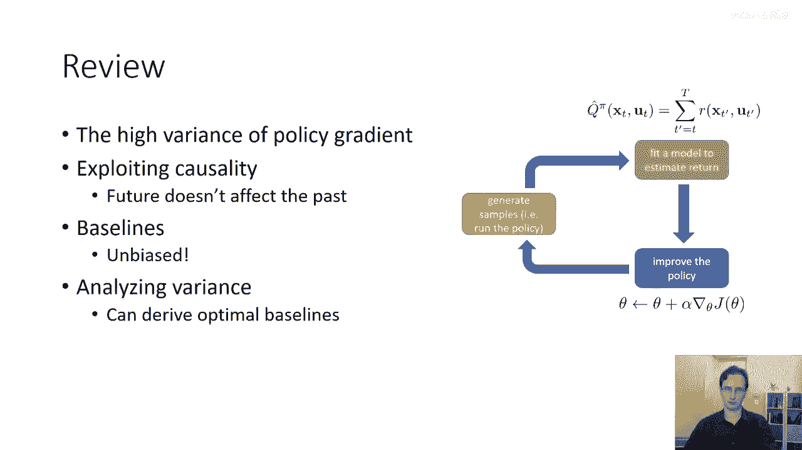

# 17：降低策略梯度方差 🎯

在本节课中，我们将学习如何修改策略梯度计算，以降低其方差，从而得到一个可用于实际强化学习算法的实用版本。我们将从利用“因果关系”这一基本属性开始，然后介绍“基线”技巧，并推导最优基线以最小化方差。

## 利用因果关系降低方差 🔄

上一节我们介绍了策略梯度的基本形式。本节中我们来看看如何利用因果关系来改进它。

因果关系指出，时间 `t` 的策略不能影响时间 `t'` 的奖励，如果 `t' < t`。这意味着当前的动作不会影响过去已获得的奖励。这与马尔可夫性质不同，后者是关于状态的条件独立性。因果关系在任何时间向前流动的过程中总是成立。

我们之前得到的策略梯度估计器并未利用这一事实。我们可以通过重写策略评分方程来引入它。具体做法是，将奖励的总和分配到每个时间步的对数策略梯度上。

原始形式涉及对所有时间步的奖励求和。利用因果关系，我们可以证明，在期望上，当前时间步 `t` 的动作对数概率只应乘以从当前时刻 `t` 到最终时刻 `T` 的奖励之和（即未来奖励），因为过去的奖励与当前动作无关。

因此，我们可以将估计器修改为只对未来的奖励求和。虽然对于有限样本，这改变了估计值，但它仍然是无偏的，并且由于求和项更少，其方差更低。

这个未来奖励的总和有时用符号 **`Q̂(s_t, a_t)`** 表示，它是对 `Q` 函数的一个单样本估计。

## 引入基线进一步降低方差 📉

仅仅利用因果关系降低方差还不够。我们还可以使用一个称为“基线”的技巧。

回顾策略梯度的直观理解：我们希望增加高奖励轨迹的概率，降低低奖励轨迹的概率。但如果所有奖励都是正数，策略梯度会倾向于增加所有轨迹的概率，只是程度不同。这并不完全符合我们的直觉。

我们希望“居中”奖励，使得高于平均值的轨迹概率增加，低于平均值的概率降低。这可以通过从每个奖励中减去一个常数 `b`（例如平均奖励）来实现。新的梯度项变为 **`∇_θ log π_θ(τ) * (r(τ) - b)`**。

可以证明，对于任何常数 `b`，这个新估计器的期望值（即真实的策略梯度）保持不变，因此它是无偏的。但它会改变估计器的方差。选择合适的 `b` 可以有效降低方差。

以下是推导过程的核心步骤，证明了减去基线 `b` 不影响期望值：
1.  新项的期望为 **`E[∇_θ log π_θ(τ) * b]`**。
2.  利用恒等式 **`π_θ(τ) ∇_θ log π_θ(τ) = ∇_θ π_θ(τ)`**，可将其重写为 **`b * ∇_θ ∫ π_θ(τ) dτ`**。
3.  由于概率分布的积分恒为1，即 **`∫ π_θ(τ) dτ = 1`**，其梯度为0。
4.  因此，**`E[∇_θ log π_θ(τ) * b] = 0`**，证明完毕。

## 推导最优基线 🧮

上一节我们知道了减去基线 `b` 能保持无偏性并影响方差。本节中我们来推导一下能最小化方差的“最优”基线 `b*`。

随机变量 `X` 的方差公式为 **`Var(X) = E[X^2] - E[X]^2`**。我们将此公式应用于策略梯度估计器 `g(τ) * (r(τ) - b)`，其中 **`g(τ) = ∇_θ log π_θ(τ)`**。

方差中只有 **`E[(g(τ) * (r(τ) - b))^2]`** 项依赖于 `b`。我们对 `b` 求导并令导数为零，以找到最小化方差的 `b`。

经过展开和求导运算（具体步骤见原讲稿），我们得到最优基线的解为：

**`b* = E[g(τ)^2 * r(τ)] / E[g(τ)^2]`**

这个结果有直观的解释：最优基线 `b*` 不是简单的平均奖励，而是奖励的期望值，但以梯度大小的平方 **`g(τ)^2`** 进行加权。这意味着，如果策略参数是向量，理论上每个参数维度都应有不同的基线值。

在实际应用中，计算这个最优基线通常比较繁琐，因此更常见的做法是直接使用平均奖励作为基线，它虽然次优但简单有效。

## 总结 📝

本节课中我们一起学习了两种降低策略梯度方差的重要技巧：
1.  **因果关系**：通过只使用未来奖励（`t` 到 `T`）而非全部奖励（1 到 `T`）来估计梯度，减少了无关的噪声项，从而降低了方差。
2.  **基线**：通过从奖励中减去一个常数（如平均奖励），可以使梯度更新更倾向于增加高于平均值的轨迹概率，同时保持估计的无偏性。我们还推导了理论上能最小化方差的最优基线公式。

结合这两种技巧，我们可以得到方差更低、更稳定的策略梯度估计器，为构建实用的强化学习算法奠定了基础。