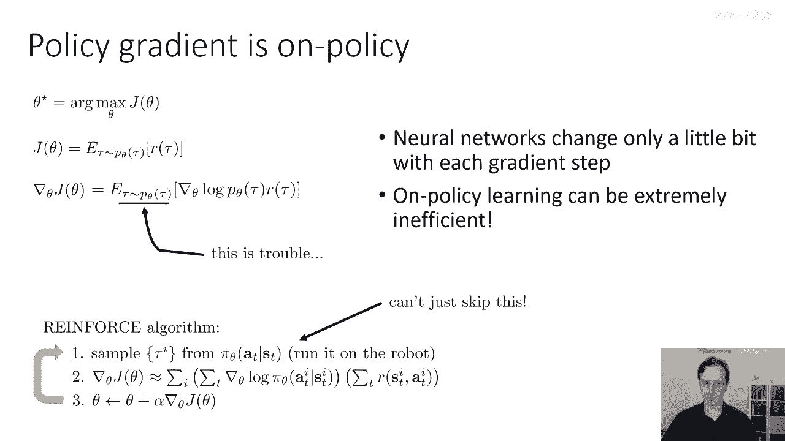
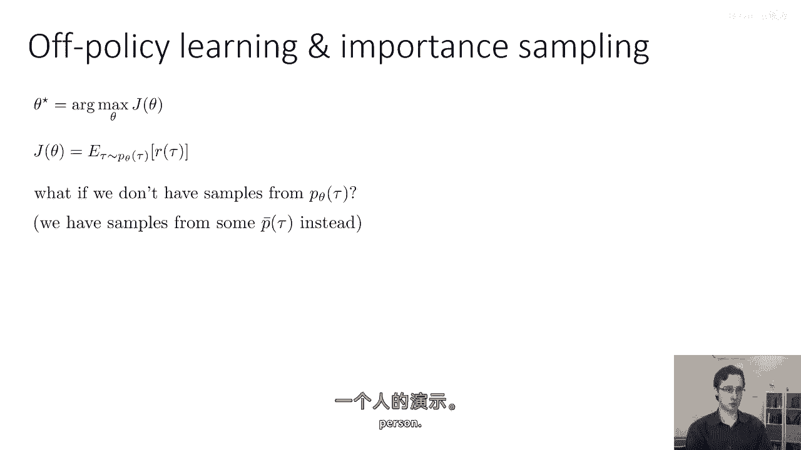
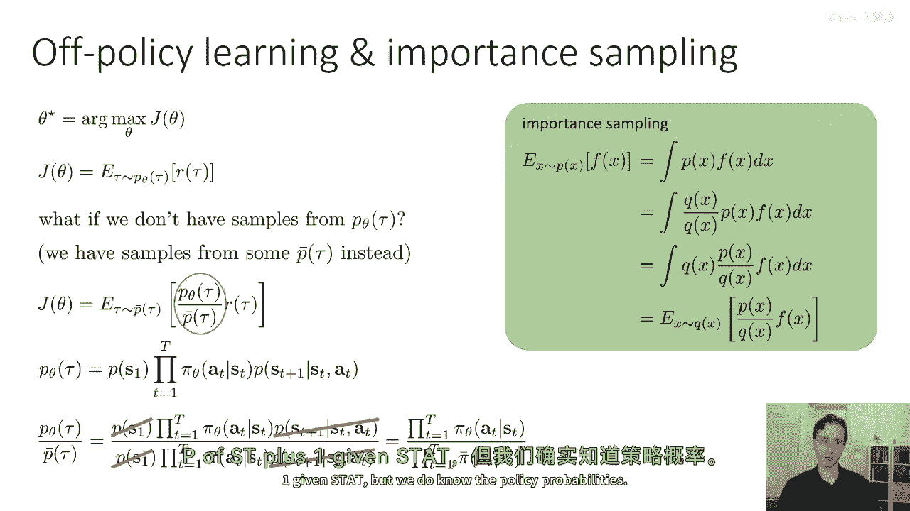
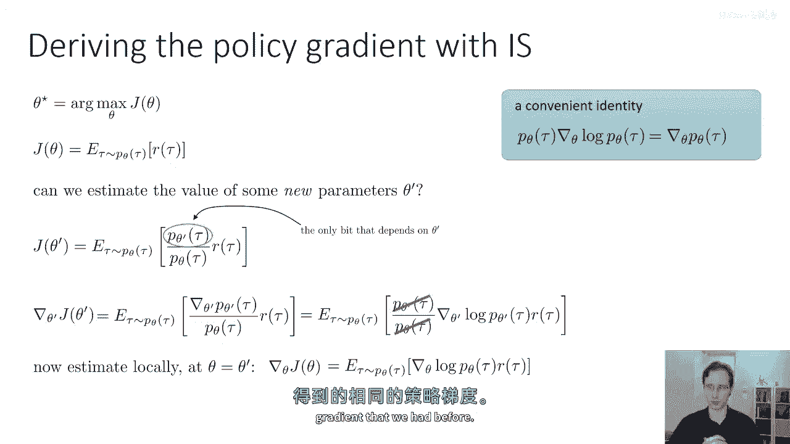
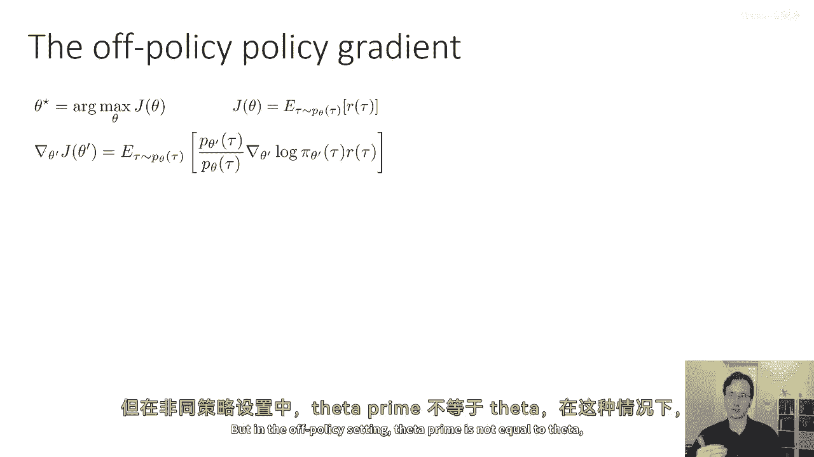
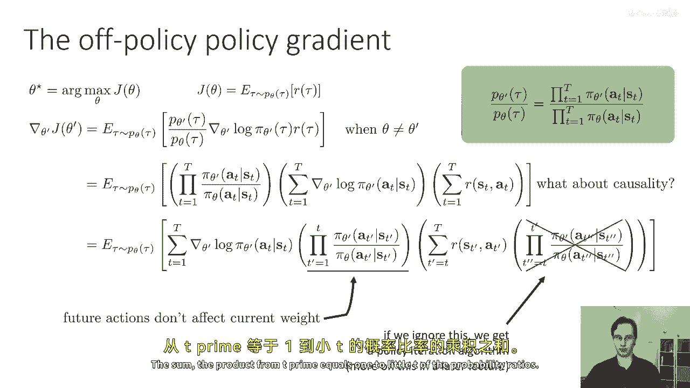
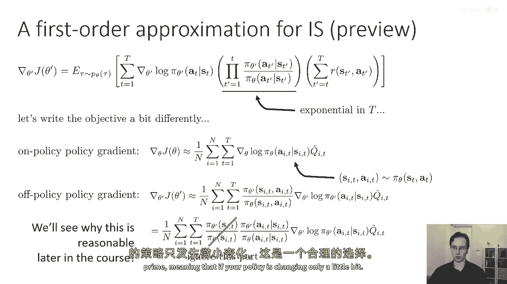
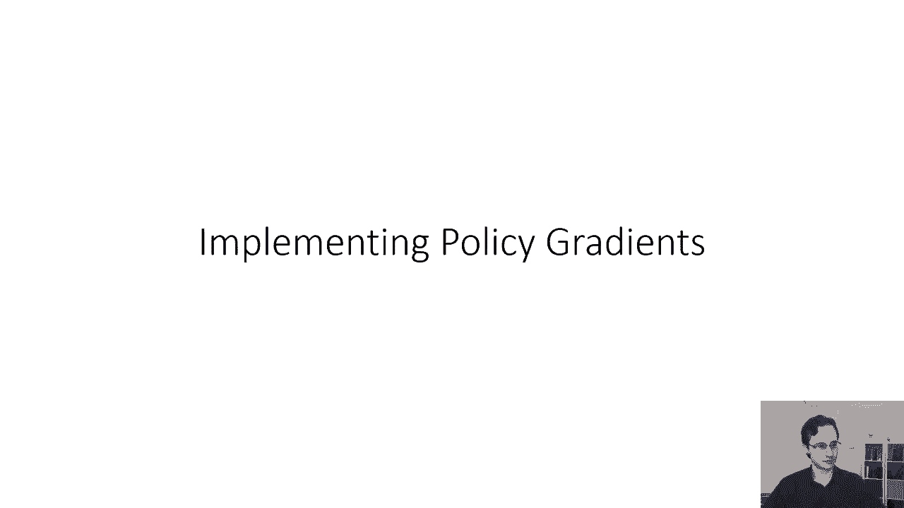

# 18：从在线到离线策略梯度 🚀

在本节课中，我们将学习如何将策略梯度算法从**在线策略**设置扩展到**离线策略**设置。我们将探讨为什么标准的策略梯度被视为在线算法，并学习使用**重要性采样**技术来利用旧策略或其他来源（如人类演示）的数据，从而显著提高样本效率。

---

## 为什么策略梯度是在线策略算法？🤔

上一节我们介绍了策略梯度的基本概念。本节中，我们来看看为什么它通常被归类为**在线策略**算法。

策略梯度算法的一个经典特点是：**每次更新策略参数后，都需要使用新策略重新采样数据**。其根本原因在于策略梯度的数学形式。

策略梯度的目标是最大化期望回报，其梯度公式为：
`∇θ J(θ) = Eτ∼pθ(τ) [∇θ log pθ(τ) * R(τ)]`

这里的关键在于，期望 `E` 是在当前策略 `pθ(τ)` 下计算的。我们通过运行**最新策略**来采样轨迹 `τ`，以估计这个期望值。由于梯度计算依赖于在参数 `θ` 下采样的样本，因此每次我们改变 `θ` 时，都必须丢弃旧的样本并重新采样。

这意味着策略梯度本质上是一种**在线策略**算法：每个更新步骤都需要**新鲜**的样本。我们不能重复使用来自旧策略的数据，也不能使用来自其他来源（例如演示）的数据。

---

## 在线策略的挑战与离线策略的动机 💡

在强化学习中，一个典型的循环包含三步：
1.  从当前策略中采样。
2.  基于样本评估梯度。
3.  执行梯度上升以更新策略。

对于策略梯度，我们**不能跳过第一步**。然而，在深度强化学习中，这带来了一个实际问题：神经网络参数在每个梯度步骤中通常只改变一点点，因为大幅度的更新可能导致训练不稳定。因此，我们往往需要进行大量微小的梯度更新，而**每一步都需要重新采样**。

如果采样成本很高（例如在真实物理系统中运行机器人，或使用计算昂贵的模拟器），这种在线策略的学习方式会变得非常低效和昂贵。当然，如果采样极其廉价，策略梯度因其简单和直接而是一个不错的选择。

为了克服这一限制，我们希望利用**离线策略**的样本，即重用旧策略或其他策略生成的样本。这就需要引入**重要性采样**技术。

---

## 重要性采样简介 📊

上一节我们了解了在线策略的局限性。本节中，我们来看看如何使用重要性采样来利用离线数据。

重要性采样是一种通用技术，用于在目标分布 `p(x)` 下估计某个函数 `f(x)` 的期望值，而我们只有来自另一个不同分布 `q(x)` 的样本。

其核心公式如下：
`Ex∼p(x)[f(x)] = Ex∼q(x) [ (p(x) / q(x)) * f(x) ]`

这个等式是**精确成立**的，意味着重要性采样估计是**无偏**的。当然，估计量的**方差**可能会发生变化，但其期望值保持不变。

现在，我们将这个技巧应用到强化学习的目标函数上。在这里：
*   `p(x)` 对应我们希望评估的新策略 `pθ‘(τ)` 下的轨迹分布。
*   `q(x)` 对应我们拥有样本的旧策略（或行为策略）的分布 `p_bar(τ)`。
*   `f(x)` 对应轨迹的回报 `R(τ)`。

因此，使用重要性采样后的RL目标函数变为：
`J(θ‘) = Eτ∼p_bar(τ) [ (pθ‘(τ) / p_bar(τ)) * R(τ) ]`

---

## 计算重要性权重 🔢

为了计算重要性权重 `pθ‘(τ) / p_bar(τ)`，我们需要展开轨迹的概率。一个轨迹的概率可以分解为初始状态分布、策略动作概率和环境转移概率的乘积。

由于新旧策略在**相同的马尔可夫决策过程（MDP）** 中运行，它们共享相同的初始状态分布 `p(s1)` 和状态转移概率 `p(st+1 | st, at)`。因此，当我们计算两个轨迹分布的比值时，这些项会相互抵消。

最终，重要性权重简化为**策略概率的比值**：
`pθ‘(τ) / p_bar(τ) = ∏_{t=1}^{T} [ πθ‘(at | st) / π_bar(at | st) ]`

这非常方便，因为我们通常不知道环境模型（状态转移概率），但我们总是知道策略本身给出的动作概率。

---

## 推导离线策略策略梯度 🧮

现在，我们正式推导离线策略的策略梯度。假设我们有一批从旧策略 `πθ` 中采样的轨迹，我们想估计新策略参数 `θ‘` 的梯度。

我们的目标是：
`∇θ‘ J(θ‘) = Eτ∼pθ(τ) [ (pθ‘(τ) / pθ(τ)) * R(τ) ]`

应用之前提到的对数导数技巧 `∇p = p * ∇ log p`，并对依赖于 `θ‘` 的项求导，我们可以得到离线策略策略梯度的表达式。经过推导和简化（忽略一些中间步骤），其估计形式通常表示为对样本和时间的求和：

以下是离线策略策略梯度的核心估计公式：
`∇θ‘ J(θ‘) ≈ (1/N) Σ_i Σ_t [ (∏_{t‘=1}^{t} πθ‘(a_t^i | s_t^i) / πθ(a_t^i | s_t^i) ) * ∇θ‘ log πθ‘(a_t^i | s_t^i) * ( Σ_{t‘=t}^{T} γ^{t‘-t} r_{t‘}^i ) ]`

这个公式包含三个关键部分的乘积：
1.  **重要性权重乘积**：从第一步到当前步 `t`，新旧策略概率的比值连乘。
2.  **策略得分**：当前策略在当前状态动作对下的对数概率梯度 `∇ log πθ‘`。
3.  **未来回报**：从当前步 `t` 到轨迹结束的累计奖励（或优势函数估计）。

---

## 重要性权重的问题与解决方案 ⚠️

然而，上述公式中的重要性权重乘积项 `∏_{t‘=1}^{t} (πθ‘/πθ)` 带来了一个严重问题：**方差爆炸**。

如果新旧策略差异较大，每个时间步的重要性权重可能远小于1。将许多小于1的数连乘，会导致这个乘积以指数速度趋近于零。这使得梯度估计的方差变得极高，甚至趋于无穷大，导致训练极其不稳定。

为了解决这个问题，一个常见的实践是进行近似。我们注意到，完整的离线策略梯度可以理解为在**状态-动作对的边际分布**上进行重要性采样。这个边际分布可以分解为状态分布和策略条件动作分布的乘积。

如果我们**忽略状态分布比值的部分**，只保留动作概率的比值，那么重要性权重就简化为仅包含当前时间步的项：
`πθ‘(a_t | s_t) / πθ(a_t | s_t)`

这样，重要性权重不再连乘，方差爆炸的问题就得到了缓解。虽然这引入了一定的偏差，但理论证明，当新旧策略 `θ‘` 和 `θ` **足够接近**时，这个偏差是可控的。这个见解是许多实用、高效的离线策略策略梯度算法（如PPO、TRPO）的基础。

---

## 总结 🎯

本节课中，我们一起学习了如何将策略梯度扩展到离线策略设置：
1.  我们首先明确了标准策略梯度是**在线策略**算法，因其严重依赖当前策略的新鲜样本。
2.  为了重用数据、提高样本效率，我们引入了**重要性采样**技术，它允许我们利用旧策略或其他策略的样本来估计新策略的梯度。
3.  我们推导了离线策略策略梯度的理论形式，并指出了其中**重要性权重连乘**导致的**高方差**问题。
4.  最后，我们探讨了通过**忽略状态分布比值**、仅使用单步重要性权重来近似梯度的方法，这为开发稳定、实用的高级策略梯度算法奠定了基础。

理解从在线到离线的这一扩展，是掌握更高效、更强大深度强化学习算法的重要一步。