# 19：策略梯度实现教程 🧠

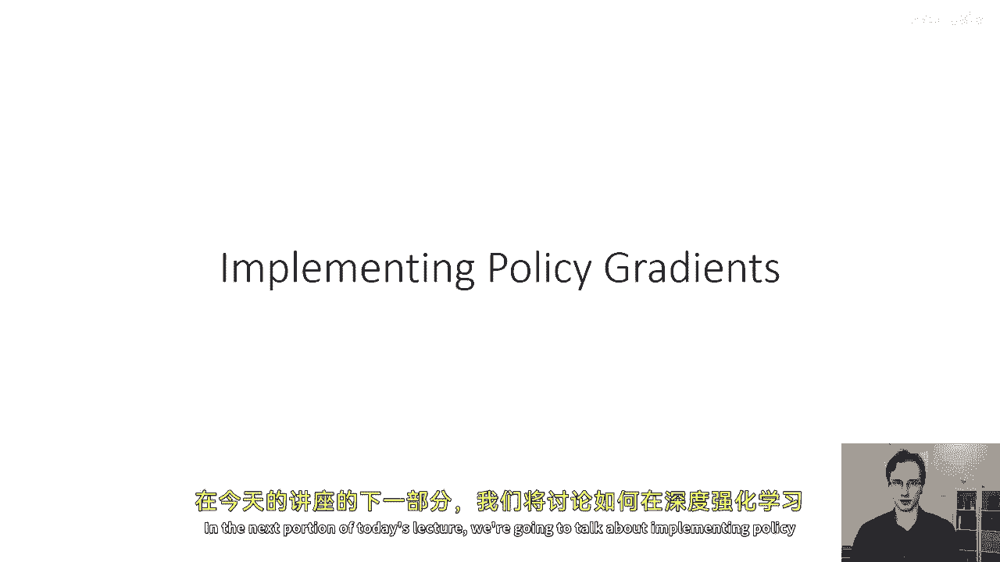

在本节课中，我们将学习如何在深度强化学习算法中实际实现策略梯度。我们将重点讨论如何利用自动微分工具（如 TensorFlow 或 PyTorch）高效地计算策略梯度，并介绍实现过程中的关键技巧和注意事项。

## 🎯 策略梯度实现的核心挑战

上一节我们介绍了策略梯度的基本概念。本节中我们来看看其实现面临的主要挑战。

实施策略梯度面临的主要挑战之一是我们希望以自动微分工具（如 TensorFlow 或 PyTorch）能够为我们计算梯度的方式来实现，同时满足合理的计算和内存需求。

如果我们想要朴素地实施策略梯度，我们只需要为每一个采样到的状态-动作元组计算对数概率的梯度。然而，这种方法通常非常低效。

因为神经网络的参数量可能非常庞大。实际上，参数数量通常远大于我们采集的样本数量。假设我们有 N 个参数（N 可能在百万级别），我们采集了一百条轨迹，每条轨迹有一百个时间步。

那么我们总共有十万个状态-动作对。这意味着我们需要计算十万个长度为一百万的梯度向量。这在内存存储上非常昂贵。在计算上，当我们希望高效计算神经网络导数时，我们希望利用反向传播算法。

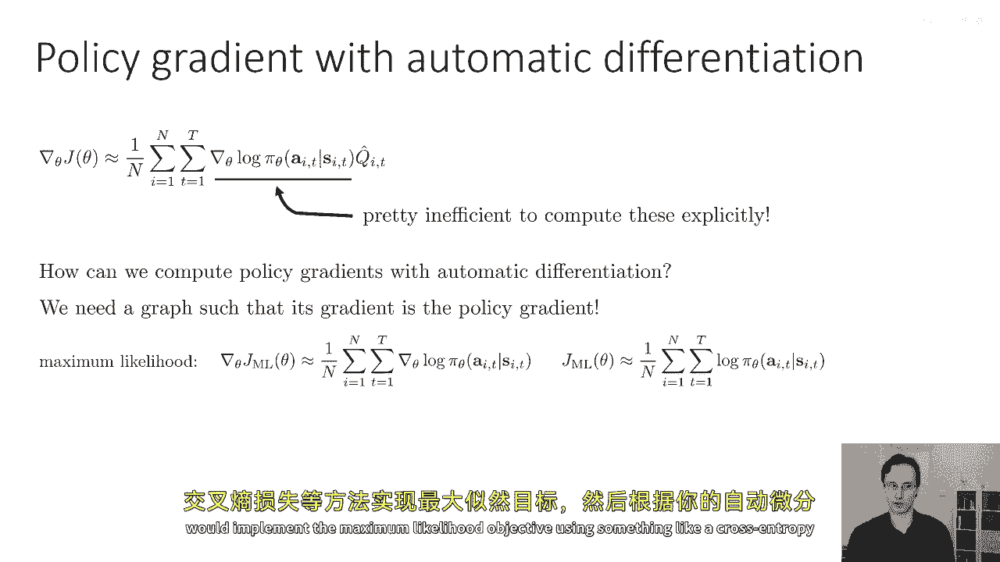

我们不是计算神经网络输出对其输入的导数，然后乘以损失的导数。我们做相反的事情：首先计算损失的导数，然后使用反向传播算法通过神经网络反向传播。这就是自动微分工具为我们所做的。为了实现这一点，我们需要构建一个计算图，使得该图的导数能给出策略梯度。

## 🔧 如何用自动微分计算策略梯度

那么，我们如何使用自动微分来计算策略梯度呢？我们需要一个计算图，其梯度就是策略梯度。我们的方法是从梯度公式本身出发。

我们已经知道如何计算最大似然梯度。如果我们想计算最大似然梯度，我们会使用像交叉熵损失这样的东西来实现最大似然目标。

```python
# 最大似然梯度计算示例（概念性）
logits = policy_network(states)
loss = cross_entropy_loss(logits, actions)
gradients = compute_gradients(loss)  # 自动微分
```

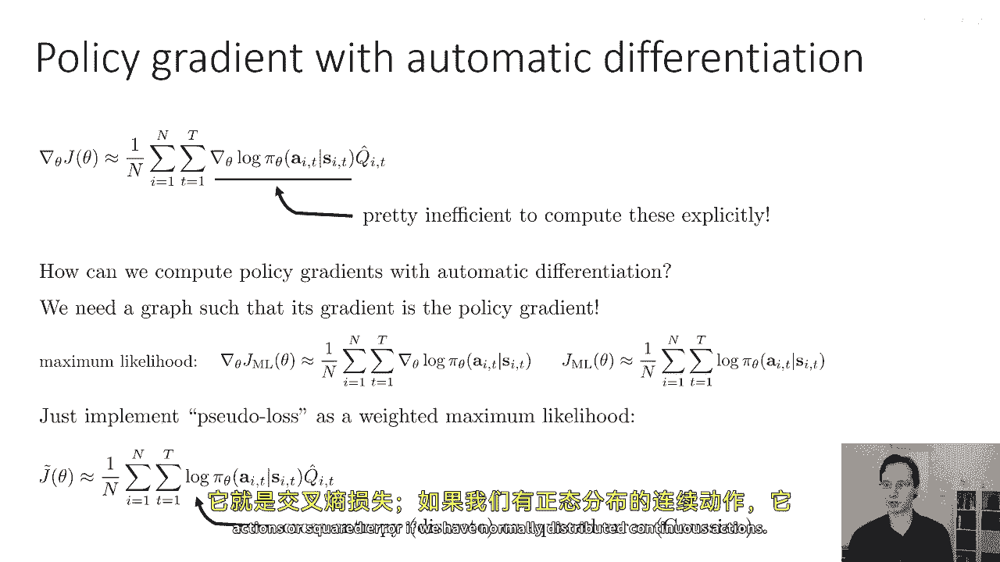

然后，根据你的自动微分包，你会调用 `.backward()` 或 `.gradients()` 来获取梯度。因此，我们计划通过实现一种“伪损失”作为加权最大似然，来让自动微分包高效地计算策略梯度。

我们不是实现最大似然目标 J，而是实现下面这个被称为 **J_tilde** 的量：

**公式：J_tilde = Σ [ log π_θ(a_t | s_t) * Q_hat(s_t, a_t) ]**

这个方程本身不是强化学习的目标。实际上，这个数学表达式本身没有直观意义。它只是一个被精心选择的量，**其导数恰好等于策略梯度**。关键的一点是，我们的自动微分包并不知道那些 Q 值本身也受到我们策略的影响。它只是处理我们提供的计算图。

在某种意义上，我们是在“欺骗”我们的自动微分包，让它给出我们想要的梯度。这里的 `log π_θ` 可以是，例如，对于离散动作是交叉熵损失，对于连续动作（如正态分布）是平方误差。

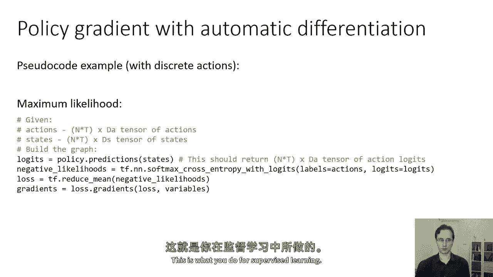

## 💻 实现策略梯度的伪代码

以下是实现策略梯度的伪代码。这段伪代码基于 TensorFlow，但核心思想在 PyTorch 中同样适用。

```python
# 监督学习（最大似然）的伪代码
# 假设 `actions` 是形状为 [N*T, action_dim] 的张量
# 假设 `states` 是形状为 [N*T, state_dim] 的张量

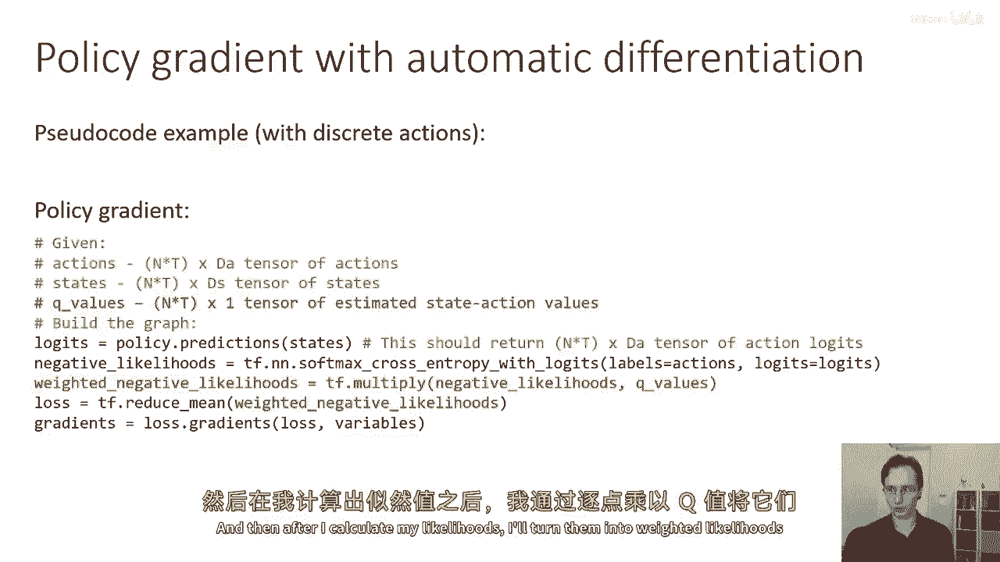

logits = policy_network(states)                # 策略网络对状态进行预测
neg_log_likelihood = cross_entropy_loss(logits, actions) # 计算负对数似然（损失）
loss = tf.reduce_mean(neg_log_likelihood)      # 对所有样本的损失求平均
gradients = tf.gradients(loss, policy_network.trainable_variables) # 计算梯度
```

为了实现策略梯度，你只需要在计算损失时加入权重，这些权重对应于优势函数或 Q 值估计。

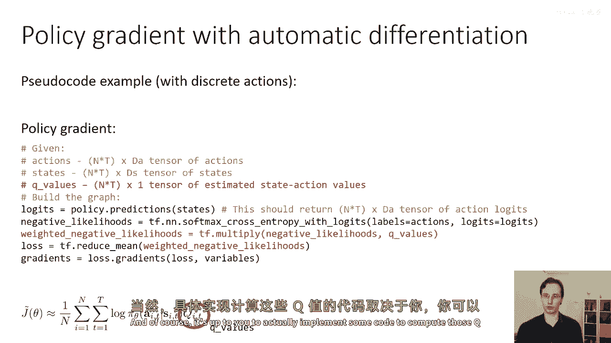

```python
# 策略梯度实现的伪代码
# 假设 `q_values` 是形状为 [N*T, 1] 的张量，包含 Q_hat 估计值

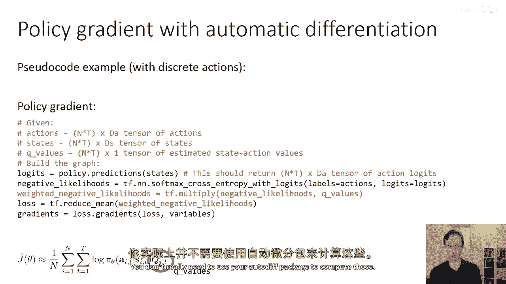

logits = policy_network(states)
neg_log_likelihood = cross_entropy_loss(logits, actions)
weighted_neg_log_likelihood = neg_log_likelihood * q_values # 关键步骤：用 Q 值加权
loss = tf.reduce_mean(weighted_neg_log_likelihood)          # 对加权损失求平均
gradients = tf.gradients(loss, policy_network.trainable_variables) # 计算策略梯度
```

在数学上，我们实现的是将最大似然损失转化为修改后的伪损失 **J_tilde**。我们将似然损失用 **Q_hat** 值进行加权。当然，实际实现中，你需要额外的代码来计算这些 `q_values`。你可以在 NumPy 中计算它们，不一定需要使用自动微分工具来计算 Q 值本身。

## 📝 策略梯度实战技巧与总结

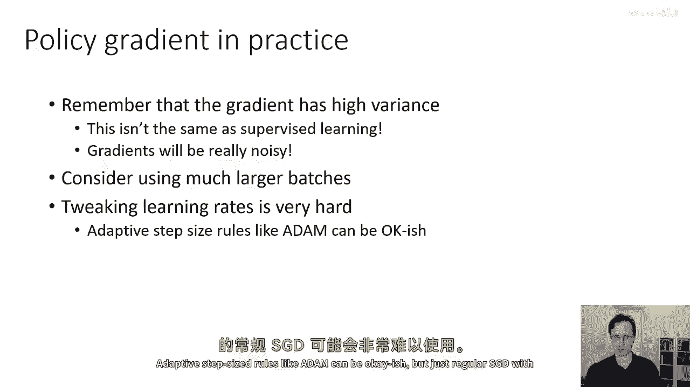

以下是关于在实践中使用策略梯度的一些重要提示。

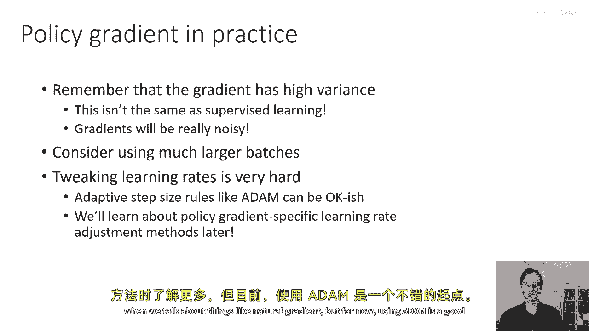

首先，请记住策略梯度的**方差很高**。尽管实现看起来像监督学习，但其行为与监督学习大不相同。策略梯度的高方差会使一些事情变得相当困难。

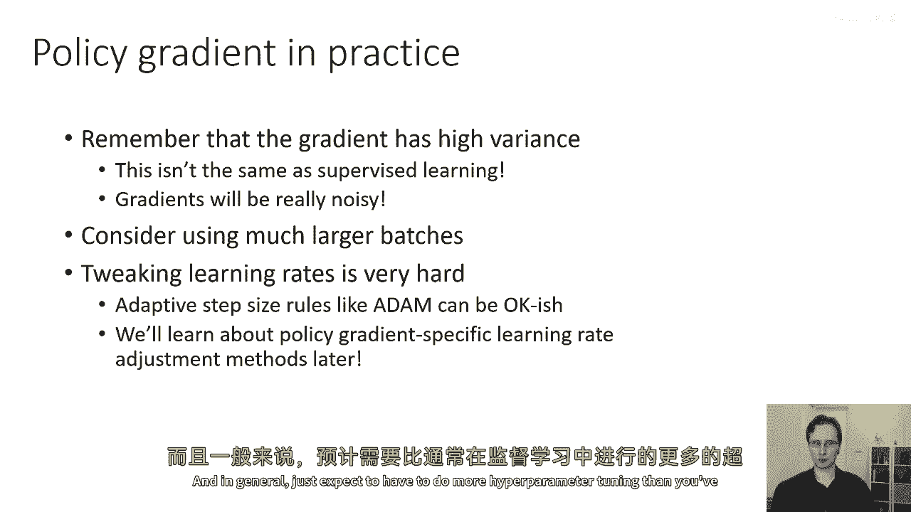

这意味着你的梯度将非常嘈杂。因此，你可能需要使用比监督学习大得多的批量大小。批量大小在数千或数十万是非常典型的。调整学习率也将更加困难。

使用像 Adam 这样的自适应优化器可能是一个好的起点。使用常规 SGD 加动量可能会非常困难。我们将在后续课程中学习针对策略梯度的特定学习率调整方法（如自然梯度）。总的来说，相比监督学习，你需要进行更多的超参数调整。

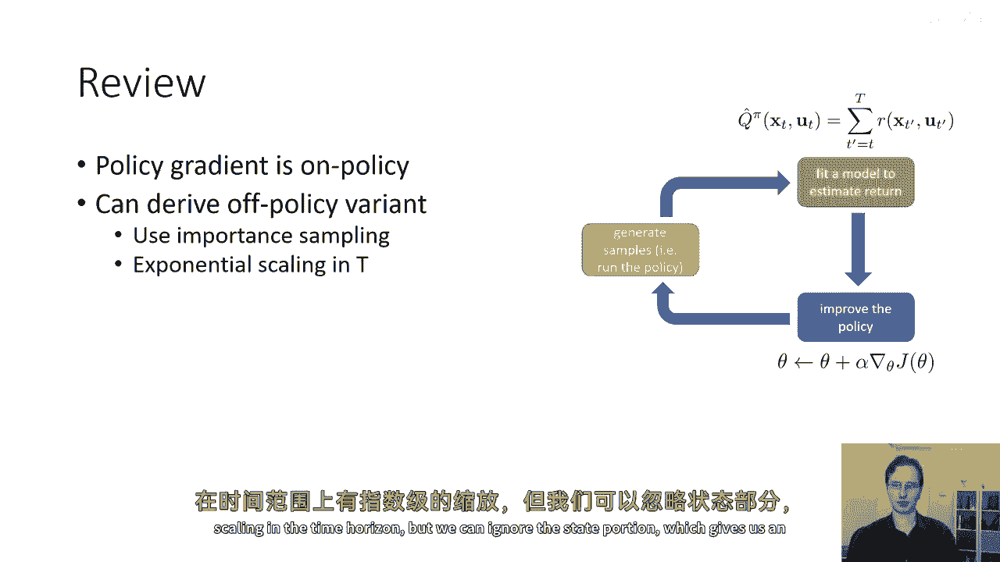

---

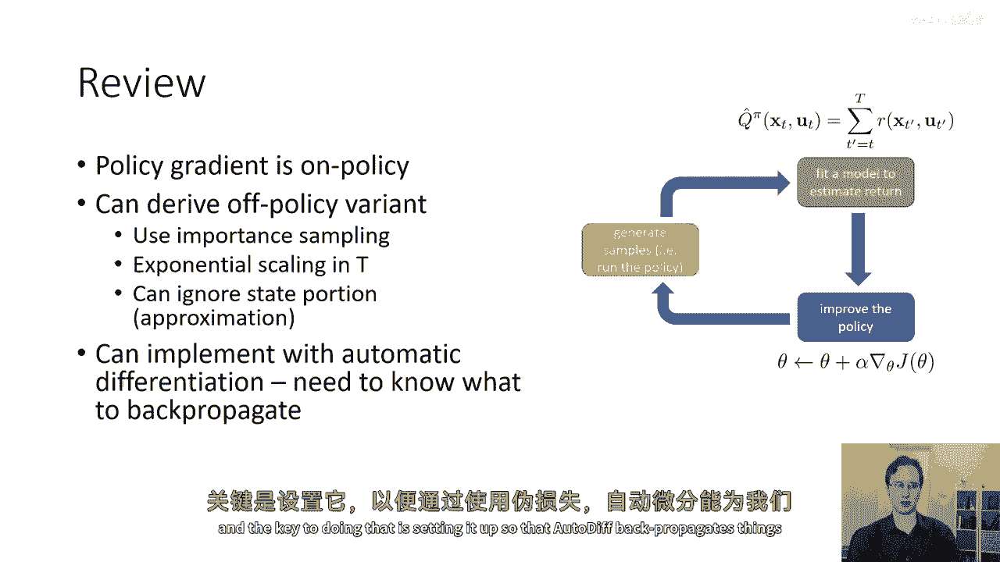

**本节课总结**

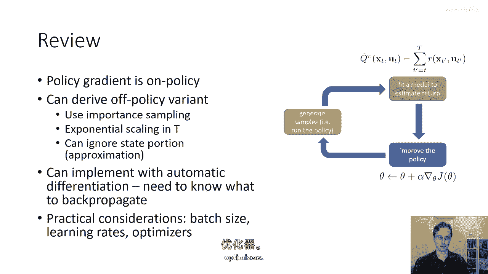

在本节课中，我们一起学习了：
1.  策略梯度实现的核心挑战在于高效利用自动微分。
2.  通过构造一个特殊的**伪损失函数 J_tilde**，我们可以“欺骗”自动微分工具计算出正确的策略梯度，其公式为 **J_tilde = Σ log π_θ(a|s) * Q_hat(s,a)**。
3.  实现的关键步骤是将监督学习的损失（如交叉熵）与估计的 Q 值或优势函数进行**逐点相乘**作为权重。
4.  在实践中，策略梯度方差高，需要**更大的批量大小**，并谨慎调整学习率，使用 Adam 优化器是一个良好的起点。