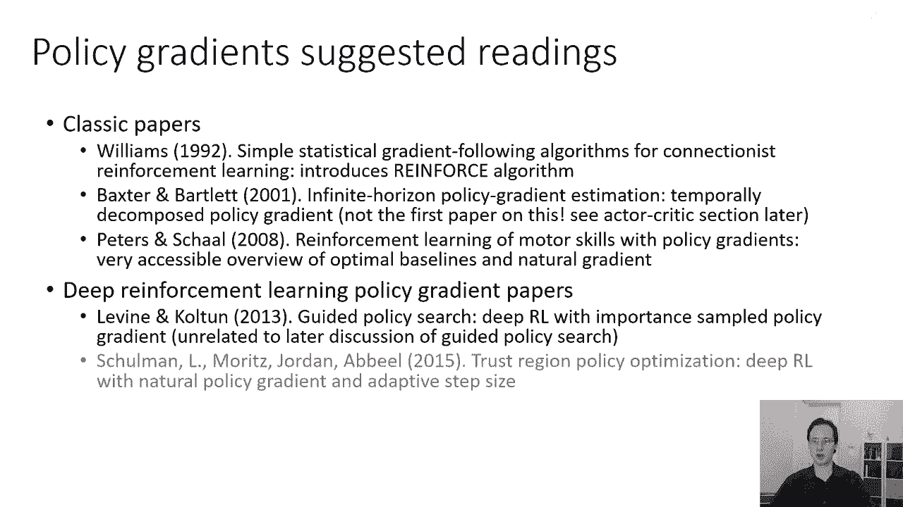

# 20：高级策略梯度 🚀

在本节课中，我们将学习策略梯度方法中一个重要的高级主题：**自然策略梯度**。我们将探讨标准策略梯度在数值优化上可能遇到的困难，并介绍一种通过重新参数化来更高效、更稳定地更新策略参数的方法。

---

## 问题引入：策略梯度的数值挑战

上一节我们介绍了策略梯度的基本原理。本节中，我们来看看它在实际优化中可能遇到的一个具体问题。

假设我们有一个简单的一维状态和动作空间问题。目标是到达状态 `s = 0`。奖励函数为 `r = -s² - a²`，策略是一个高斯分布，其均值与状态成正比，标准差为 `σ`。策略参数 `θ` 包含比例系数 `k` 和标准差 `σ`。

**策略公式**：
`π(a|s) = N(a | k·s, σ²)`

在参数空间 `(k, σ)` 中可视化梯度场时，可以发现一个现象：当标准差 `σ` 变小时，关于 `σ` 的梯度值会变得异常巨大，而关于 `k` 的梯度则相对平缓。这导致归一化后的梯度方向几乎完全由 `σ` 分量主导，使得优化过程在减小 `σ` 上花费大量时间，而难以有效地同时优化 `k`，从而收敛到最优参数 `(k=-1, σ=0)` 的速度非常慢。

**核心问题**：不同的策略参数对概率分布 `π(a|s)` 的影响程度差异巨大。改变某些参数会极大地改变分布，而改变另一些参数则影响甚微。在标准的梯度上升中，我们为所有参数使用相同的学习率，这在参数空间中是“不公平”的，会导致优化效率低下和步长选择困难。

---

## 解决方案思路：在策略空间中衡量变化

如果我们希望所有参数都能有效地更新，直觉上，我们需要一种与参数化方式无关的方法来衡量策略本身的变化。我们希望**在策略分布空间**中迈出大小相似的步伐，而不是在原始的参数空间中。

这引导我们从**约束优化**的角度重新审视梯度上升。标准的梯度上升可以看作是在参数空间的一个小邻域内，最大化目标函数的一阶近似。其约束是参数变化的欧几里得范数很小。

**约束优化视角**：
`θ' = argmax [ J(θ) + ∇J(θ)·(θ' - θ) ]`
约束条件：`||θ' - θ||² ≤ ε`

然而，这个约束是在参数空间定义的。我们更希望约束是在**策略分布空间**定义的。一个自然的选择是使用两个分布之间的KL散度 `D_KL(π_θ‘ || π_θ)` 作为距离度量，并要求这个散度小于某个值 `ε`。

**改进的约束优化问题**：
`θ' = argmax [ J(θ) + ∇J(θ)·(θ' - θ) ]`
约束条件：`D_KL(π_θ‘ || π_θ) ≤ ε`

---

## 自然策略梯度与费舍尔信息矩阵

KL散度在 `θ‘ = θ` 处进行二阶泰勒展开，其主导项是一个二次型：

`D_KL(π_θ‘ || π_θ) ≈ 1/2 * (θ' - θ)^T * F(θ) * (θ' - θ)`

其中，矩阵 `F(θ)` 被称为**费舍尔信息矩阵**。它的定义为：

`F(θ) = E_{a∼π_θ(·|s)} [ ∇ log π_θ(a|s) · (∇ log π_θ(a|s))^T ]`

费舍尔信息矩阵是梯度向量与其自身外积的期望值。重要的是，它只依赖于策略分布 `π_θ`，而不依赖于具体的参数化方式，这符合我们的目标。

现在，我们的约束优化问题近似为：
约束条件：`1/2 * (θ' - θ)^T * F(θ) * (θ' - θ) ≤ ε`

求解这个带约束的优化问题，可以得到参数更新公式：

`θ_{new} = θ + α * F(θ)^{-1} * ∇J(θ)`

其中 `α` 是与 `ε` 相关的步长系数。这个更新公式与标准梯度上升 `θ + α * ∇J(θ)` 的关键区别在于，梯度向量 `∇J(θ)` 被左乘了费舍尔信息矩阵的逆 `F(θ)^{-1}`。

这个新的更新方向 `F(θ)^{-1} * ∇J(θ)` 被称为**自然梯度**。它相当于对原始梯度进行了重新缩放，使得在策略分布空间中，每个方向的更新步长是“均匀”的。

---

## 效果与实现

使用自然梯度后，优化过程发生了显著变化。在之前的问题中，更新方向会准确地指向最优参数，收敛速度更快，并且对步长的选择不再那么敏感。

以下是实现自然策略梯度时需要注意的几点：

*   **估计费舍尔信息矩阵**：矩阵 `F(θ)` 是一个期望，可以通过从当前策略 `π_θ` 中采样动作来近似计算。
*   **计算自然梯度**：直接计算并求逆 `F(θ)` 矩阵在参数维度高时计算代价很大。通常使用**共轭梯度法**来高效地求解方程 `F(θ) · x = ∇J(θ)`，从而得到自然梯度方向 `x`。
*   **现代算法**：许多现代强化学习算法都基于这一思想。
    *   **自然策略梯度**：直接使用上述更新公式。
    *   **信赖域策略优化**：通过求解带KL散度约束的优化问题来自动确定步长 `α`。
    *   **近端策略优化**：是TRPO的一个更高效的近似版本。

---

## 总结与延伸阅读

本节课中，我们一起学习了**自然策略梯度**。我们了解到标准策略梯度因参数对分布影响不均而存在数值优化困难。通过引入KL散度约束和费舍尔信息矩阵，我们可以将更新方向转换到策略分布空间，得到更稳定、更高效的**自然梯度**更新方法。

如果你想深入了解策略梯度及其高级变种，可以参考以下论文：

*   **Williams (1992)**: 提出了强化学习的经典策略梯度方法（REINFORCE算法）。
*   **Peters & Schaal (2008)**: 详细阐述了自然梯度方法，并提供了直观的图解。
*   **Schulman et al. (2015)**: **信赖域策略优化**，使用自然梯度并自动调整步长。
*   **Schulman et al. (2017)**: **近端策略优化**，一个更简单高效的实践算法。
*   **Levine et al. (2013)**: **引导策略搜索**，将策略梯度与样本复用结合。
*   **Barto, Sutton & Anderson (1983)** / **Sutton (1984)**: 早期在Actor-Critic框架中引入了类似因果性技巧的思想。

这些工作构成了现代基于策略的深度强化学习算法的重要基础。在接下来的课程中，我们将介绍**Actor-Critic算法**，它通过引入价值函数来进一步降低策略梯度的方差。