# 21：演员-批评者算法基础（第1部分） 🎓

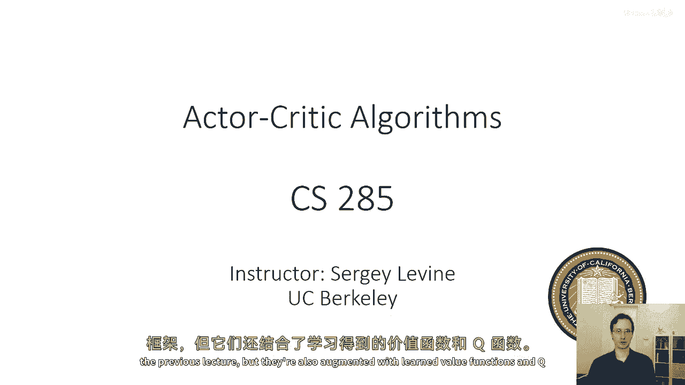

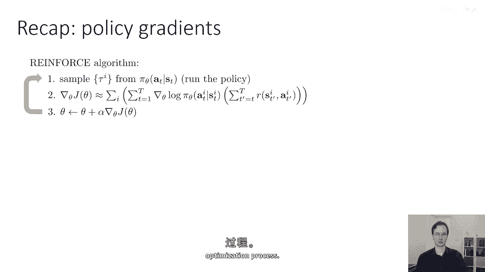

在本节课中，我们将学习演员-批评者算法。这种算法建立在上一节课讨论的策略梯度框架之上，并通过学习价值函数和Q函数来增强它，旨在降低策略梯度估计的方差。

---

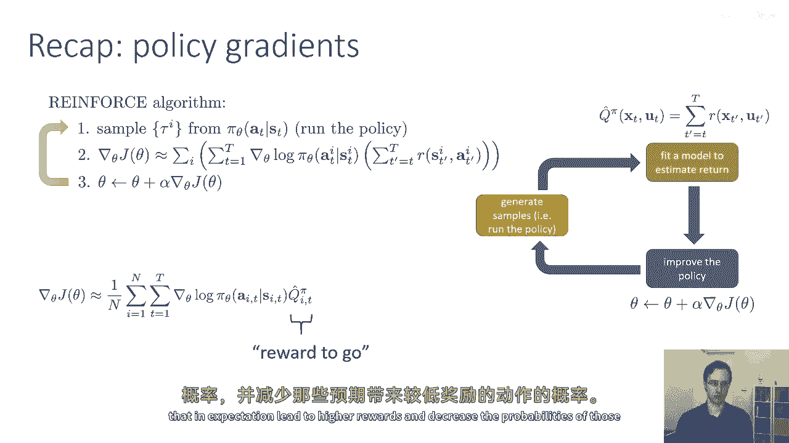

## 🔄 策略梯度回顾

上一节我们介绍了强化学习算法的基本流程。现在，让我们回顾一下策略梯度方法。

策略梯度算法交替执行三个步骤：
1.  通过在环境中运行当前策略来采样一批轨迹。
2.  使用这些轨迹计算策略梯度的估计值。
3.  将近似策略梯度乘以学习率，更新当前参数向量，这相当于执行梯度上升优化。

以下是策略梯度估计的计算公式：
\[
\nabla_\theta J(\theta) \approx \frac{1}{N} \sum_{i=1}^{N} \sum_{t=0}^{T} \nabla_\theta \log \pi_\theta(a_{i,t} | s_{i,t}) \hat{Q}_{i,t}
\]
其中，\(\hat{Q}_{i,t}\) 是从时间步 \(t\) 到轨迹结束所获得的奖励总和（即“回报”）。

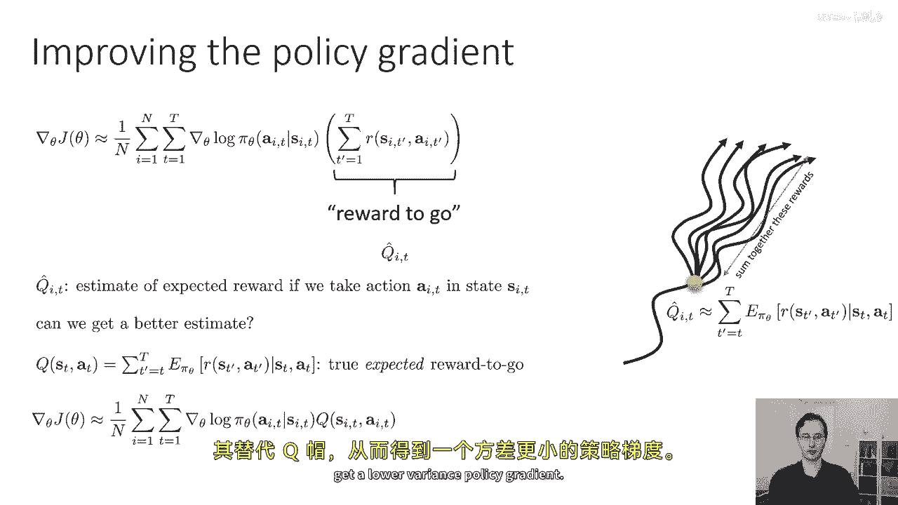

这个算法遵循强化学习的基本结构：采样（橙色框）、计算回报（绿色框）和应用梯度更新（蓝色框）。

---

## 🎯 从回报到Q函数与基线

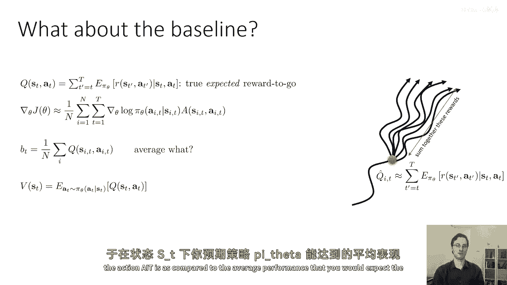

上一节我们介绍了策略梯度的基本形式，本节中我们来看看如何通过引入更精确的估计来改进它。

在基本策略梯度中，我们使用单一样本轨迹的实际回报来估计 \(Q\) 值。然而，由于策略和环境的随机性，这个单样本估计的方差可能很高。如果我们能获得真实的期望回报 \(Q^\pi(s,a)\)，即从状态 \(s\) 执行动作 \(a\) 后遵循策略 \(\pi\) 所能获得的期望总奖励，那么策略梯度的方差将大大降低。

此外，我们还可以引入一个基线 \(b\) 来进一步降低方差。基线不能依赖于当前动作以避免引入偏差，但可以依赖于状态。一个极佳的选择是状态价值函数 \(V^\pi(s)\)，它表示从状态 \(s\) 开始遵循策略 \(\pi\) 的期望总奖励。

于是，策略梯度可以改进为：
\[
\nabla_\theta J(\theta) \approx \frac{1}{N} \sum_{i=1}^{N} \sum_{t=0}^{T} \nabla_\theta \log \pi_\theta(a_{i,t} | s_{i,t}) A^\pi(s_{i,t}, a_{i,t})
\]
其中，\(A^\pi(s, a) = Q^\pi(s, a) - V^\pi(s)\) 被称为**优势函数**。它衡量了在状态 \(s\) 下采取动作 \(a\) 相对于策略平均表现的优势。

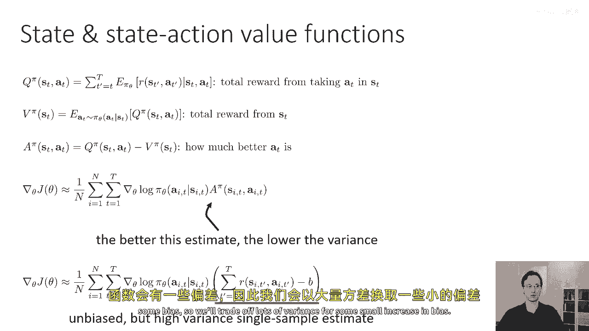

---

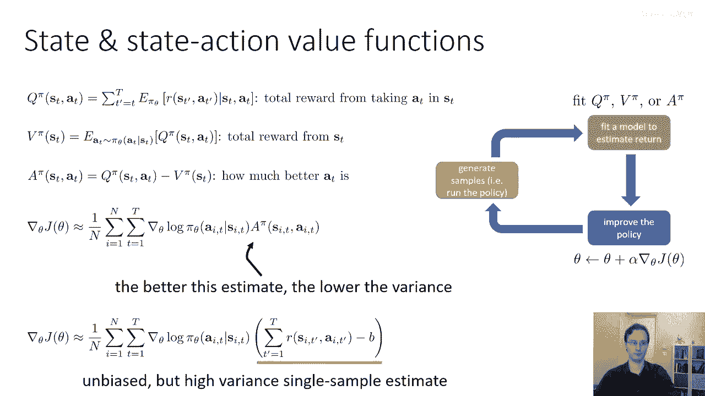

## 🤔 拟合哪个函数？Q， V 还是 A？

既然优势函数如此有用，我们自然会问：应该直接拟合Q函数、价值函数还是优势函数？

*   **Q函数** \(Q^\pi(s, a)\)：依赖于状态和动作，维度较高，学习起来可能需要更多样本。
*   **价值函数** \(V^\pi(s)\)：仅依赖于状态，学习起来相对容易。
*   **优势函数** \(A^\pi(s, a)\)：也依赖于状态和动作。

我们可以利用它们之间的关系来简化问题。根据定义：
\[
Q^\pi(s_t, a_t) = r(s_t, a_t) + \mathbb{E}_{s_{t+1} \sim p(\cdot|s_t,a_t)} [V^\pi(s_{t+1})]
\]
如果我们用单一样本 \(s_{t+1}\) 来近似这个期望，就可以得到：
\[
Q^\pi(s_t, a_t) \approx r_t + V^\pi(s_{t+1})
\]
这是一个近似，但方差较低。将其代入优势函数公式：
\[
A^\pi(s_t, a_t) \approx r_t + V^\pi(s_{t+1}) - V^\pi(s_t)
\]
这个表达式的吸引力在于，它完全依赖于价值函数 \(V^\pi\)。因此，一种常见且有效的演员-批评者算法是：**只拟合价值函数 \(V^\pi(s)\)**，然后用上述公式来近似计算优势函数。

---

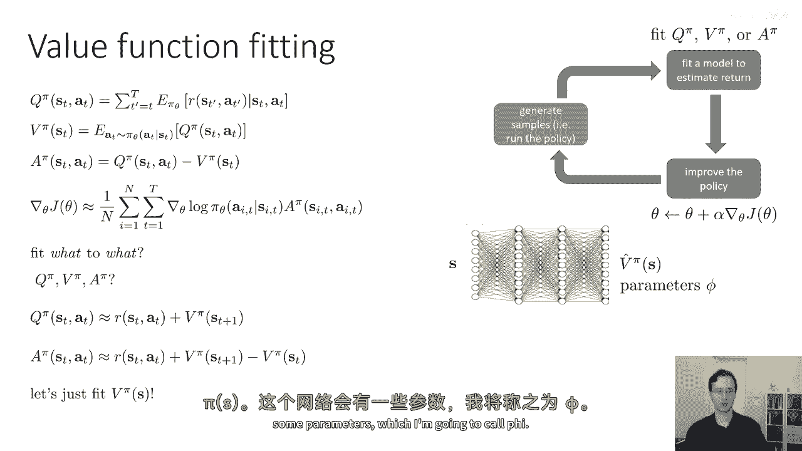

## 📊 如何进行策略评估（拟合V函数）

现在我们知道要拟合价值函数 \(V^\pi(s)\)，那么具体该如何做呢？这个过程称为**策略评估**。

我们用一个参数为 \(\phi\) 的函数（如神经网络）\(V_{\phi}(s)\) 来近似 \(V^\pi(s)\)。目标是让 \(V_{\phi}(s)\) 的预测尽可能接近真实的价值。我们需要为这个监督学习问题创建训练数据和目标。

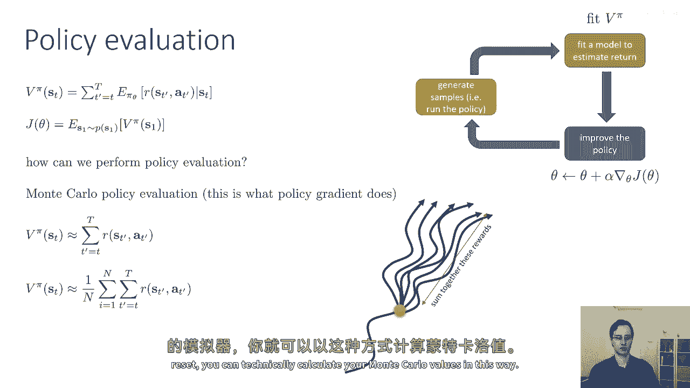

以下是两种主要方法：

**1. 蒙特卡洛（MC）估计**
*   **思路**：使用从某个状态开始到轨迹结束所获得的实际总奖励作为该状态价值的无偏估计。
*   **目标值**：\(y_t = \sum_{t‘=t}^{T} r_{t’}\)
*   **优点**：无偏。
*   **缺点**：方差高，因为它是单一样本估计。

**2. 时序差分（TD）或引导（Bootstrap）估计**
*   **思路**：利用贝尔曼方程，用当前奖励加上下一状态的估计价值来作为当前状态的价值估计。
*   **目标值**：\(y_t = r_t + V_{\phi}(s_{t+1})\)
*   **优点**：方差低，因为使用了估计器 \(V_{\phi}\) 来平滑未来奖励。
*   **缺点**：有偏，因为 \(V_{\phi}\) 本身可能不准确。

在实际的演员-批评者算法中，我们通常使用引导估计。训练过程就是最小化预测值与目标值之间的均方误差：
\[
\mathcal{L}(\phi) = \frac{1}{N} \sum_{i} (V_{\phi}(s_i) - y_i)^2
\]
通过迭代地收集数据、拟合 \(V_{\phi}\)，并更新策略，价值函数的估计会越来越准，优势函数的估计方差也会越来越低。

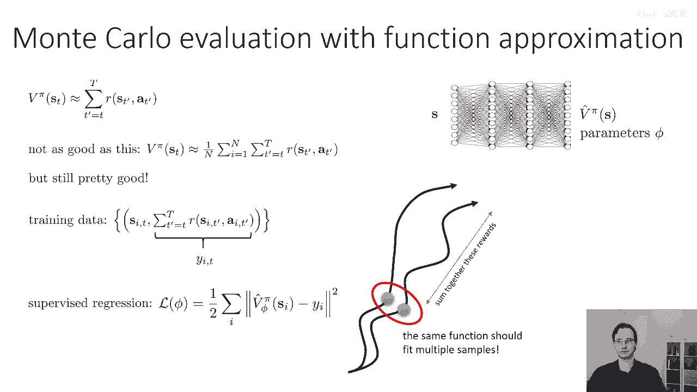

---

## 🎮 策略评估的直观例子

为了帮助理解策略评估的实际意义，让我们看两个直观的例子：

**1. 棋类游戏（如西洋双陆棋、围棋）**
*   **奖励**：游戏结果（赢为+1，输为0）。
*   **价值函数 \(V^\pi(s)\)**：在给定当前棋盘状态 \(s\) 下，智能体最终赢得游戏的**预期概率**。
*   **直观理解**：价值函数直接回答了“从这个局面开始，我有多大胜算？”这个问题。

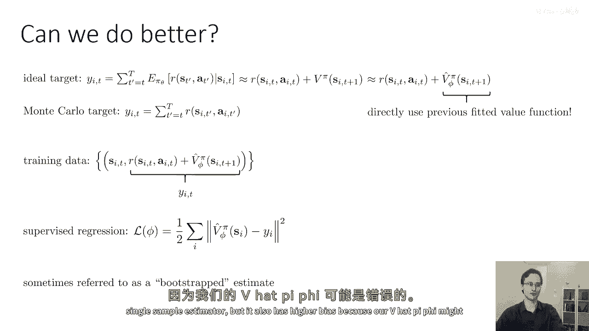

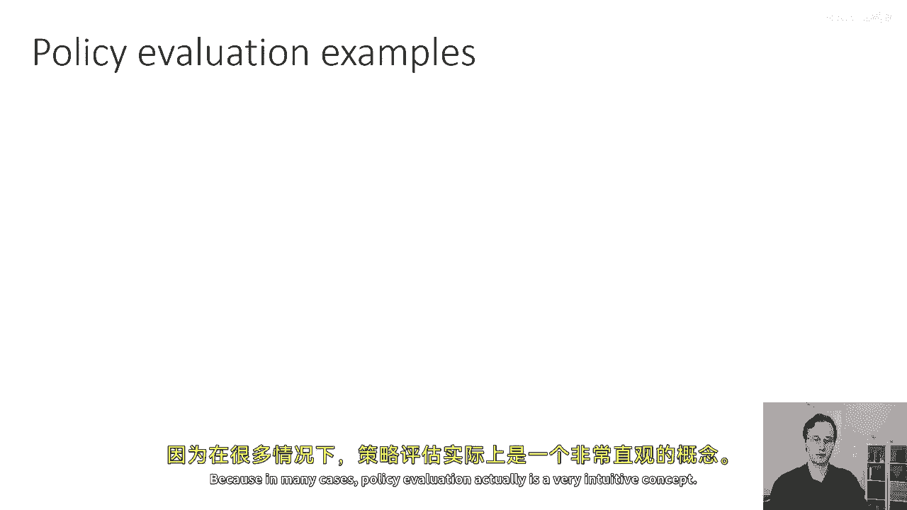

**2. 用于决策**
*   在围棋中，你可以模拟走一步棋后的局面 \(s‘\)，然后用价值函数 \(V^\pi(s’)\) 快速评估这个新局面的好坏，从而选择能最大化胜率的那一步。这比展开完整的游戏搜索树要高效得多。

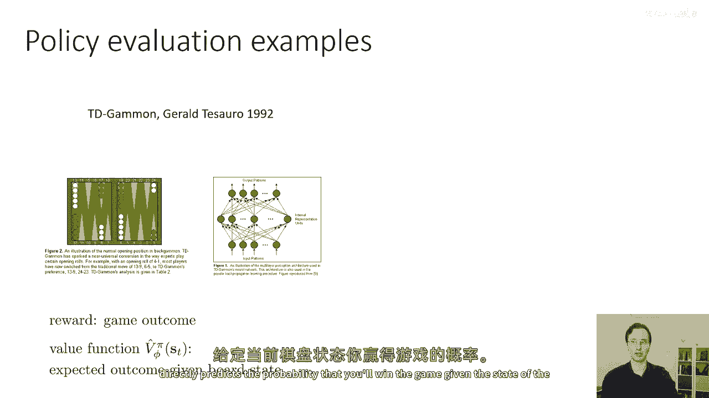

---

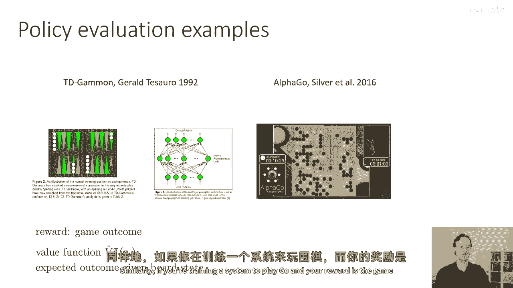

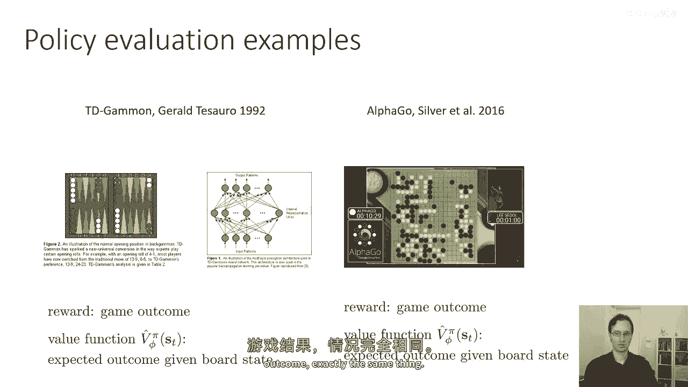

## 📝 本节总结

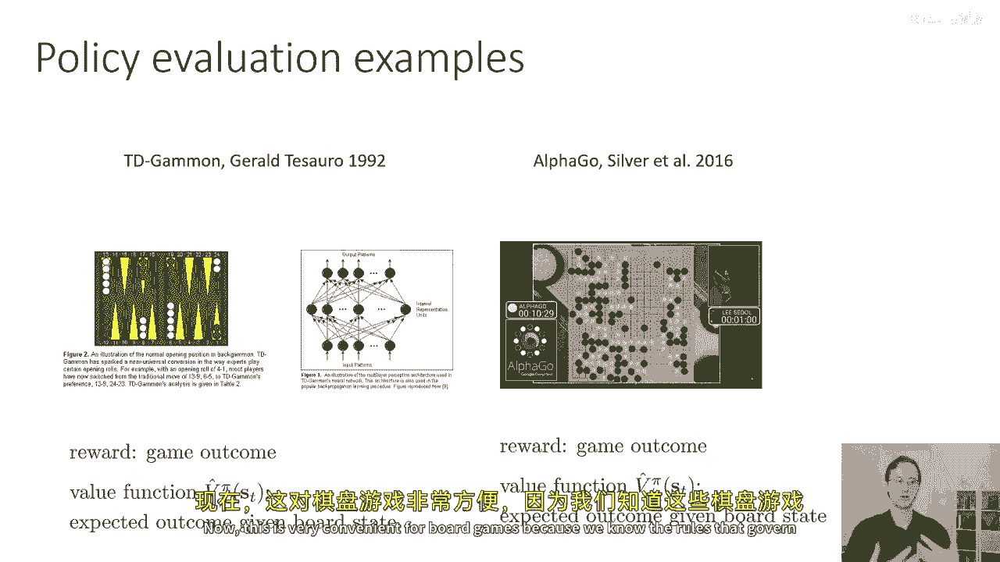

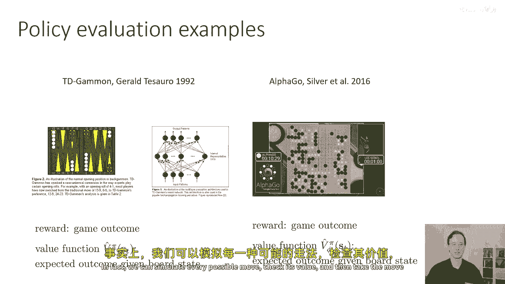

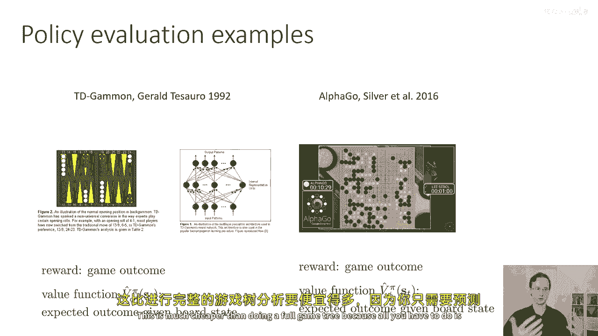

在本节课中，我们一起学习了演员-批评者算法第一部分的核心理念：
1.  **核心动机**：通过拟合价值函数来估计优势函数，以替代策略梯度中高方差的无模型回报估计，从而显著降低方差。
2.  **关键函数**：我们引入了**状态价值函数 \(V^\pi(s)\)** 和**优势函数 \(A^\pi(s, a)\)**。优势函数是Q函数与价值函数之差，能更准确地衡量动作的相对好坏。
3.  **实用方法**：我们推导出近似公式 \(A^\pi(s_t, a_t) \approx r_t + V^\pi(s_{t+1}) - V^\pi(s_t)\)，这使得我们可以通过仅拟合一个价值函数网络来估计优势。
4.  **策略评估**：介绍了拟合价值函数的两种方法——蒙特卡洛估计（无偏高方差）和时序差分引导估计（有偏低方差），后者是演员-批评者算法中的常用选择。
5.  **直观理解**：策略评估在许多任务（如棋类游戏）中有着非常直观的解释，即预测当前状态的长期期望收益或胜率。

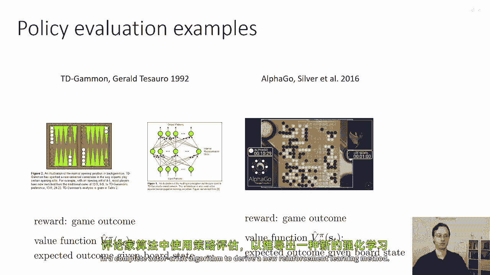

在下一部分，我们将具体讲解如何将策略评估（批评者）与策略更新（演员）结合，形成一个完整的演员-批评者算法。