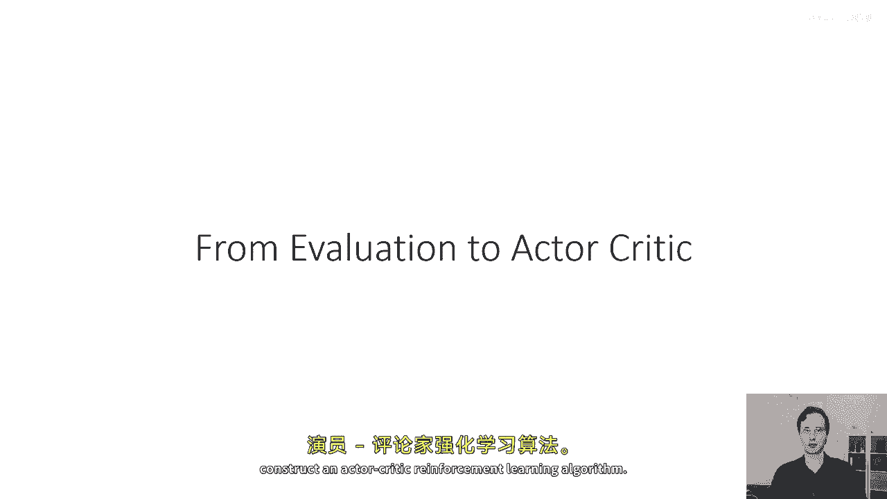
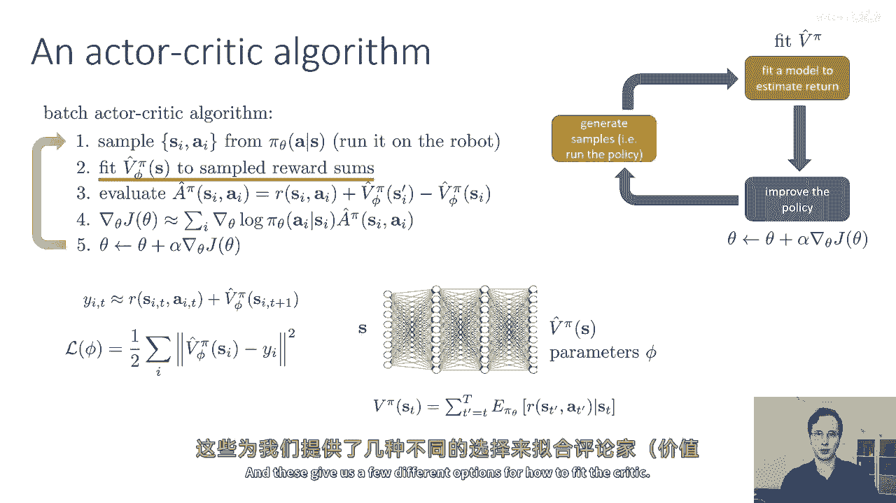
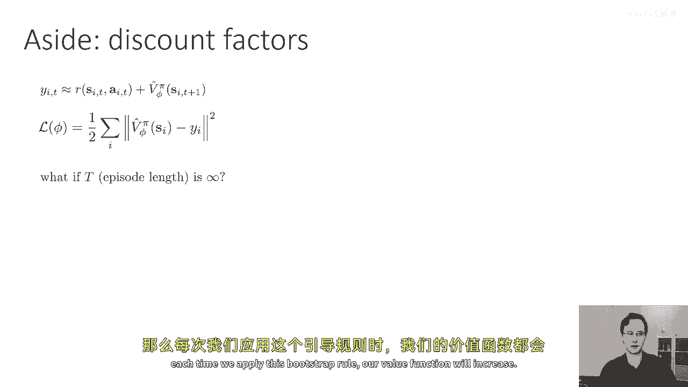
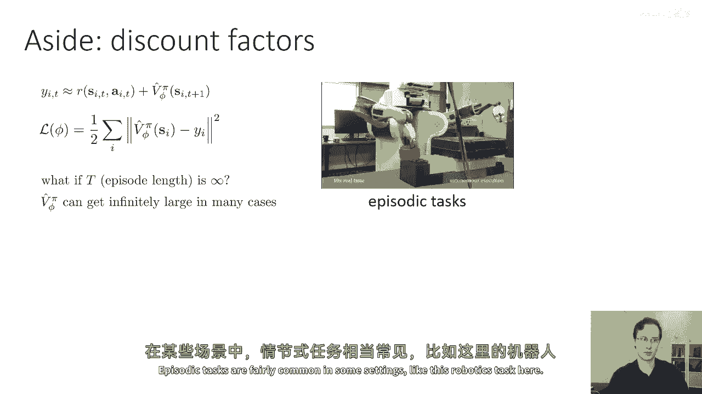
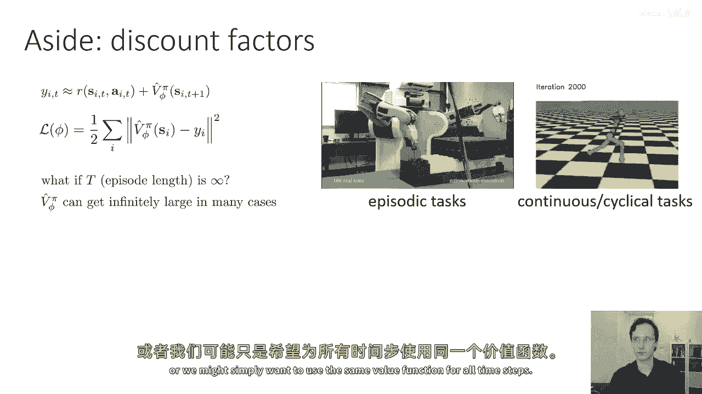
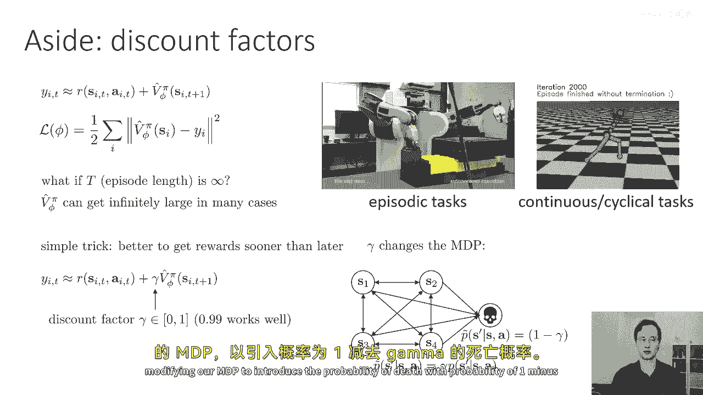
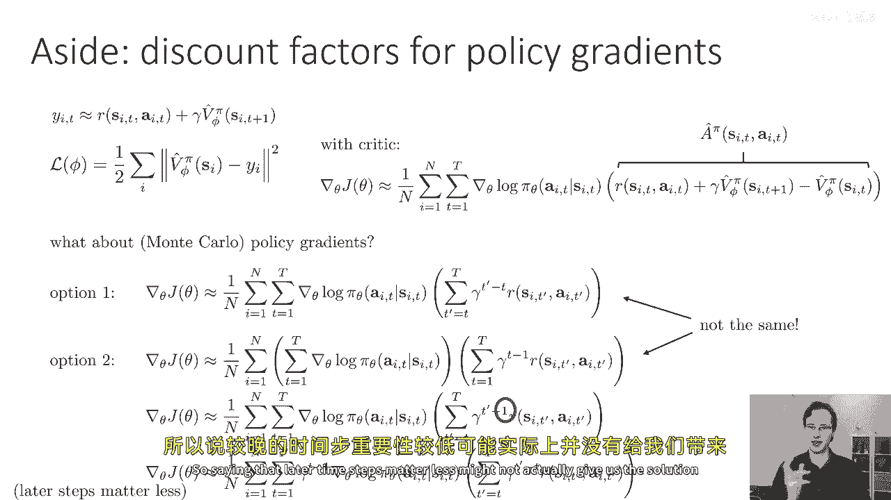
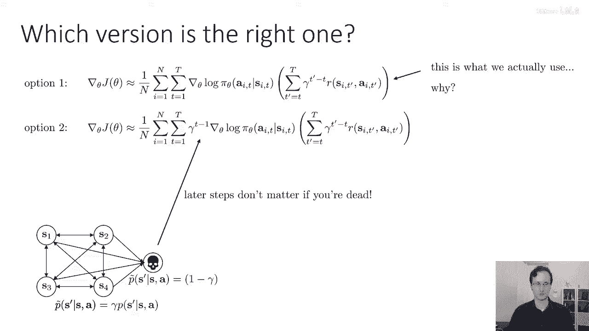
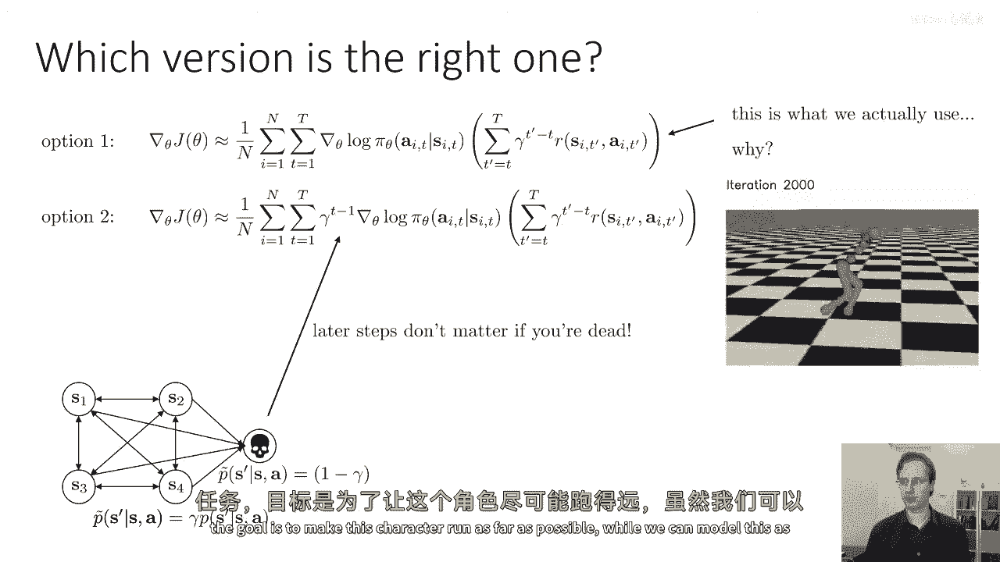
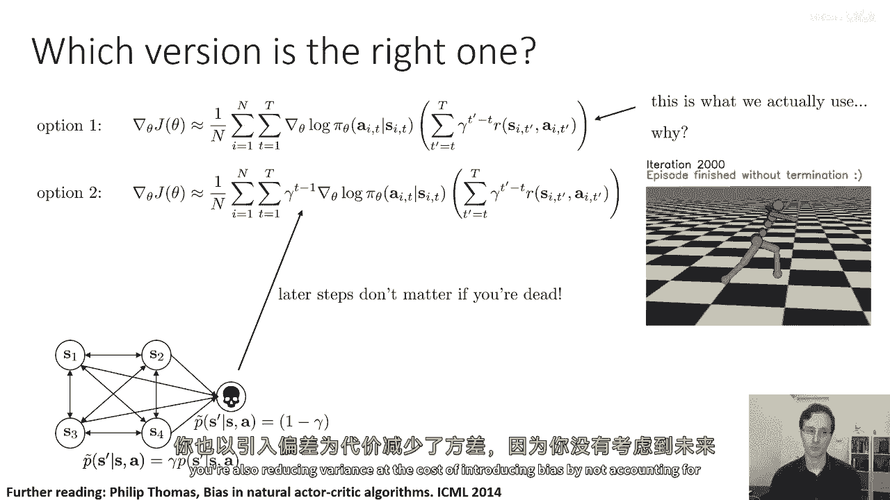

# 22：演员-批评家算法与折扣因子 🎓

在本节课中，我们将学习如何将价值函数（批评家）整合到策略梯度（演员）中，从而构建一个更高效的演员-批评家强化学习算法。我们还将探讨如何处理无限期任务，并引入折扣因子的概念。

---

## 🔄 从策略评估到演员-批评家算法

上一节我们介绍了策略评估以及如何将价值函数融入策略梯度。本节中，我们来看看如何将这些部分结合起来，构建一个完整的演员-批评家强化学习算法。

一个基本的批处理演员-批评家算法步骤如下：

以下是算法的五个核心步骤：

1.  **生成样本**：通过在当前策略下运行模拟（或与环境交互）来收集样本轨迹。
2.  **拟合价值函数**：使用收集到的数据，训练一个神经网络来近似状态或状态-动作对的价值函数。这一步取代了之前直接累加奖励的方法。
3.  **计算优势估计**：对于每个采样到的状态-动作元组 `(s_t, a_t)`，计算近似优势 `Â_t`。公式为：
    `Â_t = r_t + γ * V_φ(s_{t+1}) - V_φ(s_t)`
    其中 `γ` 是折扣因子，`V_φ` 是拟合的价值函数。
4.  **构建策略梯度估计**：使用计算出的优势值来估计策略梯度。在每个时间步 `t`，梯度贡献为 `∇_θ log π_θ(a_t|s_t) * Â_t`。
5.  **执行梯度下降**：利用第4步构建的梯度估计，对策略参数 `θ` 执行梯度下降更新，以优化策略。

在讨论策略评估的部分，我们重点介绍了步骤二——如何拟合价值函数。我们有两种主要选择：

以下是拟合批评家（价值函数）的两种主要方法：

*   **蒙特卡洛估计**：将价值函数拟合到从轨迹开始累积到结束的**实际回报** `G_t` 上。目标值是 `V_φ(s_t) ≈ G_t`。
*   **自举估计**：使用**单步时间差分**目标，即 `r_t + V_φ(s_{t+1})`。这利用了当前的函数估计来更新，是演员-批评家算法的核心。

---

## ⏳ 无限期任务与折扣因子

当我们使用上述自举规则在**无限期**任务中拟合价值函数时，可能会遇到问题：如果奖励总是正的，价值函数的估计可能会在迭代中不断增长，最终趋向无穷大。

对于在固定时间结束的**分幕式任务**，这不是大问题。但对于**连续任务**（如让机器人持续奔跑），我们需要一种机制来保证价值有限。

解决方案是引入**折扣因子 γ**。其核心思想是：智能体更偏好即时奖励，而非延迟奖励。从数学上，我们将未来奖励乘以 `γ`（0 < γ < 1），使得无限序列的奖励总和收敛。

折扣因子 `γ` 可以解释为对原始MDP的修改：

以下是折扣因子的概率解释：

*   我们引入一个额外的“死亡”或“终止”状态。
*   在每个时间步，智能体以 `1 - γ` 的概率进入该终止状态，并以 `γ` 的概率继续在原始MDP中转移。
*   一旦进入终止状态，将永远停留并获得零奖励。
*   因此，下一个时间步的期望价值变为 `γ * E[V(s_{t+1})]`。

从计算角度看，引入折扣因子后，优势估计公式变为：
`Â_t = r_t + γ * V_φ(s_{t+1}) - V_φ(s_t)`

---

## 🤔 折扣因子的不同使用方式

将折扣引入策略梯度时，有两种看似相似但本质不同的方式。考虑从时间步 `t` 开始的未来奖励总和。

以下是两种引入折扣的策略梯度形式：

*   **选项一（更常用）**：未来奖励按 `γ^{t’ - t}` 折扣。策略梯度估计为：
    `∇_θ J(θ) ≈ E [ Σ_{t=0}^{T-1} ∇_θ log π_θ(a_t|s_t) * ( Σ_{t’=t}^{T-1} γ^{t’ - t} r_{t’} ) ]`
    这**仅折扣未来奖励**，而不折扣梯度本身。
*   **选项二**：未来奖励按 `γ^{t’}` 折扣。策略梯度估计为：
    `∇_θ J(θ) ≈ E [ Σ_{t=0}^{T-1} γ^{t} ∇_θ log π_θ(a_t|s_t) * ( Σ_{t’=t}^{T-1} γ^{t’ - t} r_{t’} ) ]`
    这**同时折扣了未来奖励和未来决策的重要性**（通过 `γ^t` 乘在梯度前）。

**选项二**在数学上对应于解决一个真正的“带有死亡概率”的折扣MDP，它认为早期的决策比晚期的决策更重要。然而，在实践中，我们通常使用**选项一**。原因在于，我们引入折扣主要是为了算法上的便利（确保价值有限、降低方差），而非真正认为后期决策不重要。我们通常希望学到的策略在每个时间步都能做出好的决策。

---

## 🚀 在线演员-批评家算法

批处理模式需要收集完整轨迹再更新。而利用演员-批评家结构，我们可以实现**在线更新**，即每执行一步就立即更新策略和价值函数。

以下是在线演员-批评家算法的步骤：

1.  **执行动作**：根据当前策略 `π_θ(a|s)` 采样动作 `a_t`，与环境交互，得到转移 `(s_t, a_t, r_t, s_{t+1})`。
2.  **更新价值函数**：使用时间差分目标更新批评家。例如，采用均方误差损失：
    `L(φ) = [ r_t + γ * V_φ(s_{t+1}) - V_φ(s_t) ]^2`
    然后对 `φ` 执行梯度下降。
3.  **计算优势**：`Â_t = r_t + γ * V_φ(s_{t+1}) - V_φ(s_t)`
4.  **更新策略**：计算策略梯度 `∇_θ J(θ) ≈ ∇_θ log π_θ(a_t|s_t) * Â_t`，并对演员参数 `θ` 执行梯度上升。
5.  **重复**：将状态更新为 `s_{t+1}`，回到步骤1，持续在线学习。

然而，这种朴素的在线算法在深度强化学习中直接应用可能会不稳定，因为连续样本之间存在强相关性，且网络参数在持续变化。后续课程将讨论如何改进（例如使用经验回放、目标网络等）。

---

## 📚 本节课总结

本节课中我们一起学习了：
1.  如何将策略评估（批评家）与策略梯度（演员）结合，构建出**演员-批评家算法**的基本框架。
2.  为了处理无限期任务，引入了**折扣因子 γ** 的概念，它确保了价值函数的有限性，并可以解释为对未来奖励的偏好或进入“终止状态”的概率。
3.  分析了在策略梯度中引入折扣的**两种不同形式**，并理解了实践中常用仅折扣奖励而非梯度的形式。
4.  探讨了演员-批评家框架如何支持**在线学习**，即每一步都进行更新，并指出了其在实际深度RL应用中可能面临的挑战。

通过引入批评家，我们获得了比单纯蒙特卡洛策略梯度更低方差的梯度估计，这是向更高效、更稳定强化学习算法迈进的关键一步。