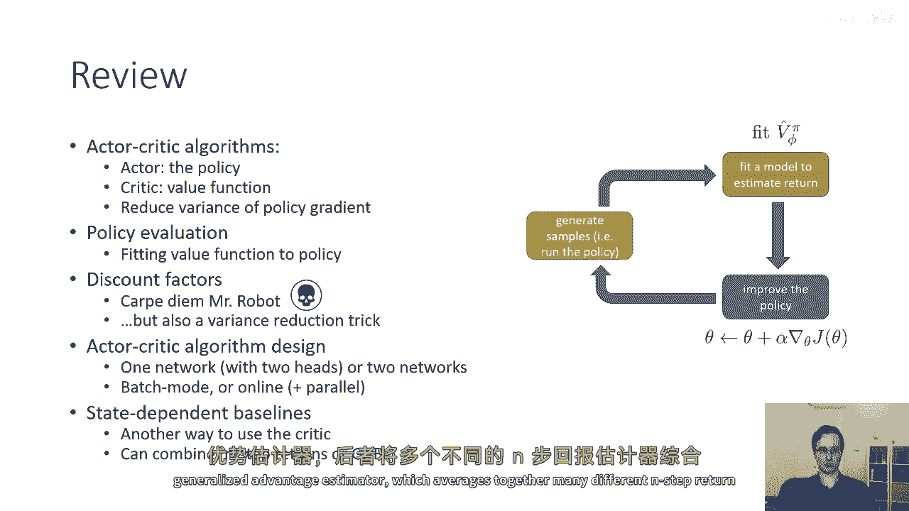
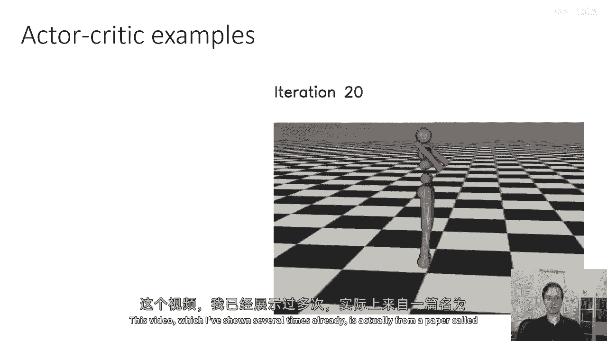
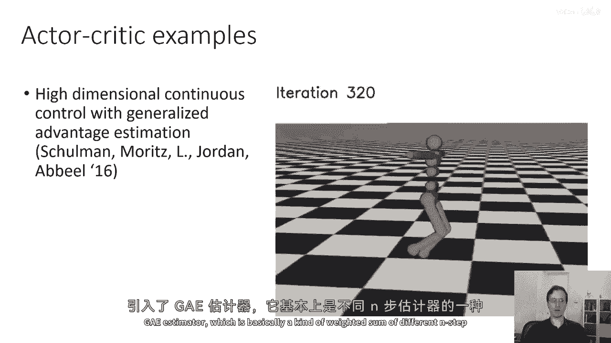
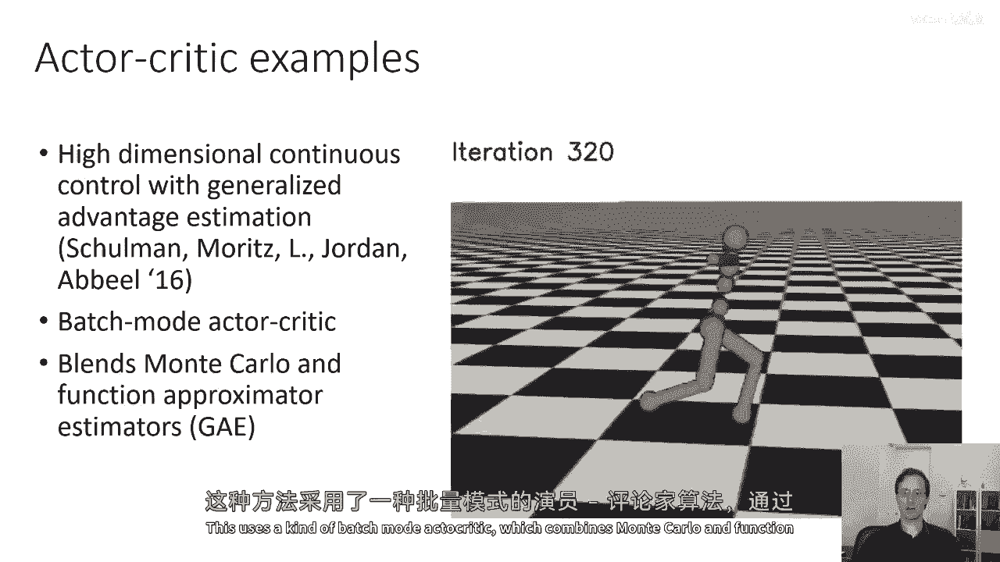
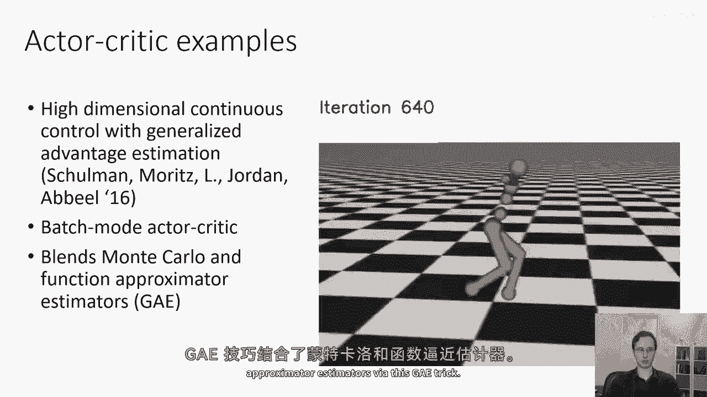
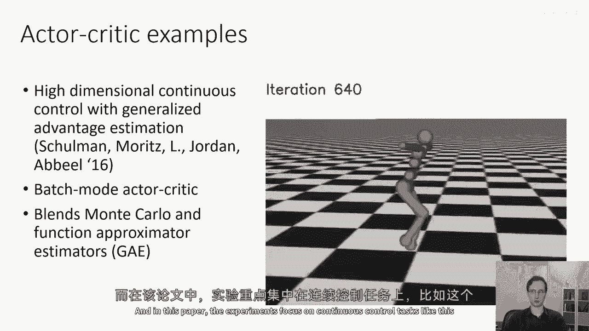
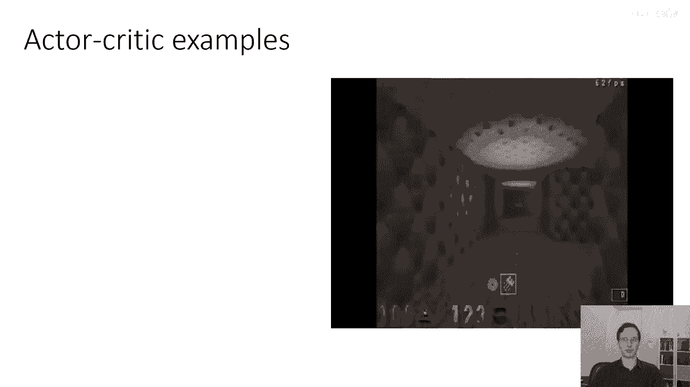
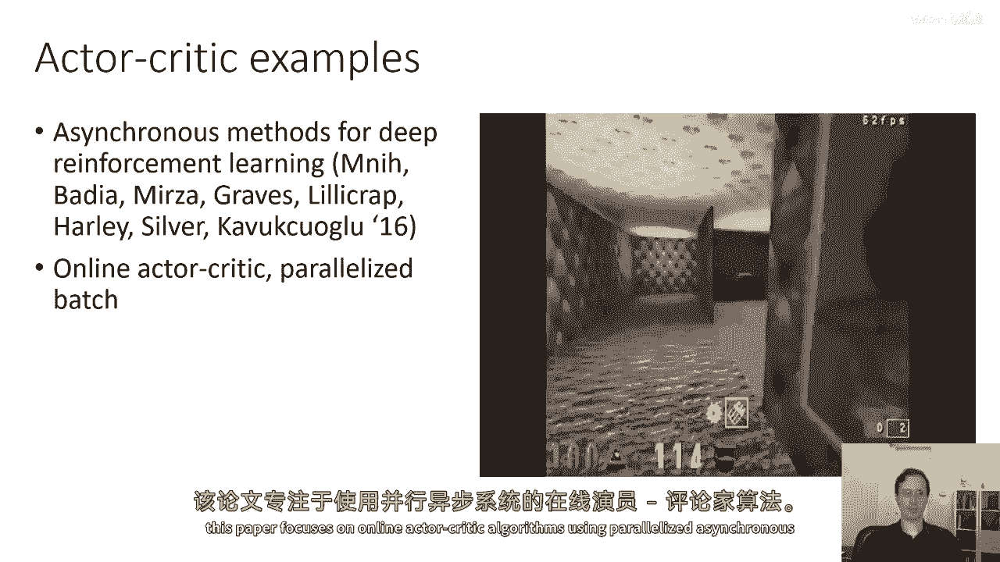
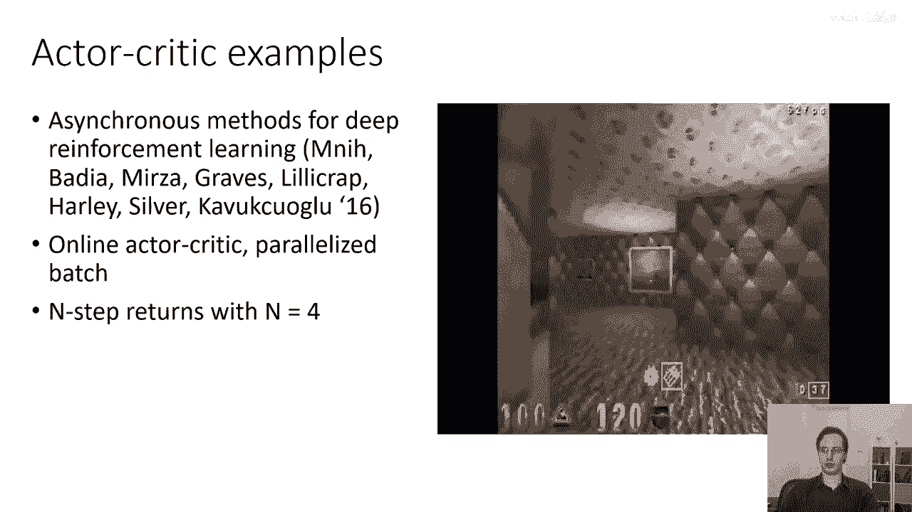
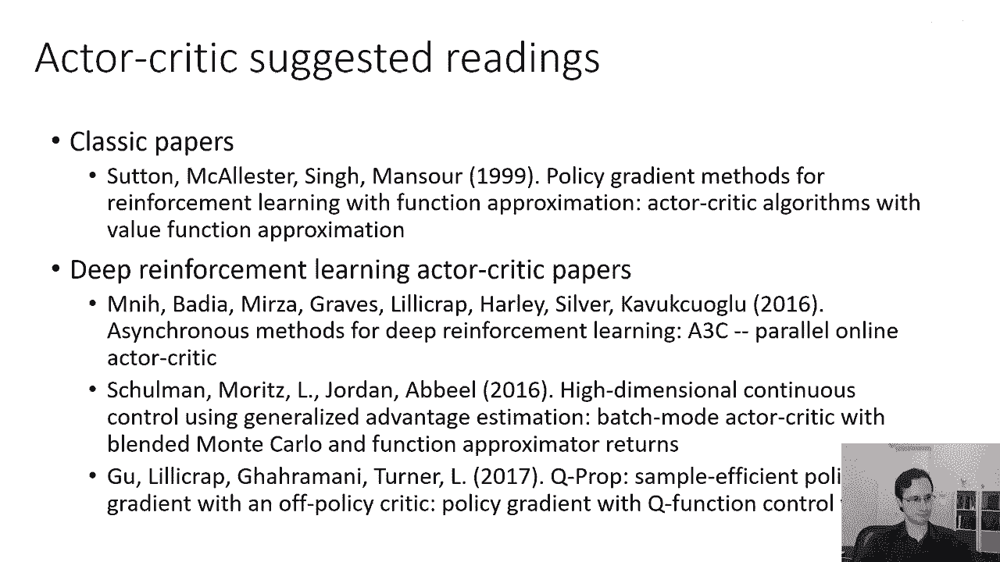

# 25：演员-批评者算法总结与文献概览 🎬

在本节课中，我们将总结演员-批评者算法的核心组成部分，并概览文献中一些重要的算法实例。我们将回顾已学内容，并了解这些理论是如何在实际研究论文中应用的。

---

## 算法核心回顾 🔄

上一节我们详细探讨了演员-批评者算法的内部机制。本节中，我们来简要回顾其核心构成。

演员-批评者算法由几个部分组成：
*   **演员**：即策略 `π(a|s)`。
*   **批评者**：即价值函数 `V(s)` 或 `Q(s, a)`。

该算法可被视为**策略梯度**的一种变体，其主要优势在于能显著**降低方差**。与其他强化学习算法类似，其流程包含三个部分：
1.  **样本生成**：在橙色框部分，我们通过与环境交互来生成轨迹样本。
2.  **回报估计**：在绿色框部分，我们拟合价值函数来估计回报。
3.  **策略更新**：在蓝色框部分，我们像标准策略梯度一样，使用梯度下降来更新策略参数。

**策略评估**指的是拟合价值函数的过程。其中，**折扣因子 γ** 是一个关键概念，它使得在无限时间范围内进行策略评估成为可能。折扣因子有两种主要解释：
*   可以解释为“对死亡的恐惧”，即智能体希望尽快获得奖励。
*   也可以纯粹视为一种**减少方差**的技术技巧。

---

## 算法设计要点 ⚙️

在讨论了基本框架后，我们来看看算法设计中的几个关键选择。

以下是算法设计时需要考虑的几个方面：
*   网络架构：可以使用一个网络配备两个输出头（分别对应演员和批评者），也可以使用两个独立的网络。
*   更新模式：可以采用批处理模式，也可以采用在线更新模式。
*   并行化：可以利用并行性来获得大于1的批处理大小，从而提升效率。
*   基线改进：我们讨论了**状态依赖基线**，以及更进一步的**动作依赖控制变量**方法。这些是另一种利用批评者信息的方式，同时能保持梯度估计的无偏性。
*   回报估计：我们还探讨了如何将上述方法与 **n步回报** 以及 **广义优势估计（GAE）** 结合。GAE通过对不同n值的n步回报估计器进行指数加权平均，提供了一个在偏差和方差之间取得更好平衡的估计。

---

## 文献中的算法实例 📚

理论需要与实践结合。现在，我们来看看研究论文中提出的几个著名演员-批评者算法实例。

以下是两篇重要论文及其贡献：

**1. 《高维连续控制与广义优势估计》**
*   这篇论文引入了**广义优势估计器（GAE）**。其核心公式是对不同n步回报估计器进行加权求和，平衡偏差与方差。
*   该算法采用**批处理模式**的演员-批评者架构。
*   它通过GAE技巧，巧妙地将蒙特卡洛估计器（高方差、无偏）与函数逼近估计器（低方差、有偏）结合起来。
*   论文中的实验主要聚焦于**连续控制任务**，例如让人形机器人学习行走。

**2. 《深度强化学习的异步方法》**
*   这篇论文专注于**在线演员-批评者算法**，并利用了**并行异步**的架构。
*   文中展示了一个基于图像的演员-批评者算法，它使用卷积神经网络处理视觉输入，并结合循环神经网络来导航迷宫。
*   该算法使用了 **n步回报**，其中n设置为4。
*   在网络设计上，它采用**单一网络**，但具有分别输出策略和价值函数的**多个头**。

---

## 延伸阅读推荐 📖

如果你想更深入地了解演员-批评者算法，以下是一些经典的论文推荐：

**理论基础论文：**
*   **《基于函数逼近的强化学习策略梯度方法》**：这是一篇非常重要的论文，奠定了策略梯度的理论基础。它详细描述了我之前提到的“因果关系”技巧（即当前时间步的策略更新不应受过去奖励影响），并系统阐述了如何将这些理论转化为演员-批评者算法。本节课的许多内容都基于这篇论文的思想。

**现代深度强化学习论文：**
*   **《深度强化学习的异步方法》**：即上文详细介绍的在线异步算法论文。
*   **《高维连续控制与广义优势估计》**：即上文详细介绍的GAE论文。

---

## 总结 🎯

本节课中，我们一起学习了演员-批评者算法的总结与文献概览。我们回顾了算法的三大核心组件（演员、批评者、更新流程），探讨了折扣因子γ的多重含义与算法设计的关键选择（如网络架构、基线、GAE）。最后，我们通过两篇标志性论文，看到了这些理论如何被应用于解决复杂的连续控制问题和基于图像的决策任务，并提供了延伸阅读的路径以助你进一步探索。