# 26：价值函数方法 🧠

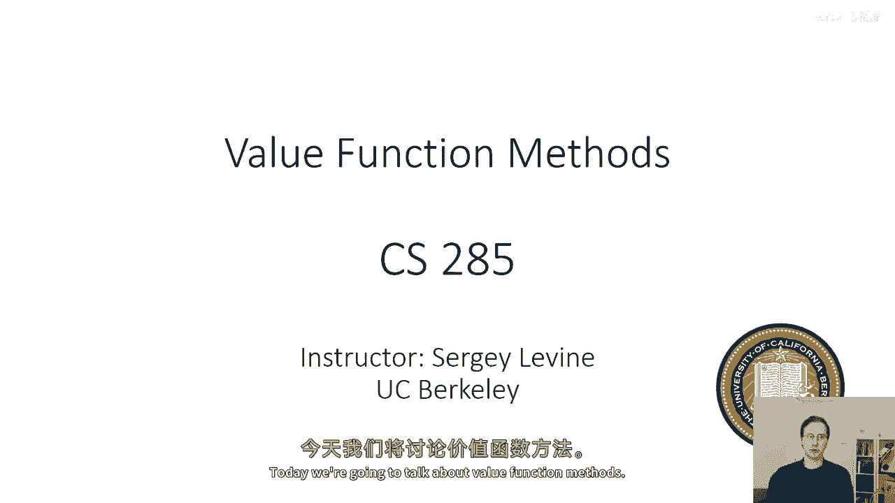

在本节课中，我们将学习强化学习中的价值函数方法。我们将从回顾演员-评论家算法开始，探讨如何仅使用价值函数来决定行动，从而引出策略迭代和价值迭代等核心算法。课程内容将涵盖这些方法的基本原理、算法步骤及其在表格型马尔可夫决策过程中的应用。

---

## 回顾演员-评论家算法 🔄

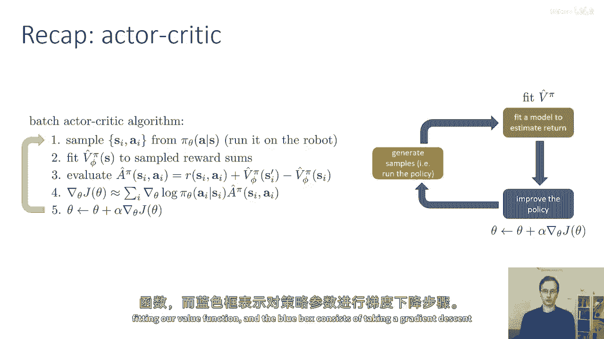

在上一节中，我们介绍了演员-评论家算法。该算法将策略评估扩展到引入价值函数。其基本流程如下：

1.  运行当前策略以生成样本 `(s_t, a_t, r_t, s_{t+1})`。
2.  使用这些样本拟合一个价值函数 `V_φ(s)`，这是一个将状态映射到标量值的神经网络。
3.  利用价值函数估计每个状态-动作对 `(s_t, a_t)` 的优势 `A_t`：
    ```
    A_t = r_t + γ * V_φ(s_{t+1}) - V_φ(s_t)
    ```
4.  使用这些估计的优势值，通过策略梯度公式更新策略参数 `θ`。

这个流程遵循强化学习的通用范式：生成样本（橙色框）、拟合价值函数（绿色框）、更新策略（蓝色框）。

---

## 从价值函数到行动决策 🎯

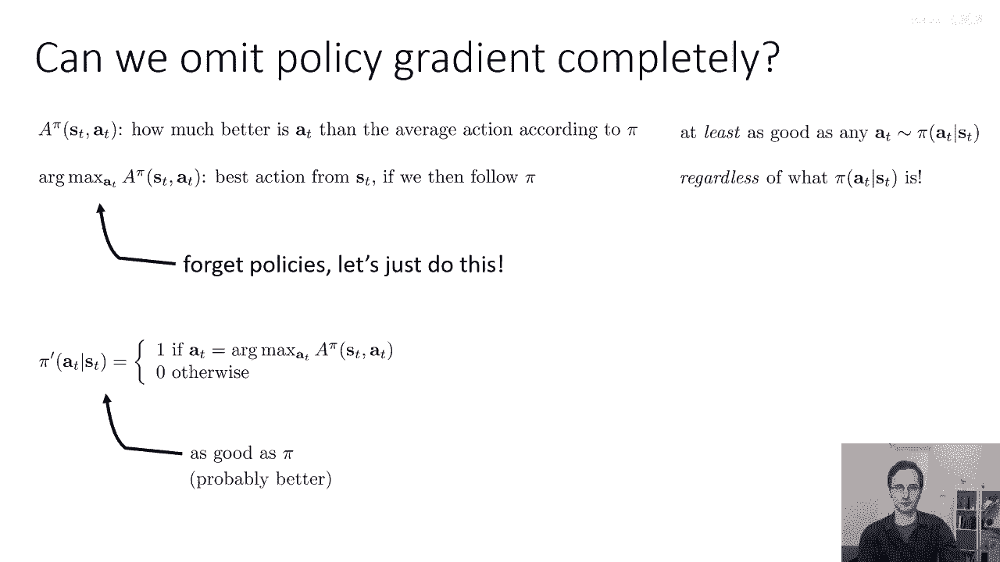

上一节我们介绍了如何用价值函数辅助策略更新。本节中我们来看看，能否完全省略显式的策略网络，仅凭价值函数来决定如何行动。

直觉上，价值函数 `V(s)` 告诉我们哪些状态更好。如果我们能选择那些能导向高价值状态的行动，或许就不再需要一个独立的策略网络。

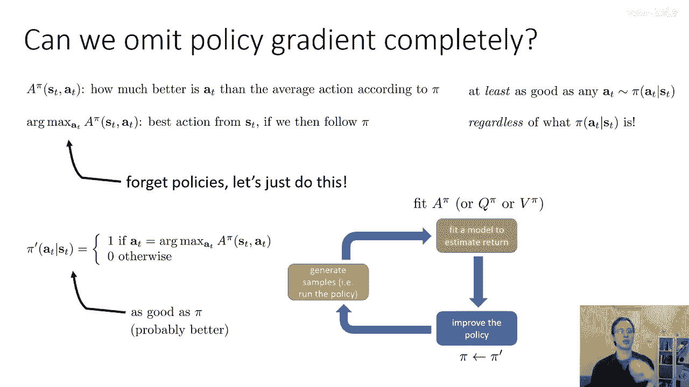

更形式化地，我们可以使用优势函数 `A^π(s, a)`，它衡量在策略 `π` 下，动作 `a` 相对于平均动作的好坏程度：
```
A^π(s, a) = Q^π(s, a) - V^π(s)
```
对于任意策略 `π`，选择优势最大的动作 `argmax_a A^π(s, a)`，得到的新策略 `π'` 至少不会比 `π` 差。这意味着，即使初始策略很差，我们也能通过这种方式进行改进。

因此，价值函数方法的核心思想是：**隐式地构建策略**。我们不需要一个额外的神经网络来表示策略，策略被隐式地定义为对优势函数（或Q函数）取 `argmax` 的操作。

---

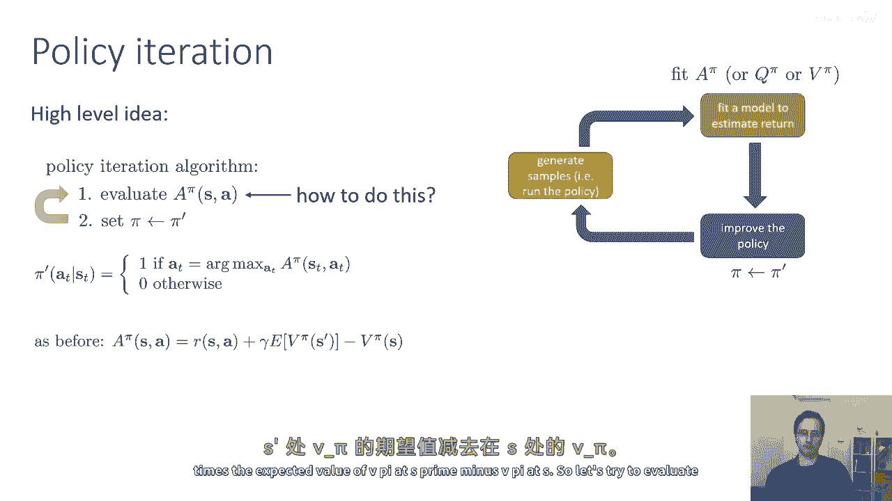

## 策略迭代算法 🔁

基于上述思想，我们可以得到一个名为**策略迭代**的算法。它包含两个交替进行的步骤：

**步骤一：策略评估**
评估当前策略 `π` 的价值函数 `V^π(s)`。

**步骤二：策略改进**
根据评估出的价值函数，构建新的、改进的策略 `π'`：
```
π'(a|s) = 1, 如果 a = argmax_a A^π(s, a)
```
新策略 `π'` 是确定性的，它总是选择当前估计下优势最大的动作。

然后，我们用 `π'` 替换 `π`，重复上述过程。每次迭代，策略都会得到改进（或保持不变）。

---

## 在表格型MDP中进行策略评估 📊

上一节我们介绍了策略迭代的框架。本节中我们来看看如何具体执行第一步——策略评估。我们暂时假设一个理想化的设置：状态 `S` 和动作 `A` 都是**小而离散的**，并且我们**已知转移概率** `P(s'|s, a)`。这种设置被称为表格型马尔可夫决策过程。

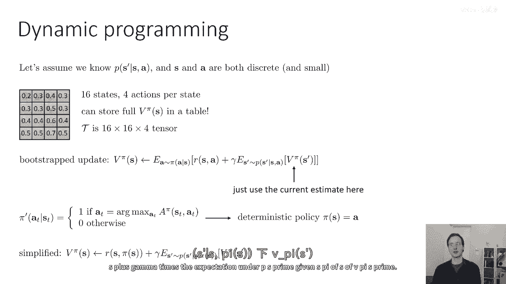

例如，在一个4x4的网格世界中，有16个状态和4个动作（上、下、左、右）。我们可以用一个包含16个数字的表格来表示价值函数 `V(s)`，用一个16x16x4的张量来表示转移概率。

在这种设置下，策略评估可以通过**动态规划**精确计算。价值函数满足贝尔曼方程：
```
V^π(s) = E_{a∼π(·|s)} [ R(s, a) + γ * E_{s'∼P(·|s,a)} [ V^π(s') ] ]
```
由于策略 `π'` 是确定性的（`π'(a|s)=1` 对于某个特定的 `a`），方程可以简化为：
```
V^{π'}(s) = R(s, π'(s)) + γ * E_{s'∼P(·|s, π'(s))} [ V^{π'}(s') ]
```
我们可以通过反复迭代这个方程（即用等号右边的值更新左边的 `V(s)`）来求解 `V^{π'}`，这个过程最终会收敛到真实的价值函数。

---

## 简化策略迭代：价值迭代 ⚡

策略迭代需要反复进行完整的策略评估。我们可以通过一个称为**价值迭代**的算法来简化这个过程。

首先注意到，在策略改进步骤中，由于 `argmax` 操作不受与动作 `a` 无关的项影响，因此：
```
argmax_a A^π(s, a) = argmax_a Q^π(s, a)
```
我们可以直接使用Q函数。

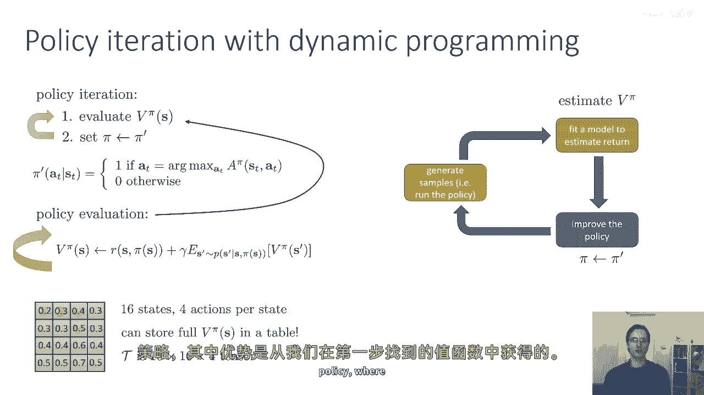

价值迭代的核心洞察是，我们可以“短路”策略的显式表示。算法步骤如下：

1.  **Q值更新**：对于每个状态 `s` 和动作 `a`，计算：
    ```
    Q(s, a) ← R(s, a) + γ * E_{s'∼P(·|s,a)}[ V(s') ]
    ```
2.  **价值更新**：对于每个状态 `s`，更新价值函数为：
    ```
    V(s) ← max_a Q(s, a)
    ```

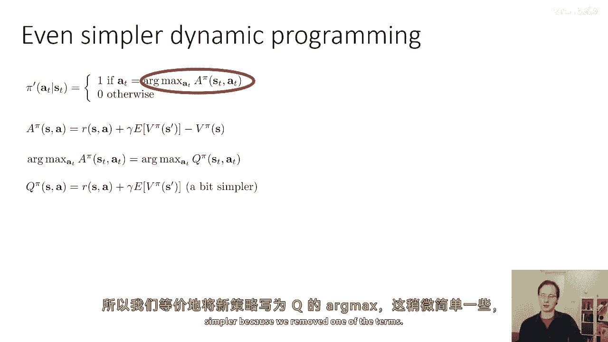

实际上，我们可以将这两个步骤合并，直接得到价值迭代的核心更新规则：
```
V(s) ← max_a [ R(s, a) + γ * E_{s'∼P(·|s,a)}[ V(s') ] ]
```
这个规则被反复应用于所有状态，直到价值函数收敛。收敛后，最优策略可以通过对每个状态 `s` 选择 `argmax_a [ R(s, a) + γ * E_{s'∼P(·|s,a)}[ V(s') ] ]` 来获得。

价值迭代本质上是在交替执行**一步策略评估**和**一步策略改进**，它比完整的策略迭代更高效。

---

## 总结 📝

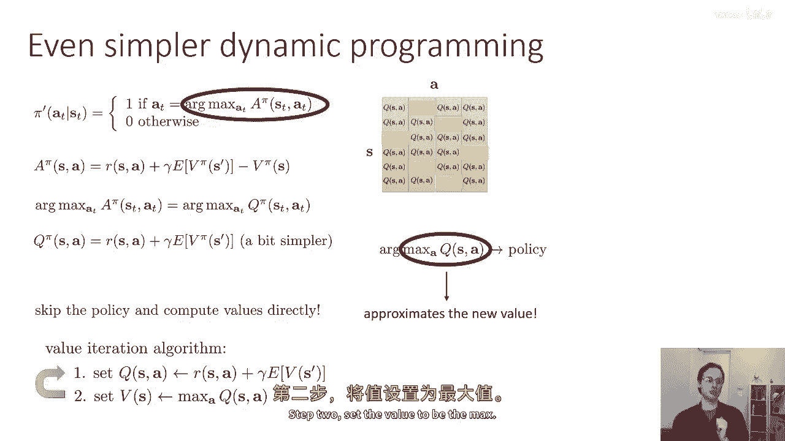

本节课中我们一起学习了强化学习中的价值函数方法。

*   我们从**演员-评论家算法**出发，理解了价值函数在评估策略中的作用。
*   我们探讨了**仅使用价值函数决定行动**的可能性，通过选择优势最大的动作来隐式定义策略，从而引出了**策略迭代**算法。
*   在**表格型、模型已知**的理想设定下，我们详细讲解了如何使用**动态规划**进行精确的**策略评估**。
*   最后，我们介绍了更高效的**价值迭代**算法，它通过合并步骤，直接迭代更新价值函数来逼近最优策略。

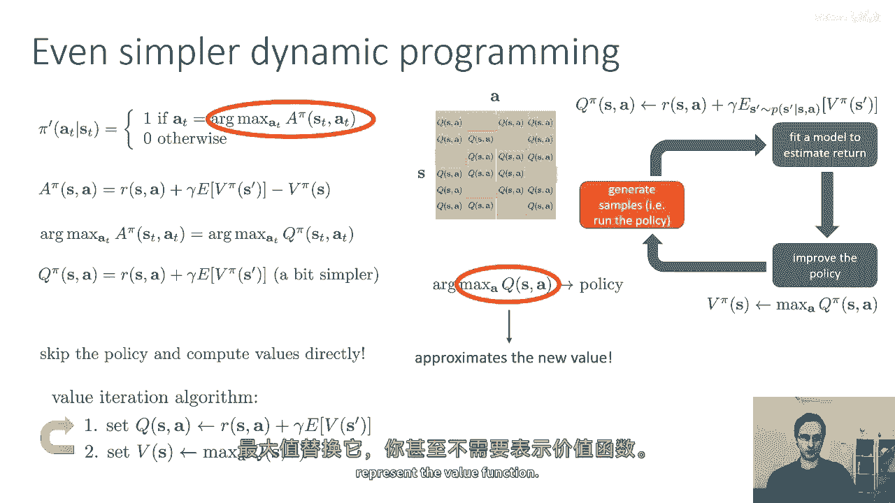

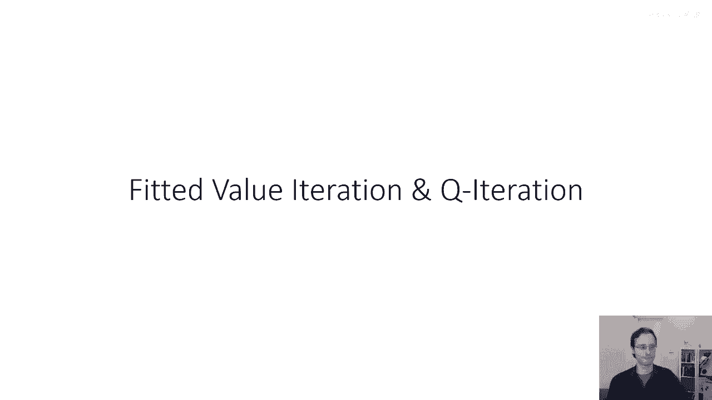

这些基于价值函数的动态规划算法为理解更复杂的、无模型的强化学习方法奠定了重要基础。在接下来的课程中，我们将探讨如何将这些思想扩展到连续状态空间和未知模型的环境中。