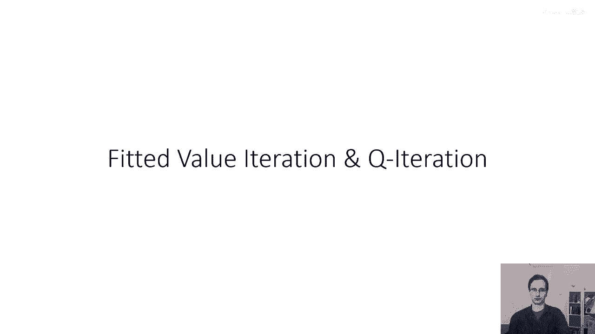
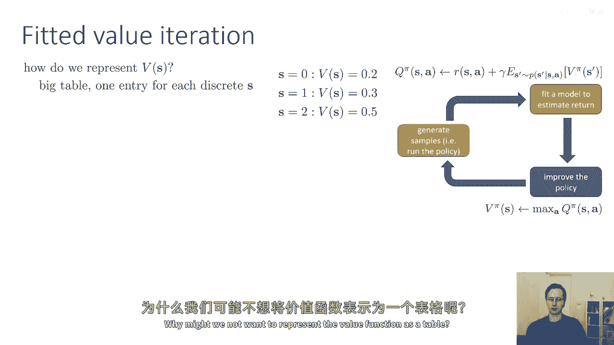
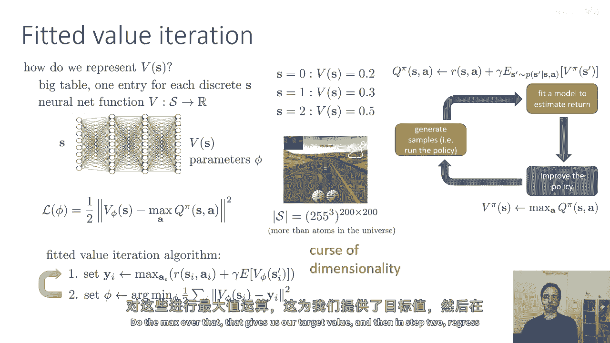
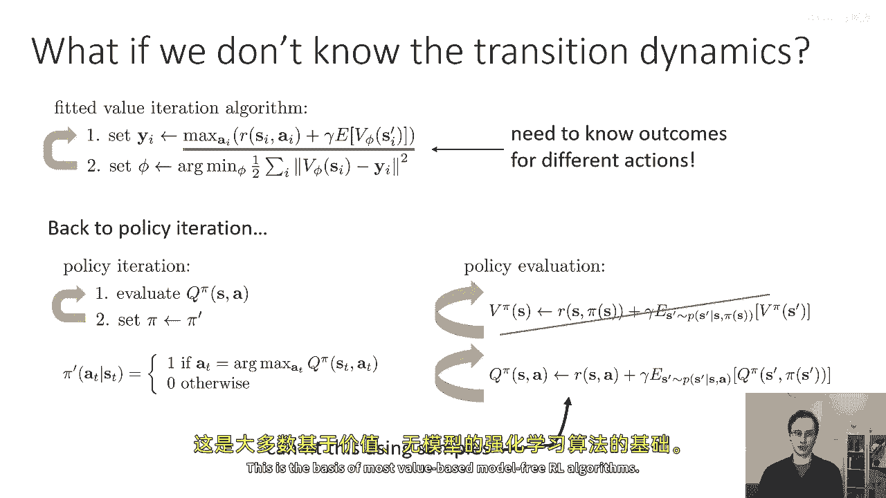
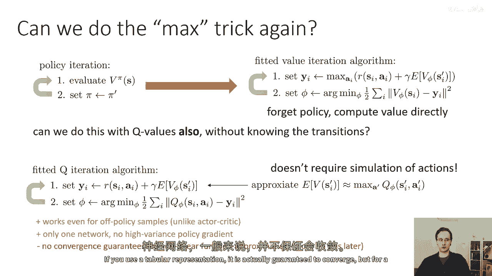
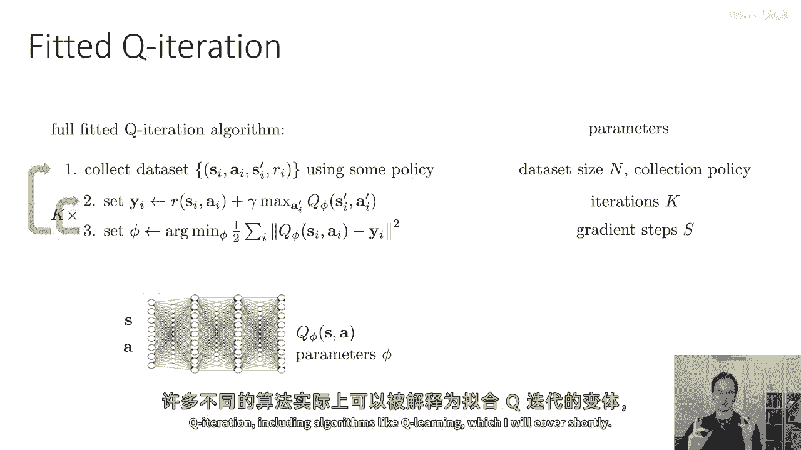
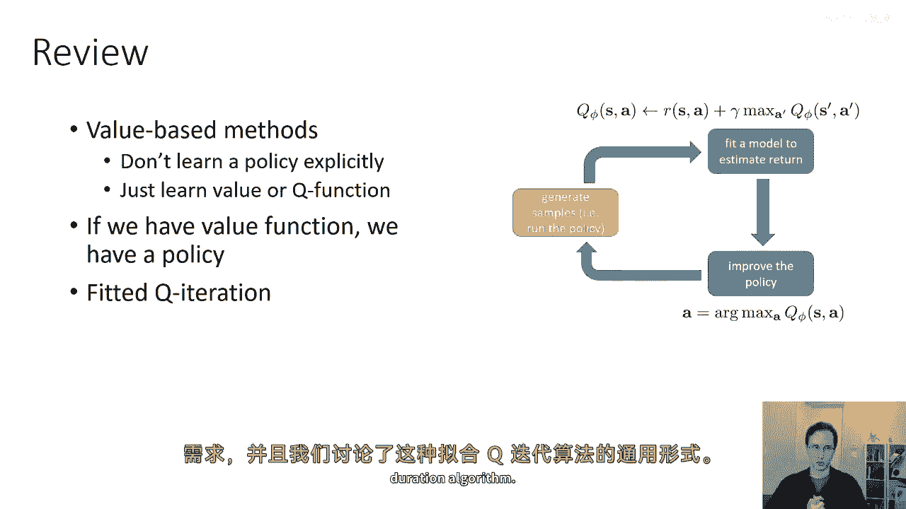

# 27：基于价值的强化学习方法 🧠

在本节课中，我们将学习如何将函数逼近（特别是神经网络）引入到强化学习中，以解决表格法无法处理大规模或连续状态空间的问题。我们将重点介绍**拟合Q迭代**算法，这是一种无需知道环境转移动态就能学习Q函数的方法。

---

## 从表格到函数逼近 📈

上一节我们讨论了如何学习用表格表示的价值函数。这种方法适用于小的离散状态空间，因为我们可以枚举所有可能状态的价值。

为什么表格法不够好？假设你正在玩一个基于图像输入的视频游戏。一个200x200像素的图像，每个像素有3个颜色通道，可能的状态数量是 `255^(200*200*3)`。这个数字超过了宇宙中的原子数量，因此存储这样的表格是不可能的。对于连续状态空间，状态数量实际上是无限的。这个问题常被称为“维度诅咒”。

因此，我们需要使用**函数逼近器**。就像在之前的课程中一样，我们将使用一个神经网络价值函数，它将状态映射到一个标量值。这个神经网络具有参数 `φ`。

我们可以通过最小二乘回归，将神经网络价值函数拟合到目标值上。如果我们使用价值迭代，目标值就是 `max_a Q_π(s, a)`。

以下是拟合价值迭代算法的两个步骤：
1.  计算目标值 `y_i`，对于每个采样状态 `s_i`，评估所有可能动作的Q值并取最大值：`y_i = max_a [ R(s_i, a) + γ * E[V(s')] ]`。
2.  通过回归，调整参数 `φ`，使 `V_φ(s_i)` 接近目标值 `y_i`。

这个算法是合理的，但它仍然需要知道环境的转移动态，以便计算期望值 `E[V(s')]` 并从同一状态尝试多个不同动作。在大多数实际环境中，我们无法做到这一点。

---

## 引入Q函数与策略迭代 🔄

如果我们不知道转移动态，通常无法执行上述算法。让我们回到**策略迭代**。策略迭代交替进行两步：策略评估（计算 `Q_π`）和策略改进（将策略设置为关于 `Q_π` 的贪婪策略）。

策略评估涉及反复应用价值函数递归。我们可以为Q函数构造一个类似的递归：
`Q_π(s, a) = R(s, a) + γ * E_{s'~P(s'|s,a)} [ Q_π(s', π(s')) ]`

这个递归式有一个关键的不同：它只需要 `(s, a, s')` 形式的样本，而不需要知道完整的转移概率 `P(s'|s,a)`。这意味着，只要我们有一些通过运行某个策略收集到的 `(s, a, r, s')` 样本，我们就可以用来拟合Q函数，而无论当前策略是什么。这为**无模型强化学习**奠定了基础。

---

## 拟合Q迭代算法 ⚙️

我们能否像简化价值迭代一样，对Q函数也使用“取最大值”的技巧，同时保留无需知道转移动态的好处？答案是肯定的，这就是**拟合Q迭代**算法。

与拟合价值迭代类似，我们构建目标值，但关键区别在于我们使用样本而不是期望，并且用Q函数本身的最大值来估计下一个状态的价值。

以下是拟合Q迭代算法的完整步骤，你需要选择一些自由参数（如收集数据量、内循环迭代次数k等）：

**第一步：收集数据集**
使用某个策略（可以是任何策略，常见选择是使用最新策略）收集包含元组 `(s_i, a_i, s_i', r_i)` 的数据集。

**第二步：计算目标值**
对于数据集中的每个转移样本，计算目标值 `y_i`：
`y_i = r_i + γ * max_{a'} Q_φ(s_i', a')`
这里，`Q_φ` 是你当前对Q函数的估计（一个神经网络）。

**第三步：拟合新的Q函数**
通过最小化损失函数（如均方误差）来更新Q函数的参数 `φ`：
`L(φ) = Σ_i ( Q_φ(s_i, a_i) - y_i )^2`
你需要决定执行此优化步骤的梯度更新次数。

**内循环与探索**
通常，我们会在收集一批新数据之前，多次（比如k次）交替执行第二步和第三步（即使用同一批数据反复改进Q函数）。完成k次内循环迭代后，你可以使用更新后的Q函数来定义一个策略（例如，ε-贪婪策略），并用它来收集更多数据，然后重复整个过程。

关于神经网络架构的一个注记：对于离散动作空间，一种常见设计是让神经网络输入状态 `s`，并输出所有可能动作 `a` 对应的Q值向量，而不是将 `s` 和 `a` 同时作为输入。

---

## 总结 📝

本节课中，我们一起学习了基于价值的强化学习方法的核心思路：
1.  **基于价值的方法**不显式学习策略，而是学习价值函数（V函数）或动作价值函数（Q函数）。
2.  当状态空间很大或连续时，必须使用**函数逼近**（如神经网络）来表示价值函数。
3.  **拟合Q迭代**算法允许我们在不知道环境模型（转移动态）的情况下，直接通过样本 `(s, a, r, s')` 来学习Q函数。
4.  该算法循环执行三个步骤：收集数据、计算目标值、拟合Q函数。它是一个**离线**、**异策略**算法，可以使用历史数据。
5.  需要注意的是，当使用非线性函数逼近器（如神经网络）时，该算法的收敛性没有理论保证，但在实践中往往非常有效。许多经典算法（如Q学习）都可以视为拟合Q迭代的变体。

通过本节课，你已经掌握了将强化学习扩展到复杂、高维状态空间的关键工具——基于函数逼近的价值函数学习。