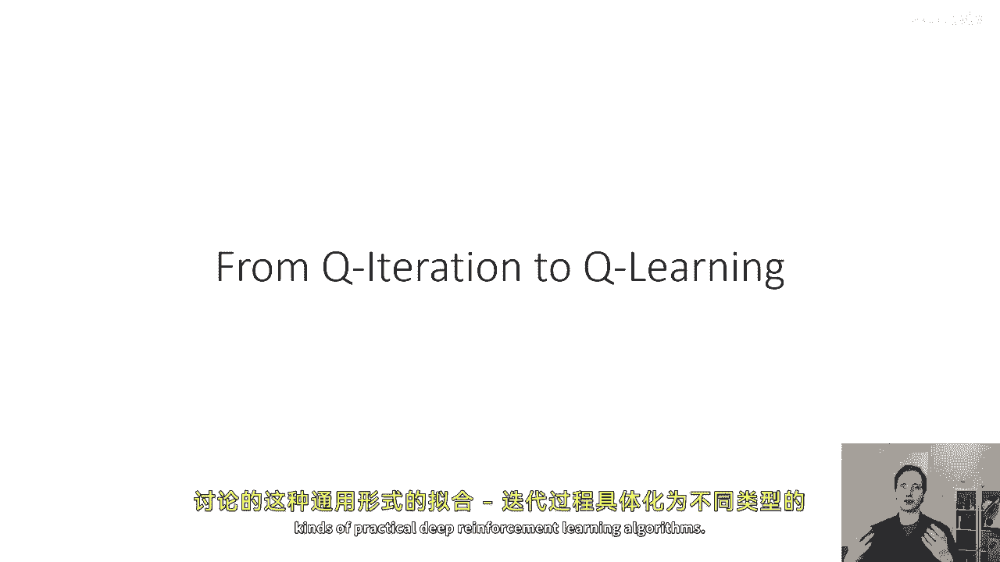
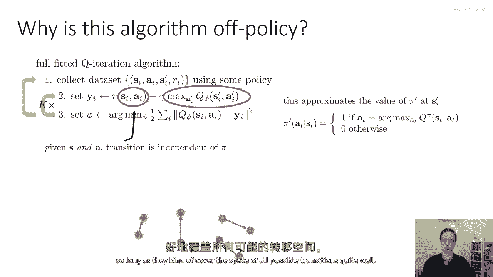
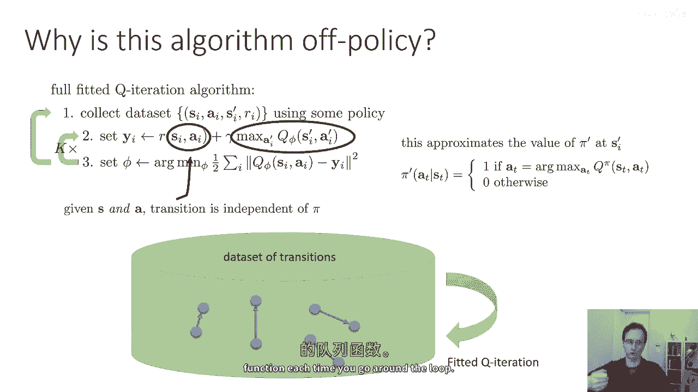
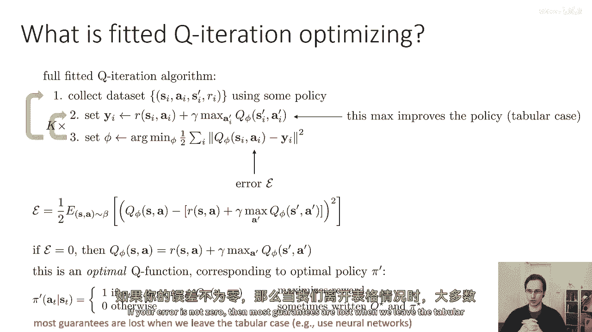
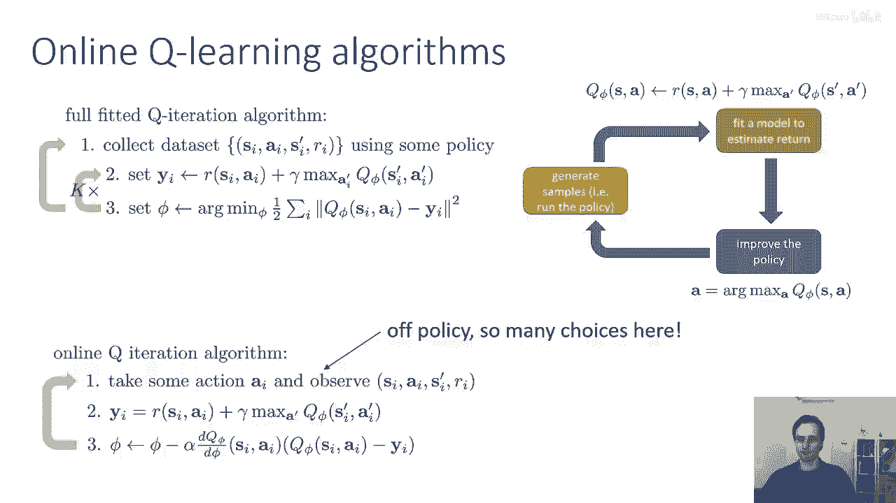
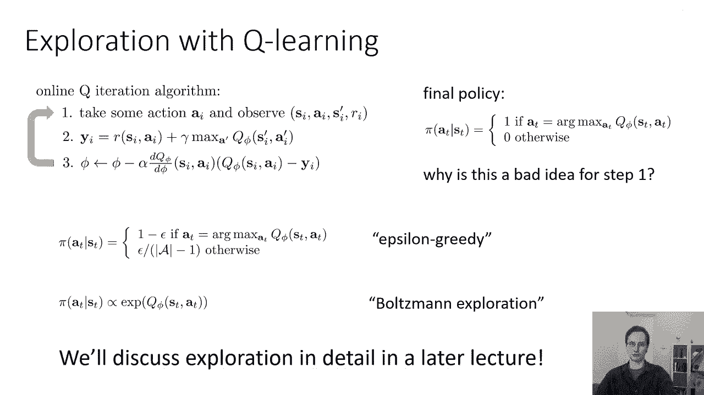
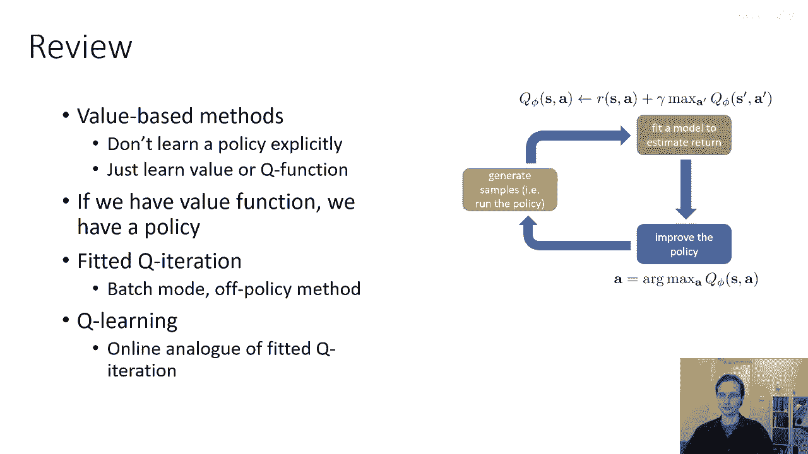

# 28：拟合Q迭代与Q学习 🧠

在本节课中，我们将学习如何将之前介绍的通用“拟合Q迭代”框架，具体化为不同类型的深度强化学习算法。我们将重点理解其作为离线策略算法的特性，并探讨几种流行的具体实现，如在线Q学习。

---

## 概述：拟合Q迭代作为离线策略算法

上一节我们介绍了拟合Q迭代的通用形式。本节中我们来看看它如何成为一个离线策略算法。

离线策略算法意味着，你不需要根据最新策略来采集样本数据。通常，你可以在同一批样本上执行多次梯度更新，或者重用之前迭代的样本，而不必丢弃旧数据。这在实践中提供了更多数据用于训练。

拟合Q迭代之所以能使用离线策略数据，是因为策略本身仅通过Q函数来体现，而非通过模拟器交互。当策略改变时，真正变化的是求取最大值的操作。策略 `π` 由 `argmax` 操作定义：`π(s) = argmax_a Q_φ(s, a)`。策略仅出现在这个 `argmax` 中，并且它是以Q函数的参数形式出现的。

这意味着，随着策略改变（即 `a_i'` 改变），我们无需生成新的轨迹（rollouts）。你可以将Q函数视为一个模型，它允许你模拟采取不同动作会获得何种价值。为了改进行为，你自然会选择价值最高的动作。因此，这个最大值操作近似了在状态 `s_i'` 下，贪婪策略 `π` 的价值。这就是我们不需要新样本的原因：我们使用Q函数来模拟新动作的价值。

给定一个状态 `s_i` 和动作 `a_i`，转移至 `s_i'` 的过程实际上与策略 `π` 无关，因为 `π` 只影响动作 `a_i`，而这里的 `a_i` 是固定的。

因此，从结构上看，拟合Q迭代可以这样理解：你有一个包含各种状态转移的大数据集，你在每个状态转移上进行价值备份（backup），每次备份都会改进你的Q值。你并不特别关心这些转移具体来自哪个策略，只要它们大致覆盖了所有可能的状态转移空间即可。

你可以想象拥有一个状态转移数据集，然后在这个数据集上反复运行拟合Q迭代。每循环一次，你的Q函数都会得到改进。

---

## 拟合Q迭代的优化与误差

那么，拟合Q迭代中优化良好的步骤是什么？在取最大值这一步，它可以改进你的策略。在表格型（tabular）情况下，这实际上就是策略改进。而第三步（最小化拟合误差）则是优化步骤。

如果你使用表格更新，你会直接将目标值 `y` 写入表格。但由于我们使用神经网络，你需要通过优化来最小化与这些目标值 `y` 之间的误差，并且可能无法将误差完全降至零。

因此，可以将拟合Q迭代视为优化一个误差，即贝尔曼误差（Bellman error），它是 `Q_φ(s, a)` 与目标值 `y` 之间的差异。这是最接近实际优化目标的误差。当然，这个误差本身并不完全反映策略的好坏，它只是衡量你复制目标值的准确度。

如果误差为零，那么 `Q_φ(s, a) = r(s, a) + γ * max_a' Q_φ(s', a')`。这正是最优策略 `π*` 对应的最优Q函数 `Q*`。当策略通过 `argmax` 规则恢复时，这就是你能展示的最大化奖励。

但如果误差不为零，那么关于策略性能的很多理论保证就会失效。我们知道在表格情况下，误差可以为零，从而恢复 `Q*`。然而，一旦离开表格情况（例如使用函数近似器），大多数保证就会丢失。

---

## 具体算法实例：在线Q学习

现在，让我们讨论拟合Q迭代的一些具体实例，它们对应着文献中非常流行的算法。

到目前为止，我们讨论的拟合Q学习通用形式包含三步：
1.  收集数据集。
2.  评估目标值。
3.  训练神经网络参数以拟合这些目标值。

然后交替执行第2和第3步 `K` 次，之后再次出去收集更多数据。

通过特定的超参数选择，可以将这个通用算法实例化为在线算法。

以下是具体步骤：

在在线算法的第一步中，你执行一个具体的动作 `a_i`，并观察一个转移 `(s_i, a_i, s_i', r_i)`。

在第二步中，为你刚刚经历的转移计算一个目标值 `y_i`。这类似于在线演员-评论家（Actor-Critic）算法中为你刚进行的一次转移计算优势值的方式。

在第三步中，你在Q值与刚计算的目标值之间的误差上执行一次梯度下降。这里的方程看起来有点复杂，但我基本上只是对第三步中的最小化目标函数应用了概率链式法则。

应用链式法则，你得到梯度更新公式：
`φ ← φ - α * dQ_φ/dφ * (Q_φ(s_i, a_i) - y_i)`

其中，括号内的误差 `(Q_φ(s_i, a_i) - y_i)` 有时被称为时序差分误差（Temporal Difference error）。

这就是基本的在线Q学习算法，有时也称为 Watkins Q-learning。这是教科书中的经典Q学习算法，并且它是一种离线策略算法。因此，你不需要根据最新的贪婪策略来执行动作 `a_i`。

---

## 探索策略：如何选择动作

那么，在第一步中应该使用哪种策略来选取动作 `a_i` 呢？最终策略将是贪婪策略。如果Q学习收敛且误差为零，那么我们知道贪婪策略是最优策略。

但在学习过程中，使用纯粹的贪婪策略可能不是好主意。思考一下：我们为什么不想在运行在线Q学习时，第一步就使用 `argmax` 策略（即贪婪策略）？

部分原因在于，`argmax` 策略是确定性的。如果我们的初始Q函数非常差（尽管不是随机的，但是任意的），那么 `argmax` 策略将导致每次进入特定状态时都采取相同的动作。如果那个动作不好，我们可能会被困住，永远采取那个坏动作，可能永远无法发现更好的动作存在。

因此，在实践中，当我们运行拟合Q迭代或Q学习算法时，强烈建议修改第一步中使用的策略，不仅仅是 `argmax` 策略，而是要注入一些额外的随机性以促进更好的探索。

以下是几种常见的选择：

**1. ε-贪婪策略 (ε-greedy)**
这是与离散动作一起使用的最简单的探索规则之一，也是作业中将要实现的。
*   以 `1 - ε` 的概率，采取贪婪动作（即 `argmax_a Q(s, a)`）。
*   以 `ε` 的概率，随机均匀选择其他动作。
因此，每个动作的概率为：贪婪动作是 `1 - ε + ε/(|A|-1)`，其他每个动作是 `ε/(|A|-1)`。

为什么这可能是个好主意？如果我们选择 `ε` 为一个小数，这意味着大多数时候我们采取我们认为最好的动作。如果我们判断正确，这将引导我们进入好的区域并收集好的数据。但我们总是有一个小而非零的概率尝试其他动作，这将确保如果我们的Q函数不好，最终我们会随机做出更好的事情。这是一个非常简单的探索规则，在实践中被广泛使用。

一个非常常见的实际选择是在整个训练过程中动态调整 `ε` 的值。这很有道理，因为你预期Q函数在开始时很差，那时你可能想要使用较大的 `ε`。随着学习的进行，Q函数变得更好，你可以减小 `ε`。

**2. 玻尔兹曼探索 / Softmax 探索**
另一种探索规则是根据Q值的某个正变换（特别是指数变换）按比例选择动作。如果你按照 `exp(Q(s, a))` 的比例采取动作，那么最好的动作将被最频繁地执行，几乎同样好的动作也会被频繁执行，因为它们有相似的概率。但如果某个动作的Q值非常低，那么它几乎永远不会被采取。

在某些情况下，这种探索规则可能优于ε-贪婪策略：
*   与ε-贪婪相比，恰好是最大值的动作发生的概率更高。如果存在两个大致相同的动作，次优动作在ε-贪婪下概率要低得多，而使用这种指数规则，如果两个动作同样好，你执行它们的次数大致相同。
*   如果你已经学到某个动作真的很差，你可能不想浪费时间探索它，而ε-贪婪策略不会利用这一点。

这也被称为玻尔兹曼探索规则。我们将在后续课程中详细讨论更复杂的探索方式，但这些简单的规则足以实现基本的Q迭代和Q学习算法。

---

## 总结

本节课中我们一起学习了基于价值的方法。这些方法不显式学习策略，而是学习价值函数或Q函数。我们讨论了在拥有价值函数后，如何通过 `argmax` 操作来恢复策略。

我们深入探讨了如何设计拟合Q迭代方法，该方法不需要知道转移动态，因此是真正的免模型方法。我们可以通过不同的超参数选择（如收集数据的步数、梯度更新的次数），以多种方式实例化它：作为批处理的离线策略方法，或作为在线的Q学习方法。