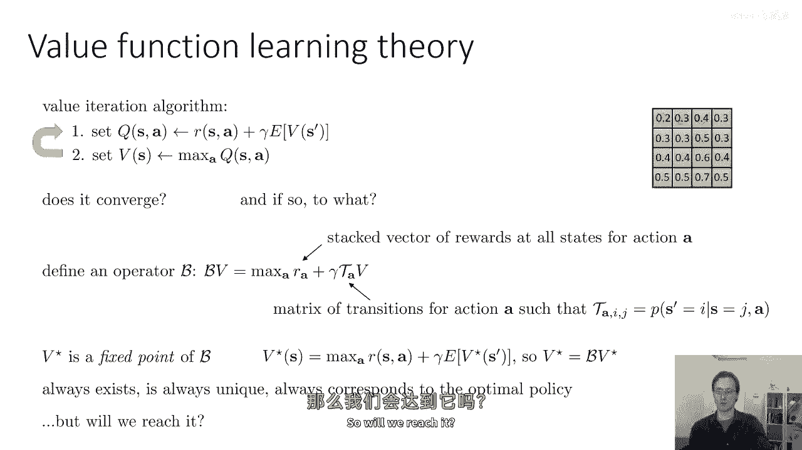
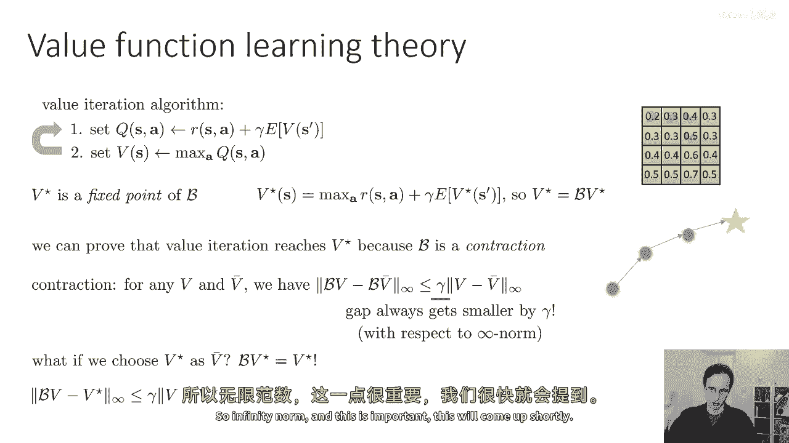
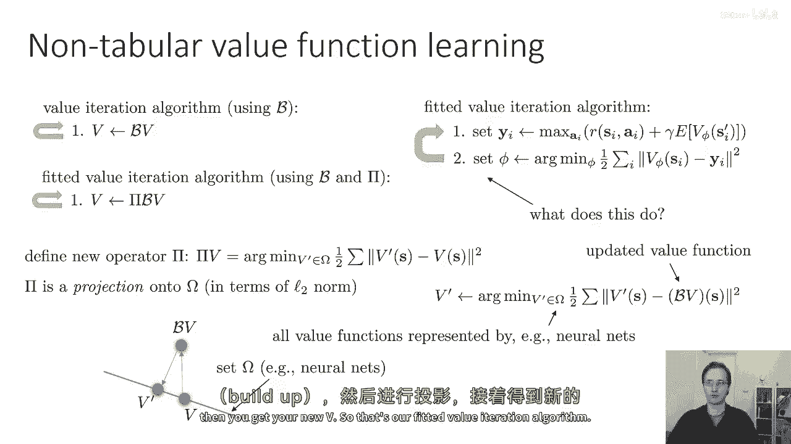
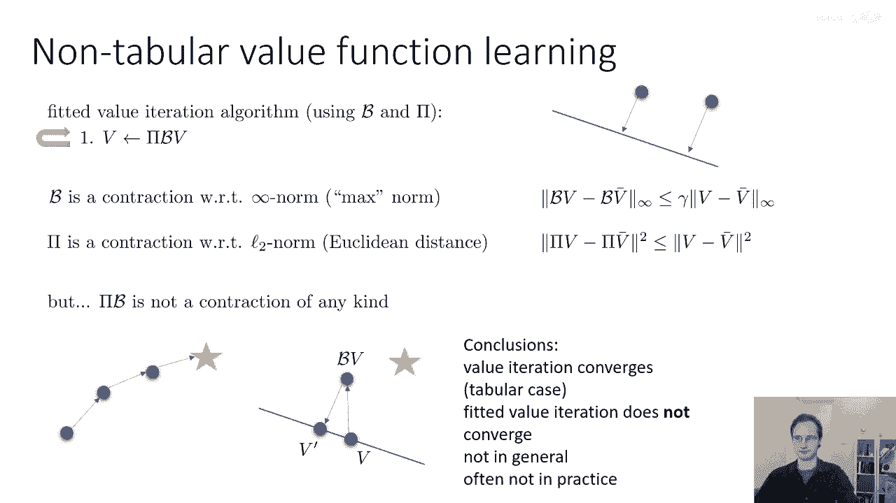
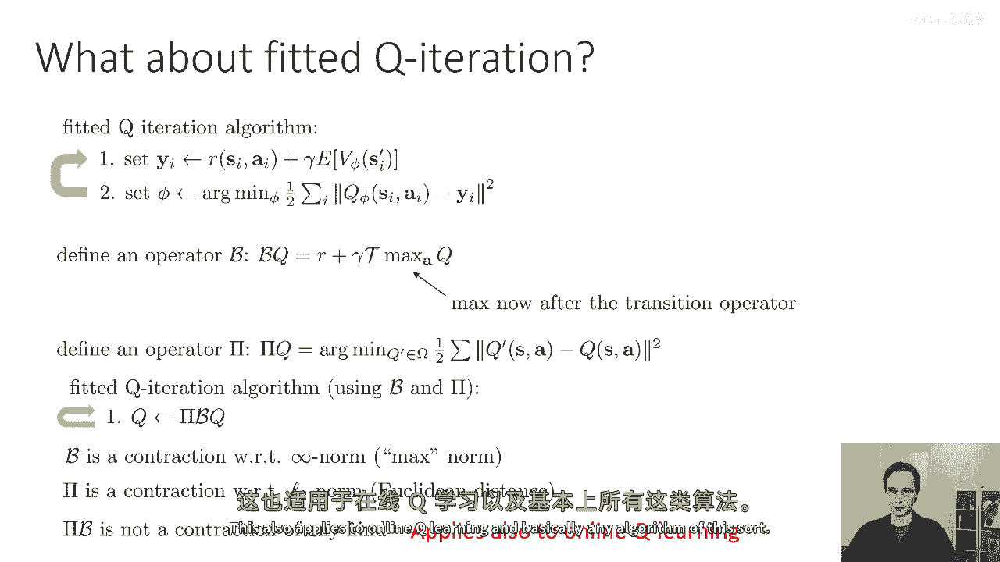
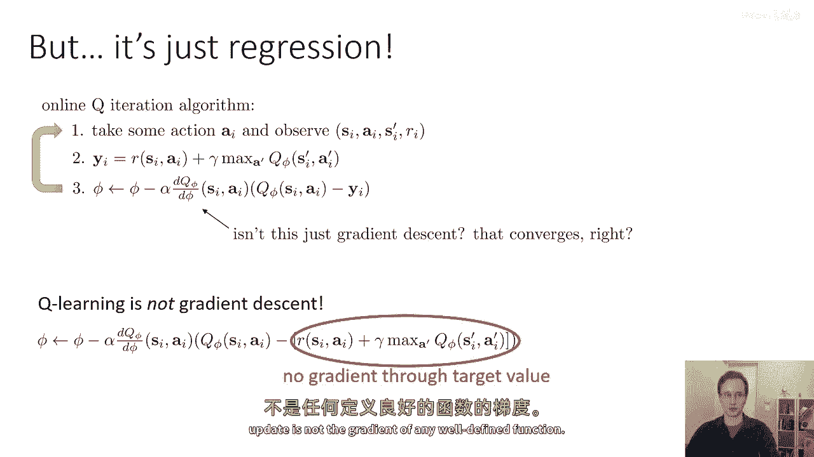
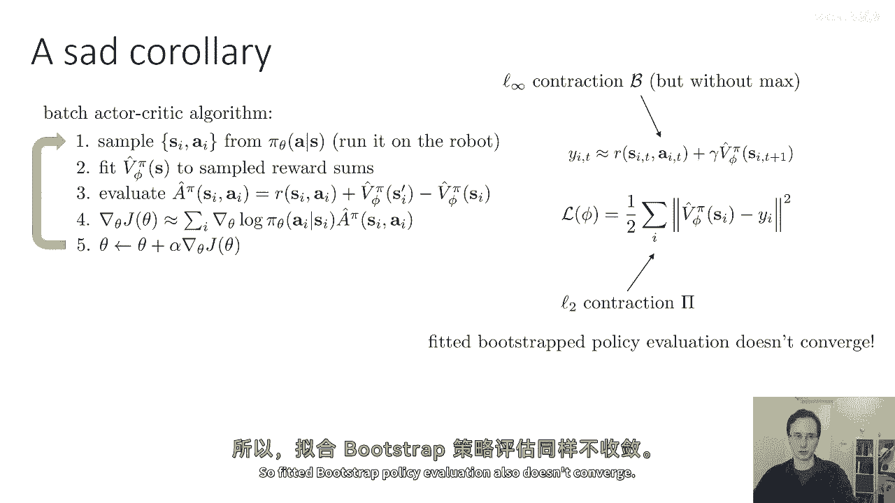
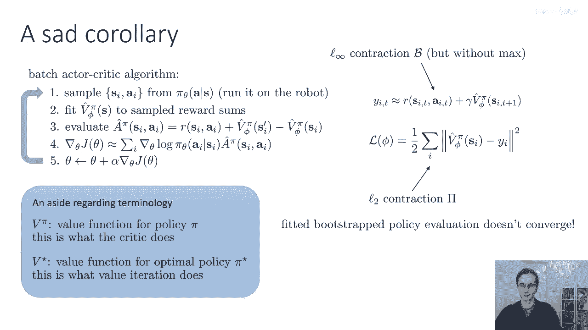
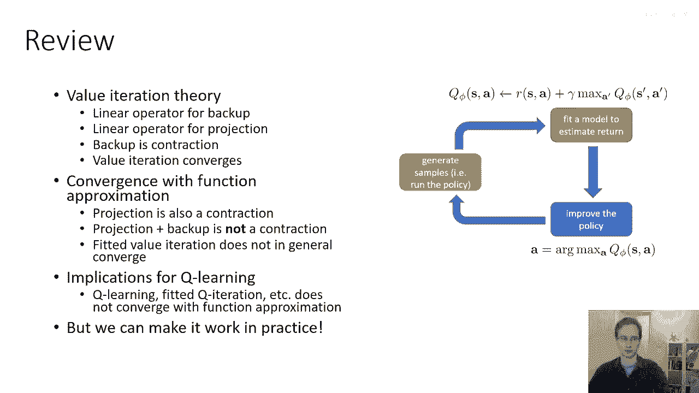

# 29：基于价值方法的收敛性理论 🧠

在本节课中，我们将学习基于价值方法的收敛性理论。我们将从表格型价值迭代的收敛性开始分析，然后探讨当引入函数逼近（如神经网络）时，算法为何可能不再收敛。理解这些理论背景，有助于我们认识不同强化学习算法的局限与潜力。

## 价值迭代与贝尔曼算子 🔄

上一节我们介绍了基于价值方法的基本思想。本节中，我们来看看其核心算法——价值迭代，并引入一个重要的数学工具：贝尔曼算子。

价值迭代算法可以看作包含两个步骤：
1.  构建Q值表：`Q(s, a) = R(s, a) + γ * E[V(s')]`
2.  更新价值函数：`V(s) = max_a Q(s, a)`

我们可以定义一个贝尔曼算子 **B**，它将一个价值函数向量 **V** 映射为另一个向量 **B V**。其数学定义为：
**B V = max_a [ R_a + γ * T_a * V ]**
其中，**R_a** 是执行动作a的奖励向量，**T_a** 是动作a对应的状态转移概率矩阵。

最优价值函数 **V*** 是贝尔曼算子的一个不动点，即满足 **V* = B V***。这意味着，如果我们能找到这个不动点，就能从中恢复出最优策略。

## 表格型价值迭代的收敛性 ✅

我们已经知道最优价值函数是贝尔曼算子的不动点。接下来的问题是，反复应用算子 **B** 能否找到这个不动点？答案是肯定的，因为贝尔曼算子 **B** 在无穷范数（L∞ norm）下是一个收缩映射。

收缩映射意味着，对于任意两个价值函数向量 **V** 和 **V‘**，应用算子后它们的距离会缩小：
**||B V - B V‘||_∞ ≤ γ * ||V - V‘||_∞**
其中 **γ** 是折扣因子（0 ≤ γ < 1）。

由于 **V*** 是不动点（即 **B V* = V***），将 **V‘** 替换为 **V*** 可得：
**||B V - V*||_∞ ≤ γ * ||V - V*||_∞**
这表明，每进行一次价值迭代更新，我们的价值函数估计都会以系数 **γ** 的比例更接近最优价值函数。因此，表格型价值迭代算法保证收敛到最优解。

## 拟合价值迭代与投影算子 📉

上一节我们介绍了表格型算法的理想收敛性。本节中我们来看看当使用函数逼近（如神经网络）来参数化价值函数时，情况会发生什么变化。这对应着拟合价值迭代算法。

拟合价值迭代也可分为两步：
1.  生成目标值：`y = B V` （贝尔曼备份）
2.  监督学习：`V‘ = argmin_φ Σ ||V_φ(s) - y||²` （投影到假设空间）

第二步可以看作一个投影算子 **Π**，它在L2范数下将向量投影到由神经网络参数所定义的函数集合 **Ω** 上。投影算子 **Π** 在L2范数下也是一个收缩映射。

因此，完整的拟合价值迭代算法可以简洁地写为：**V ← Π B V**。
即先进行贝尔曼备份，再将结果投影回假设空间。

## 为何拟合价值迭代可能不收敛 ❌

我们知道了 **B** 在L∞范数下收缩，**Π** 在L2范数下收缩。一个自然的想法是，它们的组合 **Π B** 也应该收缩。但遗憾的是，**Π B** 在任何范数下都不一定是收缩算子。

这是因为两个算子收缩所依据的范数不同。以下是一个直观解释：
*   从当前价值函数 **V** 开始。
*   **B V** 会在L∞范数意义下使其更接近最优值 **V***。
*   但 **Π (B V)** 将其投影回假设空间 **Ω** 时，依据的是L2范数。
*   这次投影可能导致投影后的点 **V‘** 反而比原来的 **V** 离 **V*** 更远。

这种现象并非理论上的特例，在实践中也可能发生。因此，拟合价值迭代（以及使用神经网络的Q学习）不能保证收敛到最优解，甚至不能保证收敛。

## 对Q学习与演员-评论家算法的影响 ⚠️

上述结论具有广泛的含义。它不仅适用于拟合价值迭代，也适用于我们之前讨论的其他算法。

以下是核心要点：
*   **拟合Q迭代**：其算法形式为 **Q ← Π B Q**，与拟合价值迭代面临相同的理论问题，即 **Π B** 不收缩，因此不保证收敛。
*   **Q学习不是梯度下降**：虽然Q学习的更新看起来像是在做回归（最小化当前Q值与目标Q值的误差），但目标值本身依赖于当前的Q值。算法并没有计算目标值对Q参数的梯度，因此它并非在优化一个定义良好的全局目标函数。这是它可能不收敛的根本原因。
*   **演员-评论家算法**：在策略评估（评论家更新）步骤中，同样涉及贝尔曼备份和函数逼近投影的组合。因此，基于价值函数近似的演员-评论家算法同样缺乏收敛性保证。

## 术语回顾与总结 📚

在本节课中，我们一起学习了基于价值方法的收敛性理论。让我们回顾一下关键点：

**重要术语**：
*   **V^π**：策略 **π** 的价值函数（评论家评估的对象）。
*   **V***：最优策略 **π*** 的价值函数（价值迭代寻找的目标）。

**核心结论**：
1.  表格型价值迭代中，贝尔曼算子 **B** 是收缩的，算法保证收敛到最优解。
2.  当使用函数逼近（如神经网络）时，我们引入了投影算子 **Π**。
3.  虽然 **B** 和 **Π** 各自是收缩的（但在不同范数下），它们的组合 **Π B** 却可能不是收缩的。
4.  因此，拟合价值迭代、拟合Q学习、以及使用神经网络近似的演员-评论家算法，在理论上都不保证收敛。

尽管这些理论结论看起来有些令人沮丧，但它们帮助我们深刻理解了算法行为的边界。在实践中，通过精心设计网络架构、采用目标网络、经验回放等技术，可以极大地改善这些算法的稳定性和性能。在接下来的课程中，我们将探索如何让这些算法在实际应用中良好工作。