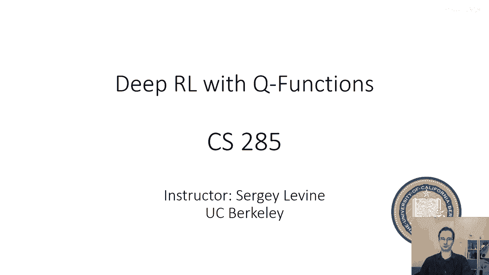
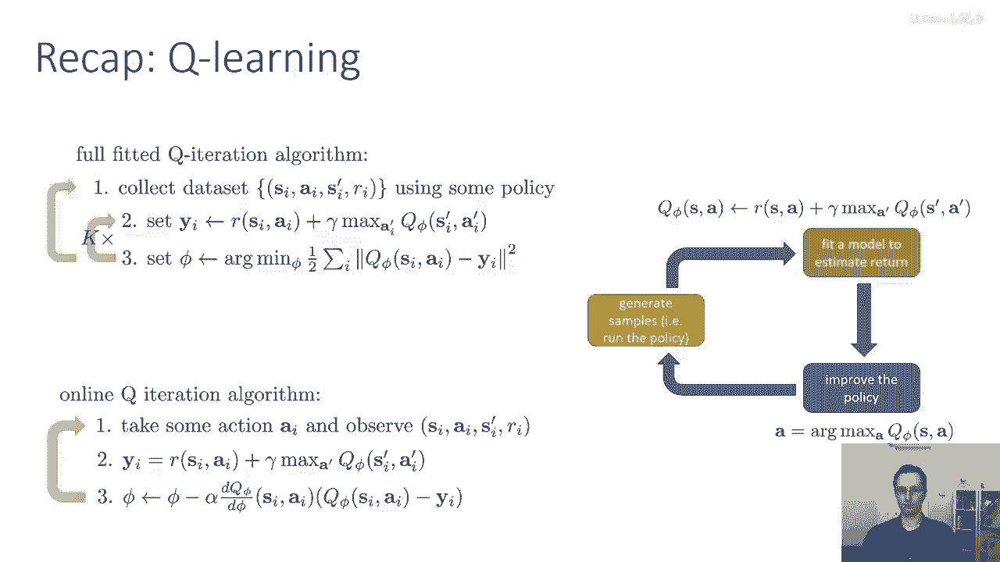
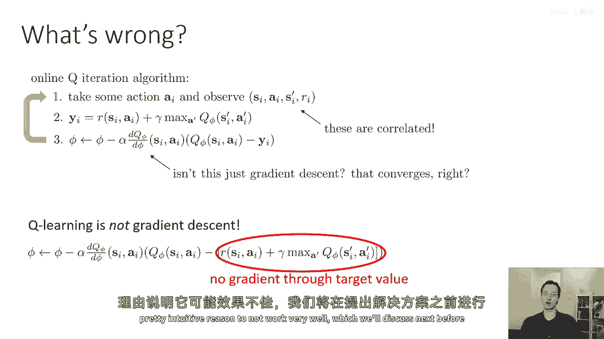
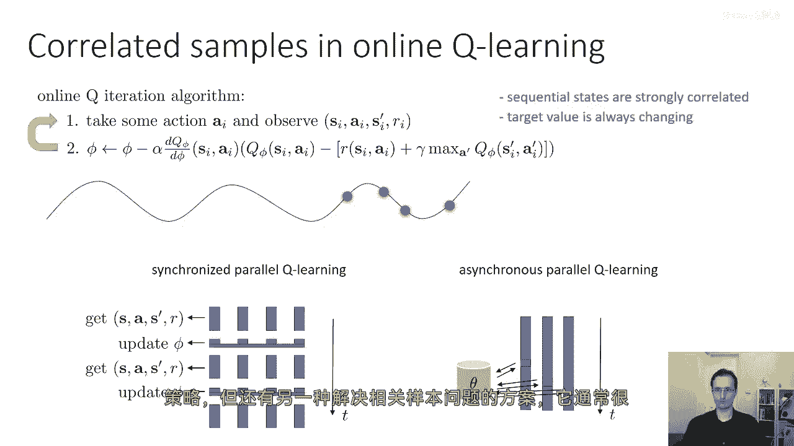
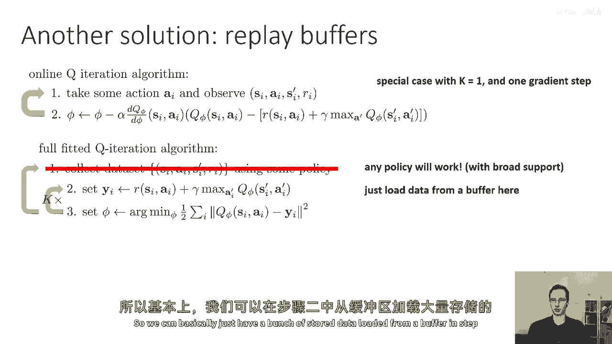
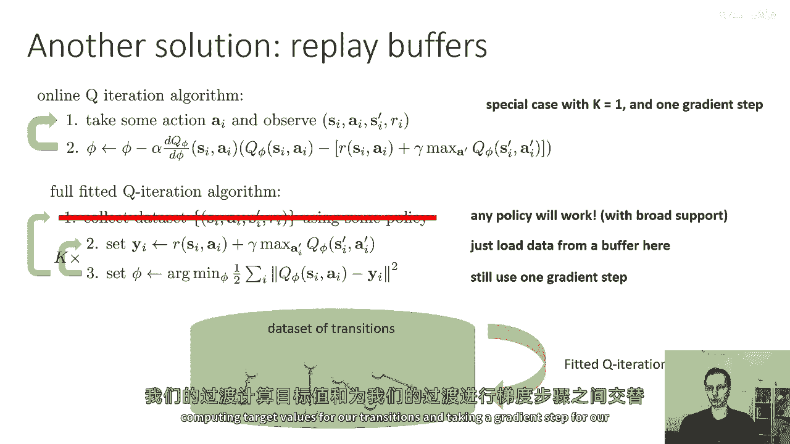
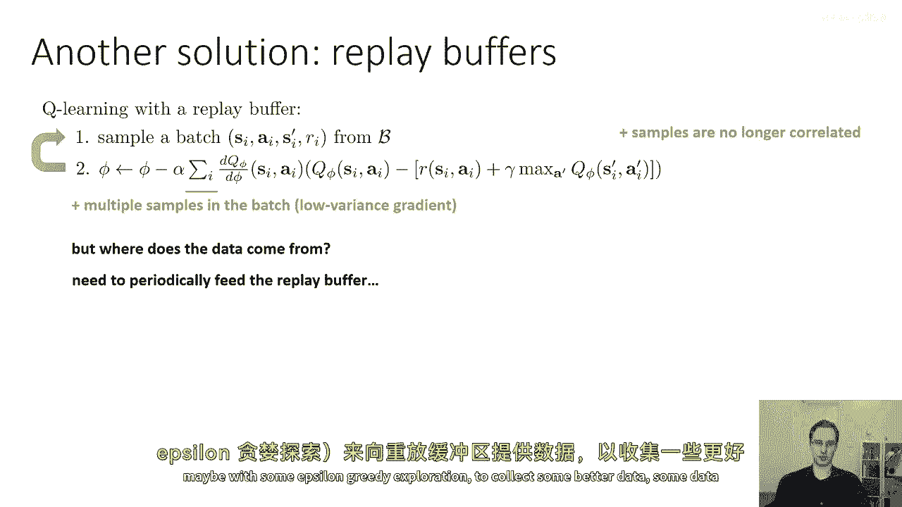
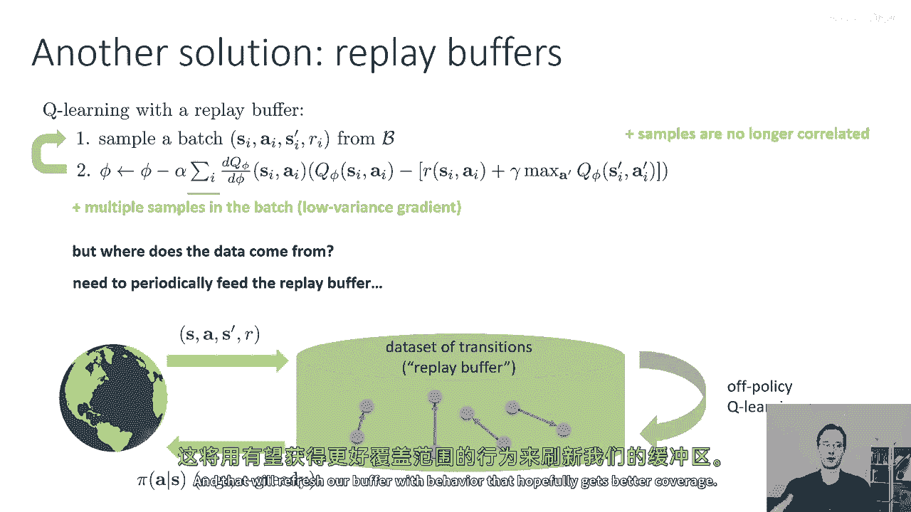
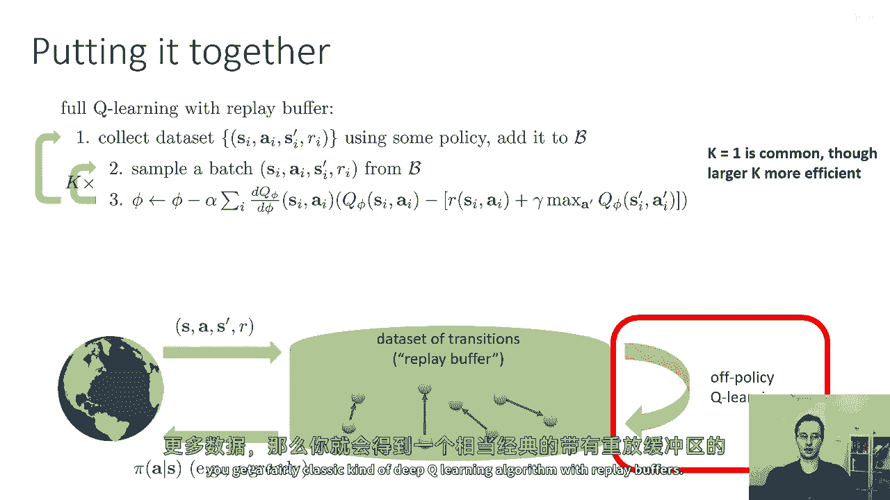
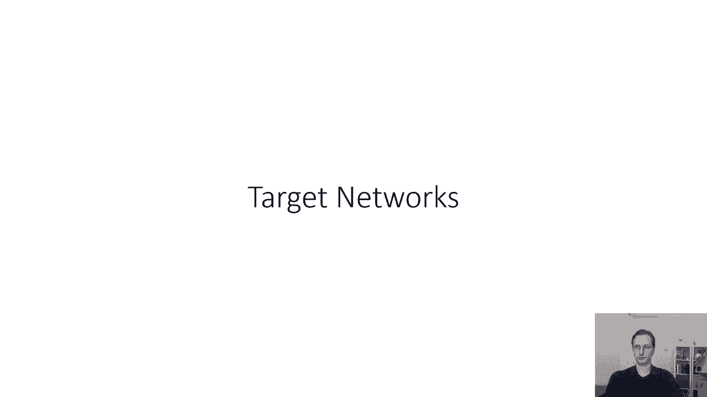

# 30：深度Q学习算法 🧠

在本节课中，我们将继续探讨价值驱动方法，并学习如何利用Q函数构建实用的深度强化学习算法。尽管基于价值的方法在理论上不一定保证收敛，但我们可以从中提取出强大且实用的算法。本节课将重点介绍拟合Q迭代算法、在线Q学习及其面临的挑战，并引入回放缓冲区这一关键技术来解决样本相关性问题。

---

## 回顾：拟合Q迭代算法 🔄

上一节我们介绍了价值驱动方法的基本框架。本节中，我们来看看一个具体的离线算法——拟合Q迭代算法。该算法无需知道状态转移概率，也无需显式表示策略。

以下是拟合Q迭代算法的三个基本步骤：

1.  **数据收集**：使用某种策略（可以是不同策略的混合，或包含探索机制如ε-贪婪、玻尔兹曼探索）收集一个包含状态转移的数据集。这是一个离线算法，可以聚合来自先前迭代的数据。
2.  **目标值计算**：对于数据集中的每一个转移元组 `(s_i, a_i, s_i‘, r_i)`，计算目标值 `y_i`。其公式为：
    `y_i = r_i + γ * max_{a‘} Q_φ(s_i‘, a‘)`
    这里的最大值操作隐式地计算了一个贪婪策略，并使用当前的Q函数 `Q_φ` 来评估其价值，这使得算法能够进行离策略学习。
3.  **函数拟合**：更新由参数 `φ` 参数化的Q函数近似器。通过最小化 `Q_φ(s_i, a_i)` 与目标值 `y_i` 之间的差异来优化参数 `φ`。公式表示为：
    `φ ← argmin_φ Σ_i (Q_φ(s_i, a_i) - y_i)^2`

步骤2和步骤3通常会在收集更多新数据之前重复多次。这个通用框架允许我们做出多种选择，例如每次收集多少数据、进行多少梯度步以及如何交替进行数据收集和参数更新。

---

## 在线Q学习：一个特例 ⚡

如果我们对拟合Q迭代算法进行特定设置——每次只收集一个转移样本、只进行一次梯度更新，并且在收集新数据前只执行一轮步骤2和3——我们就得到了**在线Q学习算法**（通常简称为Q学习）。

其步骤如下：

1.  执行一个动作 `a_i`，观察产生的转移 `(s_i, a_i, s_i‘, r_i)`。
2.  计算该转移的目标值 `y_i`。
3.  在Q函数输出与目标值 `y_i` 的差异上执行一次梯度下降步。

这个算法符合强化学习的通用模式：与环境交互（橙色部分）、价值函数拟合（绿色部分），而策略改进（蓝色部分）则退化为简单地选择使Q值最大的动作。

---

## Q学习面临的问题与挑战 ⚠️

然而，上述通用流程存在一些问题。

首先，步骤3中的更新看似是梯度下降，但实际上**Q学习并不是真正的梯度下降**。因为目标值 `y_i` 的公式中，`Q_φ` 出现在两个地方，但在第二项（`max Q_φ`）中并没有被求梯度。如果我们正确地应用链式法则，会得到一类名为“残差梯度”的算法，但这些算法在实践中往往因严重的数值条件问题而效果不佳。

其次，**序列样本高度相关**。在线Q学习一次处理一个转移，导致在时间步 `t` 和 `t+1` 看到的状态非常相似。对这种高度相关的样本序列进行梯度更新，违反了随机梯度方法通常要求的独立同分布假设，可能导致训练不稳定和效率低下。直观上，这会导致模型在局部“过拟合”最近看到的一小段轨迹，而无法学到全局准确的Q函数。

---

## 解决方案：并行化与回放缓冲区 🛠️

我们可以借鉴之前演员-评论员算法中的思想来解决样本相关性问题。

一种方案是**并行化**：使用多个工作者并行收集不同轨迹上的转移样本，然后汇总成批进行更新。这可以缓解相关性，因为批内的样本来自不同的轨迹。甚至可以异步进行，工作者无需严格同步。

然而，更常用且简单有效的方法是使用**回放缓冲区**。这个想法在90年代就被引入强化学习。

回放缓冲区是一个存储历史转移 `(s, a, s‘, r)` 的数据集。在训练时，我们不再直接使用最新收集的连续样本，而是从缓冲区中**均匀随机采样**一个批量的转移数据。这样做有两个关键好处：
1.  打破了连续样本之间的相关性，满足了随机梯度下降的假设。
2.  通过批量计算，降低了梯度估计的方差。

那么数据从何而来呢？我们需要定期用最新的策略（例如，带有ε-贪婪探索的贪婪策略）与环境交互，并将收集到的新转移数据加入到回放缓冲区中。这样可以不断用更有趣、覆盖更广的数据来刷新缓冲区。

---

## 完整的深度Q学习算法流程 🧩

将以上所有部分结合起来，我们可以得到结合了回放缓冲区的完整Q学习算法流程：

1.  **数据收集与填充缓冲区**：使用某种策略（初始可为随机策略，后续可采用ε-贪婪策略）收集转移数据，并将其添加到回放缓冲区 `B` 中。
2.  **从缓冲区采样**：从缓冲区 `B` 中随机采样一个小批量的转移数据。
3.  **计算目标与更新**：
    *   对批量中的每个样本计算目标值：`y_i = r_i + γ * max_{a‘} Q_φ(s_i‘, a‘)`
    *   执行一次梯度下降步，最小化损失：`L(φ) = Σ_{i∈batch} (Q_φ(s_i, a_i) - y_i)^2`
4.  **重复**：重复步骤2和步骤3多次（例如K次），然后再回到步骤1收集更多新数据。

通过从大型缓冲区中随机采样，我们获得了不相关、低方差的样本。通过定期用新策略收集数据，我们确保了缓冲区能覆盖状态-动作空间中有意义的区域。

---

## 总结 📚

本节课中，我们一起学习了：
1.  回顾了**拟合Q迭代算法**的离线学习框架。
2.  了解了**在线Q学习**是其一个特例，并认识到它面临**非梯度更新**和**样本相关性**两大问题。
3.  引入了**回放缓冲区**这一关键技术，通过存储历史经验并随机采样，有效解决了样本相关性问题，使得深度Q学习训练更加稳定和高效。
4.  最终整合出使用回放缓冲区的**完整深度Q学习算法流程**，为实际应用奠定了坚实基础。

下一节，我们将继续探讨深度Q学习算法在实际中遇到的其他挑战及其改进方案。