# 31：深度强化学习中的目标网络 🎯

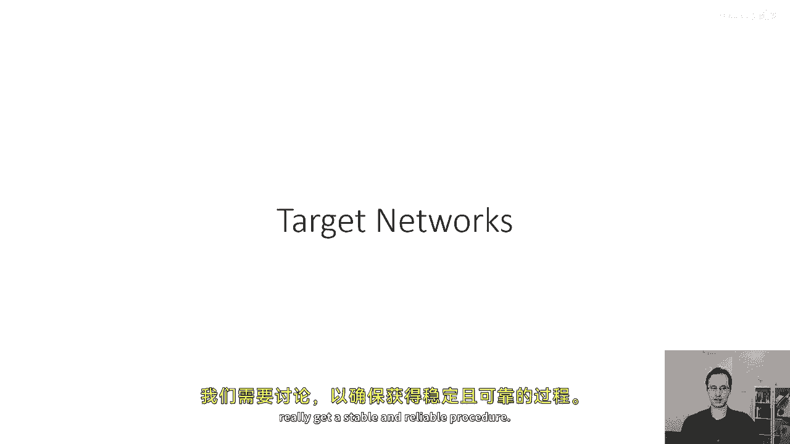

在本节课中，我们将学习如何通过引入**目标网络**来解决深度Q学习中的“移动目标”问题，从而构建一个稳定可靠的深度Q学习算法。我们将从回顾现有问题开始，逐步推导出经典的DQN算法，并探讨目标网络的不同更新策略。

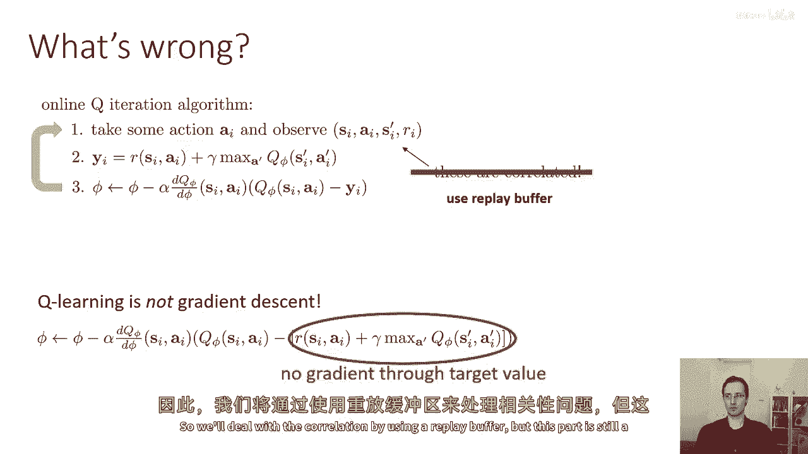

---

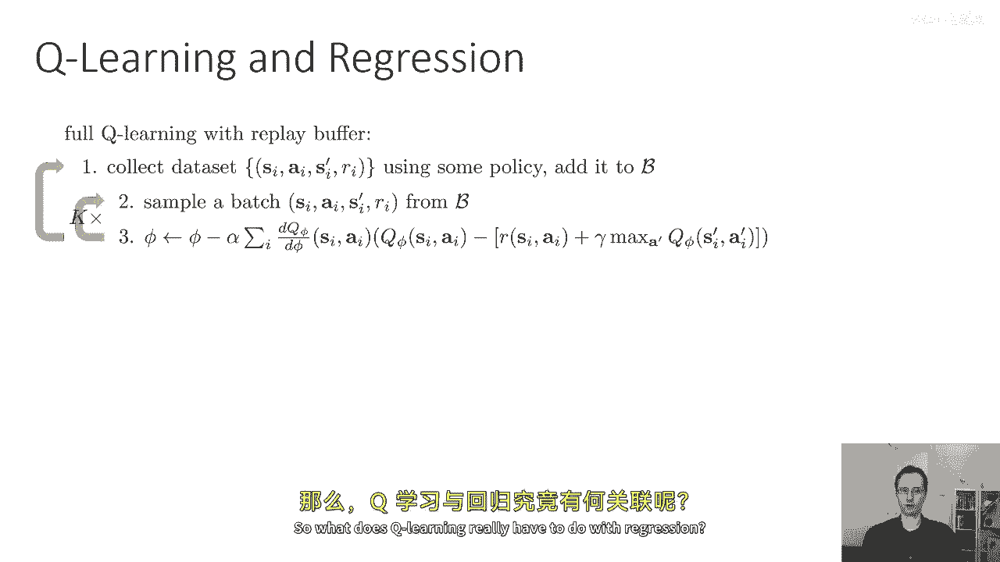

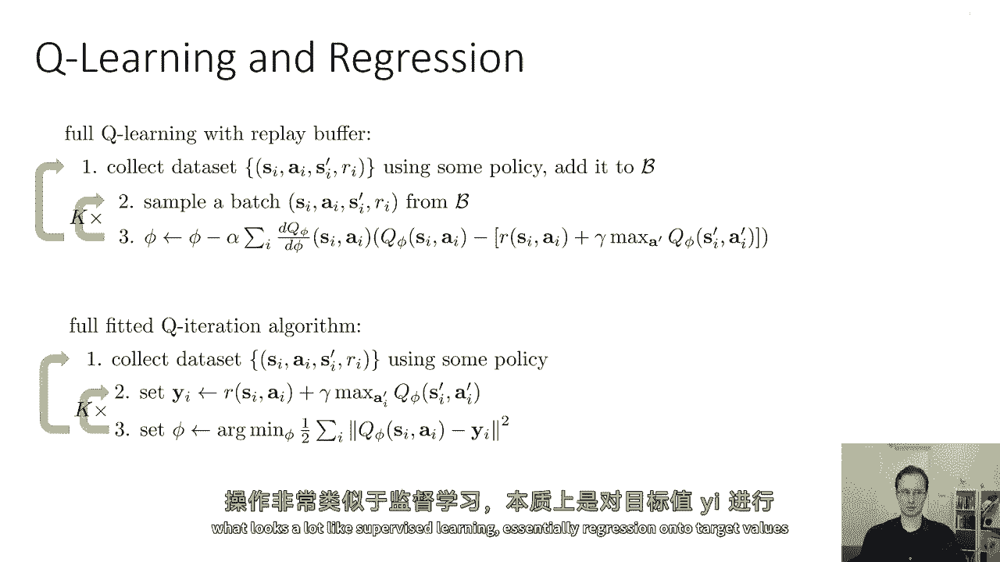

## 概述：从问题到解决方案

上一节我们介绍了使用**经验回放缓冲器**来解决样本相关性问题。本节中，我们来看看另一个关键挑战：Q学习的目标值会随着Q函数自身的更新而不断变化，这就像试图击中一个移动的靶子，使得学习过程难以收敛。我们将通过引入一个独立的**目标网络**来稳定训练目标。

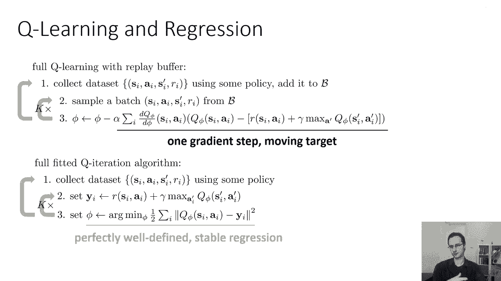

---

## 移动目标问题与监督回归

Q学习本质上可以看作是一个回归问题，其目标是使Q函数的预测值逼近一个目标值 `y_i`。在拟合Q迭代算法中，步骤三执行的就是这种监督学习式的回归。然而，问题在于这个回归目标 `y_i` 本身依赖于我们正在更新的Q函数参数，因此目标会“移动”。

如果我们在一个错误的目标上训练到收敛，结果并不会好。因此，在实践中，我们通常只对每个目标执行少量（甚至一步）梯度更新，但这依然无法完全解决目标移动带来的不稳定性。

---

## 解决方案：经验回放与目标网络

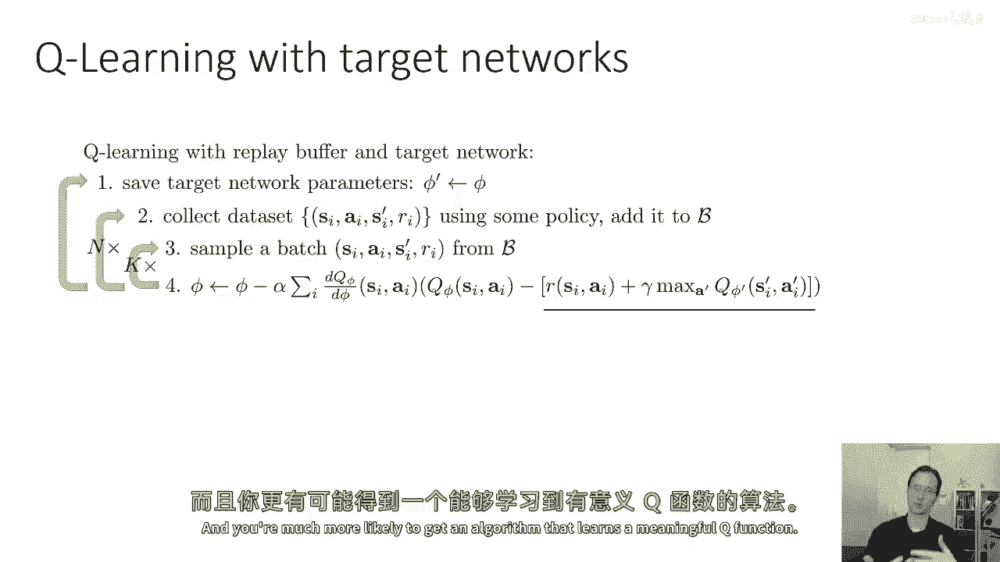

为了在“全拟合Q迭代”的稳定性和“在线Q学习”的效率之间取得平衡，我们结合使用**经验回放缓冲器**和**目标网络**。

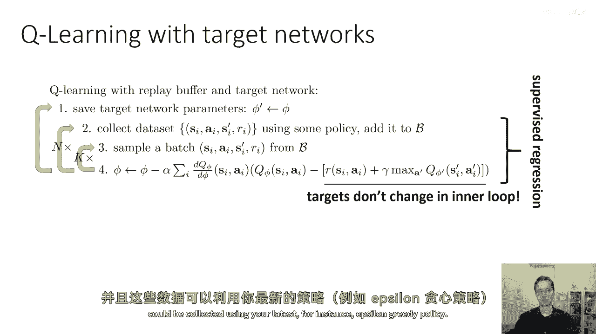

以下是结合了这两种技术的通用算法框架：

1.  **初始化**：随机初始化当前Q网络参数 `φ` 和目标Q网络参数 `φ'`。
2.  **数据收集**：使用某种策略（如ε-greedy策略）与环境交互，将收集到的转移样本 `(s, a, s', r)` 存入回放缓冲器 `D`。
3.  **内部更新循环**（重复k次）：
    *   从缓冲器 `D` 中采样一个小批量的转移样本。
    *   使用**目标网络** `Q_{φ'}` 计算目标值：`y = r + γ * max_{a'} Q_{φ'}(s', a')`。
    *   通过最小化当前网络 `Q_φ` 的预测值与目标值 `y` 之间的均方误差，来更新参数 `φ`。
4.  **外部更新循环**：每收集N步新数据后，更新目标网络参数 `φ'`，通常将其设置为当前网络参数 `φ`（即 `φ' ← φ`）。

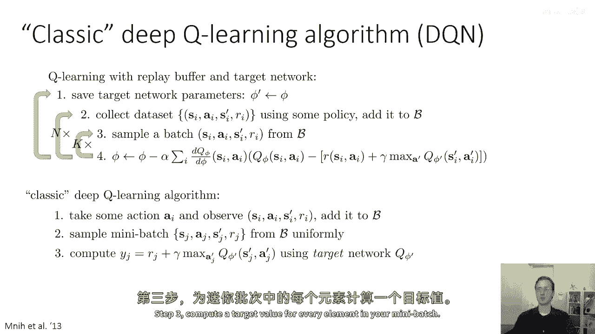

**核心思想**：在内部循环的k次更新中，目标网络 `φ'` 保持不变。这意味着我们是在对一个**固定的目标**进行监督回归，从而大大提高了学习的稳定性。参数 `k` 通常较小（1-4），而 `N` 较大（约10000），以确保目标不会变化得太频繁。

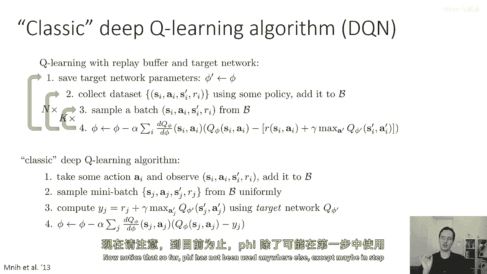

---

## 经典深度Q网络算法

基于上述通用框架，并设置 `k = 1`，我们可以得到经典的**深度Q网络**算法：

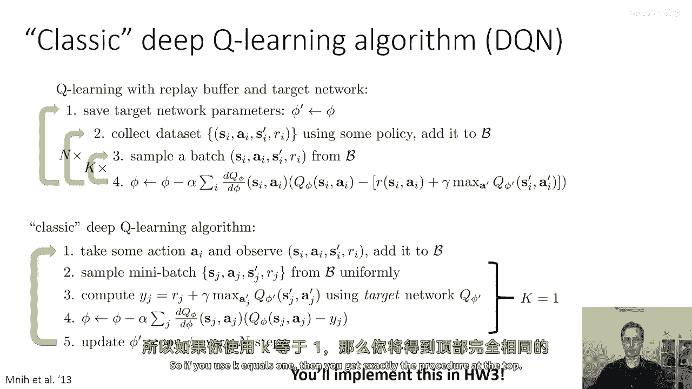

以下是DQN算法的具体步骤：

1.  **执行动作**：根据当前策略（如基于 `Q_φ` 的ε-greedy策略）选择动作 `a_t`，执行并观察到转移 `(s_t, a_t, s_{t+1}, r_t)`，将其存入回放缓冲器 `D`。
2.  **采样批次**：从 `D` 中均匀随机采样一个小批量的转移样本。
3.  **计算目标**：对批次中的每个样本，使用**目标网络**计算目标值：`y_j = r_j + γ * max_{a'} Q_{φ'}(s'_j, a')`。
4.  **梯度更新**：通过梯度下降最小化损失函数 `L(φ) = Σ_j (Q_φ(s_j, a_j) - y_j)^2`，更新当前网络参数 `φ`。
5.  **软更新目标网络**（每隔C步）：更新目标网络参数，`φ' ← τφ + (1-τ)φ'`。其中 `τ` 是一个很小的值（如0.001）。

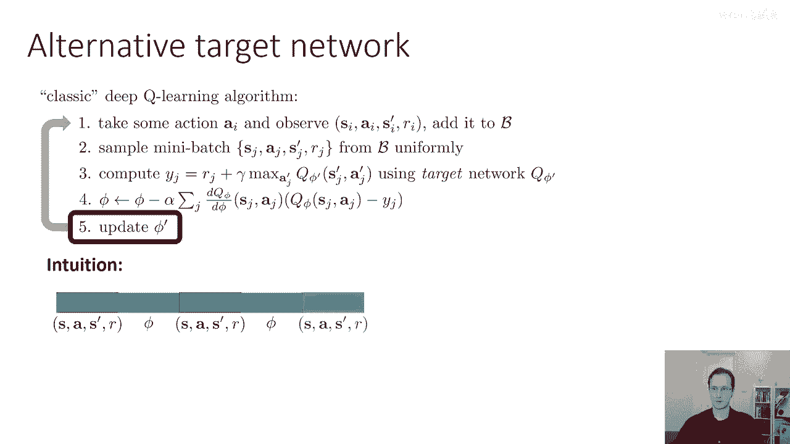

请注意，步骤5采用了**软更新**方式，这是对原始算法（硬更新 `φ' ← φ`）的一种改进，它让目标网络参数缓慢跟踪当前网络，进一步平滑了目标值的变化。

---

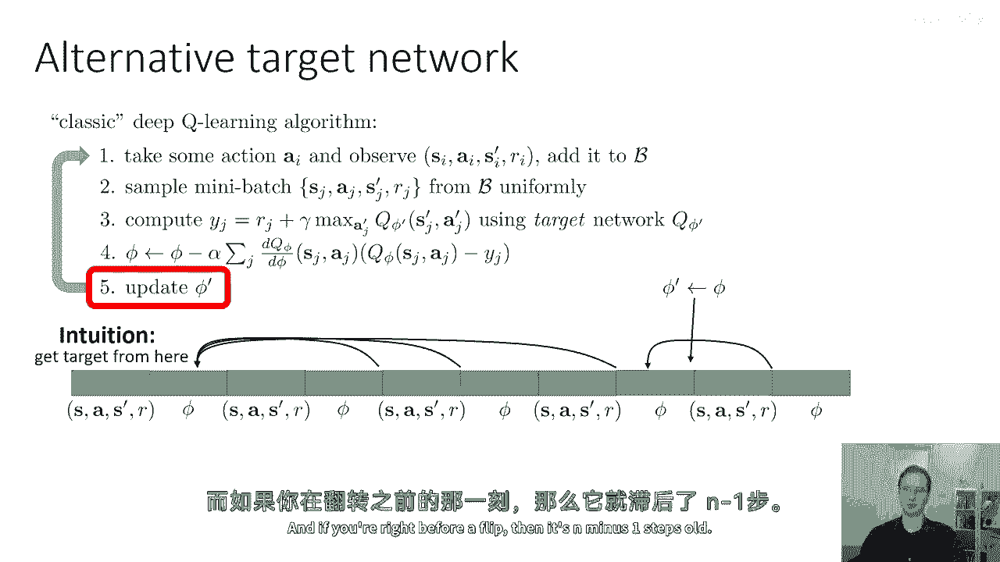

## 目标网络的更新策略

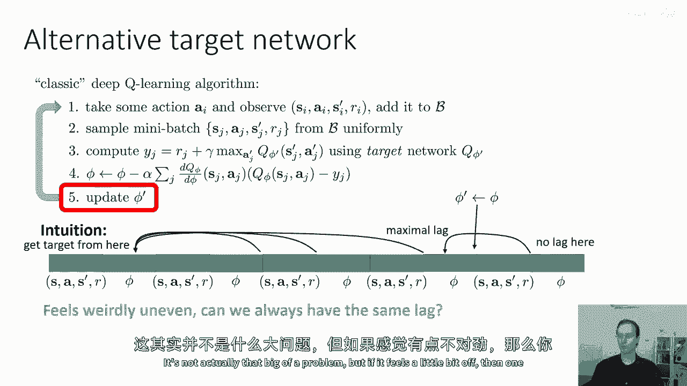

原始算法中周期性的硬更新（`φ' ← φ`）会导致目标网络的信息在不同时间点滞后程度不同，可能在某些时刻目标移动过快。

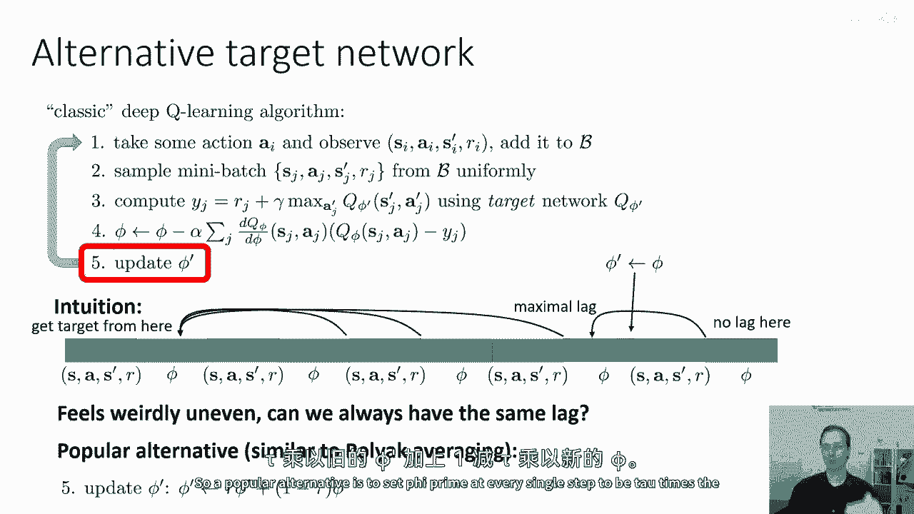

一种更平滑、更常用的方法是**软更新**，其公式为：
`φ' ← τ * φ + (1 - τ) * φ'`
其中 `τ` 是一个接近0的很小的数（例如0.001）。

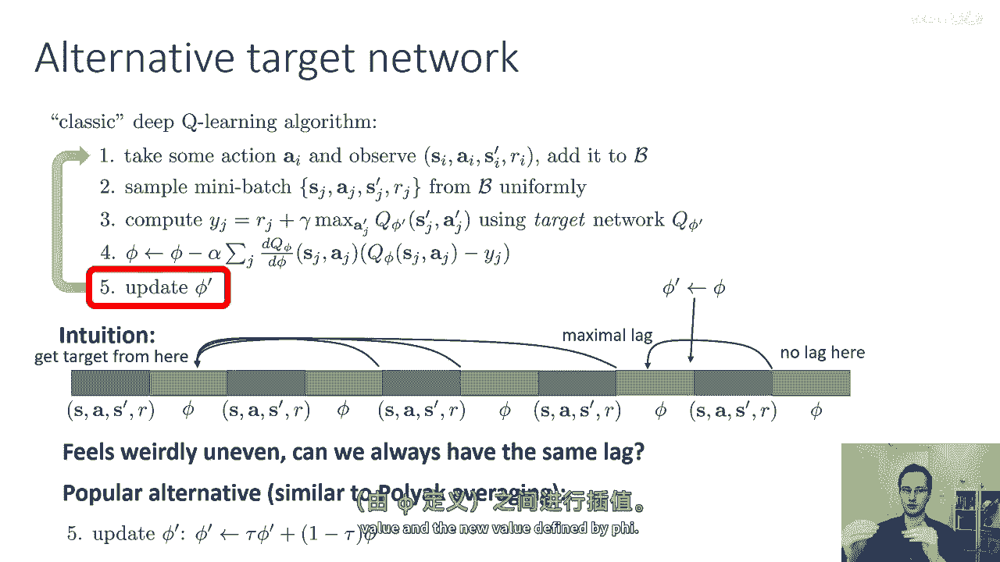

**直观理解**：每一步，目标网络的参数 `φ'` 都会向当前网络参数 `φ` 靠近一小步（`τ` 部分），同时保留其大部分旧值（`1-τ` 部分）。这相当于对网络参数进行**指数移动平均**，能产生更稳定、变化更缓慢的目标值。

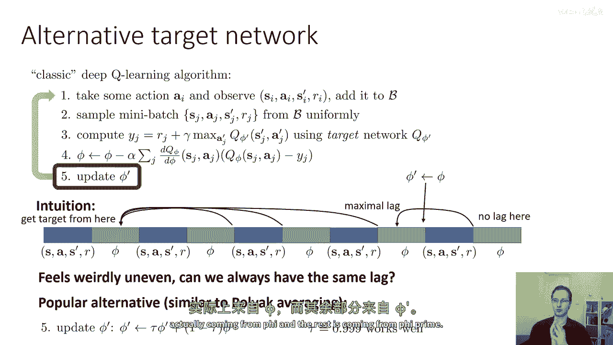

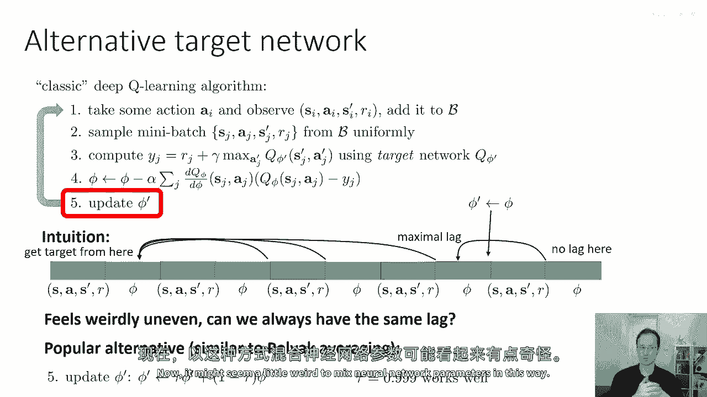

尽管对非线性神经网络的参数进行线性插值在理论上可能显得奇怪，但由于 `φ'` 始终与 `φ` 保持相似，且更新幅度极小，这种方法在实践中被证明非常有效且稳定。

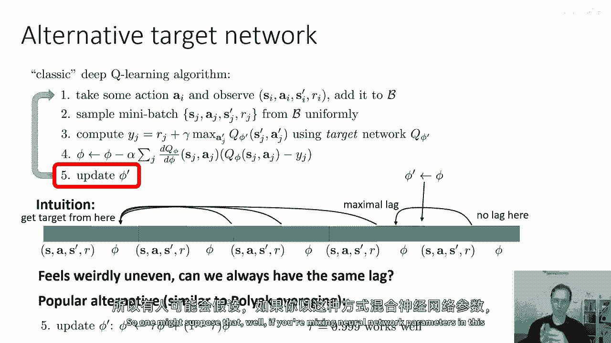

---

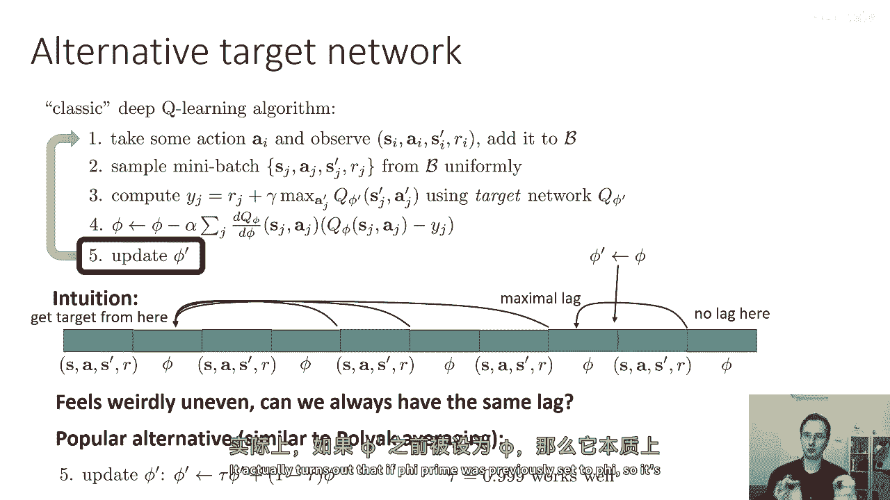

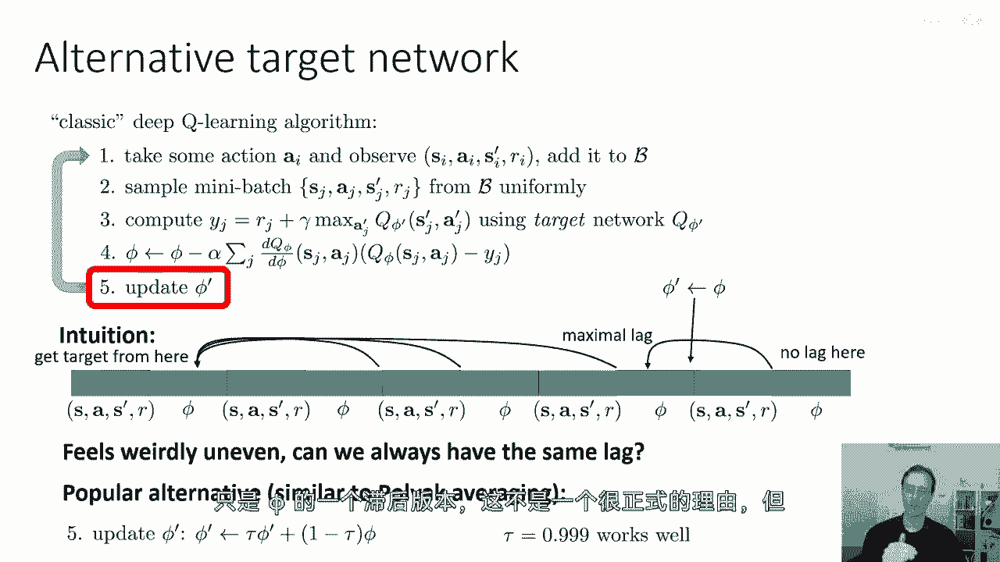

## 总结

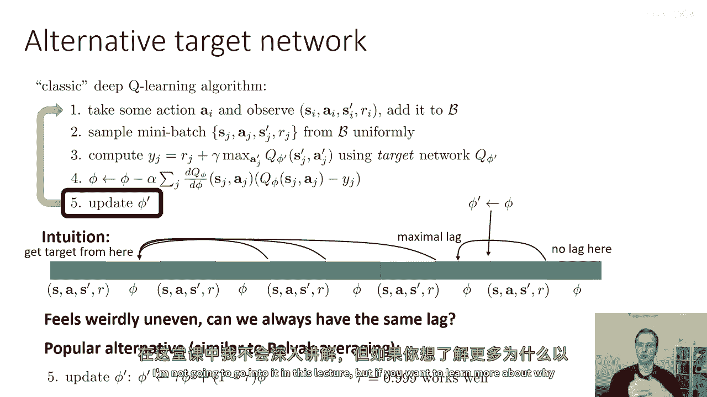

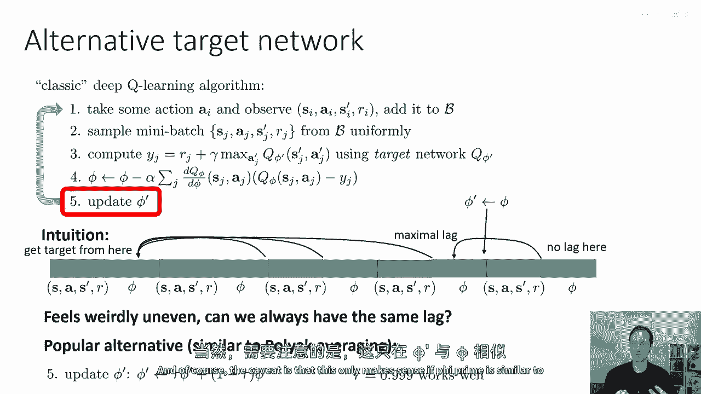

本节课中我们一起学习了构建稳定深度Q学习算法的关键组件——**目标网络**。

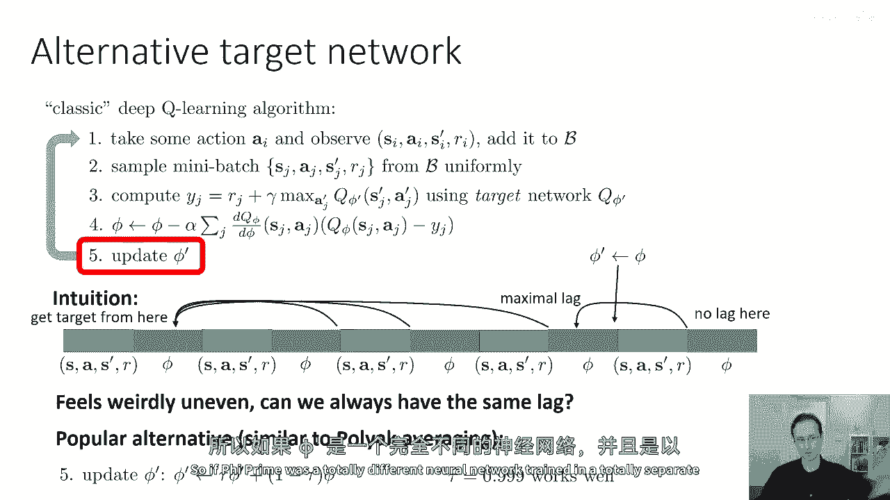

*   我们首先明确了**移动目标问题**是导致Q学习不稳定的核心原因。
*   接着，我们提出了结合**经验回放**和**目标网络**的通用框架，通过在内部循环中使用固定的目标网络进行监督式回归，来稳定训练过程。
*   然后，我们推导出了经典的**DQN算法**，它是该框架在 `k=1` 时的特例。
*   最后，我们比较了目标网络的**硬更新**与**软更新**策略，并解释了软更新（指数移动平均）如何能提供更平滑、更稳定的学习目标。

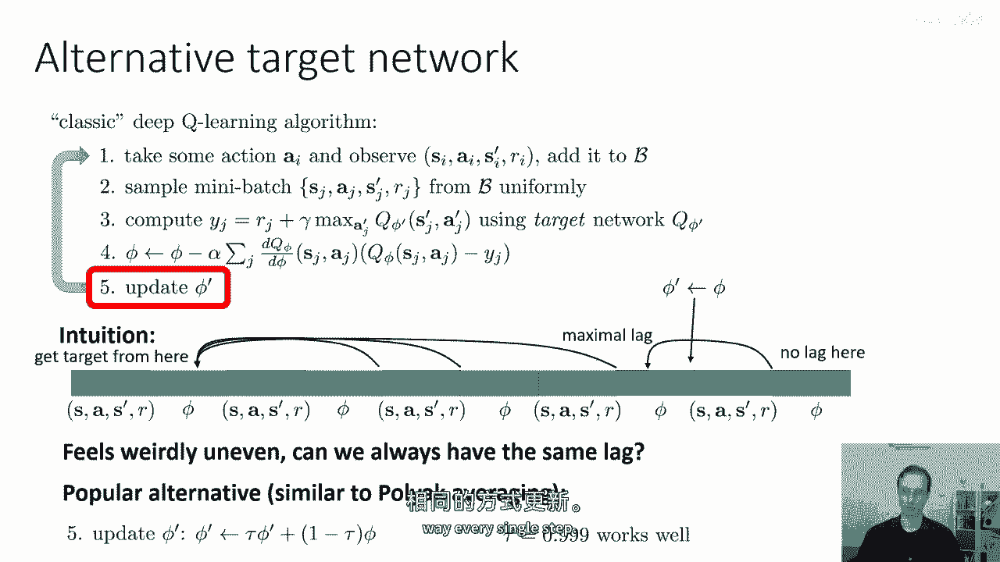

通过引入目标网络，我们有效地“冻结”了短时间内的学习目标，使深度Q学习算法具备了在实际复杂环境中稳定收敛的能力。