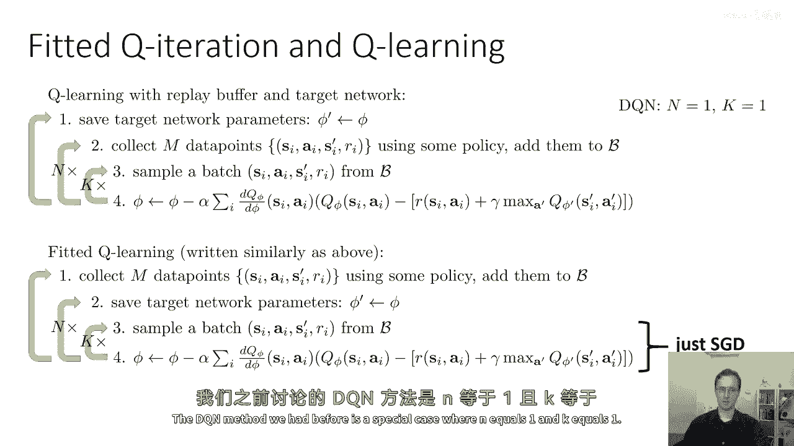
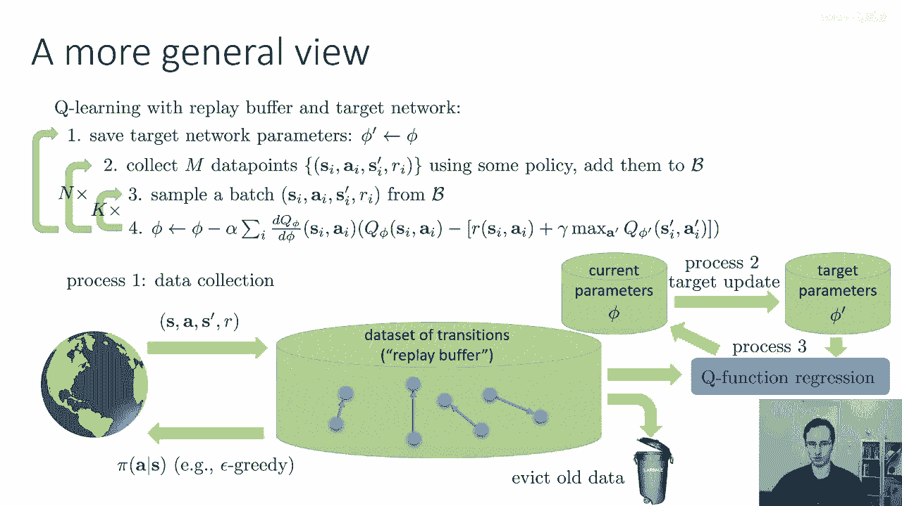
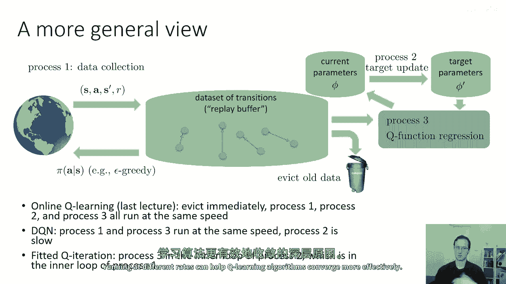

# 32：Q学习算法的统一视角 🧠

在本节课中，我们将学习如何将之前讨论过的多种Q学习算法（如在线Q学习、深度Q网络DQN和拟合Q迭代）统一到一个通用的概念框架中。这个视角有助于我们理解这些看似不同的算法如何共享相同的核心结构，只是在不同“过程”的运行速度上做出了不同的选择。

## 概述：从不同算法到统一框架

上一节我们介绍了多种Q学习算法的具体实现。本节中我们来看看如何将这些算法统一到一个更一般的并行框架中。这个框架将数据收集、参数更新和目标网络更新视为三个可以不同速率运行的独立过程。

## 统一框架的核心：三个并行过程

以下是理解统一Q学习框架的核心。我们可以将整个算法分解为三个主要过程和一个共享的数据结构。

*   **回放缓冲区**：这是一个存储环境转换 `(s, a, r, s')` 的数据结构。它通常是固定大小的，当满时，最旧的转换会被新的替换（环形缓冲区）。
*   **过程一：数据收集**
    *   此过程负责与环境交互。
    *   它使用最新的Q网络参数 `φ` 来构建策略（例如ε-贪婪策略）。
    *   它将收集到的每一步转换发送到回放缓冲区。
*   **过程二：目标参数更新**
    *   此过程负责更新用于计算目标Q值的网络参数 `φ'`。
    *   它通常运行得非常缓慢，例如定期将 `φ` 复制到 `φ'`，或使用滑动平均：`φ' ← τ φ' + (1-τ) φ`。
*   **过程三：主学习过程**
    *   此过程是算法的核心学习引擎。
    *   它从回放缓冲区采样一个批次的转换。
    *   它使用目标网络参数 `φ'` 计算每个转换的目标值 `y = r + γ * max_a‘ Q_φ‘(s‘, a‘)`。
    *   它执行梯度下降步骤，更新当前网络参数 `φ`，以最小化 `(Q_φ(s, a) - y)^2`。

这个框架的图形化表示如下，它涵盖了之前讨论的所有算法变体：

## 具体算法作为框架的特例

现在，让我们看看之前学过的具体算法如何成为这个通用框架的特例。关键在于三个过程（数据收集、目标更新、主学习）以何种速率运行。

### 在线Q学习（Watkins‘ Q-learning）

在线Q学习是这个框架的一个极端特例。
*   **回放缓冲区大小**：1（即每次收集新数据后立即覆盖旧数据）。
*   **过程运行速率**：过程一、过程二和过程三以完全相同的速率依次运行。
    1.  过程一收集一个转换 `(s, a, r, s‘)`。
    2.  过程二立即将 `φ` 复制到 `φ‘`（即目标值使用最新参数计算）。
    3.  过程三立即使用这个单一转换执行一次梯度更新。

### 深度Q网络（DQN）

DQN是更接近通用框架的典型实例。
*   **回放缓冲区大小**：很大（例如一百万次转换）。
*   **过程运行速率**：
    *   过程一（数据收集）和过程三（主学习）通常以相近的速率交替运行（例如，收集一步数据，执行一次梯度更新）。
    *   过程二（目标更新）运行得非常缓慢（例如，每10000次主学习更新才更新一次目标网络）。
*   由于缓冲区很大，过程一和过程三在很大程度上是解耦的，因为从缓冲区中采样到刚收集的数据的概率很低。

### 拟合Q迭代（Fitted Q-Iteration）

拟合Q迭代可以看作是强调“批量学习”的特例。
*   **过程运行速率**：
    *   过程一首先运行一段时间，收集一个完整的数据集并存入缓冲区。
    *   然后过程三运行很多次（甚至直到收敛），使用缓冲区中的所有（或大部分）数据反复更新 `φ`。
    *   最后，过程二运行一次，将更新后的 `φ` 复制到 `φ‘`。
    *   这个过程（收集数据 -> 内部循环更新 -> 更新目标）可能会重复多次。

## 为何采用不同速率：缓解非平稳性

这种将算法分解为不同速率过程的设计，核心目的是**缓解非平稳性问题**。

在强化学习中，我们试图学习的目标（最优Q值）本身依赖于我们正在学习的策略，这造成了非平稳性。在这个框架中：
*   如果过程二（目标更新）运行得比过程三（主学习）慢得多，那么对于过程三而言，目标网络 `φ‘` 几乎是静止的，这将其面临的问题转化为一个更稳定的监督回归问题。
*   同样，大的回放缓冲区混合了不同策略下收集的数据，减少了过程三所看到数据分布的剧烈变化。

通过调整这些过程的运行速率，我们可以在探索（收集新数据）、利用（改进当前策略）和稳定性（保持目标固定）之间进行权衡。下图展示了这三个过程如何相互作用：

## 总结与回顾

本节课中我们一起学习了如何用统一的并行过程视角来理解多种Q学习算法。我们了解到，无论是简单的在线Q学习、实用的DQN，还是批处理的拟合Q迭代，都可以被视为同一个通用框架的特例。这个框架的核心是三个以不同速率运行的独立过程：**数据收集**、**目标参数更新**和**主学习更新**，它们共同围绕一个**回放缓冲区**工作。不同的算法本质上是对这三个过程的运行频率和缓冲区大小做出了不同的设计选择。理解这个统一视角有助于我们更深刻地把握Q学习家族算法的内在联系，并为设计和调整自己的强化学习算法提供了清晰的思路。