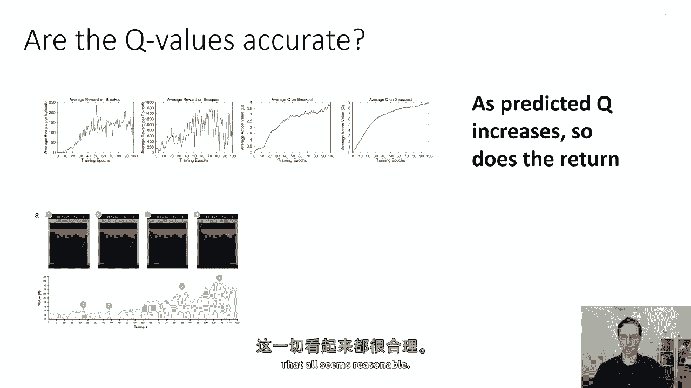
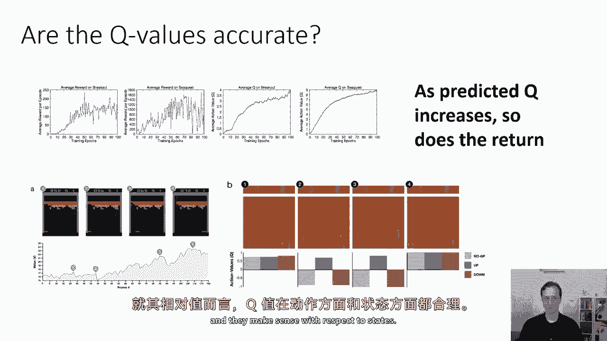
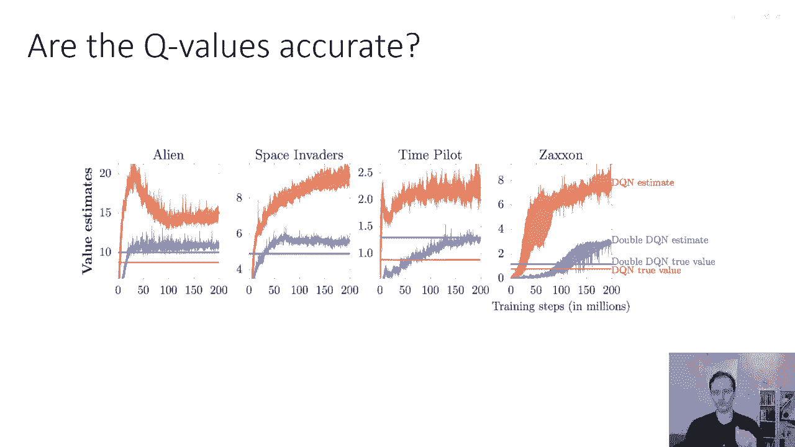
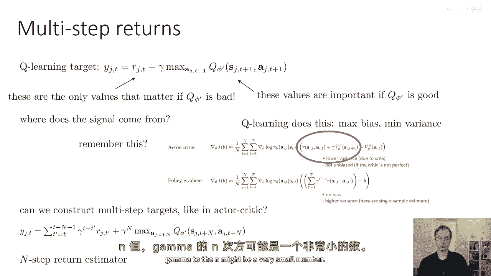
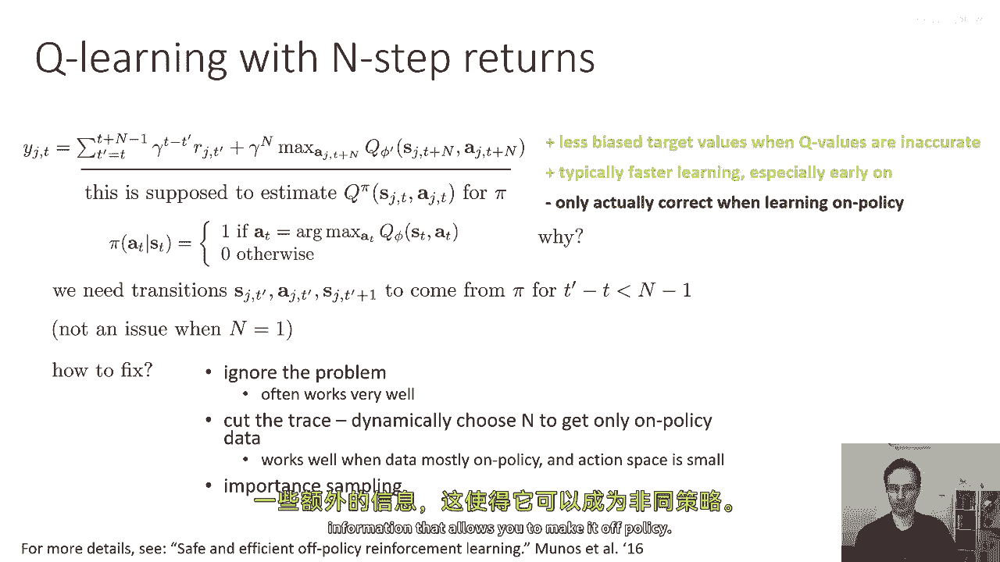
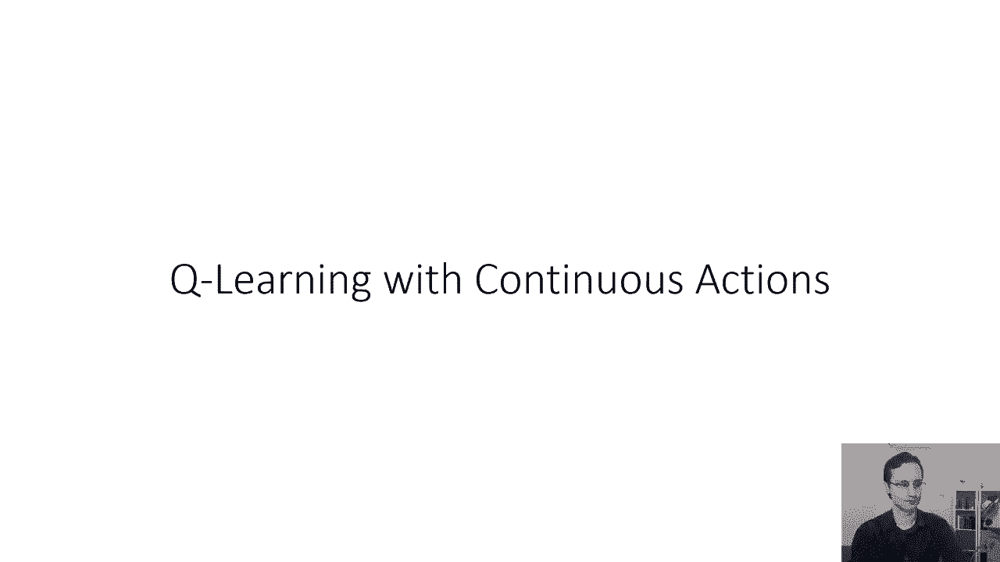

# 33：Q学习算法实践与改进 🚀

在本节课中，我们将探讨在实现Q学习算法时需要考虑的实际因素，以及一些能够提升算法性能的改进方法。我们将从评估Q值的准确性开始，分析常见问题，并学习如何通过双Q学习和多步回报等技术来解决这些问题。

## Q值的准确性评估 🔍

上一节我们介绍了Q学习的基本概念。本节中，我们来看看如何评估Q值的准确性。

Q函数是对未来总奖励的预测。它预测从特定状态采取某个动作，并遵循策略后所能获得的总奖励。因此，评估这些预测是否准确、是否与实际运行策略时得到的结果相符，具有重要意义。

观察基本的学习曲线可以发现，随着训练迭代次数增加，每回合的平均奖励通常呈上升趋势。同时，Q函数预测的平均Q值也在增加。这符合直觉：策略变得更好，获得更高奖励，Q函数也应预测更高的Q值。

### 价值函数的直观理解

以下是价值函数在具体游戏中的表现示例，有助于我们理解其预测的合理性。

*   **打砖块游戏**：目标是使用底部的橙色拍子击打球，使其反弹并击碎上方的彩色砖块。击碎每个砖块得一分。
    *   一个高级策略是让球从一侧反弹到顶部天花板，从而连续击碎大量砖块获得高分。
    *   下图展示了在游戏不同时刻，最佳动作对应的Q值（即状态价值函数值）。
    *   **点1**：即将击碎一个砖块，此时价值最高。
    *   **点2**：击碎砖块后球弹回，价值下降，因为短期内不会得分。
    *   **点3**：球即将反弹至顶部天花板，价值变得相当高。
    *   **点4**：球刚从拍子弹起，尚未击碎任何砖块，但即将反弹至天花板获得大量分数，因此此时价值函数值达到最大。




### 动作Q值的相对比较

我们还可以比较同一状态下不同动作的Q值，以理解模型的决策依据。

*   **乒乓球游戏**：玩家控制右侧的绿色拍子击球，目标是使对手（橙色拍子）无法回球。
*   **帧1**：球距离较远时，向上、向下、静止三个动作的Q值大致相同。这是因为Q函数理解，即使此时不移动拍子，在后续时间步仍有充足机会调整位置接球。
*   **帧2**：球已非常接近，需要立即回击。此时“向上”动作的Q值变得非常大，而“向下”和“静止”的Q值则非常低（负值）。Q函数理解必须立即行动。
*   **帧3**：成功回球后，不同动作的Q值差异再次变小，因为当前时刻的具体动作对后续影响不大。




## Q值过度估计问题 ⚠️

虽然相对Q值看起来合理，但在实践中，Q值的绝对值预测往往不准确，存在系统性**过度估计**问题。

### 问题现象

如果我们将Q函数预测的折扣奖励总和与实际运行策略获得的折扣奖励总和进行比较，会发现Q函数的预测值**系统性偏高**。

**公式**：折扣奖励总和 = `r_t + γ * r_{t+1} + γ^2 * r_{t+2} + ...`
比较对象：在状态 `s_t` 下，Q函数值 `Q(s_t, a_t)` 应近似等于从该状态动作开始的实际折扣奖励总和。

下图显示，Q函数估计值（红色实线）持续高于实际获得的折扣奖励总和（红色点线）。




### 问题根源：最大化操作

过度估计的根源在于Q学习目标值计算中的 **`max` 操作**。

**标准Q学习目标公式**：
`y = r + γ * max_{a'} Q_{φ'}(s', a')`

问题分析：
1.  假设真实的Q函数为 `Q*`，我们学习的Q函数 `Q_φ` 是带有噪声的估计：`Q_φ ≈ Q* + ε`，其中噪声ε均值为零。
2.  在计算目标值时，我们对所有动作取 `max Q_φ(s', a')`。这个最大化操作会**系统性选择正向噪声**。
    *   直观理解：假设两个动作的真实Q值相同，但估计各有正负噪声。只要有一个估计的噪声为正，`max` 就会选中它，导致目标值被高估。
    *   数学上，随机变量最大值 `E[max(X1, X2)]` 的期望值通常大于等于其期望值的最大值 `max(E[X1], E[X2])`。

因此，即使Q函数的噪声是无偏的（均值为零），通过 `max` 操作构造的目标值也会产生正向偏差，导致Q值更新时被持续高估。

## 解决方案：双Q学习 🛡️

上一节我们分析了过度估计的根源。本节中，我们来看看如何通过双Q学习来缓解这个问题。

### 核心思想：解耦动作选择与价值评估

过度估计的关键在于，**选择动作的函数**和**评估该动作价值的函数**是同一个（有噪声的）Q网络 `Q_{φ'}`。这导致噪声被重复利用并放大。

**双Q学习**通过使用两个网络来解耦这两个过程：
1.  **策略网络 (φ_A)**：用于选择动作，即 `a* = argmax_{a'} Q_{φ_A}(s', a')`。
2.  **目标网络 (φ_B)**：用于评估上一步所选动作的价值，即 `Q_{φ_B}(s', a*)`。

**双Q学习目标公式**：
`y = r + γ * Q_{φ_B}(s', argmax_{a'} Q_{φ_A}(s', a'))`

如果两个网络的噪声是独立的，那么即使 `φ_A` 因正向噪声错误地选择了某个动作，`φ_B` 评估该动作时也不太可能给出同样高的正向噪声估值，从而系统能够自我纠正。

### 实际实现

在实践中，我们通常不维护两个完全独立的网络，而是利用Q学习中已有的**当前网络 (φ)** 和**目标网络 (φ')** 来实现双Q学习。

**实现方式**：
使用当前网络 `φ` 来选择动作，但使用目标网络 `φ'` 来评估该动作的价值。

**代码描述（目标值计算）**：
```python
# 标准Q学习
target = r + γ * max_{a'} Q_target(s', a')  # 用目标网络选择并评估

# 双Q学习
best_action = argmax_{a'} Q_current(s', a')  # 用当前网络选择动作
target = r + γ * Q_target(s', best_action)   # 用目标网络评估该动作
```
虽然目标网络 `φ'` 会定期从当前网络 `φ` 更新，并非完全独立，但在实践中，这种方法能有效减轻大部分过度估计问题。

## 改进技巧：多步回报 ⏱️

除了双Q学习，我们还可以借鉴演员-评论员方法中的思路，使用**多步回报**来改进Q学习。

### 一步回报的局限性

标准Q学习使用**一步回报**：
`y = r_t + γ * max_{a'} Q(s_{t+1}, a')`

*   **训练初期**：Q函数很差，目标值中的 `max Q` 项几乎只是噪声，学习信号主要来自即时奖励 `r_t`，学习缓慢。
*   **训练后期**：Q函数较好，目标值由 `max Q` 主导，学习效率高。
这与演员-评论员方法中“高偏差、低方差”的估计器类似。

### 引入N步回报

**N步回报**通过融合接下来N步的即时奖励和N步后的状态价值，来构造目标值。

**N步回报目标公式**：
`y_t = Σ_{i=0}^{n-1} (γ^i * r_{t+i}) + γ^n * max_{a'} Q(s_{t+n}, a')`

当 `n=1` 时，即为标准的一步Q学习。



**优势**：
*   **更低偏差**：即使Q函数初期不准确，由于 `γ^n` 项衰减，其影响变小。学习信号更多来自真实奖励 `r` 的求和。
*   **更快初期学习**：奖励提供了更直接、更丰富的学习信号。
*   **更高方差**：奖励求和是基于单个样本的估计，方差比使用价值函数估计要高。

### 离策略挑战与应对

N步回报的一个主要挑战是它本质上是**在策略**的。它假设从 `t` 到 `t+n-1` 步的动作都是由**当前要评估的策略**生成的。然而，Q学习通常使用回放缓冲区中的旧数据（**离策略**数据），这会导致估计偏差。

**应对方法**：
1.  **动态截断**：检查样本轨迹中的动作，找到最大的 `n`，使得这 `n` 步内的动作都与当前贪婪策略要执行的动作一致，然后使用这个 `n` 来计算N步回报。
2.  **重要性采样**：为轨迹中的动作计算重要性权重，以校正不同策略间的差异。这种方法更复杂，但能处理更一般的离策略情况。
3.  **思考题**：如何设计一个完全离策略的N步Q学习算法？这可能需要学习一个不仅依赖于状态和动作，还依赖于其他信息（如未来动作序列）的模型。

下图对比了一步回报与多步回报的差异。


## 总结 📝

本节课我们一起学习了Q学习算法在实际应用中的关键考量与改进技术。

1.  **评估Q值**：我们首先认识到，虽然Q值的相对大小能合理反映策略优劣，但其绝对值存在系统性的过度估计问题。
2.  **诊断问题**：过度估计的根源在于目标值计算中的 `max` 操作，它会系统性选择Q函数估计中的正向噪声。
3.  **双Q学习**：为了缓解过度估计，我们引入了双Q学习。其核心思想是解耦**动作选择**和**价值评估**两个步骤，通常使用当前网络选动作，目标网络估价值，从而打破噪声的关联性。
4.  **多步回报**：为了加速初期学习并降低偏差，我们引入了N步回报。它通过结合多个即时奖励来构建目标值，但需要注意其在离策略数据上面临的挑战，并可以采用动态截断等方法来应对。





通过结合这些技术，我们可以构建出更稳定、更高效的深度Q学习智能体。