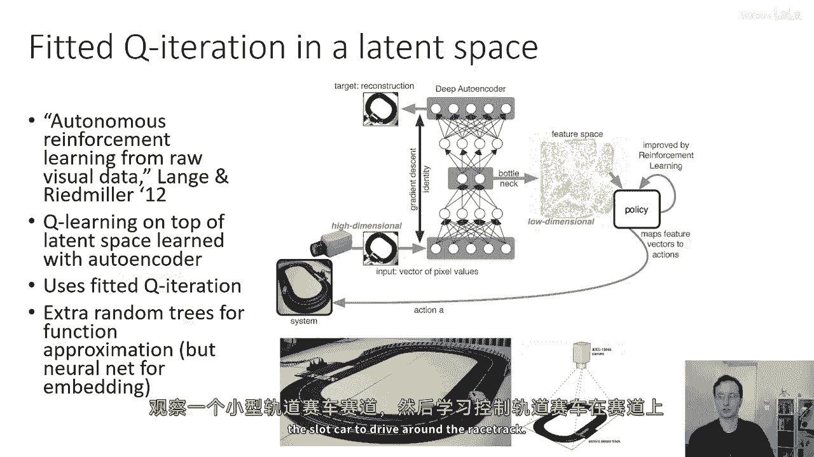
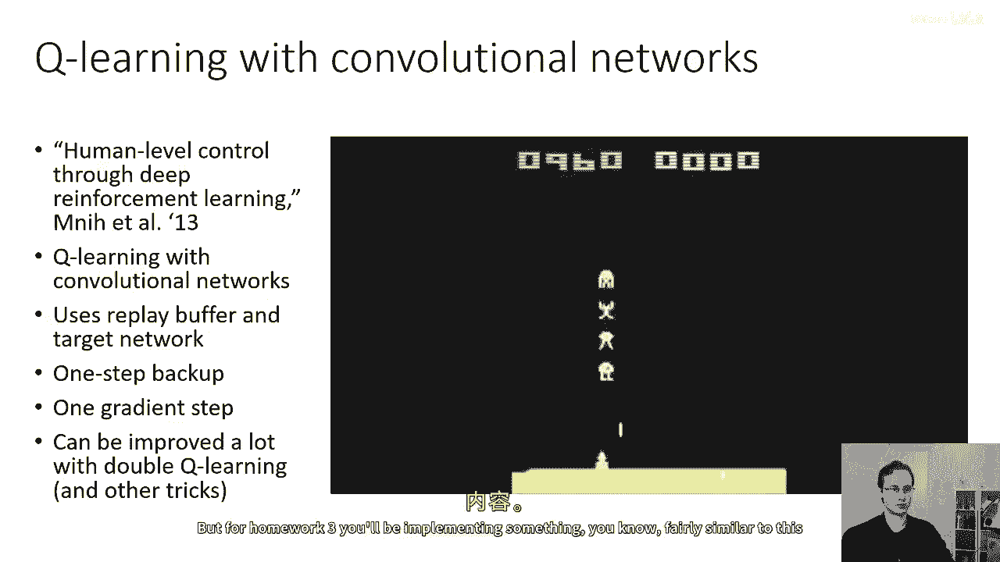
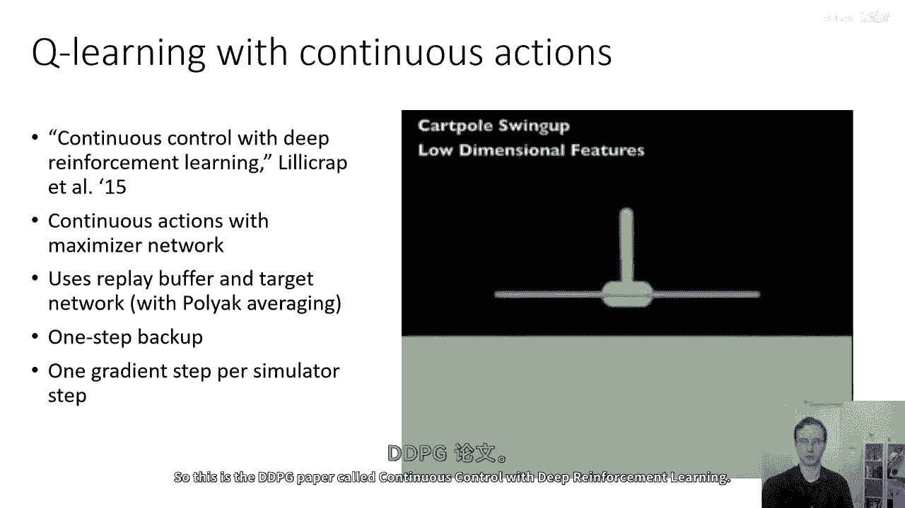
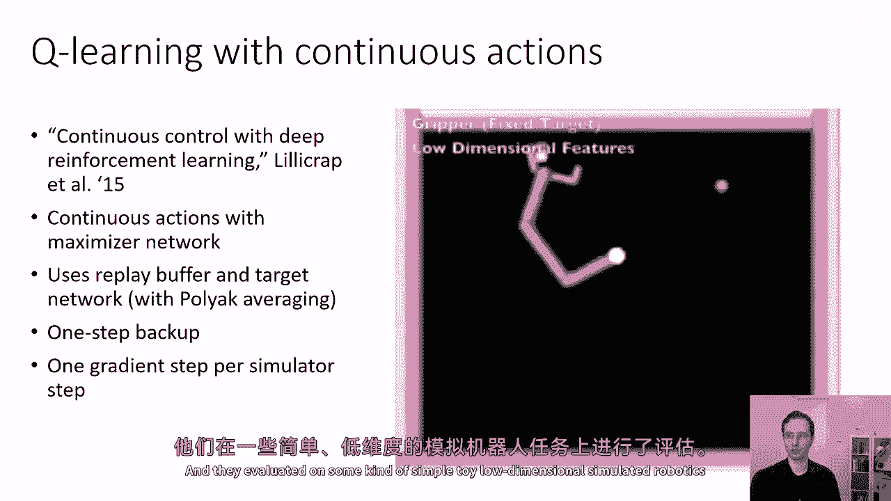
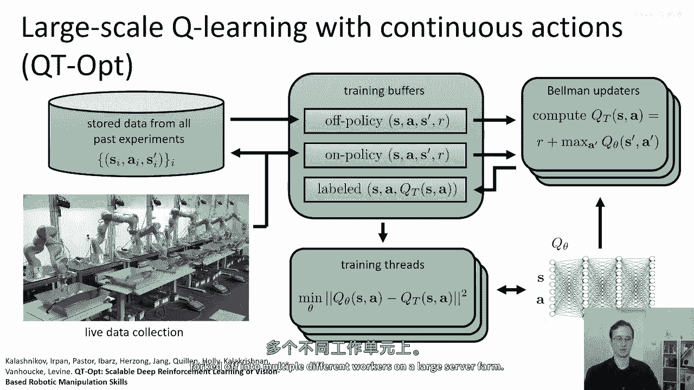
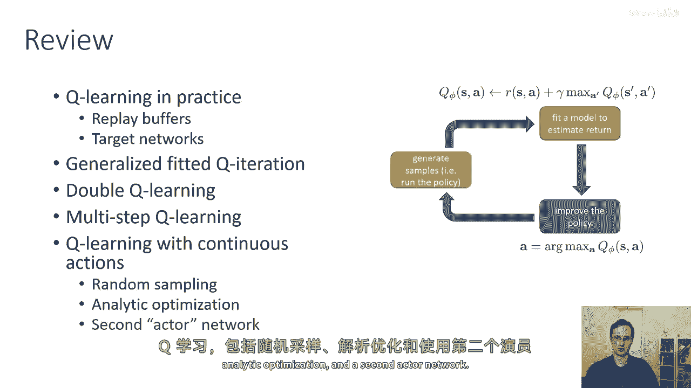

# 35：Q学习算法实践指南 🎯

在本节课中，我们将学习Q学习算法在实际应用中的关键技巧和注意事项，并通过一些经典论文案例来加深理解。Q学习是一种强大的强化学习方法，但其实现和调优比策略梯度方法更为精细，需要更多的细心和调试。

## 实用提示与调试策略 🛠️

上一节我们介绍了Q学习的基本概念，本节中我们来看看如何在实际中稳定地应用它。Q学习方法通常比策略梯度方法更精细，因此需要更多的小心谨慎来确保正确使用。

以下是确保算法稳定运行的关键步骤：

1.  **在简单问题上测试**：首先在已知算法应该有效、简单可靠的问题上测试你的实现。这是为了确保实现本身没有错误。
2.  **分阶段调试**：调试过程应分阶段进行。首先确保代码没有错误，然后再进行超参数调优，最后才在目标问题上运行。
3.  **注意性能差异**：Q学习在不同问题上的表现差异极大。例如，在Atari游戏中，某些游戏（如Pong）奖励稳步上升，而另一些（如Breakout）则可能先上升后剧烈波动，还有一些（如Montezuma‘s Revenge）则非常不稳定。
4.  **使用大型回放缓冲区**：较大的回放缓冲区（例如容量约一百万）可以显著提高算法的稳定性。当缓冲区足够大时，算法更接近于拟合Q迭代（Fitted Q-Iteration），这可能是稳定性改善的原因之一。
5.  **保持耐心**：Q学习通常需要很长时间才能收敛。在很长一段时间内，其性能可能并不比随机策略好。一旦通过随机探索找到了好的状态转移，性能才可能快速提升。
6.  **安排探索率**：在训练初期，Q函数质量很差，大部分工作依赖于随机探索。因此，可以从一个较大的探索率（epsilon）开始，并随着Q函数的改善而逐渐降低。将探索率按计划衰减通常很有帮助。

## 高级技巧：处理贝尔曼误差 📈

上一节我们讨论了基础的调试策略，本节中我们来看看如何处理训练中可能出现的数值问题，特别是与贝尔曼误差相关的问题。

贝尔曼误差的梯度可能非常大，这类似于最小二乘回归中的平方误差项。一个棘手的问题是，如果某个动作的价值非常差（例如-1,000,000），即使你并不关心这个动作的确切价值（只要知道它很差即可），平方误差目标也会产生巨大的梯度。

以下是处理此问题的两种方法：

*   **梯度裁剪**：直接限制梯度的大小，防止其过大。
*   **使用Huber损失**：Huber损失是平方损失和绝对值损失的一种插值。在远离最小值时，它像绝对值损失；在接近最小值时，它用二次函数平滑，以避免不可导的尖峰。其效果与梯度裁剪类似，但可能更容易实现。

`Huber损失公式（近似）：Lδ(a) = { 0.5*a² for |a|≤δ, δ*(|a|-0.5*δ) otherwise }`，其中 `a` 是误差。

## 其他改进策略与注意事项 ✅

除了处理梯度，还有一些其他策略可以显著提升Q学习的性能。

以下是实践中被证明有效的几种策略：

1.  **使用双Q学习**：双Q学习在实践中帮助很大，实现简单且几乎没有缺点。它通过解耦动作选择和价值评估来减少过高估计偏差，在训练早期尤其有益。
2.  **谨慎使用N步回报**：N步回报可以加速早期训练，但对于较大的N，它会系统性地偏差你的目标价值估计。
3.  **使用自适应优化器**：像RMSProp这样的早期自适应优化规则有帮助，但不如最新的优化器（如Adam）有效。使用Adam通常是个好主意。
4.  **运行多个随机种子**：由于随机种子可能导致结果有很大差异（有时很好，有时很糟），在调试和评估算法时，应运行多个不同的随机种子，以确保性能的稳定性和可复现性。

## 相关论文案例 📚

上一节我们介绍了一些改进技巧，本节中我们通过几篇经典论文来看看这些方法是如何被应用的。

以下是几篇在Q学习发展过程中具有代表性的论文：

*   **《Learning from Real-World Images with Autoencoders and Fitted Q-Iteration》**：这篇2012年的论文是早期将深度学习与值迭代方法结合的成果。它使用自编码器从原始图像中学习潜在空间表示，然后在该特征空间上使用Fitted Q-Iteration（使用Extra Trees作为函数逼近器）进行Q学习，成功控制了一辆微型卡丁车。
*   **《Human-level control through deep reinforcement learning》**：即著名的DQN论文。它使用卷积神经网络、经验回放缓冲区和目标网络，通过一步备份和梯度下降来玩Atari游戏。后续的改进（如双Q学习、Dueling Network）可以大幅提升其性能。
*   **《Continuous control with deep reinforcement learning》**：这篇论文将深度Q学习应用于连续动作空间。它使用了**最大化网络**（或NAF网络结构）来简化连续动作的最大化操作，并采用了经验回放和目标网络。
*   **《Robotic Manipulation with Deep Reinforcement Learning》**：这篇论文将深度Q学习用于真实世界的机器人控制（如开门）。它利用了**并行学习**的思想，使用多个机器人同时收集数据，并采用NAF表示法、经验回放和目标网络来提高数据效率。

如果你想深入了解Q学习，可以查阅以下经典文献：Watkins (1989) 的Q学习奠基论文、Neural Fitted Q-Iteration (NFQ) 论文、DQN论文、双Q学习论文、NAF论文以及Dueling Network架构论文。

## 总结 🎓

本节课中我们一起学习了Q学习算法的实践要点。我们讨论了如何使用经验回放缓冲区和目标网络来稳定Q学习训练，从三个并行过程（数据收集、目标计算、网络回归）的角度理解了拟合Q迭代的通用框架。我们还介绍了双Q学习、多步Q学习等改进技巧，以及处理连续动作空间的几种方法（随机采样、解析优化、使用第二个“演员”网络）。掌握这些技巧对于成功实现和应用Q学习算法至关重要。