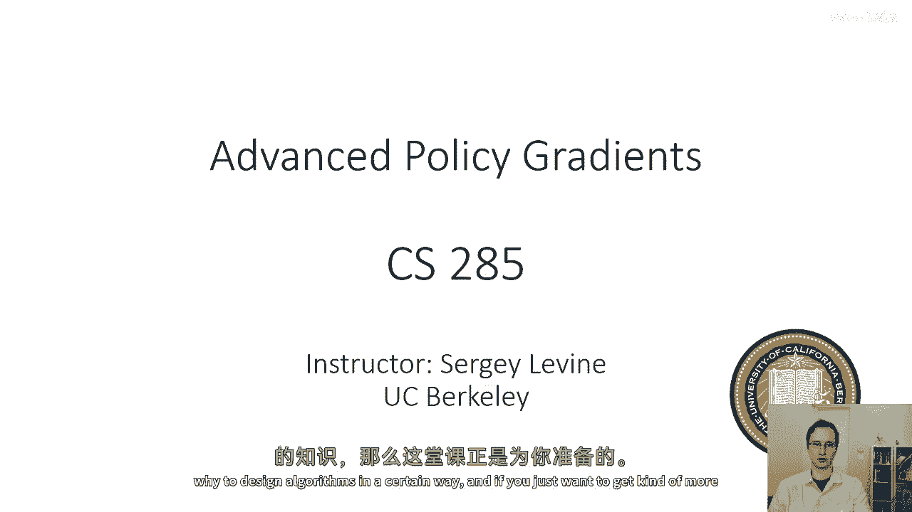
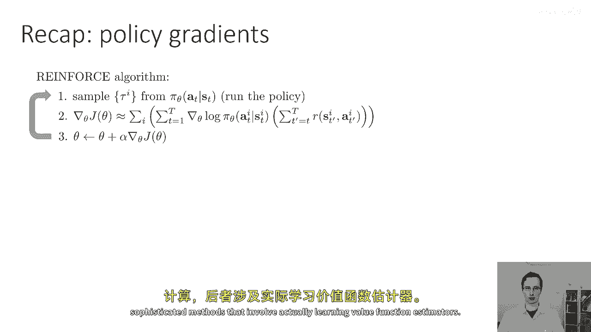
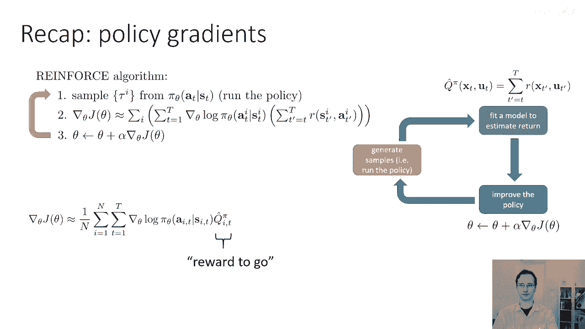
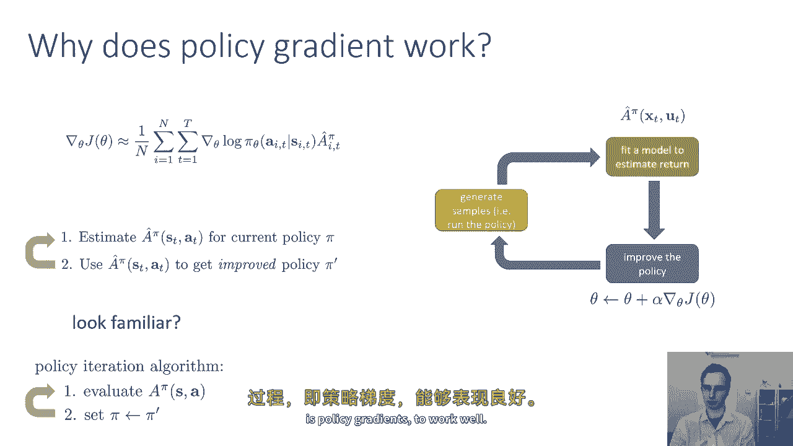
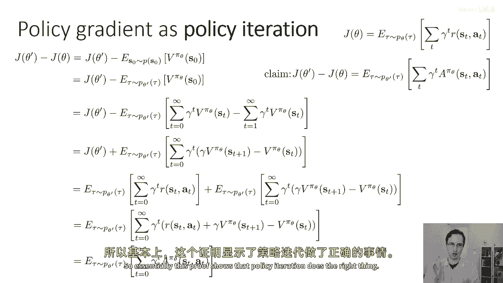
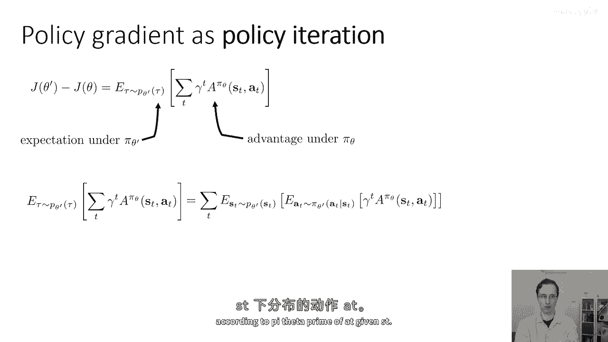
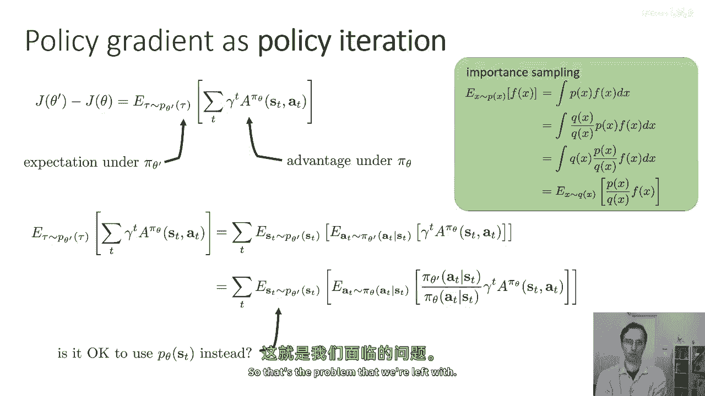
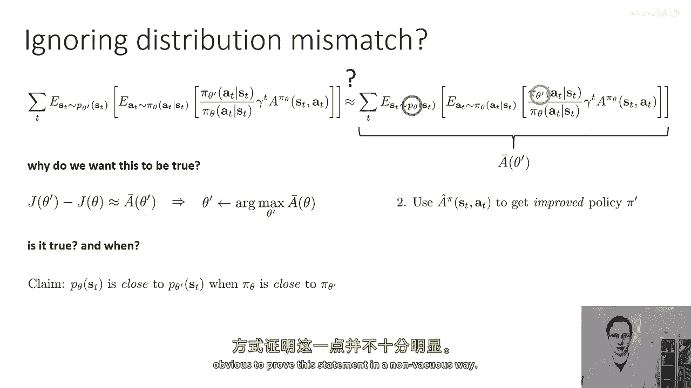

# 36：高级策略梯度算法 🧠

在本节课中，我们将学习高级策略梯度算法。我们将把之前讨论的策略评分思想与近期学到的策略迭代概念相结合，从而为策略梯度方法提供一个新视角，并分析其有效的原因。本节课内容较为深入，如果遇到困难，请耐心阅读。

## 回顾：策略梯度基础

上一节我们介绍了强化学习的基本算法。本节中，我们先简要回顾策略梯度的核心思想。

策略梯度的基本流程如下：
1.  从当前的策略（记为 π）中采样若干条轨迹。
2.  对于每条轨迹中的每个时间步，计算从该时刻起未来累积奖励的估计值（即“优势”或“奖励到去”）。
3.  计算策略梯度：`梯度 ≈ (∇ log π(a|s)) * (优势估计值)`。
4.  沿梯度方向更新策略参数，以最大化期望回报。

在演员-评论家算法中，优势估计值可以通过蒙特卡洛方法直接计算，也可以通过学习的价值函数来更精确地估计。

策略梯度算法遵循一个通用模式：采样（橙色框）、拟合优势估计（绿色框）、执行梯度上升更新策略（蓝色框）。其中，优势估计值 `q_hat` 的计算方式有多种选择。

## 策略梯度为何有效？🤔

上一节我们回顾了策略梯度的操作步骤。本节中我们来看看其背后的原理：为什么策略梯度算法能有效改进策略？

一个直观的回答是：因为我们在计算梯度并执行梯度下降（或上升）。然而，通过更深入的分析，我们可以将策略梯度视为一种“软化”的策略迭代。

我们可以从概念上将策略梯度视为两个步骤的循环：
1.  估计当前策略 π 下各状态-动作对的近似优势 `A_hat`。
2.  利用这个优势估计 `A_hat` 来改进策略，得到新策略 π‘。

这种视角与上周学习的**策略迭代**算法非常相似。策略迭代也交替进行两步：评估当前策略的价值（或优势），然后基于此改进策略（例如，采用贪心策略选择最优动作）。

两者的关键区别在于策略改进的方式：
*   **策略迭代**：采用“硬”更新，直接为估计优势最大的动作分配概率1（`argmax` 操作）。
*   **策略梯度**：采用“软”更新，通过梯度调整策略参数，使高优势动作的概率增加，低优势动作的概率减小，但不会立刻跳变到0或1。

当优势估计不完美时，这种温和的更新方式可能更理想：它允许我们沿估计的优势方向小幅调整策略，收集更多数据后，再改进优势估计器本身。

## 策略梯度作为策略迭代的数学表述 📐

上一节我们建立了策略梯度与策略迭代的直观联系。本节中，我们将通过数学推导来形式化这一观点。

我们想要证明一个核心观点：**通过最大化旧策略 πθ 在新策略 πθ‘ 下的期望优势，我们实际上是在优化新策略的强化学习目标 J(θ‘)。**

具体而言，我们希望证明以下等式成立：
`J(θ‘) - J(θ) = E_τ~πθ‘ [ Σ γ^t * A_πθ(s_t, a_t) ]`

其中：
*   `J(θ)` 表示策略参数为 θ 时的期望折扣总回报。
*   `A_πθ(s, a)` 是旧策略 πθ 下的优势函数。
*   右边的期望是在新策略 πθ‘ 产生的轨迹分布下计算的。

**这个等式的重要性在于**：它表明，如果我们能找到一个新策略 πθ‘，使其在自身产生的状态分布下，旧策略的优势期望最大，那么这个新策略就能带来最大的性能提升 `J(θ‘) - J(θ)`。这正是策略迭代的思想精髓。

以下是证明思路的概述：
1.  从 `J(θ‘)` 的定义出发，将其表示为初始状态价值函数的期望。
2.  巧妙地将初始状态价值 `V(s0)` 重写为两个无穷级数之差，从而引入时间步概念。
3.  通过代数重组，将表达式转化为关于时间步 t 的求和，其内部项逐渐呈现出 `γ^t * [r_t + γV(s_{t+1}) - V(s_t)]` 的形式。
4.  识别出括号内的项正是优势函数 `A_πθ(s_t, a_t)` 的定义。
5.  最终得到期望形式的表达式，完成证明。

此证明确立了策略迭代的理论正确性：通过基于旧策略的优势评估来改进策略，是优化长期回报的有效途径。

## 从策略迭代到策略梯度 🔄

上一节我们证明了策略迭代的理论基础。本节中，我们来看如何将其与策略梯度联系起来。

我们已经得到目标：
`最大化 E_(s~πθ‘, a~πθ‘) [ A_πθ(s, a) ]` 等价于 `最大化 J(θ‘)`。

为了将其转化为可优化的目标，我们需要处理期望中的状态分布 `s ~ πθ‘`。因为我们尚未确定 θ‘，无法直接从 πθ‘ 中采样状态。

一个自然的想法是使用**重要性采样**，将动作的分布从 πθ‘ 转换回我们已知的 πθ：
`E_(s~πθ‘, a~πθ‘)[...] = E_(s~πθ‘)[ E_(a~πθ‘)[...] ] = E_(s~πθ‘)[ E_(a~πθ)[ (πθ‘(a|s)/πθ(a|s)) * A_πθ(s, a) ] ]`

现在，动作期望可以基于旧策略 πθ 计算了，但**状态期望 `s ~ πθ‘` 仍然依赖于未知的新策略**。

如果我们能近似地认为，当策略变化不大时，新旧策略产生的状态分布也相似，即 `p_θ‘(s) ≈ p_θ(s)`，那么我们就可以用旧策略的状态分布 `s ~ πθ` 来替代。此时，我们的优化目标变为：
`最大化 E_(s~πθ, a~πθ)[ (πθ‘(a|s)/πθ(a|s)) * A_πθ(s, a) ]`

对这个目标关于 θ‘ 求梯度（然后在 θ‘ = θ 处取值），就能恢复出经典的策略梯度更新公式。这表明，在策略变化不大的假设下，**策略梯度可以看作是实现策略迭代目标的一种近似且实用的方法**。

## 总结

本节课中我们一起学习了高级策略梯度算法的原理。
1.  我们首先回顾了策略梯度的基本流程。
2.  然后我们探讨了策略梯度有效的深层原因，并将其与策略迭代算法进行类比，指出策略梯度是一种“软化”的策略迭代。
3.  通过数学推导，我们证明了策略迭代的核心原理：最大化旧策略在新策略下的期望优势，能直接优化整体性能目标。
4.  最后，我们展示了在“策略变化不大”的假设下，如何从策略迭代的目标推导出策略梯度的形式，从而在理论上将两者统一起来。

这种分析方法不仅加深了我们对策略梯度的理解，也为设计更稳定、更高效的强化学习算法（如近端策略优化PPO）提供了理论基础。