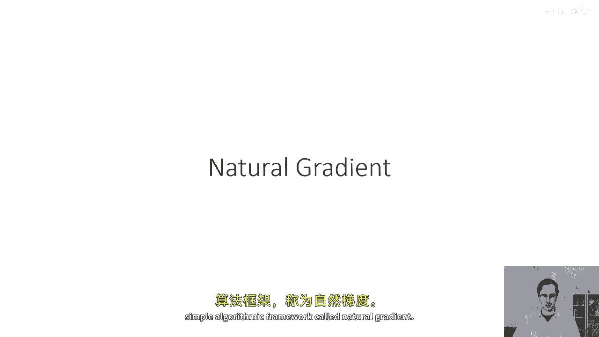
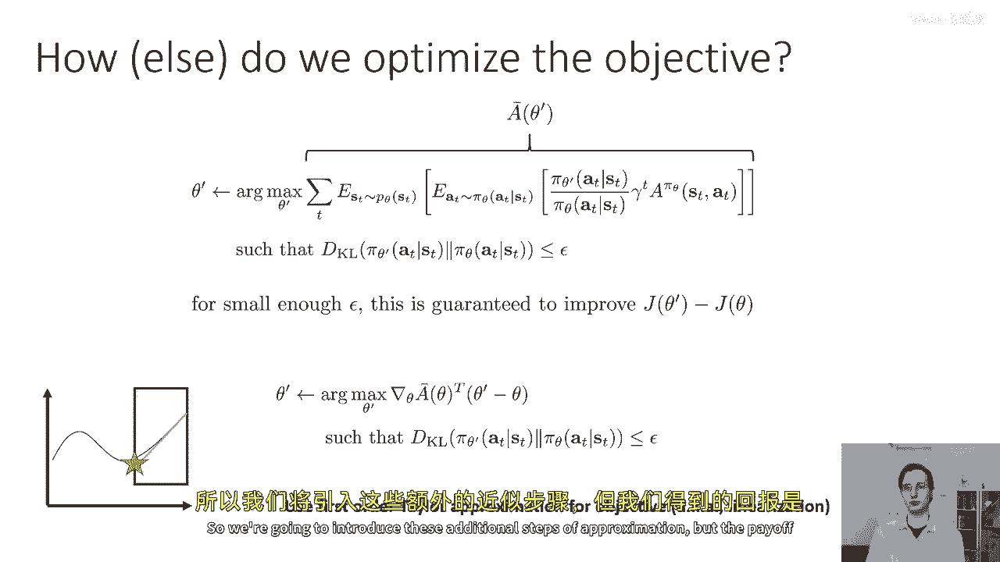
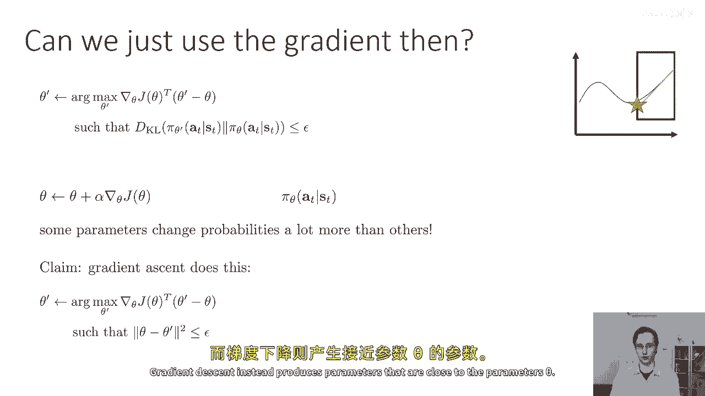
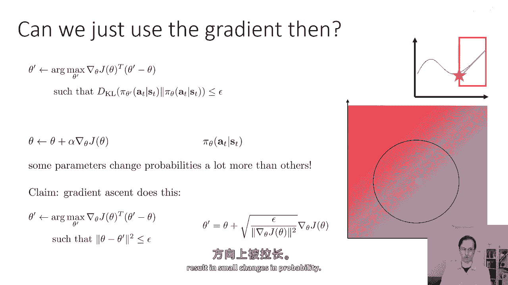
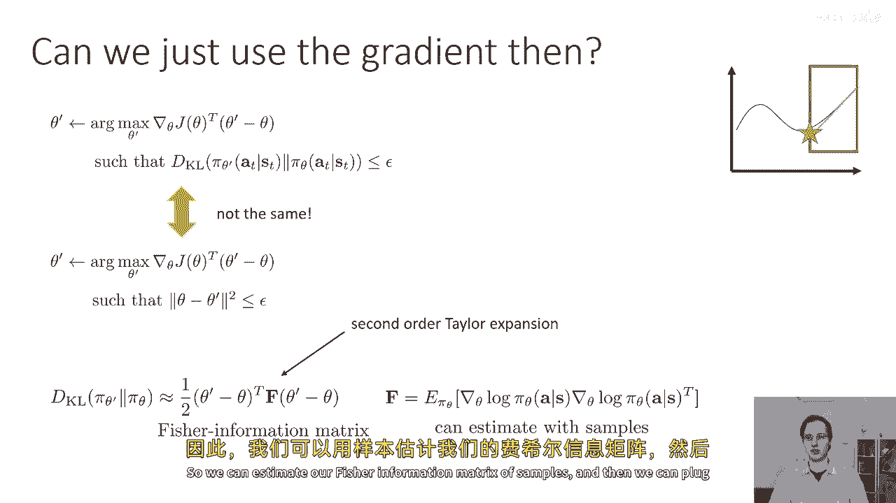
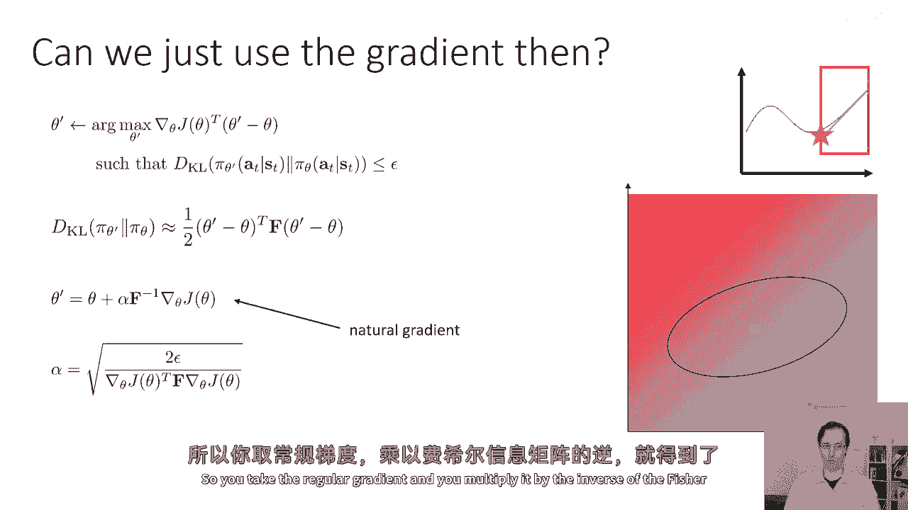
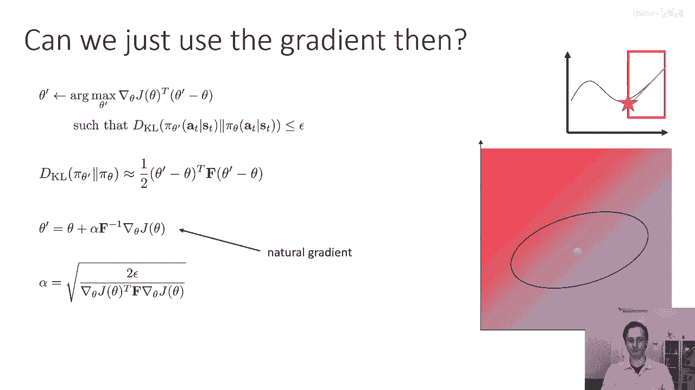
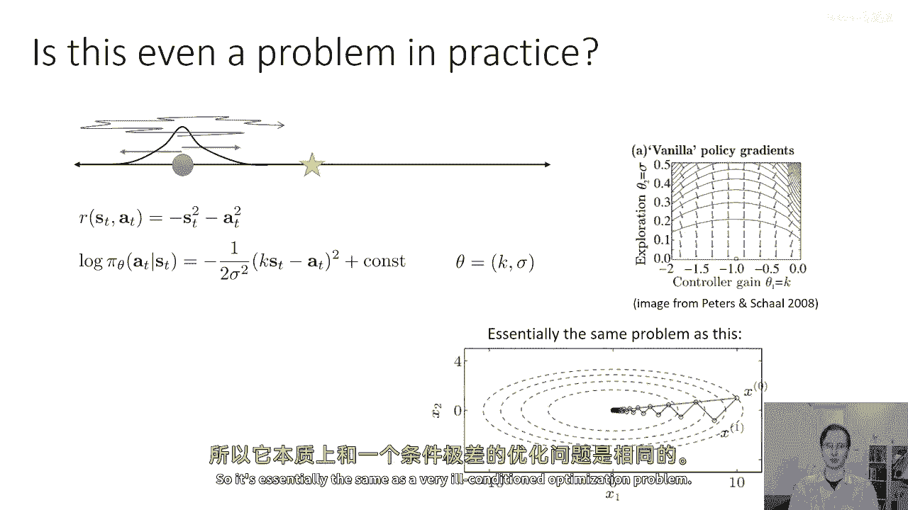
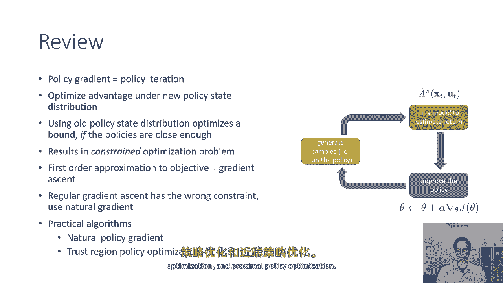

# 39：自然梯度与约束优化 🧠

在本节课中，我们将学习另一种施加策略约束的方法。这种方法虽然是一种近似，但它引出了一个非常简洁的算法框架——自然梯度。我们将从回顾约束优化问题开始，逐步推导出自然梯度的形式，并解释它为何比常规策略梯度更稳定。

## 概述：从约束优化到近似解法

在上一节中，我们讨论了如何通过约束新旧策略之间的KL散度来保证策略性能的单调改进，并使用了拉格朗日乘子法等优化技巧。本节我们将探讨一种更近似的方法，它通过一系列近似步骤，最终得到一个极其简单的算法，其核心步骤与标准策略梯度非常相似。

## 线性近似与信任区域

首先，我们回顾优化问题的核心思想。当我们计算某个目标函数的梯度并进行梯度上升时，这可以理解为在优化该目标函数的一阶泰勒展开。对于一个复杂的非线性函数（如图中的蓝色曲线），我们可以用一个简单的线性函数（绿色直线）来近似它。

然而，如果不施加任何约束，这个线性近似会延伸到正负无穷，优化它将没有意义。因此，我们必须定义一个“信任区域”（如图中的红色方框），在这个区域内，我们相信线性近似能够较好地代表原函数。我们的优化就限制在这个信任区域内进行。

对于我们的策略优化问题，我们可以将目标函数替换为其在旧策略参数 θ 处的一阶泰勒展开：
`目标 ≈ ∇θ J(θ)ᵀ (θ' - θ)`
同时，我们保留KL散度约束。这使得目标函数在优化变量 θ‘ 上是线性的，但约束仍然复杂。

## 常规梯度下降的局限性

接下来，我们看看如果直接使用梯度下降法优化这个线性目标会怎样。梯度下降的更新规则是：
`θ' = θ + α ∇θ J(θ)`
这实际上是在解决另一个约束优化问题：最大化线性目标，但约束是参数空间中的欧几里得距离 `||θ' - θ||² ≤ ε`。

**问题在于**：参数空间中的微小变化，对策略分布的影响可能天差地别。某些参数（如高斯策略中的方差σ）的微小变动会导致概率分布的剧烈变化。因此，在参数空间中施加“球形”约束（欧几里得距离），并不能保证在分布空间中满足我们想要的“接近”约束（KL散度小）。从几何上看，我们需要的信任区域在参数空间应该是一个“椭圆”，在敏感方向（导致分布变化大的方向）约束更紧，在不敏感方向约束更松。

## 引入自然梯度

为了得到正确的椭圆形状信任区域，我们需要对KL散度约束本身进行近似。由于KL散度在 θ‘ = θ 处的一阶导数为零，我们使用其二阶泰勒展开。这个二阶展开是一个二次型：
`KL(πθ‘ || πθ) ≈ 1/2 (θ‘ - θ)ᵀ F (θ‘ - θ)`
其中矩阵 **F** 是费舍尔信息矩阵（Fisher Information Matrix），其定义为：
`F = 𝔼_{s∼πθ, a∼πθ} [∇ log πθ(a|s) ∇ log πθ(a|s)ᵀ]`
费舍尔信息矩阵的一个优点是，它可以通过从当前策略 πθ 中采样的样本来估计。

现在，我们的优化问题变为：
最大化：`∇θ J(θ)ᵀ (θ‘ - θ)`
约束：`1/2 (θ‘ - θ)ᵀ F (θ‘ - θ) ≤ ε`

通过构造拉格朗日函数并求解，我们可以得到这个问题的闭式解：
`θ‘ = θ + α F⁻¹ ∇θ J(θ)`
其中步长 α 可以根据 ε 计算得出，以确保严格满足约束。这个更新方向 `F⁻¹ ∇θ J(θ)` 就被称为**自然梯度**。

## 为何自然梯度更优：一个直观例子

考虑一个简单的一维状态和动作问题，策略是高斯分布：`a ∼ N(k·s, σ²)`，参数是 θ = [k, σ]。回报函数是 `R = -s² - a²`。

在这个问题中，常规策略梯度极不稳定。当方差 σ 很小时，关于 σ 的梯度分量会变得异常巨大，导致优化过程主要忙于调整 σ，而难以找到最优的均值参数 k = -1。这是因为参数空间中的欧几里得距离没有考虑不同参数对分布影响的差异。

自然梯度通过乘以费舍尔信息矩阵的逆 `F⁻¹` 来纠正这一点。`F⁻¹` 的作用相当于对梯度进行重新缩放，在敏感方向（如 σ）上减小步长，在不敏感方向（如 k）上增大步长，从而引导优化朝着正确的方向稳定前进。

## 实践注意事项与算法

以下是自然策略梯度在实际应用中的关键点：

*   **经典自然梯度算法**：首先使用样本估计费舍尔信息矩阵 **F**，然后计算自然梯度方向 `F⁻¹ ∇θ J(θ)`，并手动选择一个步长 α。
*   **高效计算**：直接计算和求逆 **F** 矩阵（参数多时维度很高）计算量很大。一个高效的技巧是使用**共轭梯度法**来求解线性方程组 `F x = ∇θ J(θ)`，从而得到 `x = F⁻¹ ∇θ J(θ)`，同时还能自动确定满足特定 ε 的步长 α。这在TRPO（Trust Region Policy Optimization）论文中有详细描述。
*   **替代方案**：也可以不显式计算自然梯度，而是直接优化带有KL散度惩罚项的重要性采样目标，并通过启发式方法调整惩罚系数。这种方法更简单，即PPO（Proximal Policy Optimization）系列算法的思想。

## 总结

本节课我们一起学习了策略优化中约束方法的另一种视角。我们了解到：

1.  常规策略梯度可以看作是在参数空间施加欧几里得距离约束的优化过程。
2.  这种约束不能保证策略分布在概率空间中的接近度，可能导致训练不稳定。
3.  自然梯度方法通过使用费舍尔信息矩阵对KL散度约束进行二阶近似，将信任区域修正为参数空间中的椭圆形状。
4.  自然梯度的更新方向为 `θ‘ = θ + α F⁻¹ ∇θ J(θ)`，它更合理地考虑了参数变化对策略分布的影响，从而提供了更稳定、更有效的优化方向。
5.  在实践中，可以通过共轭梯度法等技巧高效实现自然梯度更新，也可以采用更简单的带惩罚项的优化目标作为近似。

通过本节的学习，我们掌握了从约束优化理论推导出实用算法（自然梯度）的完整思路，这是理解现代深度强化学习算法（如TRPO）的重要基础。