# 40：基于模型的强化学习与最优控制（第一部分） 📘

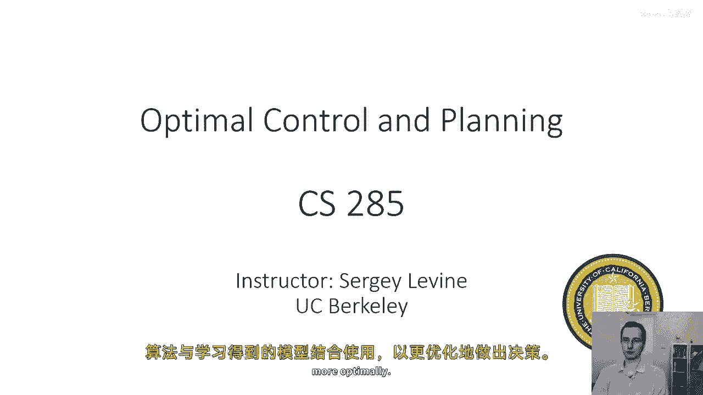

在本节课中，我们将学习当系统模型（即状态转移动态）已知时，如何利用它来做出最优决策。我们将探讨规划、最优控制和轨迹优化的基本概念与算法，为后续学习如何结合学习到的模型打下基础。

---

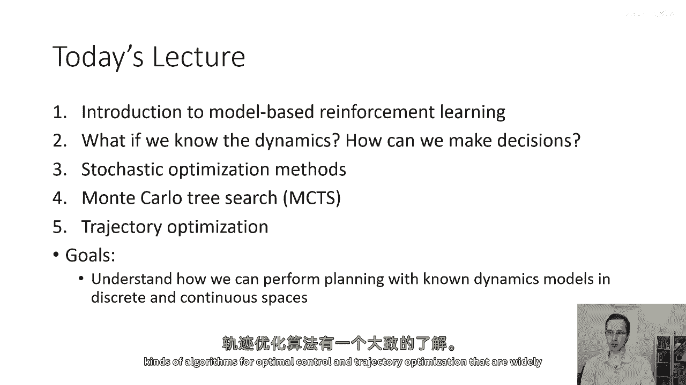

## 🔍 回顾：无模型强化学习

在前面的课程中，我们学习了优化强化学习目标的算法。强化学习的目标是最大化由策略 **π_θ** 诱导出的轨迹分布 **p_θ(τ)** 下的期望总奖励：

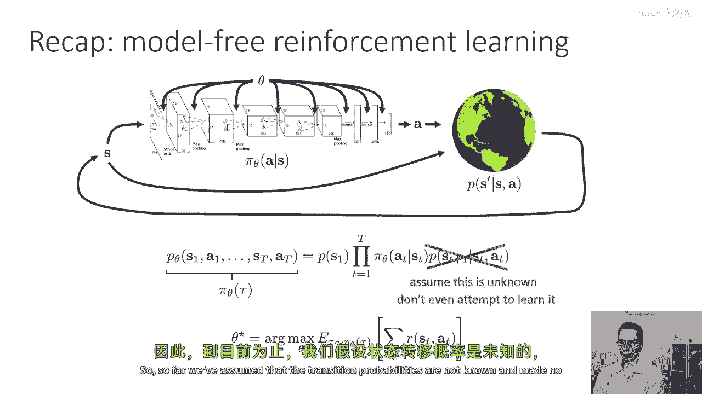

**目标：max_θ E_{τ∼p_θ(τ)}[Σ_t r(s_t, a_t)]**

我们讨论的算法（如策略梯度、Q学习）都采用了**无模型**形式。这意味着我们假设不知道状态转移概率 **p(s_{t+1} | s_t, a_t)**，甚至不尝试去学习它。这些算法仅通过从环境中采样来估计期望，而不预测在相同状态下采取不同行动会导致什么结果。

---

## 🤔 为什么需要考虑模型？

在许多实际问题中，我们实际上**知道**或可以**学习**系统的动态模型。例如：
*   在棋类游戏或雅达利游戏中，规则是明确已知的。
*   许多物理系统（如道路上的汽车）的动力学可以用方程较好地描述。
*   在机器人学中，“系统识别”领域专门研究如何将观测数据与已知模型结构进行匹配，以估计未知参数。

如果知道动态模型，我们就拥有一套在无模型设置中无法使用的强大算法工具箱，这通常能使问题解决得更高效、更优。

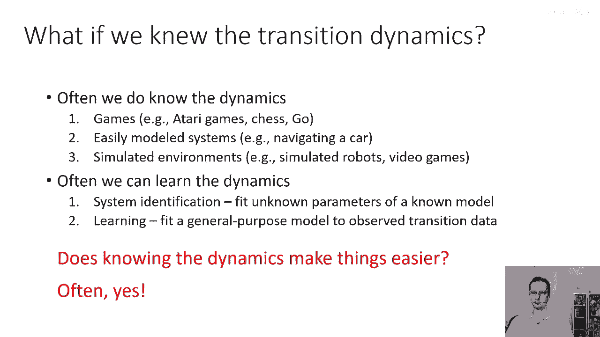

---

## 🎯 基于模型的强化学习概述

基于模型的强化学习通常分为两步：
1.  **学习模型**：从数据中学习状态转移动态 **p(s_{t+1} | s_t, a_t)**。
2.  **利用模型进行规划**：使用学习到的（或已知的）模型来决定如何选择动作。

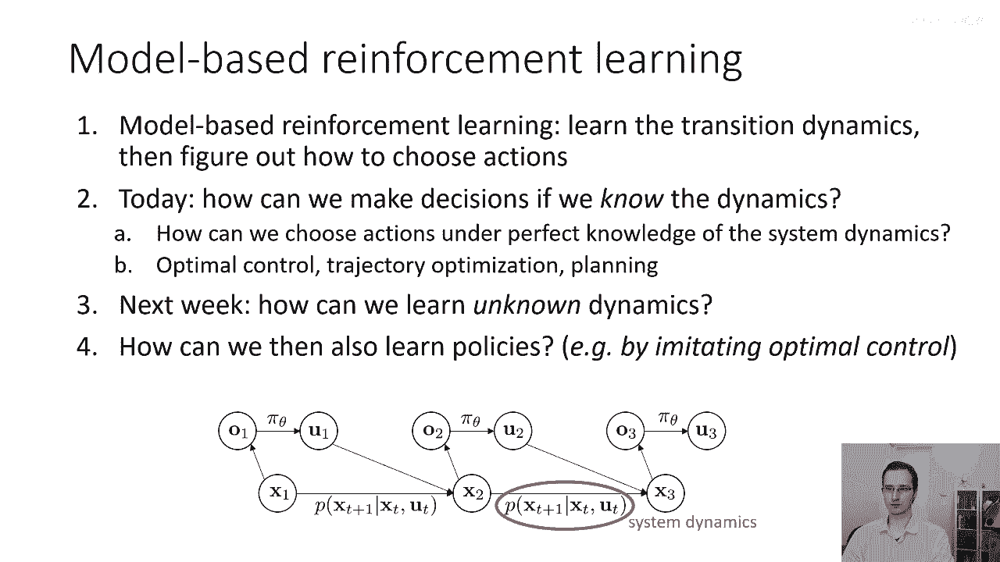

**本节课我们专注于第二步**：在**完全已知模型**的假设下，如何进行规划与决策。这属于**最优控制**、**轨迹优化**和**规划**算法的领域。这些术语虽有重叠，但通常：
*   **轨迹优化**：指在连续空间中优化一系列状态和动作的问题。
*   **规划**：通常指在离散空间中考虑多种可能性的问题。
*   **最优控制**：指选择控制输入以优化某个目标（如最小化成本）的通用问题。

下周我们将讨论当模型未知时，如何结合学习与规划。

---

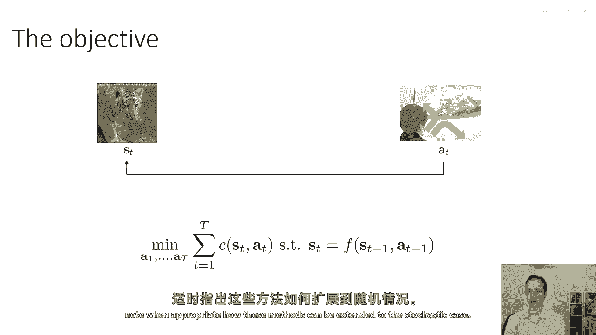

## ⚙️ 规划问题的形式化

### 开环规划 vs. 闭环规划

在规划时，一个关键区别是**开环**与**闭环**。

*   **开环规划**：代理在初始状态 **s_1** 被揭示后，**承诺并执行一整个动作序列 [a_1, ..., a_T]**，期间不再观察后续状态。
    *   **确定性情况**：若动态是确定性的（**s_{t+1} = f(s_t, a_t)**），开环规划是直接且最优的。问题可表述为带约束的优化：
        **max_{a_1,...,a_T} Σ_t r(s_t, a_t)**
        **约束条件：s_{t+1} = f(s_t, a_t)**
    *   **随机情况**：若动态是随机的，开环规划可能非常次优。因为它无法根据执行过程中揭示的新信息（新状态）调整计划。例如，在不知道考试题目的情况下，提前决定所有答案序列很可能导致糟糕的结果。

*   **闭环规划**：代理在每个时间步 **t** 都观察当前状态 **s_t**，然后根据某个**策略 π** 选择动作 **a_t**。这形成了“感知-行动”的闭环。
    *   强化学习通常解决闭环问题。目标与之前相同，但我们现在可以选择不同复杂度的策略类：
        *   **全局策略**：如神经网络，能处理广阔状态空间。
        *   **局部策略**：如在轨迹附近使用的线性反馈控制器，在最优控制中更常见。

**核心洞见**：在随机环境中，由于未来信息有价值，**闭环规划通常优于开环规划**。

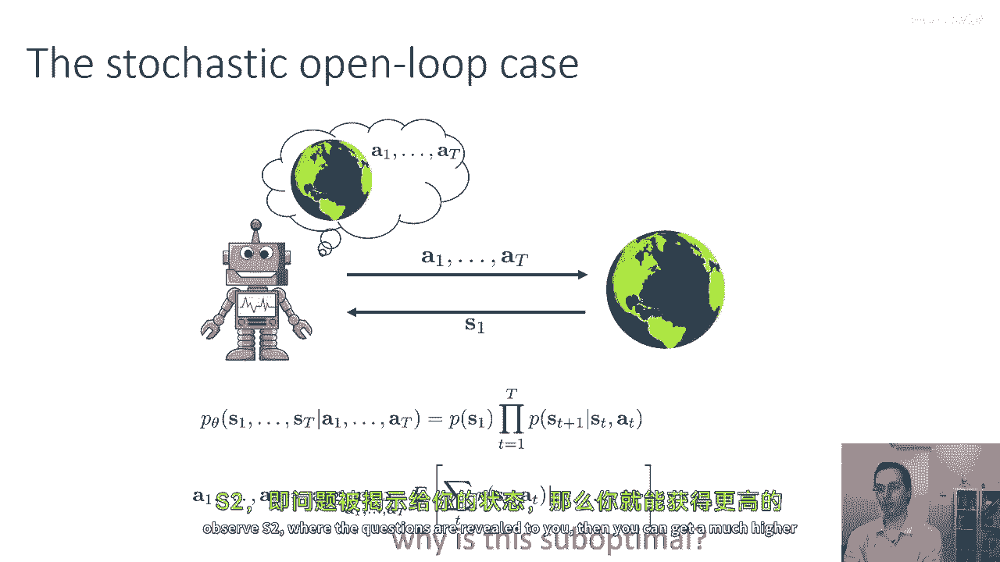

---

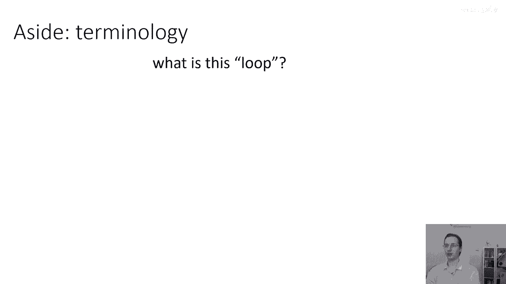

## 📋 本节课内容预告

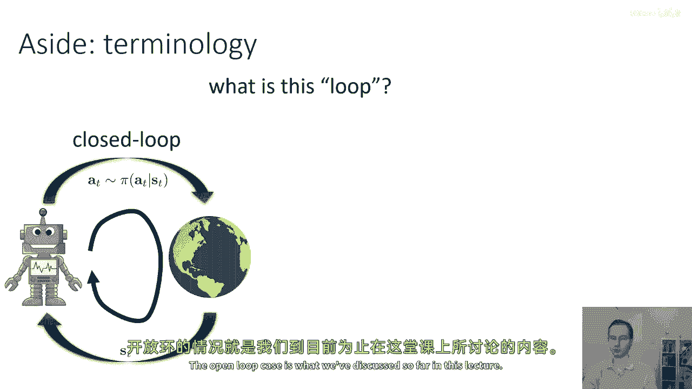

上一节我们介绍了基于模型规划的基本概念和开环/闭环的区别。本节中，我们来看看本讲后续将涵盖的具体算法类别：

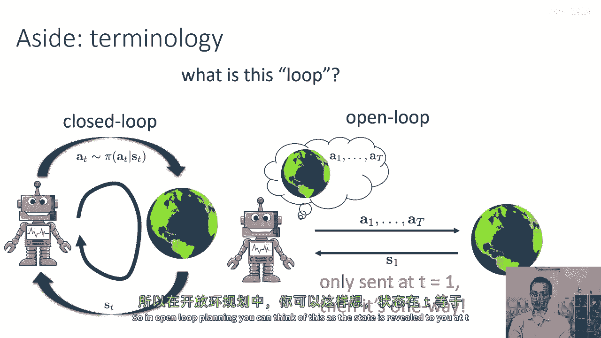

以下是本节课剩余部分将要讨论的核心算法：
1.  **随机黑箱优化方法**：因其简单性而被广泛使用。
2.  **蒙特卡洛树搜索**：一种强大的离散空间规划算法。
3.  **轨迹优化**：特别是**线性二次调节器**及其非线性扩展。

---

## 🎓 总结

在本节课中，我们一起学习了：
*   从**无模型**强化学习转向**基于模型**方法的动机。
*   在模型已知的假设下，规划问题的形式化定义。
*   **开环规划**与**闭环规划**的根本区别及其适用场景。
*   理解了在随机环境中，由于未来信息的重要性，闭环规划通常更为可取。

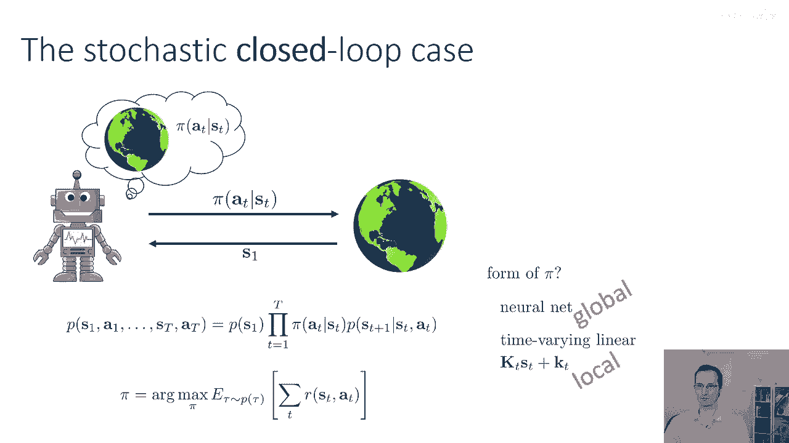

接下来的部分，我们将深入探讨具体的规划算法，从简单的随机优化开始，逐步深入到更结构化的轨迹优化方法。