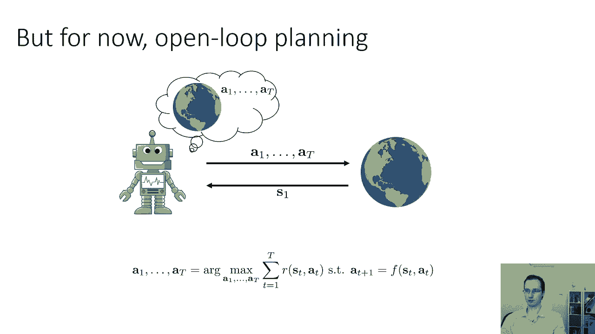
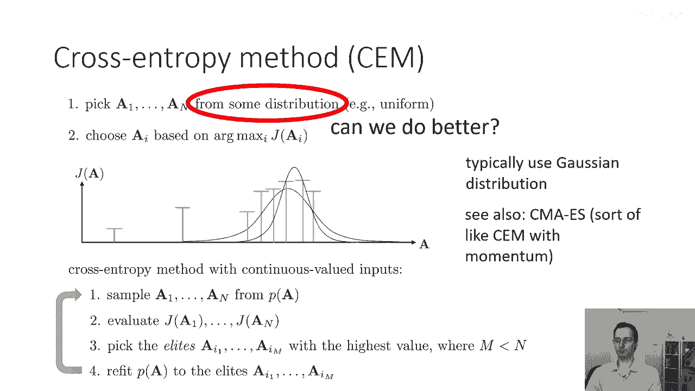
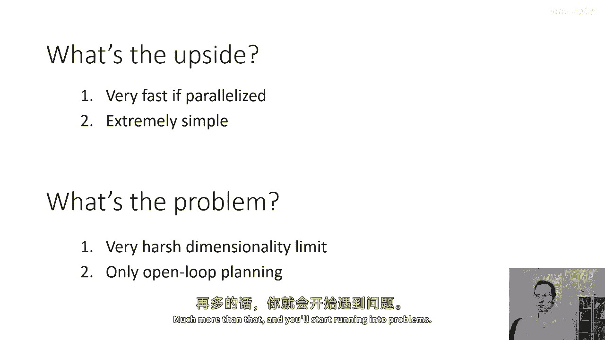
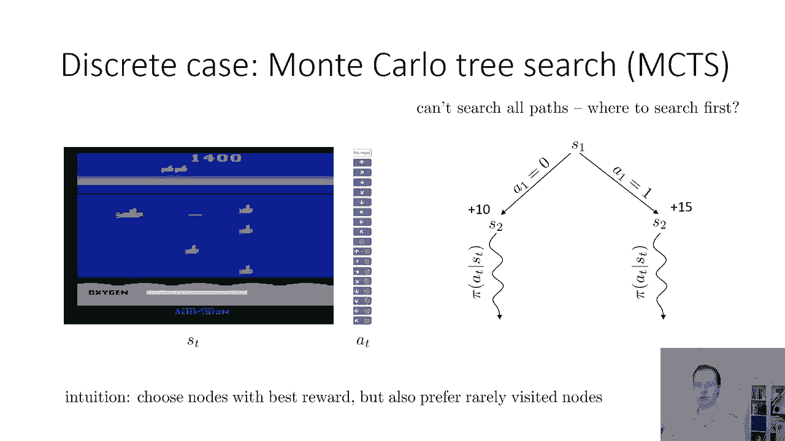
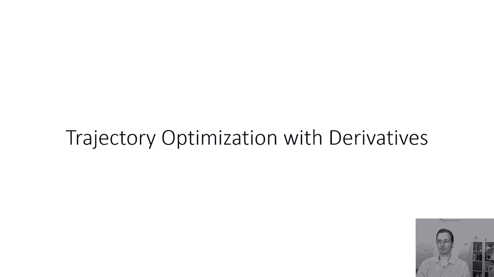

# 41：开环规划与蒙特卡洛树搜索 🧠



在本节课中，我们将学习两种重要的规划算法：开环规划中的随机优化方法（如交叉熵方法）和适用于闭环规划的蒙特卡洛树搜索。这些方法对动力学模型的假设非常有限，仅需知道模型，而不要求其连续、可微或确定。

---

## 开环规划与随机优化方法 🎯

上一部分我们讨论了基于模型的强化学习基础。本节中，我们来看看一类对模型假设极少的开环规划算法。在开环规划问题中，给定一个初始状态，目标是生成一系列能最大化累积回报的动作序列。这个想法对于数学考试可能不理想，但对许多实际应用问题可能很有效。

我们将从一类可广泛视为随机优化（或黑箱优化）的方法开始。这些方法将问题抽象为一个黑箱，不关心时间结构或最优控制器，只关心解决一个最大化或最小化问题。

我们将整个动作序列 `A` 表示为从 `a1` 到 `aT` 的拼接，从而将其转化为一个在变量 `A` 上、目标函数为 `J`（衡量期望奖励）的无约束优化问题。

### 随机射击方法

解决此问题的一个非常简单（起初可能显得愚蠢）的方法是“猜和检查”，即随机采样。

以下是其基本步骤：

1.  从某个分布（如均匀分布）中随机选择 `N` 个动作序列 `A_i`。
2.  评估每个动作序列的回报 `J(A_i)`。
3.  选择回报最高的动作序列 `A* = argmax_i J(A_i)`。

这种方法有时被称为“随机射击方法”。你可以将选择动作序列的过程想象为向环境随机“射击”，以观察结果。

对于低维系统和短时域问题，这种方法在实践中可以工作得非常好。它的一个主要优势是**实现极其简单**，编写代码只需几分钟。在现代硬件上，它通常也非常高效，因为可以并行评估多个动作序列的回报（例如，将 `N` 个序列作为一个小批量通过神经网络模型），然后进行归约求最大值。

这种方法的缺点是依赖运气，随机样本中可能不包含好的动作序列。

### 交叉熵方法 (CEM)



交叉熵方法可以显著改进随机射击方法，同时保留其许多优势。它适用于低到中等维度和时域的控制问题。

其核心思想是：更智能地选择采样分布，使其专注于可能包含优质动作序列的区域。这是一个迭代过程。

直观上，如果我们生成一批样本，我们会根据其中表现较好的样本（“精英样本”）来重新拟合一个新的采样分布，然后从新分布中再次采样，如此反复，从而逐渐逼近更优解。



以下是交叉熵方法的算法步骤：

1.  **初始化**：设定一个初始分布 `P(A)`（例如均匀分布或高斯分布）。
2.  **迭代**：重复以下步骤直到收敛：
    *   **采样**：从当前分布 `P(A)` 中采样 `N` 个动作序列。
    *   **评估**：计算每个序列的回报 `J(A_i)`。
    *   **选择精英**：选出回报最高的前 `M` 个样本（例如前10%），称为“精英集”。
    *   **重新拟合**：用这 `M` 个精英样本重新拟合（如计算最大似然估计）出一个新的分布 `P(A)`。

交叉熵方法有许多吸引人的保证。如果初始分布足够宽且采样足够多，它通常能找到全局最优解。在实践中，它对现代深度学习框架友好，支持并行计算，且不要求模型对动作可微。该方法可以扩展到离散动作（使用其他分布族），通常对连续动作使用高斯分布。

**一个更复杂的变体是 CMA-ES**（协方差矩阵自适应进化策略），它引入了动量风格的更新，在迭代次数较多时，能用更小的种群规模产生更好的解。

### 随机优化方法的优缺点总结

**优点**：
*   **速度快**：易于并行化，计算高效。
*   **易实现**：算法逻辑简单。
*   **限制少**：不要求模型连续、可微或确定。

**缺点**：
*   **维度限制**：严重依赖随机采样来覆盖动作空间。当维度较高时（经验法则：通常超过30-60维），性能会下降。对于时间序列问题，虽然连续时间步动作相关，但总维度（动作维度×时间步数）过高仍会带来挑战。
*   **仅限开环**：只能进行开环规划，不涉及闭环反馈。

---

## 蒙特卡洛树搜索 (MCTS) 🌳

接下来我们将讨论另一种规划方法——蒙特卡洛树搜索，它能够考虑**闭环反馈**。MCTS 能处理离散和连续状态（更常用于离散），在棋类游戏（如 AlphaGo）和机会型游戏（如扑克）中非常受欢迎。

让我们思考如何用 MCTS 玩一个简单的游戏。从初始状态开始，你可以尝试每个可能的动作，看看会导致什么状态，然后再从新状态尝试每个动作，如此反复构建一棵树。穷举搜索这棵树是指数级昂贵的。

MCTS 的核心思想是：**通过智能地选择树中哪些部分进行扩展和评估，来近似状态的价值，而非扩展整棵树**。具体做法是，当搜索到一定深度后，不再继续展开，而是用一个简单的“默认策略”（例如随机策略）从该状态模拟到回合结束，用得到的模拟回报来估计该状态的价值。虽然这不精确，但如果进行足够多次模拟，并能智能地探索有潜力的分支，效果会很好。



### MCTS 算法概述

MCTS 是一个迭代过程，每次迭代包含四个步骤：

1.  **选择**：从根节点（当前状态）开始，使用**树策略**递归地选择子节点，直到到达一个未被完全扩展的叶节点（即该节点还有未尝试过的动作）。
2.  **扩展**：为上一步选中的叶节点，选择一个未执行过的动作，从而创建一个或多个新的子节点。
3.  **模拟**：从新扩展的节点（或上一步的叶节点）开始，使用**默认策略**（如随机策略）进行模拟，直到回合结束，得到一个模拟回报值。
4.  **回溯**：将模拟得到的回报值，沿着从新节点到根节点的路径反向传播，更新路径上所有节点的统计信息（如总回报、访问次数）。

在计算预算用尽后，根据根节点下各子节点的平均回报（总回报/访问次数），选择最优的动作执行。

### 树策略：UCT 算法

树策略的关键在于平衡**利用**（选择当前估计价值高的节点）和**探索**（尝试访问次数少的节点）。最常用的树策略是 **UCT（上限置信区间树）** 公式。

对于一个节点 `s`，其每个子节点 `a` 的得分计算公式为：
```
Score(s, a) = Q(s, a) / N(s, a) + c * sqrt( ln(N(s)) / N(s, a) )
```
其中：
*   `Q(s, a)`：在节点 `s` 采取动作 `a` 获得的总回报。
*   `N(s, a)`：在节点 `s` 采取动作 `a` 的次数。
*   `N(s)`：节点 `s` 的总访问次数。
*   `c`：探索常数，控制探索与利用的权衡。

**公式解读**：
*   第一项 `Q/N` 是平均回报，代表**利用**——选择历史表现好的动作。
*   第二项是**探索奖励**。子节点访问次数 `N(s, a)` 越少，分母越小，该项值越大，鼓励探索。分子 `ln(N(s))` 使得随着父节点总访问次数增加，探索奖励缓慢增加。

树策略会选择得分最高的子节点进行深入。

### MCTS 的特点与扩展

MCTS 在实践中效果非常好，尤其适合存在随机性的场景。虽然其理论保证较少，但已成为许多复杂游戏的标准算法。

可以通过多种方式增强 MCTS：
*   **学习默认策略**：使用学到的策略而非随机策略进行模拟。
*   **使用价值函数**：在模拟未结束时，用价值函数估计状态价值，而非模拟到底。
*   **与强化学习结合**：例如 AlphaGo 就将 MCTS 与深度强化学习相结合。

如果想深入了解，推荐阅读综述论文《A Survey of Monte Carlo Tree Search Methods》。

---

## 总结 📝

本节课我们一起学习了两种重要的规划算法：
1.  **开环随机优化方法**：包括基础的随机射击和更高效的交叉熵方法。它们实现简单、并行高效，对模型假设少，但受限于维度且只能进行开环规划。
2.  **蒙特卡洛树搜索**：一种用于闭环规划的迭代算法，通过选择、扩展、模拟、回溯四个步骤，智能地探索决策树。其核心 UCT 树策略能有效平衡利用与探索，在实践中，尤其在随机性环境中，表现非常强大。



这些方法为我们在模型已知但性质不限的情况下进行规划提供了强大而实用的工具。