# 43：从 LQR 到非线性系统控制 🚀

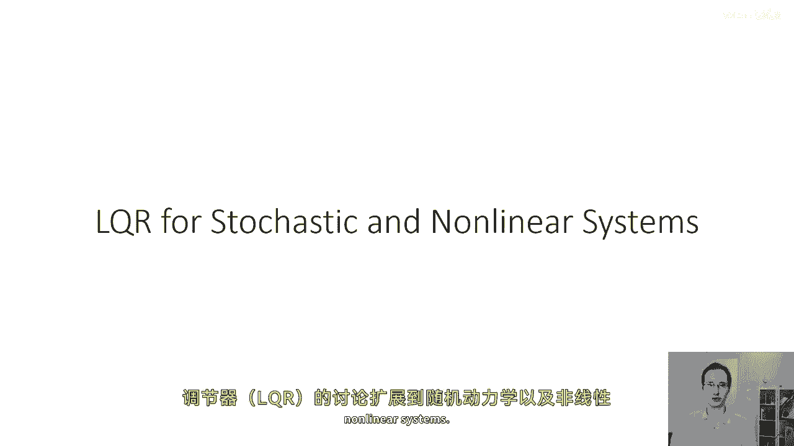

在本节课中，我们将扩展之前讨论的线性二次型调节器（LQR），将其应用于随机动力学系统和非线性系统。我们将学习如何通过局部线性化和迭代优化来处理更复杂的控制问题。

---

## 1. 扩展到随机动力学 🔀

上一节我们介绍了确定性线性系统下的 LQR。本节中，我们来看看当系统动力学引入随机性时会发生什么。

在随机动力学的特殊情况下，如果动力学是正态的，即给定状态 `x_t` 和动作 `u_t`，下一状态的条件概率分布 `p(x_{t+1} | x_t, u_t)` 是一个多元正态分布。其均值由线性动力学给出，协方差为常数。

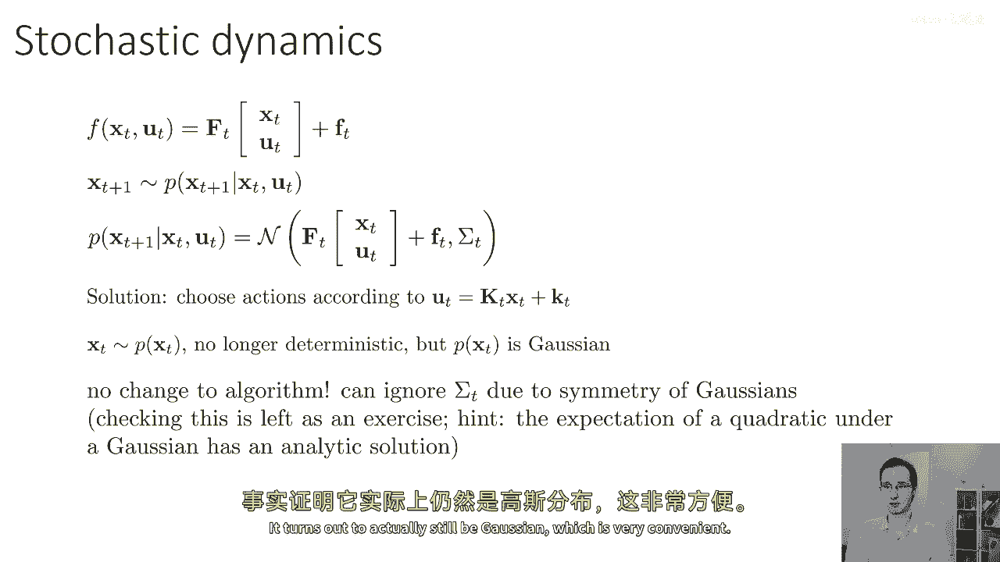

**核心公式**：
```
p(x_{t+1} | x_t, u_t) = N( A_t x_t + B_t u_t, Σ_t )
```

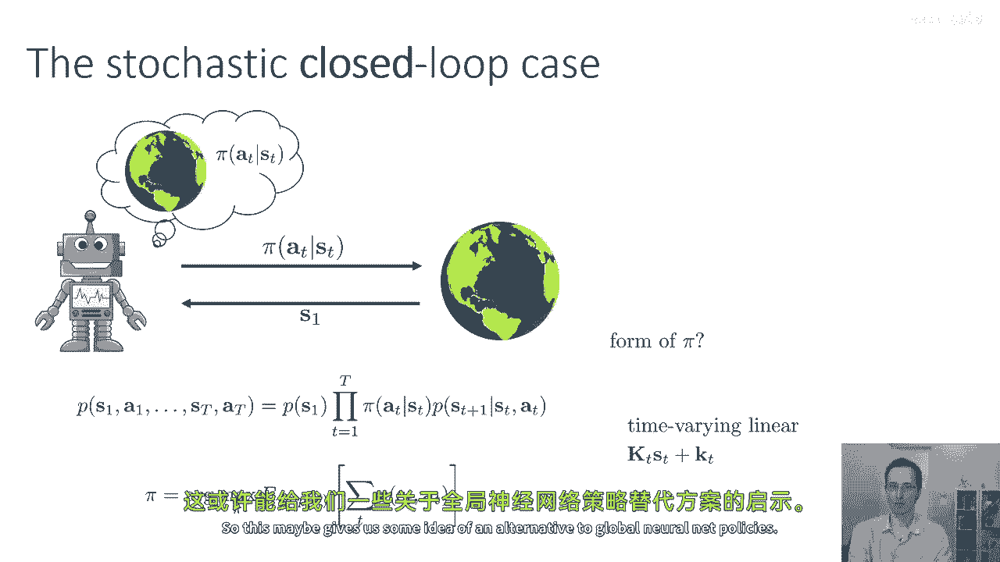

在这种情况下，我们发现之前推导出的确定性 LQR 控制律仍然是最优的。直觉上，这是因为高斯分布是对称的。在二次成本函数下，均值左右的偏差会相互抵消，因此添加高斯噪声不会改变最优动作 `u_t` 的解。

然而，一个重要区别是：由于引入了噪声，系统访问的状态序列变得随机。这意味着我们无法再生成单一的开环动作序列。相反，我们将控制律 `u_t = K_t x_t + k_t` 作为一个**闭环策略**来使用。在线性二次高斯（LQG）问题中，这个策略被证明是最优的闭环策略。

**算法总结**：算法本身无需改变。由于高斯噪声的对称性，我们可以忽略协方差矩阵 `Σ_t`。LQR 向后递归计算出的增益矩阵 `K_t` 和偏移量 `k_t` 直接构成了最优的线性反馈控制器。

**状态分布**：此时，状态 `x_t` 是从某个分布中采样得到的，而不再是确定性的。有趣的是，在 LQG 设定下，`x_t` 的分布仍然是正态的。

---

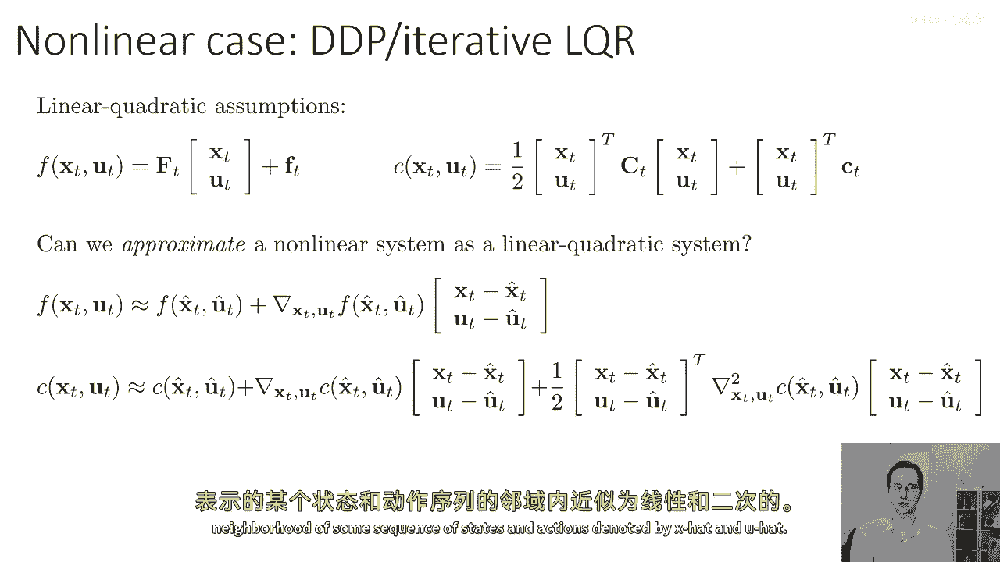

## 2. 扩展到非线性系统：迭代 LQR (iLQR) 🔄

处理了随机线性系统后，我们现在面临更大的挑战：非线性系统。本节我们将学习如何通过局部近似，将 LQR 的思想扩展到非线性领域。

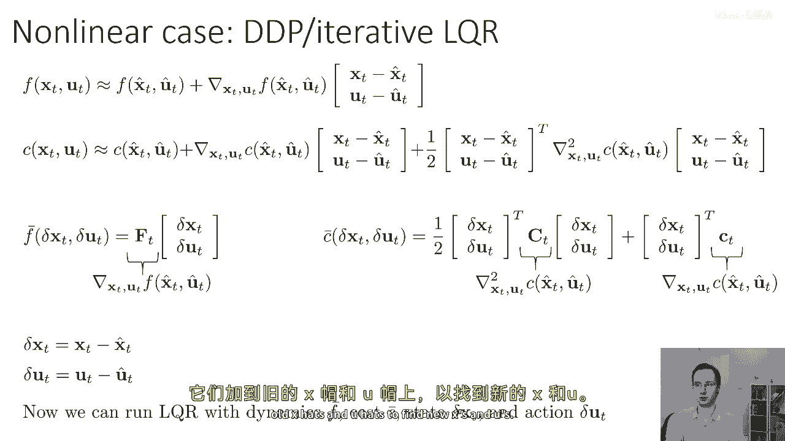

LQR 基于两个关键假设：
1.  动力学 `f(x_t, u_t)` 是 `x_t` 和 `u_t` 的**线性**函数。
2.  成本函数 `c(x_t, u_t)` 是 `x_t` 和 `u_t` 的**二次**函数。

对于非线性系统，我们可以利用一个强大的数学工具：**泰勒展开**。如果我们有一条当前估计的最优轨迹（记为 `\hat{x}_t`, `\hat{u}_t`），我们可以在该轨迹的邻域内，对动力学和成本函数进行一阶和二阶近似。

**核心近似公式**：
对于动力学 `f` 和成本 `c`，在点 `(\hat{x}_t, \hat{u}_t)` 附近有：
```
δx = x - \hat{x}_t
δu = u - \hat{u}_t

f(x, u) ≈ f(\hat{x}_t, \hat{u}_t) + ∇_x f · δx + ∇_u f · δu  (一阶近似)
c(x, u) ≈ c(\hat{x}_t, \hat{u}_t) + ∇ c · [δx; δu] + 1/2 [δx; δu]^T H [δx; δu] (二阶近似)
```
其中 `∇` 代表梯度，`H` 代表海森矩阵。

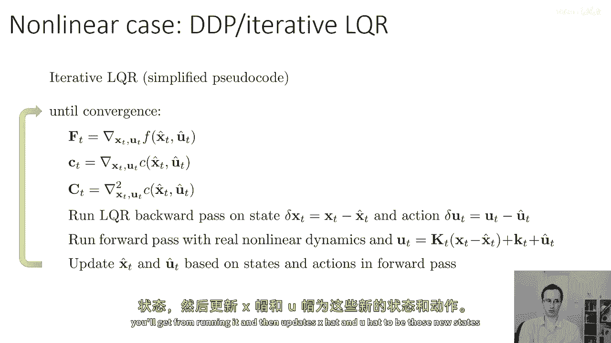

通过这种近似，我们得到了一个关于偏差 `δx` 和 `δu` 的**局部线性二次型**问题。这正是标准 LQR 可以解决的问题。

基于这个想法，以下是迭代 LQR (iLQR) 算法：

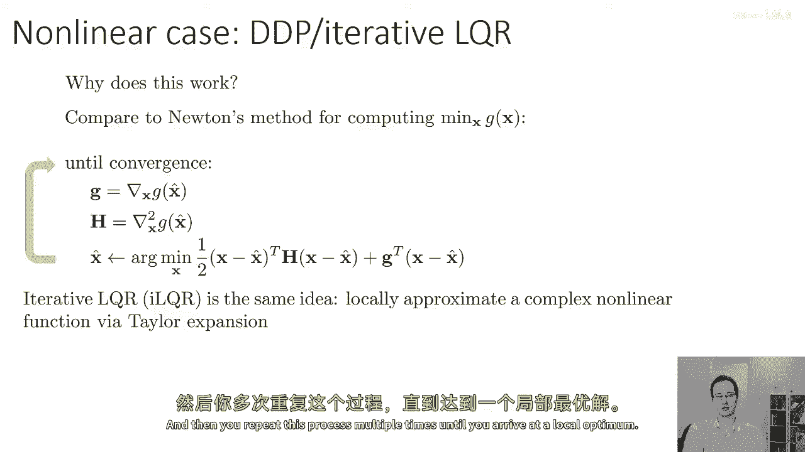

以下是 iLQR 算法的核心步骤：

1.  **线性化**：在当前轨迹 `\hat{x}_t, \hat{u}_t` 附近，计算动力学和成本函数的泰勒展开（一阶动力学，二阶成本）。
2.  **向后传递**：对得到的局部 LQR 问题（以 `δx`, `δu` 为变量）运行标准 LQR 的向后递归，计算出最优的反馈增益 `K_t` 和前馈项 `k_t`。
3.  **带线搜索的前向传递**：从初始状态开始，使用**原始的非线性动力学**和上一步计算出的控制律进行前向模拟：
    ```
    u_t = \hat{u}_t + K_t (x_t - \hat{x}_t) + α * k_t
    x_{t+1} = f(x_t, u_t)
    ```
    其中 `α` 是一个介于 0 和 1 之间的步长参数，用于线搜索以确保成本下降。
4.  **更新轨迹**：将新模拟得到的状态和动作序列 `{x_t, u_t}` 设置为新的参考轨迹 `{\hat{x}_t, \hat{u}_t}`。
5.  **迭代**：重复步骤 1-4，直到轨迹收敛（成本变化很小）。

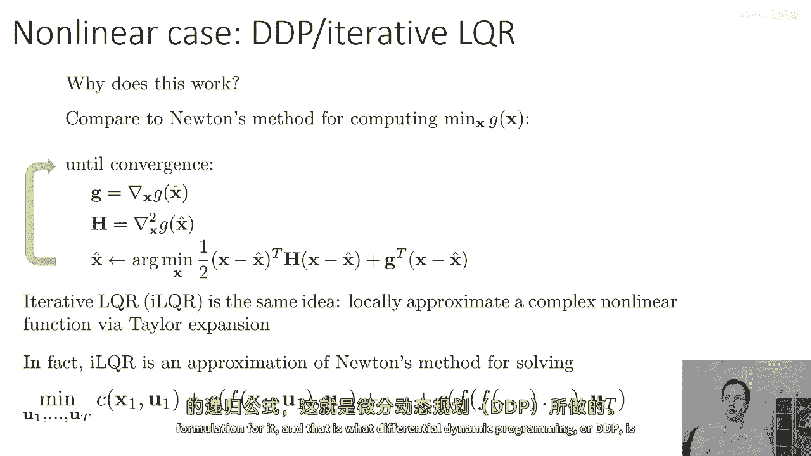

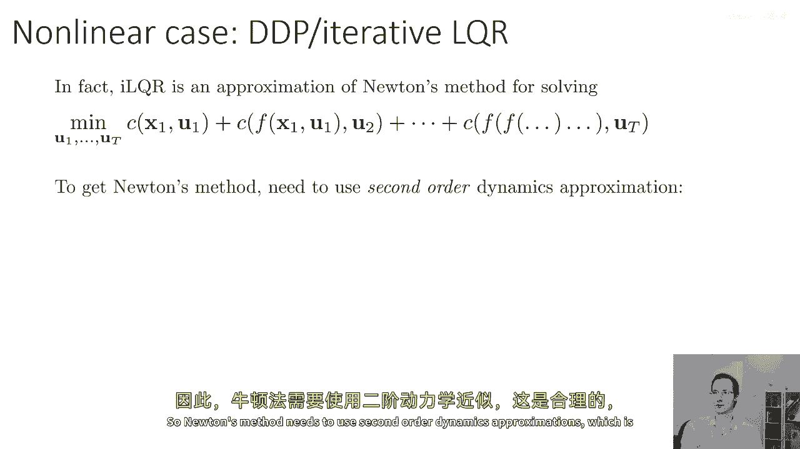

**与牛顿法的联系**：iLQR 本质上是一种牛顿法，用于求解原始的最优控制问题。向后传递计算了“牛顿步”，而前向传递中的线搜索确保了稳定性。如果想使用完整的二阶信息（即也对动力学进行二阶近似），对应的算法称为**差分动态规划**。

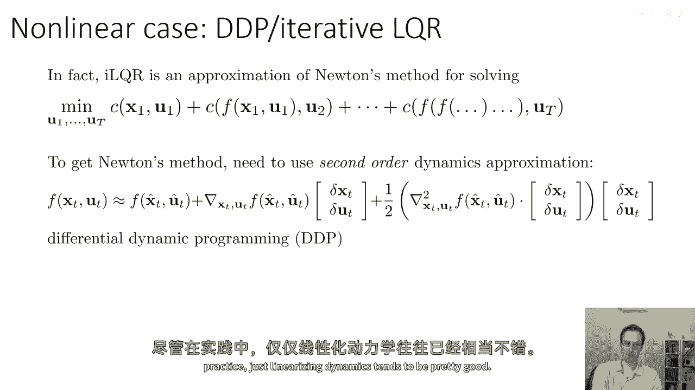

---

## 3. 线搜索的重要性 📉

上一节我们介绍了 iLQR 的基本流程，本节我们重点讨论其中保证算法鲁棒性的关键技巧：线搜索。

在牛顿法中，如果二次近似在远离当前点的区域不准确，直接跳到该二次模型的最优点可能导致性能反而变差（成本上升）。我们需要一种机制来“信任”这个近似模型只在当前点附近有效，即**信赖域**思想。

在 iLQR 中，线搜索通过调节前馈项 `k_t` 的步长 `α` 来实现这一点：
*   当 `α = 0` 时，控制动作 `u_t = \hat{u}_t + K_t (x_t - \hat{x}_t)`，即只使用反馈部分，不执行牛顿步。这会使新轨迹非常接近旧轨迹。
*   当 `α = 1` 时，执行完整的牛顿步。
*   我们可以从 `α=1` 开始尝试，如果新轨迹的成本没有降低，则按比例减小 `α`（例如减半），重新进行前向模拟，直到找到一个能降低成本的 `α` 值。

这种简单的回溯线搜索能极大提高 iLQR 的收敛鲁棒性，使其能够处理高度非线性的问题。

---

## 总结 📚

本节课中我们一起学习了如何将 LQR 框架进行扩展：
1.  **随机线性系统 (LQG)**：在高斯噪声下，最优控制律形式不变，但需理解为闭环反馈策略。状态分布保持高斯特性。
2.  **非线性系统 (iLQR)**：通过在当前轨迹点进行泰勒展开，将非线性问题局部近似为 LQR 问题。通过迭代地进行线性化、求解 LQR、执行带线搜索的前向模拟和更新轨迹，最终收敛到一个局部最优解。
3.  **关键改进**：引入**线搜索**机制是保证 iLQR 算法实际性能稳定的关键，它通过调节步长来确保每次迭代的成本单调下降，体现了信赖域的思想。

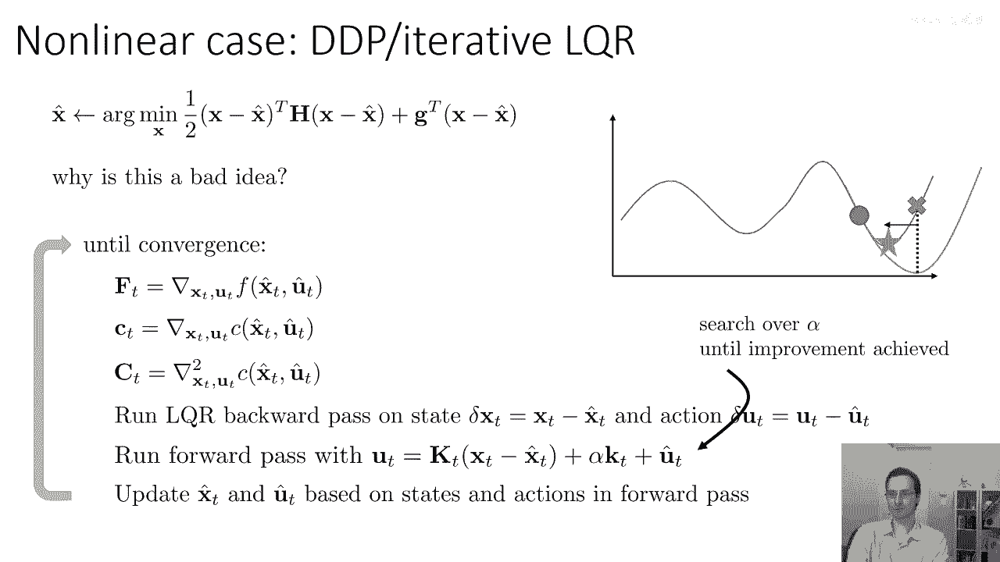

通过掌握 iLQR，我们获得了一个强大的工具，可以将高效的 LQR 计算应用于更广泛的非线性最优控制问题中。