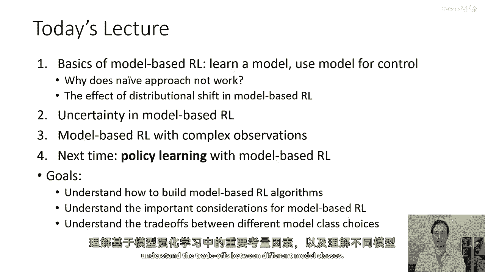
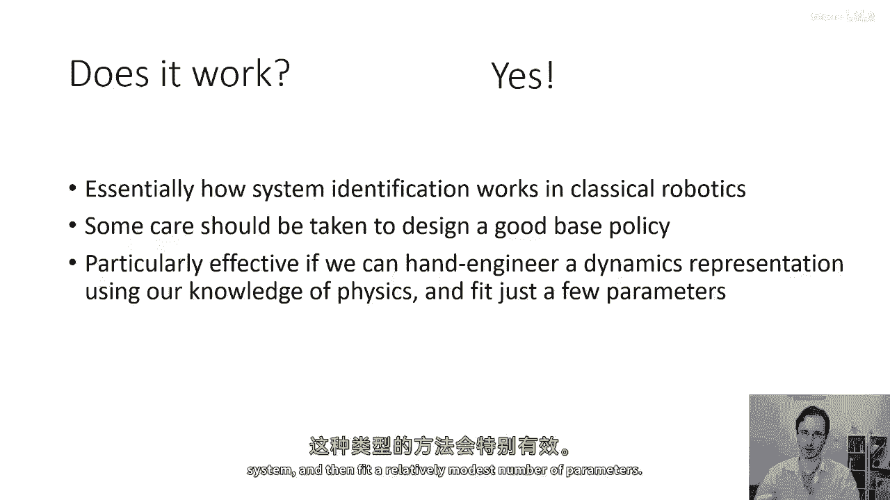
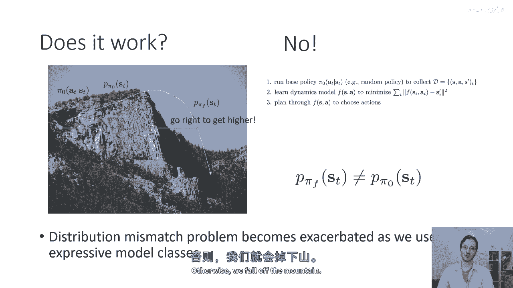
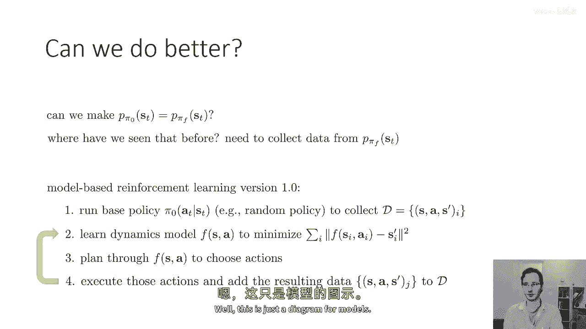
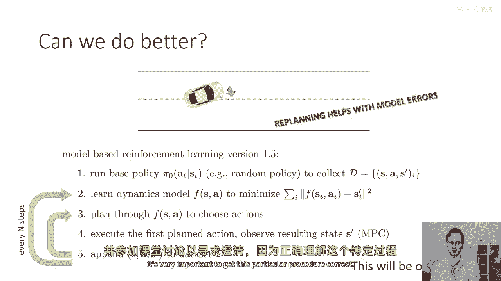
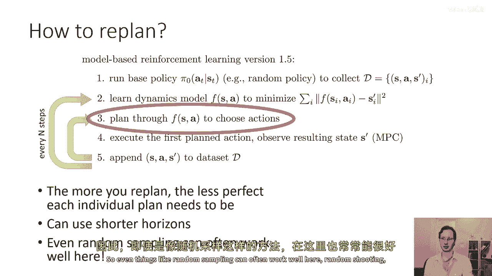
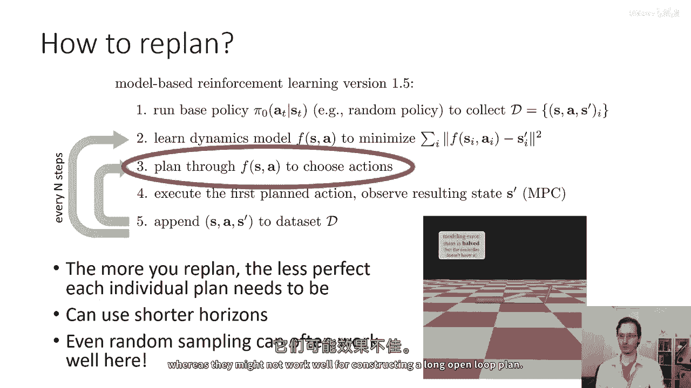
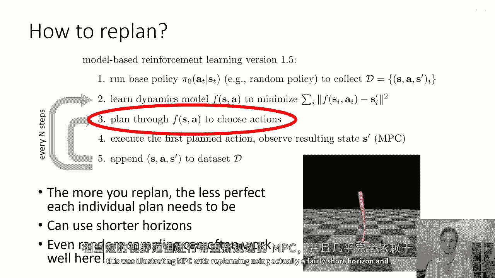
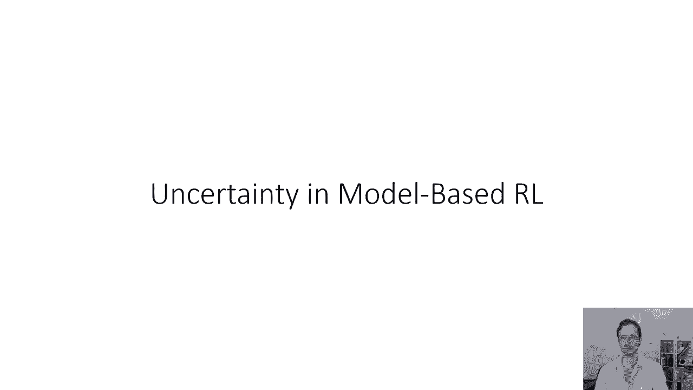

# 45：基于模型的强化学习算法（第一部分） 📘

在本节课中，我们将学习基于模型的强化学习的基本概念。我们将探讨如何从数据中学习一个动态模型，并利用这个模型来规划行动。课程将涵盖从最基础的方法到更高级的、能处理模型误差的技术，并讨论其中的核心挑战与权衡。



---

## 🧠 基于模型的强化学习基本概念

上一节我们介绍了课程目标，本节中我们来看看基于模型的强化学习的基本框架。

其核心思想是：首先从智能体与环境的交互数据中学习一个动态模型，然后利用这个学到的模型（而非真实环境）来进行规划和控制。这个模型可以预测在给定状态和动作下，下一个状态会是什么。

我们可以学习一个确定性模型，其形式为：
```
s_{t+1} = f(s_t, a_t)
```
也可以学习一个随机（概率）模型，其形式为：
```
s_{t+1} ~ p(s_{t+1} | s_t, a_t)
```
在今天的讲座中，我们将主要以确定性模型为例进行讲解，但大多数思想同样适用于概率模型。

---

## ⚠️ 一个朴素的方法及其问题



一个最直观的基于模型的强化学习算法可以称为“版本0.5”。以下是其步骤：

1.  **运行基础探索策略**：例如一个完全随机的策略，收集状态、动作、下一状态组成的转移数据 `(s, a, s')`。
2.  **训练动态模型**：使用监督学习（如最小化均方误差）在收集的数据集上训练模型 `f(s, a)`。
3.  **利用模型规划**：使用上周学到的任何规划算法（如随机采样、轨迹优化等），在学到的模型 `f` 中选择能获得高回报的动作。

这个方法在某些情况下（如经典机器人中的系统识别）可以工作得很好，尤其是当模型形式已知、仅需拟合少量参数时。然而，当使用高容量模型（如深度神经网络）时，它会遇到一个严重问题：**分布漂移**。

**为什么分布漂移是个问题？**
- 模型 `f` 是在基础策略 `π_0` 产生的状态分布 `p_{π_0}(s_t)` 下训练的。
- 当我们基于模型 `f` 规划时，我们执行的是由模型诱导的新策略 `π_f`。
- `π_f` 会访问一些在 `p_{π_0}(s_t)` 下概率很低甚至从未见过的状态。
- 在这些“陌生”区域，模型 `f` 的预测可能非常不准确。
- 基于这些错误预测做出的“最优”决策，会将智能体导向更陌生、模型预测更不准的区域，形成恶性循环，导致性能崩溃。

这类似于我们在模仿学习中讨论过的分布不匹配问题。

---

## 🔄 改进方案：迭代数据收集

为了解决分布漂移问题，我们可以借鉴DAgger算法的思想：持续收集新策略下的数据，并重新训练模型。这引出了“版本1.0”算法：



以下是“版本1.0”算法的步骤：

1.  运行基础策略收集初始数据。
2.  使用所有现有数据训练动态模型 `f`。
3.  基于当前模型 `f` 规划并执行动作，收集新的转移数据。
4.  将新数据加入数据集。
5.  返回第2步，重复此循环。

这个迭代过程让模型能够不断在它即将访问的状态分布上进行训练，从而从原则上缓解分布漂移问题。

---

## 🎯 进一步优化：模型预测控制



“版本1.0”虽然有效，但学习可能较慢。如果模型在一步预测上犯了一个小错误，这个错误会在整个开环计划中累积，导致糟糕的结果，而智能体要等到整个回合结束、数据被加入训练集后，才能修正这个错误。

我们可以做得更好，通过在每个时间步都重新规划来立即纠正错误。这种方法称为**模型预测控制**，我们称之为“版本1.5”。

以下是“版本1.5”（MPC）算法的步骤：


1.  运行基础策略收集初始数据。
2.  使用所有数据训练动态模型 `f`。
3.  在每一个时间步 `t`：
    a. 基于当前状态 `s_t` 和模型 `f`，规划一个短序列的动作（例如，使用随机采样方法）。
    b. 只执行规划出的第一个动作 `a_t`。
    c. 观察到真实的下一个状态 `s_{t+1}`，并将转移 `(s_t, a_t, s_{t+1})` 加入数据集。
    d. 状态更新为 `s_{t+1}`，立即重新规划。
4.  每隔一定的时间步（例如每完成一个轨迹），用累积的新数据重新训练模型 `f`，然后回到第3步。

MPC的核心优势在于其鲁棒性：即使模型不完美，频繁的重新规划也能利用模型在当前“已到达”状态下的局部信息，及时纠正偏差，防止错误累积。当然，代价是计算成本更高。

---



## 📝 总结

本节课我们一起学习了基于模型的强化学习算法的第一部分。



- 我们首先介绍了**基本概念**，即先学习环境动态模型，再基于模型进行规划。
- 然后我们分析了一个**朴素方法（版本0.5）**，并指出了其核心问题：**分布漂移**，即训练模型与使用模型时的状态分布不匹配。
- 接着，我们提出了**迭代数据收集（版本1.0）** 的解决方案，通过不断用新策略的数据训练模型来对齐分布。
- 最后，我们介绍了更高级的**模型预测控制（版本1.5）**，它通过每一步都重新规划来即时纠正模型误差，从而提高了算法的鲁棒性和学习效率。







理解这些基础算法和它们面临的问题是设计有效基于模型强化学习系统的关键。在下节课中，我们将探讨如何利用学到的模型来直接学习策略。