# 46：不确定性在基于模型的强化学习中的角色 🧠

在本节课中，我们将要学习不确定性在基于模型的强化学习中的核心作用。我们将探讨为什么简单的基于模型方法在实践中会遇到困难，以及如何通过适当的不确定性估计来解决这些问题，从而构建更稳健、性能更好的智能体。

---

上一节我们介绍了基于模型的强化学习的基本框架。本节中我们来看看它在实践中面临的一个关键挑战。

在基于模型的强化学习版本1.0或1.5中，算法理论上可以解决问题，但在实践中，它面临着一些相当严重的问题。

下图展示了一个在伯克利进行的实验，该实验在半人马座模拟任务上比较了基于模型的方法和无模型方法。

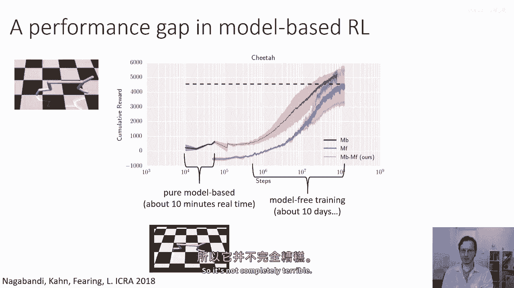

橙色曲线显示了从零开始运行的基本基于模型强化学习算法的结果。红色曲线显示了使用相同数据启动并运行更久的无模型学习者的结果。

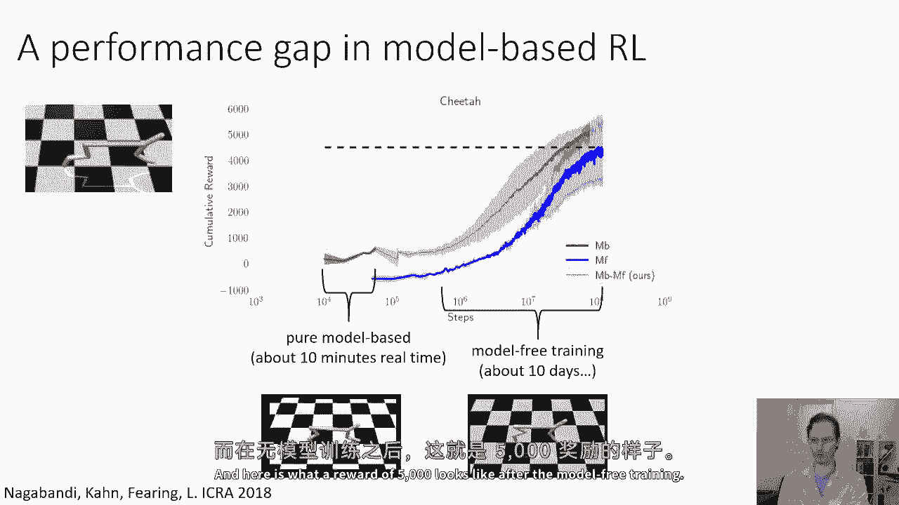

从结果中可以观察到两点：
1.  无模型学习者最终获得了更好的性能。
2.  基于模型的学习者虽然能较快地达到比零稍好的性能，但其最终性能远低于无模型方法。

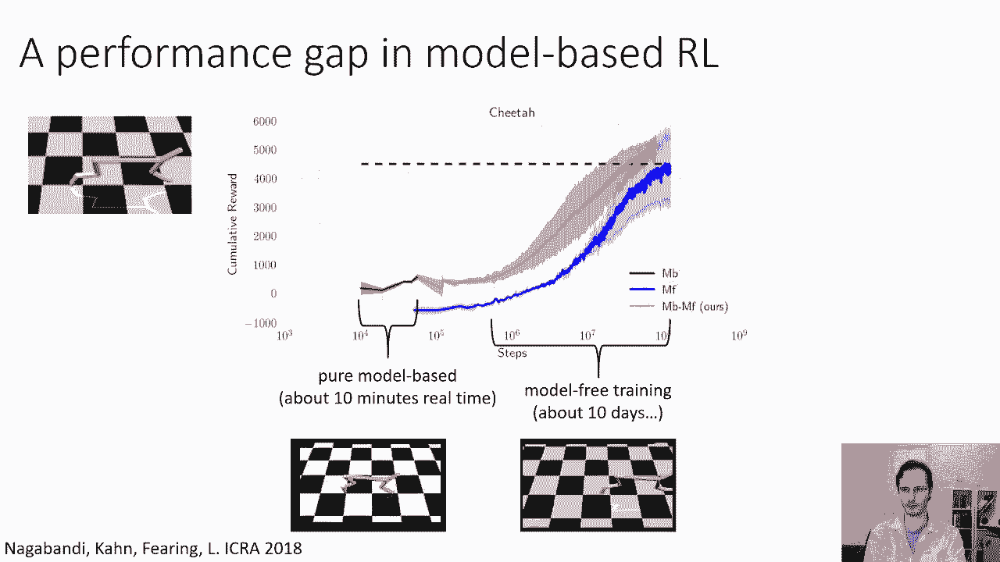

这里的x轴是对数尺度。基于模型的学习者奖励约为500，而无模型学习者的奖励约为5000。

500奖励对应的行为如下，它并非完全失败，但进展缓慢。

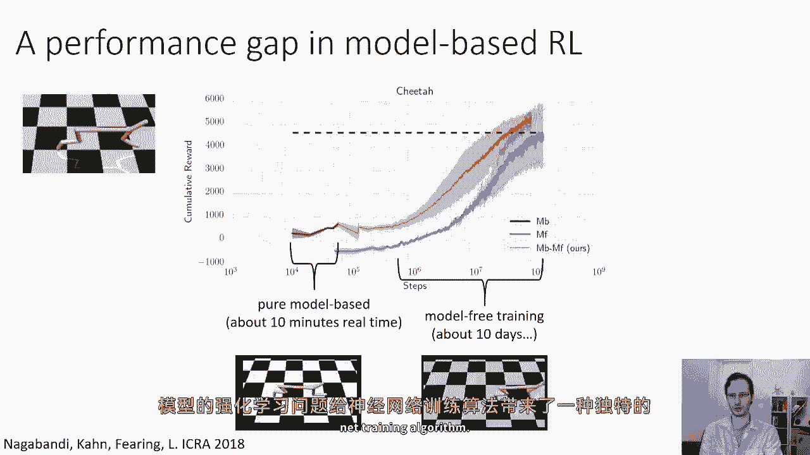

5000奖励对应的行为则如下，表现优异。

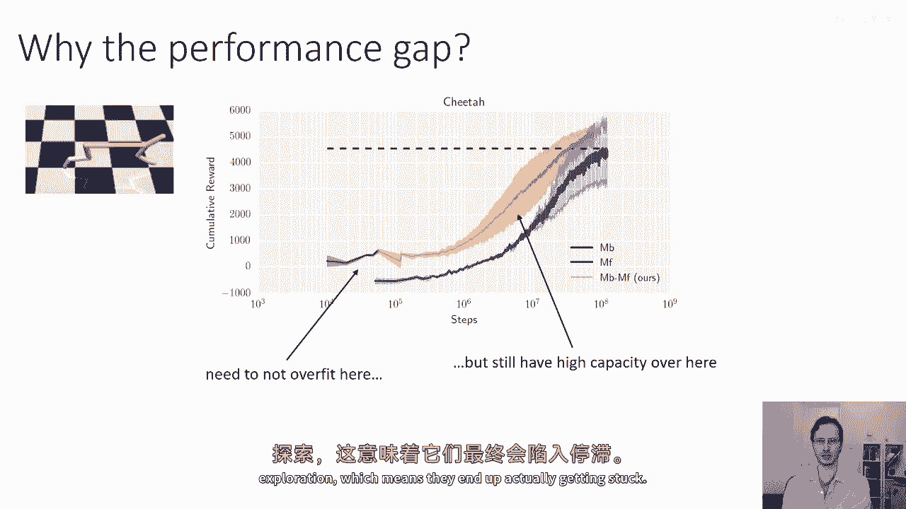

那么，这里发生了什么？为什么基于模型的学习者比无模型学习者差这么多？

---

与常规监督学习问题不同，在基于模型的强化学习这种迭代式数据收集问题中，神经网络训练算法面临一种独特的挑战。

问题的核心在于：
*   我们需要避免过拟合，尤其是在初期数据量很少的时候。
*   但同时，模型又需要有足够的容量来处理后期的大量数据。
*   像神经网络这样的高容量模型在大数据集上表现良好，但在小数据集上容易表现不佳。
*   如果模型在早期表现不佳，它就无法产生有效的探索行为，从而导致智能体陷入困境。

---

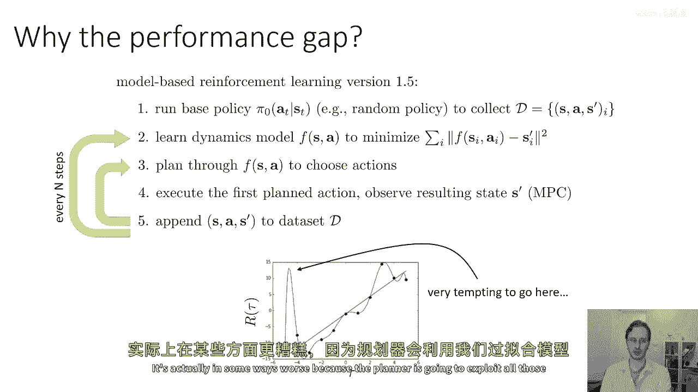

那么，性能差距的主要原因是什么？这个问题主要归结于类似过拟合的问题，并且被数据分布的变化进一步加剧。

以下是经典过拟合的示意图：我们有一组由直线加噪声构成的数据点，如果使用一个非常强大的函数逼近器（如复杂神经网络）去拟合，可能会得到图中蓝色的复杂曲线，它“记住”了噪声而非真实规律。

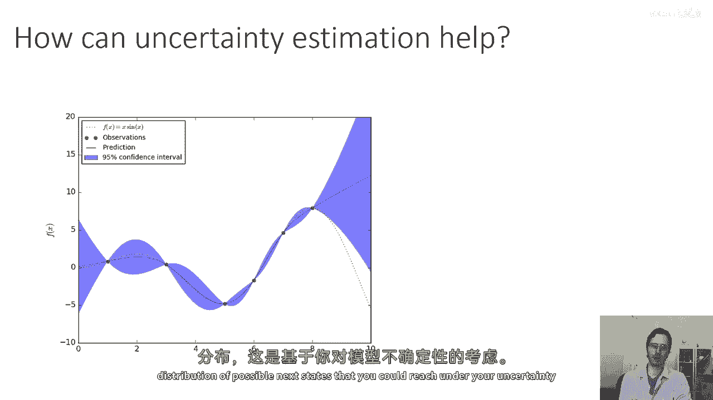

在基于模型的强化学习中，情况更为棘手：
*   我们通过模型进行规划。如果模型对某些轨迹的奖励预测产生了稍微偏向乐观的错误（即预测奖励高于实际），那么对规划器而言，选择这些轨迹将极具诱惑力。
*   这导致了误差在乐观方向被最大化利用。规划器会倾向于利用模型中的所有误差。
*   如果模型过拟合，它会产生许多微小的、不真实的“伪峰值”（预测奖励虚高），这为规划器提供了丰富的利用空间。
*   因此，这比常规的过拟合问题更严重，因为规划器会主动寻找并利用模型中的所有漏洞。

---

好的，那么在这个讲座的部分，我要讨论的是，如何通过适当的不确定性估计来帮助我们解决这个问题。

不确定性估计如何帮助我们做得更好？其核心思想是：对于每个状态-动作对，我们不仅仅预测一个单一的下一个状态 `s'`，而是预测一个可能的下一个状态的**分布**，这个分布反映了在模型不确定性下可能达到的状态。

这之所以是个好主意，可以通过一个比喻来理解：假设你的目标是走到悬崖边欣赏美景（高奖励）。
*   如果你的模型非常自信（不确定性低），你可能会计划直接走到悬崖边，并预期获得高奖励。
*   但如果你意识到模型极度不确定悬崖的精确位置，当你计算在不确定模型下的**预期奖励**时，你会发现：直接走向悬崖边有很高的概率会失足跌落（导致巨大负奖励）。
*   因此，你会自动选择停留在离悬崖更远的安全地带，因为越靠近悬崖，由于模型不确定性，意外跌落的风险（预期负奖励）就越高。

关键在于，即使我们没有刻意制定一个悲观或规避风险的策略，仅仅是在**不确定模型下计算预期奖励**，就会自然产生避免高不确定性区域的行为，前提是该区域可能带来负面后果。

**公式表示**：
在确定模型下，我们选择最大化 `Q(s, a)` 的动作。
在不确定模型下，我们选择最大化 **期望奖励 `E_{p(model)}[Q(s, a)]`** 的动作，其中期望是在所有与当前数据一致的可能模型 `p(model)` 下计算的。

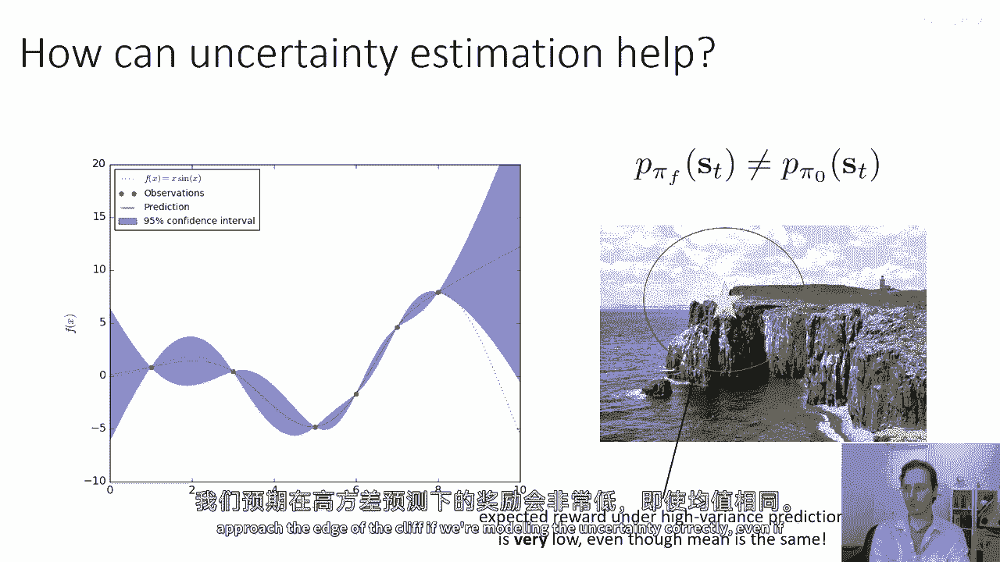

这样做迫使规划者进行“对冲”，选择那些在所有可能未来中都“相当不错”的行动序列。这种不确定性不是关于动态本身有噪声，而是关于**我们不知道真实动态是什么**。存在许多与现有数据一致的可能世界，我们希望采取的行动在这些可能世界的分布下预期良好。

因此，在算法第三步中，唯一的变化是：我们只采取那些在特定（不确定）动态模型下**预期**能获得高奖励的行动。这将避免模型误差被利用的问题，使算法在训练早期（模型不确定性高时）做出更明智的决策。随着模型收集更多数据并变得更精确，它会在高奖励区域逐渐变得自信，最终智能体也能安全地接近目标。

直觉上可以这样想：因为不知道悬崖在哪，你先走到一个相对安全的距离，收集数据， refine 你的模型；下次你就可以基于更精确的模型走得更近。

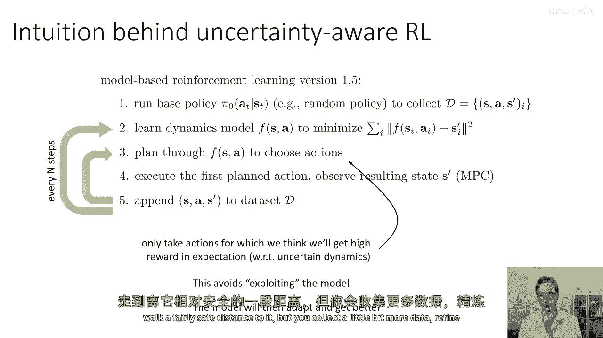

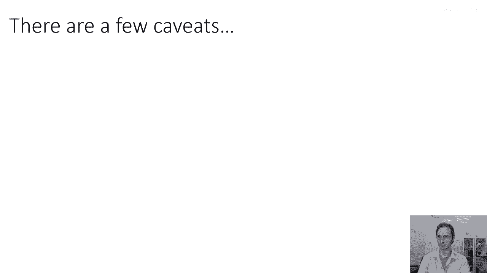

---

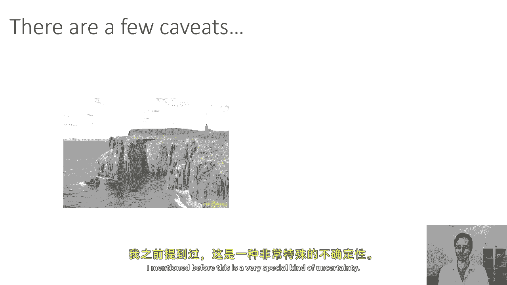

然而，这里有几个非常重要的注意事项。这是一种非常特殊的不确定性处理方式。

以下是关键注意事项：
1.  **需要平衡探索**：如果你过于谨慎，不确定性区间划得太大，并且奖励结构设计不佳，你可能永远无法接近高奖励区域，从而阻碍探索。必须确保不确定性感知不会过度损害探索能力（我们将在后续课程深入探讨探索）。
2.  **预期值 vs. 悲观值**：我们讨论的是计算**期望值**，而不是悲观值或最坏情况值。这不是一个试图最大化最坏情况回报或追求绝对稳健的算法。虽然使用置信区间下限是合理的（特别是在关心安全时），但这里我们聚焦于期望值。
3.  **预期值 vs. 乐观值**：同样，它也不是乐观值。你可以对不确定性持乐观态度，从而鼓励更多的“利用”和探索，但这将是不同的算法（如乐观探索）。计算期望值是一个良好且直观的起点。

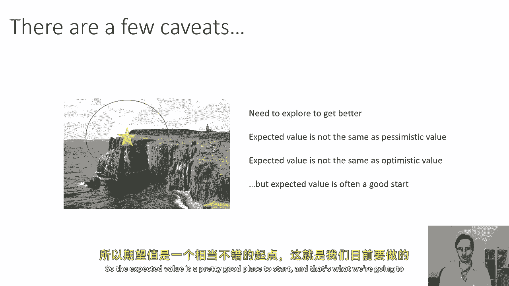

---

本节课中我们一起学习了不确定性在基于模型的强化学习中的关键作用。我们了解到，简单的最大似然模型容易因过拟合和规划器利用误差而导致性能不佳。通过引入并利用模型的不确定性估计，在可能模型的分布下计算预期奖励，可以自然地促使智能体采取更稳健、对冲风险的行为，从而在训练早期做出更好决策，并逐步 refine 模型以达成最终目标。同时，我们也指出了这种方法需要注意平衡探索与利用，并明确了期望值与悲观/乐观策略的区别。