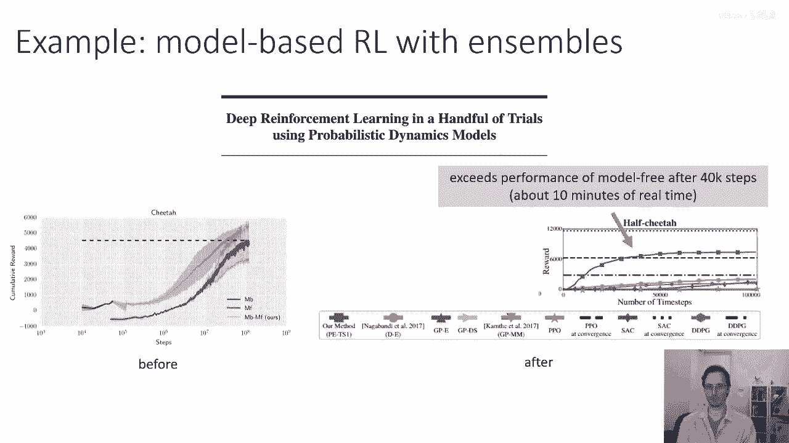
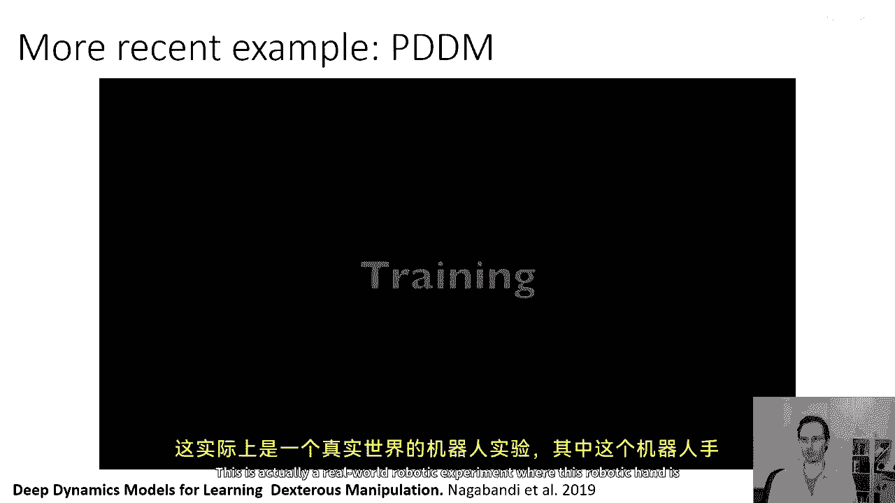
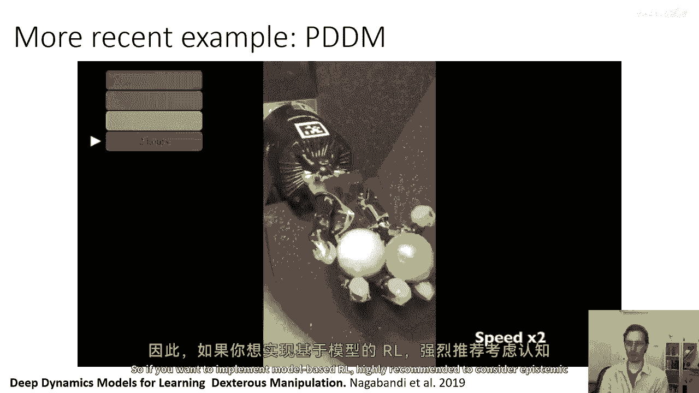
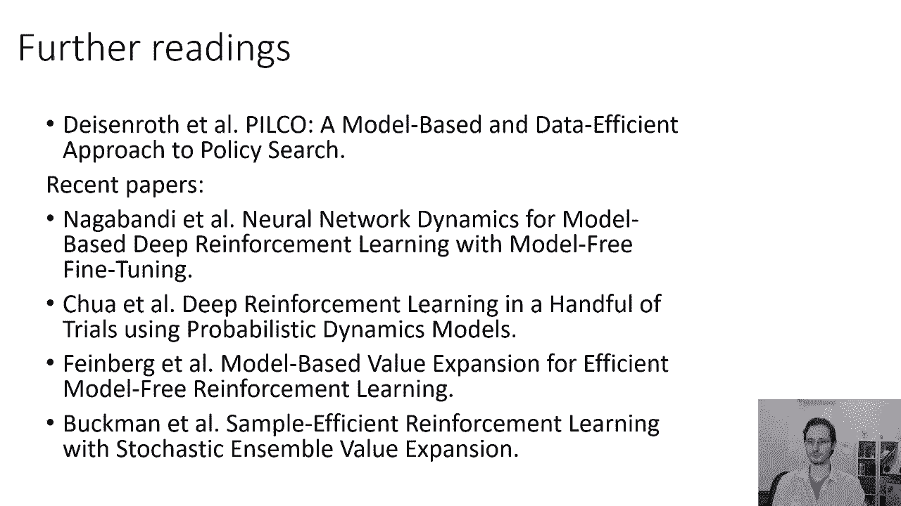

# 48：考虑不确定性的模型预测控制 🧠

在本节课中，我们将学习如何在基于模型的强化学习（Model-Based RL）中，利用考虑不确定性的模型进行决策规划。我们将介绍一个具体的评估流程，并通过实际研究案例来展示其重要性。

---

上一节我们介绍了如何训练考虑不确定性的模型。本节中，我们来看看如何利用这些模型进行控制决策。

假设我们已经通过Bootstrap集成等方法，训练好了考虑不确定性的模型。现在，我们希望在基于模型的强化学习（例如MBRL 1.5算法）中使用它来做出决策。

在规划时，我们优化的目标是最大化从时间 `t=1` 到规划时域 `H` 的累积奖励之和。状态转移由模型 `f` 决定。现在，我们拥有 `N` 个可能的模型。

我们想要做的事情是：选择一系列从 `1` 到 `H` 的动作 `a_{1:H}`，使其在所有可能模型上平均的累积奖励最大化。

因此，我们的目标函数变为对所有模型 `i` 求平均，再对时间步 `t` 求和，计算每个模型预测出的状态所对应的奖励。

如果我们学习到的是确定性模型的分布（例如Bootstrap集成），情况就是如此。如果你有随机模型，那么对于每个模型，你还需要对其内部的随机性取期望。

以下是评估一个候选动作序列 `a_{1:H}` 期望奖励的一般流程：

1.  **采样模型**：从模型参数的后验分布 `p(θ | D)` 中采样一个模型参数 `θ^i`。对于Bootstrap集成，这意味着从 `N` 个模型中随机均匀选择一个。
2.  **采样状态轨迹**：对于每个时间步 `t`，根据当前状态 `s_t`、动作 `a_t` 以及上一步采样的模型参数 `θ^i`，从模型预测的分布 `p(s_{t+1} | s_t, a_t, θ^i)` 中采样下一个状态 `s_{t+1}`。
3.  **计算轨迹奖励**：对这条采样的状态轨迹，计算从 `t=1` 到 `H` 的奖励总和 `R^i = Σ_{t=1}^{H} r(s_t, a_t)`。
4.  **重复与平均**：重复步骤1到3多次，将所有采样得到的奖励 `R^i` 取平均，作为该动作序列的期望奖励估计。

这个流程适用于任何能表示后验分布 `p(θ | D)` 的模型。如果你只有少数几个模型（如小型集成），也可以直接对所有模型求和而非采样，这样更简单。对于贝叶斯神经网络等其他方法，你可以采样不同的参数向量来估计奖励。

当然，这不是唯一的选择。这是一种通过采样来评估奖励的程序。你也可以设想其他方法，例如在每个时间步评估每个模型可能的下一个状态，然后进行矩匹配（如估计均值和方差）来近似真实的状态分布 `p(s_{t+1})`。但上述采样方法是一个简单直接的起点。

在能够评估每个候选动作序列的期望奖励之后，你就可以使用随机采样射击（Random Shooting）或交叉熵方法（CEM）等优化方法来寻找最优动作序列。也可以将LQR等连续优化方法适配到这个设置中，这时“重参数化技巧”（Reparameterization Trick）会非常有用，我们将在后续课程中讨论。

请花点时间理解这个流程，如果你想实现考虑不确定性的基于模型强化学习，这是一张非常重要的幻灯片。

---

这个基本方案有效吗？让我们看一些研究实例。

下图来自论文《Deep Reinforcement Learning in a Handful of Trials》。在半猎豹（HalfCheetah）任务中，标准的MBRL 1.5算法能将奖励从零提升到约500。

而当我们使用Bootstrap集成来实施认知不确定性（Epistemic Uncertainty）估计后，基于模型的强化学习能在相近的时间内获得超过6000的奖励。这表明，尤其是在数据稀缺的情况下，认知不确定性估计对性能有巨大影响。

另一个更近期的例子是使用模型集成（Ensemble）的基于模型强化学习方法，并且是在真实机器人上进行的实验。

在这个实验中，机械手学习在掌心操控物体。它使用了MBRL 1.5算法、一个复杂的模型以及用于不确定性估计的模型集成。通过大约三小时的直接交互学习，机械手可以完成物体在掌心的180度旋转；四小时后，操作已相当可靠。这再次证明不确定性估计是有效的，并且对这些基于模型的方法至关重要。

因此，如果你想实现基于模型的强化学习，强烈建议考虑认知不确定性估计。

---

如果你想了解更多关于认知不确定性与基于模型强化学习的内容，可以参考以下论文：

*   **PILCO**：这篇较早的论文（约2011年）使用高斯过程而非神经网络学习模型。它是奠定认知不确定性估计在基于模型强化学习中重要性基础的工作，并很好地讨论了其原理。
*   **MBRL with Ensembles**：这篇论文引入了模型集成，成功地在HalfCheetah等任务上取得了与无模型强化学习相媲美的结果。如果你对结合模型与不确定性的前沿工作感兴趣，这篇论文值得一读。

---

**本节课总结**

本节课我们一起学习了如何将考虑不确定性的模型用于控制规划。核心是**通过采样模型和状态轨迹来估计候选动作序列的期望奖励**，其流程可概括为：采样模型 → 采样轨迹 → 计算奖励 → 重复平均。我们通过研究案例看到，引入认知不确定性估计能显著提升基于模型强化学习在数据效率与最终性能上的表现，尤其是在复杂或数据稀缺的任务中。这是实现高效、鲁棒基于模型强化学习的关键技术之一。