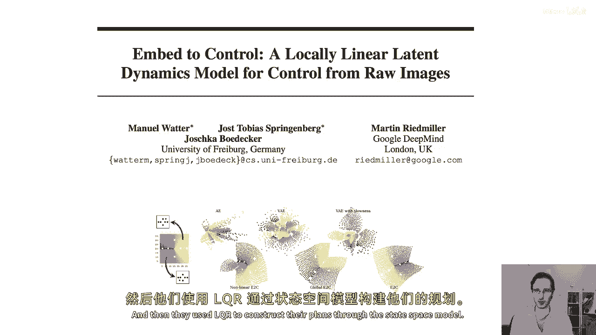
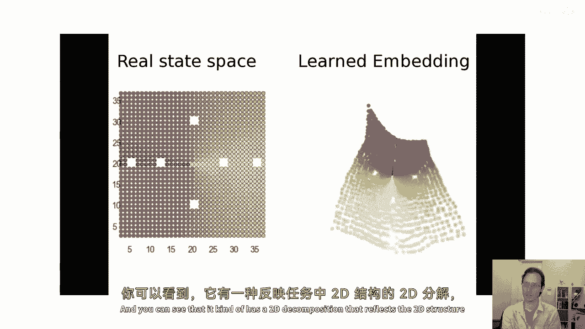
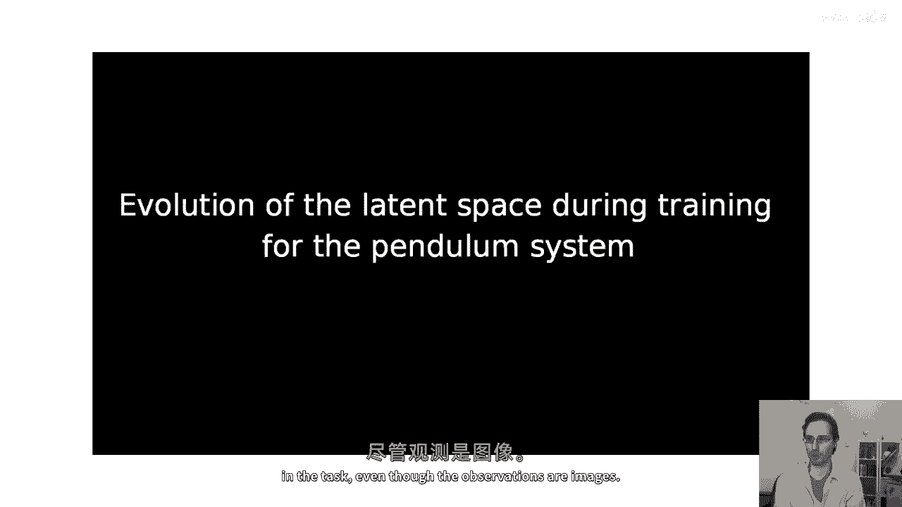
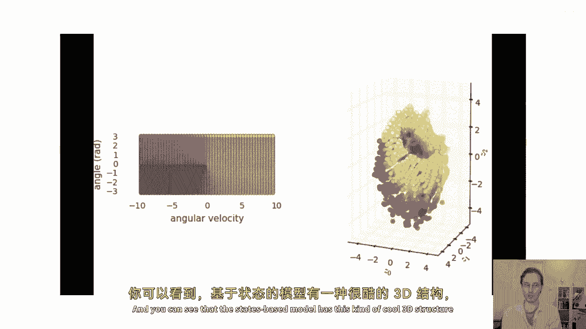
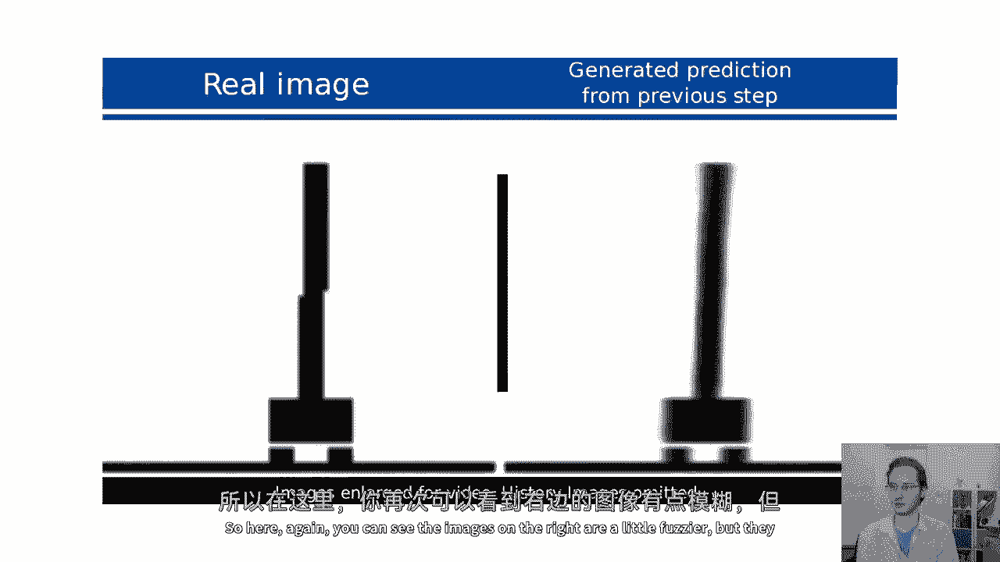
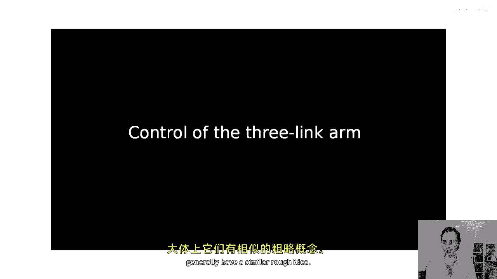
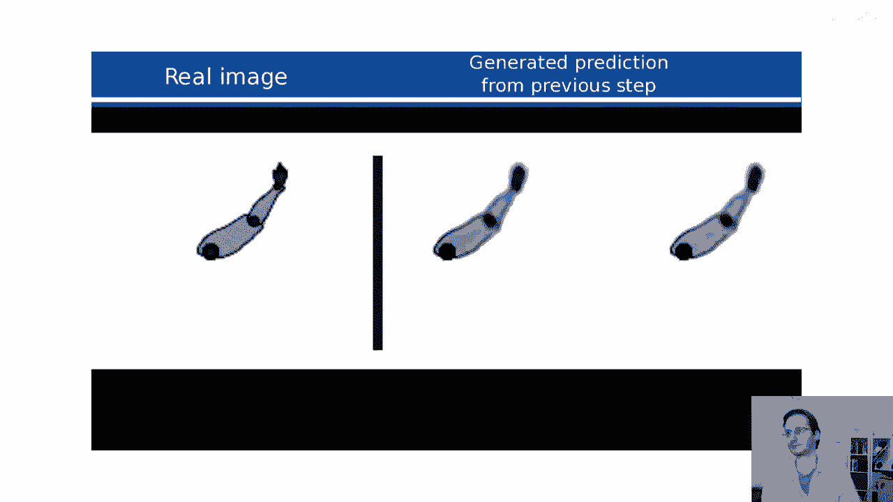
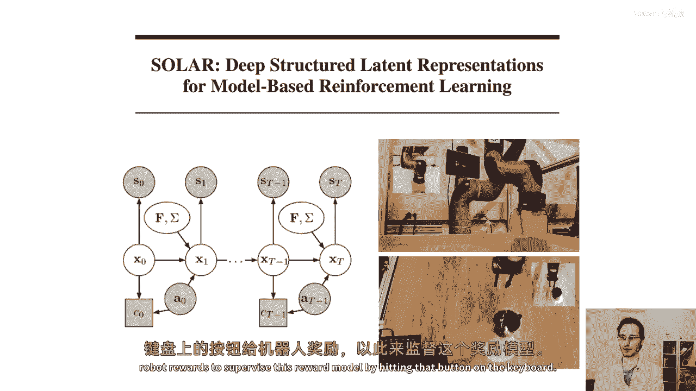
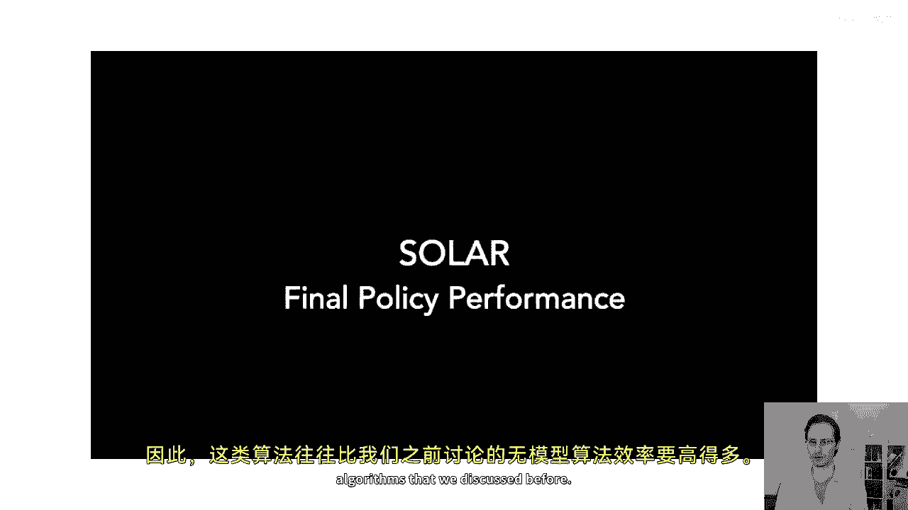
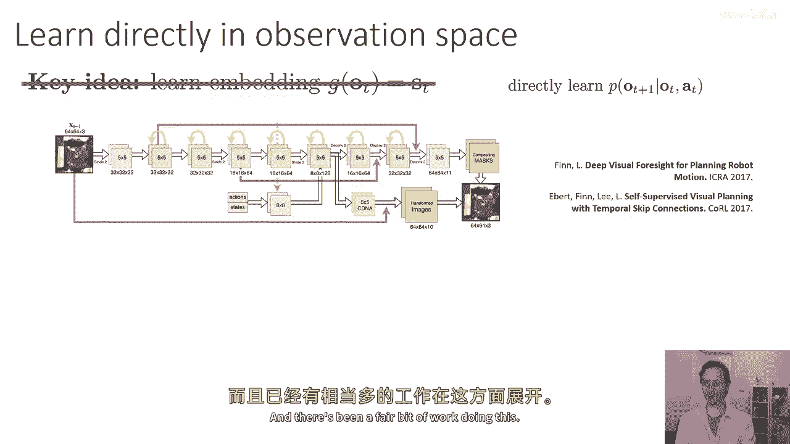

# 49：基于图像的模型强化学习 🖼️🤖

在本节课中，我们将学习如何将强化学习应用于图像观察。我们将探讨处理高维、部分可观察的图像数据所面临的挑战，并介绍两种核心方法：学习潜在状态空间模型和直接在图像空间学习动态模型。

## 概述

基于图像的强化学习面临几个核心挑战。图像的维度非常高，这使预测变得困难。图像包含大量冗余信息。此外，基于图像的任务通常是部分可观察的，即仅凭单帧图像可能无法获知完整状态信息。因此，我们通常需要在部分可观察马尔可夫决策过程的框架下处理问题。

## 部分可观察马尔可夫决策过程

上一节我们概述了挑战，本节中我们来看看部分可观察马尔可夫决策过程的模型。其图形模型包含以下部分：给定前一状态和动作的下一状态分布 `p(s_{t+1} | s_t, a_t)`，以及给定状态的观察分布 `p(o_t | s_t)`。在基于图像的强化学习中，我们已知观察 `o_t` 和动作 `a_t`，但不知道真实状态 `s_t`。

我们的目标是学习状态空间中的转移动态 `p(s_{t+1} | s_t, a_t)`。然而，由于状态 `s` 未知，我们或许可以分别学习观察模型 `p(o_t | s_t)` 和动态模型 `p(s_{t+1} | s_t, a_t)`。这种分离有其优势：观察模型处理高维图像，而动态模型则专注于状态间的时序关系。

## 潜在状态空间模型

上一节我们介绍了POMDP框架，本节中我们来看看如何构建潜在状态空间模型。这类模型有时也被称为潜在空间模型。

以下是模型需要学习的核心组件：
*   **观察模型**：`p(o_t | s_t)`，描述潜在状态如何生成图像观察。
*   **动态模型**：`p(s_{t+1} | s_t, a_t)`，描述潜在状态在动作影响下的转移。
*   **奖励模型**：`p(r_t | s_t, a_t)`，由于奖励通常依赖于状态，而状态未知，因此也需要学习奖励模型。

### 训练目标与挑战

在标准的完全可观察模型中，我们通过最大化对数似然 `log p(s_{t+1} | s_t, a_t)` 来训练。对于潜在状态空间模型，我们需要同时最大化 `log p(o_t | s_t)` 和 `log p(s_{t+1} | s_t, a_t)` 的期望。

核心问题在于我们不知道真实状态 `s`。因此，我们必须使用**期望对数似然**作为目标，期望是在给定所有观察和动作的条件下，对未知状态的后验分布 `p(s_t, s_{t+1} | o_{1:t}, a_{1:t})` 上取得的。

### 近似后验分布

为了估计这个期望，我们需要一个能计算状态后验分布的算法。我们通过学习一个参数化的近似后验分布 `q_ψ(s_t | ...)` 来实现，这个网络通常被称为**编码器**。

以下是几种不同的后验分布选择：
*   **全平滑后验**：`q_ψ(s_t | o_{1:T}, a_{1:T})`。这是最准确但也最难学习的后验，它利用了整个轨迹的信息。
*   **一步编码器**：`q_ψ(s_t | o_t)`。这是最简单的后验，仅根据当前观察猜测状态，但准确性最低。
*   **滤波后验**：`q_ψ(s_t | o_{1:t}, a_{1:t})`。这是一个折中的选择，利用到当前时刻为止的历史信息。

选择哪种后验取决于问题的部分可观察性程度。如果问题接近完全可观察，一步编码器是简单有效的选择。如果部分可观察性严重，则需要更接近全平滑的后验。

### 确定性编码器的简化情况

为了阐述的简单性，我们聚焦于一步编码器的一个特例：**确定性编码器**。如果我们相信问题几乎完全可观察，可以假设状态是观察的确定性函数：`s_t = g_ψ(o_t)`。

使用确定性编码器后，期望运算消失，训练目标简化为同时最大化以下两项：
1.  **动态一致性**：`log p_φ( g_ψ(o_{t+1}) | g_ψ(o_t), a_t )`。这强制编码后的状态遵守学习到的动态。
2.  **自编码重建**：`log p_φ( o_t | g_ψ(o_t) )`。这确保编码后的状态能够重建原始观察。

目标函数 `J(φ, ψ)` 可以写为对所有轨迹和时间的求和：
`J(φ, ψ) = Σ_i Σ_t [ log p_φ( g_ψ(o_{t+1}) | g_ψ(o_t), a_t ) + log p_φ( o_t | g_ψ(o_t) ) ]`

我们可以通过反向传播同时优化模型参数 `φ` 和编码器参数 `ψ`。如果动态是随机的，则需要使用重参数化技巧，这将在后续课程中讨论。

## 算法整合与应用

上一节我们构建了潜在状态空间模型，本节中我们来看看如何将其整合到基于模型的强化学习算法中，并查看实际应用。

整合过程相当直接。我们可以将其插入之前讨论的基于模型的RL算法（如算法1.5）中：
1.  运行基线策略 `π_0` 收集包含 `(o_t, a_t, o_{t+1})` 元组的数据集 `D`。
2.  训练动态模型、奖励模型、观察模型和编码器。
3.  通过模型进行规划（例如反向传播），选择能最大化预期奖励的动作。
4.  执行第一个规划动作，观察结果 `o‘`，并将该转移添加到 `D`。
5.  重复步骤3-4进行内部规划循环。
6.  每隔N步，收集更多数据，重新训练所有模型，进行外部数据收集循环。

### 实际应用示例

文献中有许多成功应用潜在状态空间模型的例子：
*   **“Embed to Control”论文**：在2D导航和倒立摆任务中，学习到的状态空间呈现出与任务物理结构对应的低维嵌入。
*   **局部线性正则化模型**：将状态空间模型正则化为局部线性，使其非常适合迭代LQR等规划器。该方法已成功应用于机器人叠乐高块、推杯子等需要图像输入的任务。经过约20分钟的训练，机器人就能学会执行这些任务，显示出比无模型方法更高的样本效率。

## 直接在图像空间学习模型

到目前为止，我们讨论了学习潜在状态空间模型的方法。但如果我们放弃学习显式的潜在状态，直接回到原始的基于模型的强化学习配方，直接在观察（图像）空间学习动态模型，结果会怎样？

我们可以直接学习 `p(o_{t+1} | o_t, a_t)`。如果存在部分可观察性，我们可能需要使用循环模型，使预测也依赖于历史观察 `o_{t+1} = f(o_{1:t}, a_{1:t})`。

研究表明，直接在图像空间中建模动态可以取得相当好的效果。例如，在一项机器人操控任务中，模型能够准确预测机械臂动作对场景中多个物体产生的复杂影响，并成功完成如抓取订书机等任务。对于包含数十个物体的复杂场景，学习一个紧凑的潜在空间可能非常困难，而直接进行图像预测反而更可行。

## 总结

在本节课中，我们一起学习了基于图像的模型强化学习。我们首先分析了处理图像数据时面临的高维度和部分可观察性挑战。接着，我们深入探讨了**潜在状态空间模型**，它通过学习一个编码器将图像映射到低维潜在状态，并分别训练观察模型和动态模型。我们讨论了使用**确定性编码器**的简化训练过程。然后，我们看到了如何将这种模型整合到标准的基于模型的RL算法中，以及它在机器人任务中的成功应用。最后，我们了解到，另一种可行的方案是**直接在图像空间学习动态模型**，这种方法在处理复杂场景时可能更具优势。两种方法各有千秋，选择取决于具体任务的特性和需求。