# 50：基于模型的强化学习策略篇 📚

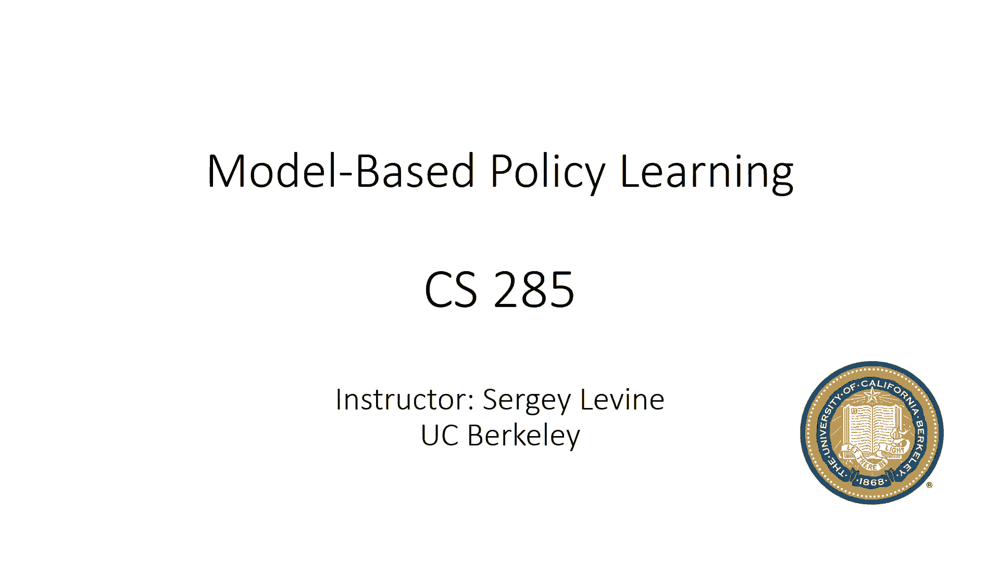

在本节课中，我们将学习如何利用学习到的环境模型来训练一个全局策略（例如神经网络），从而实现完整的基于模型的强化学习。我们将探讨直接通过模型反向传播优化策略所面临的挑战，并介绍当前更有效的解决方案。

---

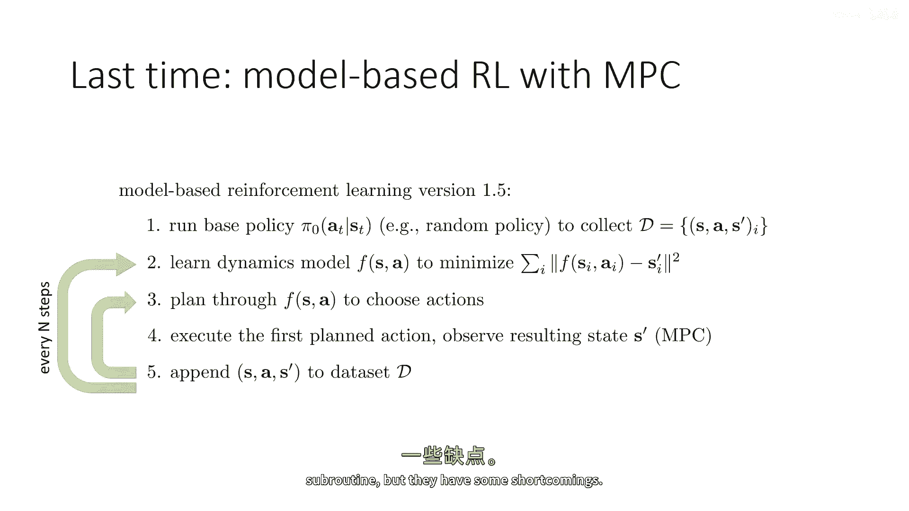

## 🧠 回顾：基于模型的强化学习 1.5 版

上一节我们介绍了结合模型预测控制的基于模型强化学习方法，我们将其称为版本 1.5。

它的工作流程如下：
1.  使用初始策略（如随机策略）收集数据。
2.  训练一个动力学模型 `f(s_t, a_t)`。
3.  使用该模型，通过某种规划方法（如随机打靶法）选择动作序列。
4.  执行计划中的第一个动作，观察新状态，并将该状态转移 `(s_t, a_t, s_{t+1})` 存入数据缓冲区。
5.  在每个时间步都基于最新模型重新规划，以补偿模型误差。
6.  每隔几个时间步或几条轨迹后，使用新收集的数据重新训练模型。

这种方法的优点是能够利用最优控制领域的规划程序。然而，它有一个主要缺点：大部分规划方法（尤其是随机打靶法）是**开环**的。这意味着它们优化的是**给定动作序列**的期望奖励，而不是一个根据状态做出反应的策略。

---

## 🔄 从开环控制到闭环策略

为了克服开环控制的局限性，我们需要转向**闭环**控制。在闭环情况下，智能体不是承诺一系列动作，而是承诺一个**策略** `π(a|s)`。这个策略会在任何状态下选择动作，其目标与原始强化学习问题完全一致。

如果我们能开发有效的闭环控制算法，它就能解决开环方法无法处理的问题。例如，在一个两阶段的数学测试问题中，开环规划者因为无法提前看到题目而选择放弃考试；而闭环策略可以在观察到题目后给出正确答案，因此会选择参加考试。

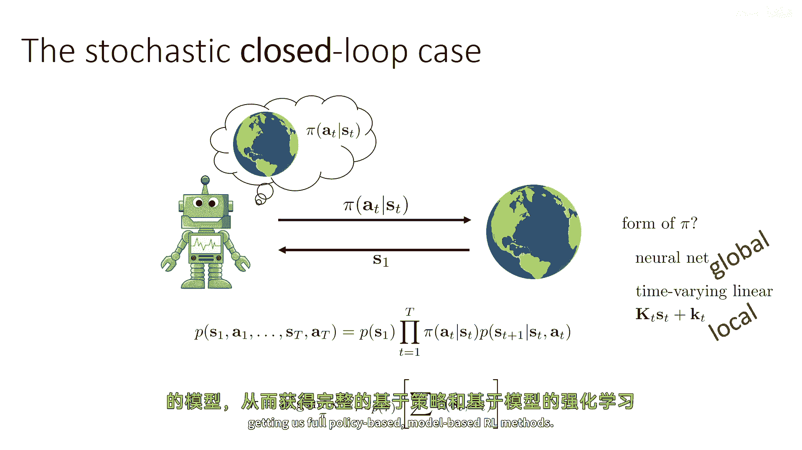

这里的一个关键选择是策略 `π` 的形式。在无模型强化学习中，`π` 通常由表达能力强的函数逼近器（如神经网络）表示，这能提供**全局有效**的策略。而上周讨论的最优控制方法（如迭代LQR）虽然能产生线性反馈控制器，但只在**局部邻域**内有效。

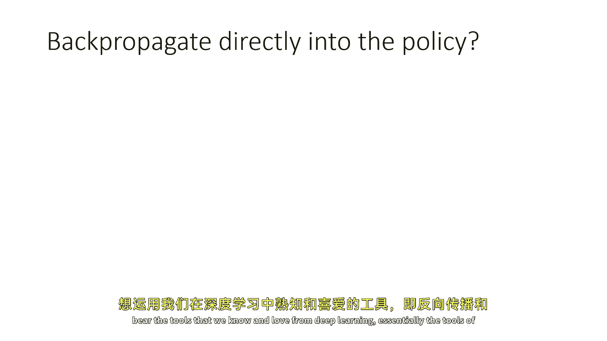

**因此，本节课的核心是：探讨如何利用学习到的模型来训练一个全局有效的策略（如神经网络）。**

---

## 🤖 基于模型的强化学习 2.0 版：一个简单的设想

如果我们对强化学习一无所知，只想运用熟悉的深度学习工具（反向传播和梯度优化）来最大化总奖励 `∑ r(s_t, a_t)`，我们可能会构建如下计算图：

*   **策略函数**：`a_t = π_θ(s_t)`
*   **动力学模型**：`s_{t+1} = f_φ(s_t, a_t)`
*   **奖励函数**：`r_t = r(s_t, a_t)`

我们可以将总奖励作为损失函数（取负号），通过反向传播计算梯度，并优化策略参数 `θ`。对于确定性系统或某些随机系统（如使用重参数化技巧的高斯模型），这完全可以实现。

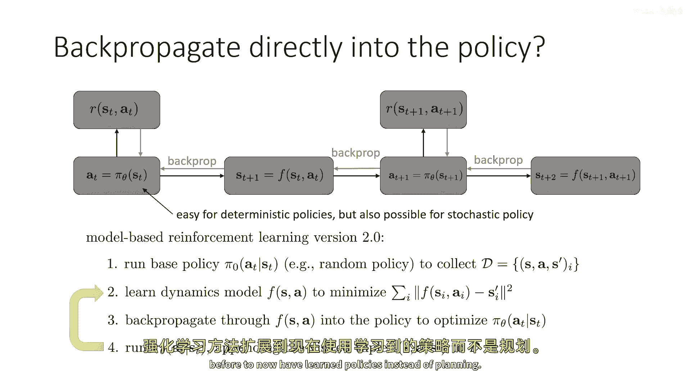

基于此，我们可以构想一个“版本 2.0”的算法：
1.  运行基础策略收集初始数据集 `D`。
2.  在 `D` 上训练动力学模型 `f_φ`。
3.  构建上述计算图，通过反向传播优化策略参数 `θ` 以最大化奖励。
4.  运行更新后的策略 `π_θ`，将新数据加入 `D`。
5.  重复步骤 2-4。

---

## ⚠️ 为什么直接优化常常失败？

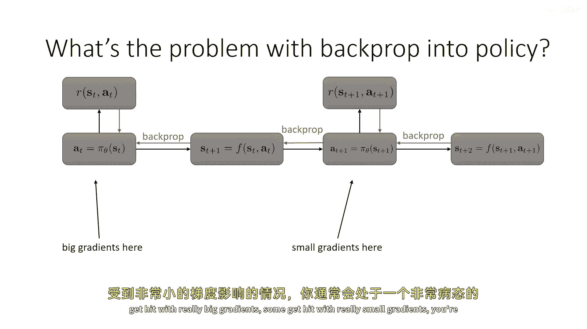

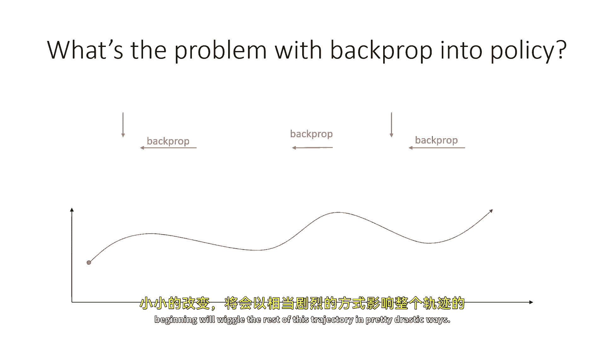

这个看似合理的方法存在一个根本性问题：**梯度传播的数值不稳定性**。

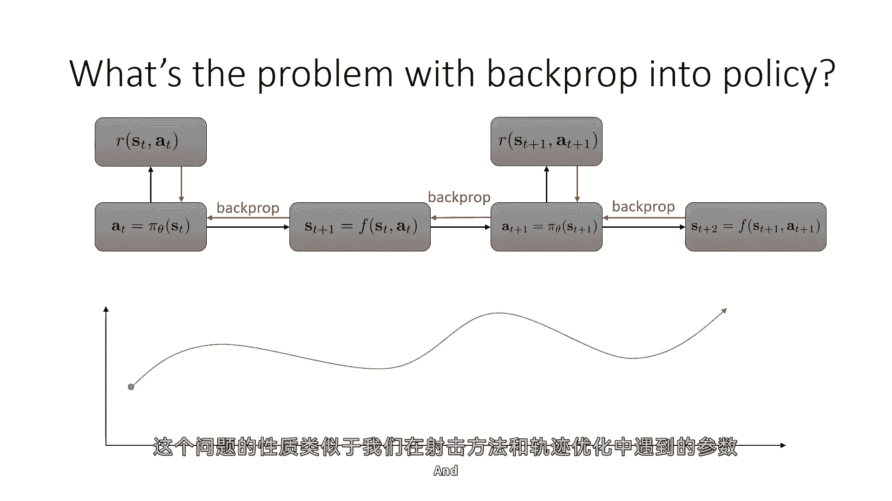

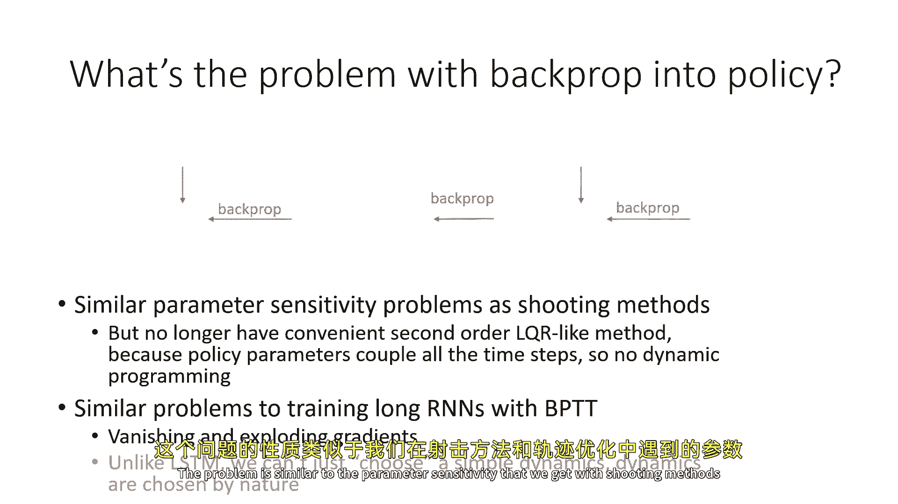

在长序列中，早期时间步的动作通过动力学模型 `f_φ` 的多次复合，对最终奖励产生巨大影响。这导致：
*   **梯度爆炸或消失**：从最终奖励反向传播到早期策略参数的梯度，涉及许多雅可比矩阵 `∂f/∂s` 和 `∂f/∂a` 的连乘。除非这些矩阵的特征值都接近 1，否则梯度会指数级地增大（爆炸）或减小（消失）。
*   **病态优化问题**：不同时间步的参数接收到量级差异巨大的梯度，使得优化问题的条件数很差，难以用一阶梯度方法有效求解。

这与训练普通循环神经网络（RNN）时遇到的“梯度消失/爆炸”问题本质相同。然而，在基于模型的 RL 中，我们**无法像设计 LSTM 那样去设计动力学模型 `f_φ` 的结构**以稳定梯度，因为 `f_φ` 必须尽可能拟合真实环境动态，而真实动态可能本身就具有高曲率。

虽然理论上可以使用二阶优化方法改善，但对于大型神经网络而言，它们通常难以实施且不稳定。

---

## 💡 当前有效的解决方案：将模型用作模拟器

既然通过长时程模型链直接优化策略参数非常困难，那么当前的解决方案可能令人惊讶：**不直接使用模型的梯度，而是将学习到的模型当作一个“模拟器”来生成合成数据**。

具体而言，我们可以：
1.  用学习到的模型 `f_φ` 来“想象”或“滚动出”许多额外的轨迹。
2.  将这些模型生成的轨迹与实际交互数据一起，用于训练**无模型**强化学习算法（如策略梯度、演员-评论家、Q-learning 等）。

**这本质上是一种“基于模型的、加速无模型强化学习”的范式。** 模型的作用是提供更多、更廉价的数据，从而帮助无模型算法更快、更高效地学习策略。

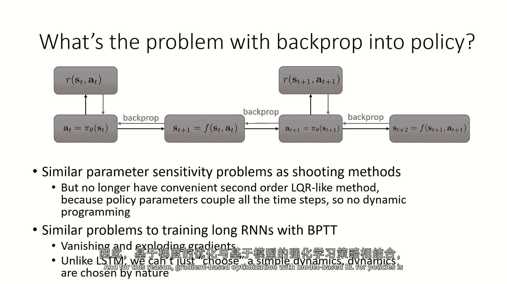

---

## 🎯 本节总结

本节课我们一起学习了：
1.  回顾了基于模型 RL 1.5 版（开环规划）的优缺点，并指出了转向**闭环策略**的必要性。
2.  探讨了直接通过模型反向传播来优化策略参数（版本 2.0 设想）的直观想法。
3.  分析了该方法失败的核心原因：**通过长序列模型链反向传播会导致梯度不稳定和病态优化问题**，且难以像 RNN 那样通过结构设计来解决。
4.  引出了当前更可行的路径：**将学习到的模型作为数据模拟器，用于加速无模型强化学习算法**。

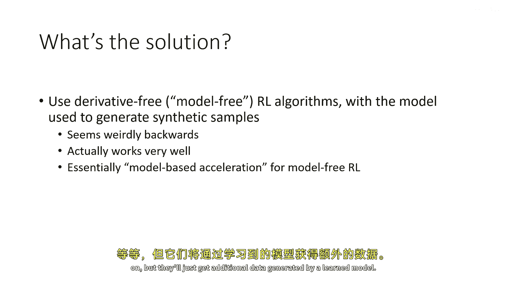

在接下来的部分，我们将深入探讨如何具体实现这种“模型作为模拟器”的算法。