# 51：基于模型的强化学习（含策略）🚀

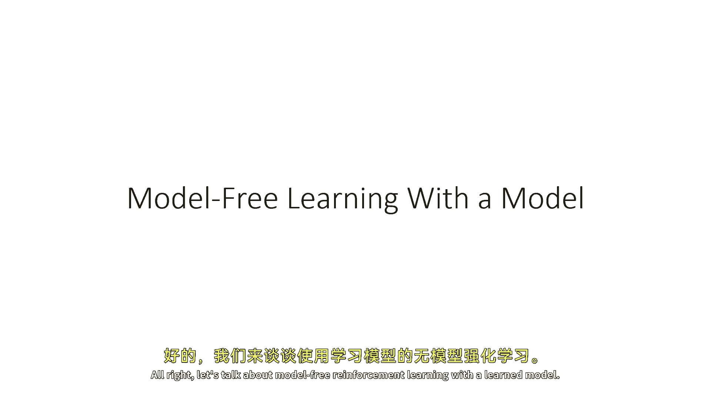

在本节课中，我们将学习如何将无模型强化学习方法与学习到的环境模型结合使用，即基于模型的强化学习。我们将探讨两种主要的梯度估计方法，分析其优缺点，并最终介绍一种在实践中更稳定、更高效的算法框架。

---

## 概述 📖

基于模型的强化学习核心思想是：先利用数据学习一个环境动态模型，然后基于这个模型来优化策略，从而减少与真实环境交互的高昂成本。本节将重点讨论如何将无模型RL中的策略梯度方法应用于学习到的模型上，并分析由此带来的挑战与解决方案。

---

## 策略梯度与路径导数梯度 🔄

上一节我们介绍了基于模型RL的基本概念。本节中，我们来看看两种计算策略参数梯度的核心方法：策略梯度（无模型）和路径导数梯度（基于模型）。

### 策略梯度（似然比估计器）

策略梯度是一种无模型强化学习算法，它也可以被视为一个通用的梯度估计器。其公式不显式包含环境转移概率，这是其关键优势。

**策略梯度公式**：
`∇θ J(θ) ≈ (1/N) Σ Σ ∇θ log πθ(at|st) * Q(st, at)`

这个估计器通过采样来工作，样本可以来自真实环境，也可以来自学习到的模型。它不需要知道环境动态的导数。

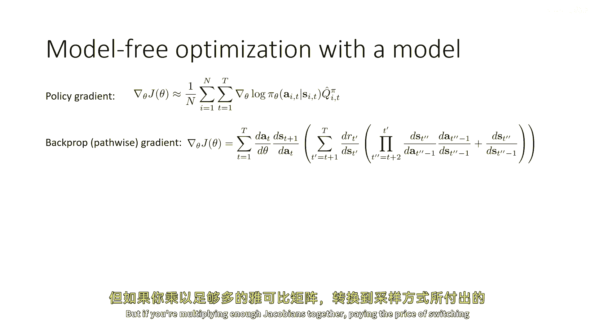

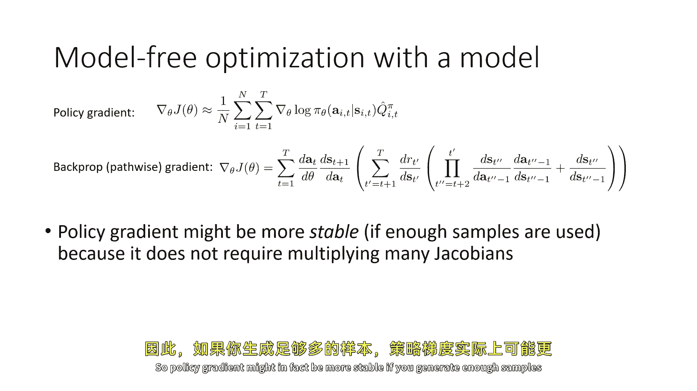

### 路径导数梯度（反向传播梯度）

另一种方法是沿着采样轨迹进行反向传播，计算梯度。这被称为路径导数梯度，它直接应用链式法则。

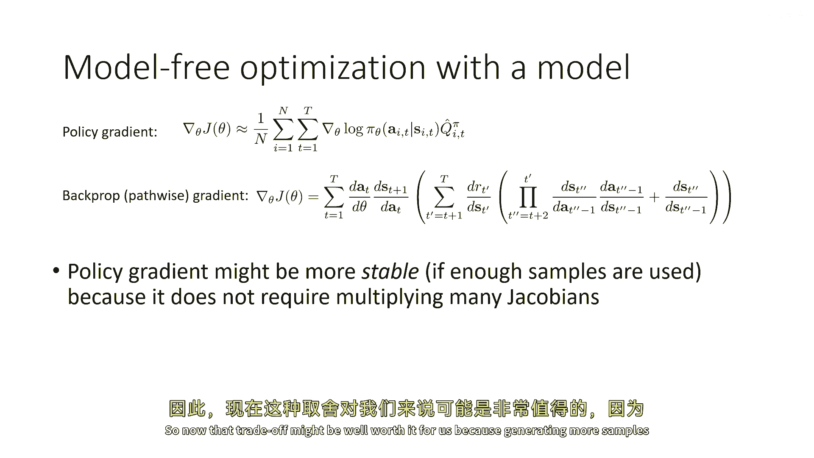

**路径导数梯度公式（简化概念）**：
`∇θ J(θ) 涉及 Σ [∂a/∂θ * (∂s'/∂a * (∂R/∂s' + ...))]`

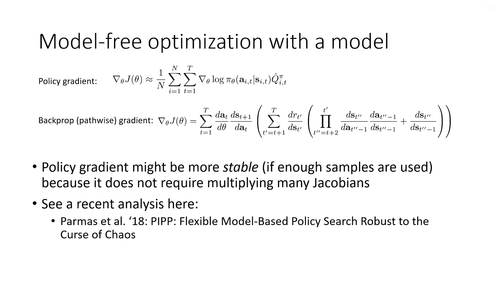

这个表达式包含了状态对动作的导数（∂s‘/∂a）和状态对前一个状态的导数（∂s’/∂s）等雅可比矩阵的连乘。

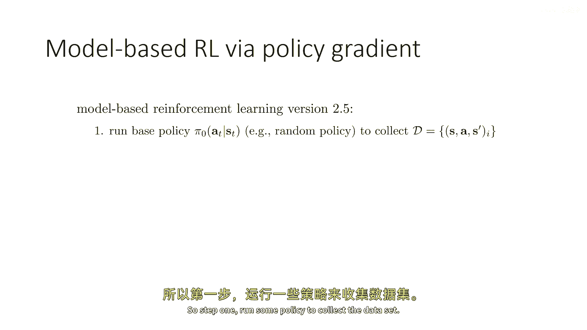

**核心问题**：
当这些雅可比矩阵的特征值大于1时，连乘会导致梯度爆炸；特征值小于1时，则会导致梯度消失。这使得路径导数梯度在长周期问题上难以处理。

**两者对比**：
*   **策略梯度**：避免了雅可比矩阵的连乘，但需要大量采样来获得低方差估计。
*   **路径导数梯度**：理论上更精确，但存在数值不稳定的风险。

在基于模型的RL中，由于从模型中采样成本较低，我们可以承受生成大量样本，这使得**策略梯度方法相比路径导数梯度可能更具吸引力**。

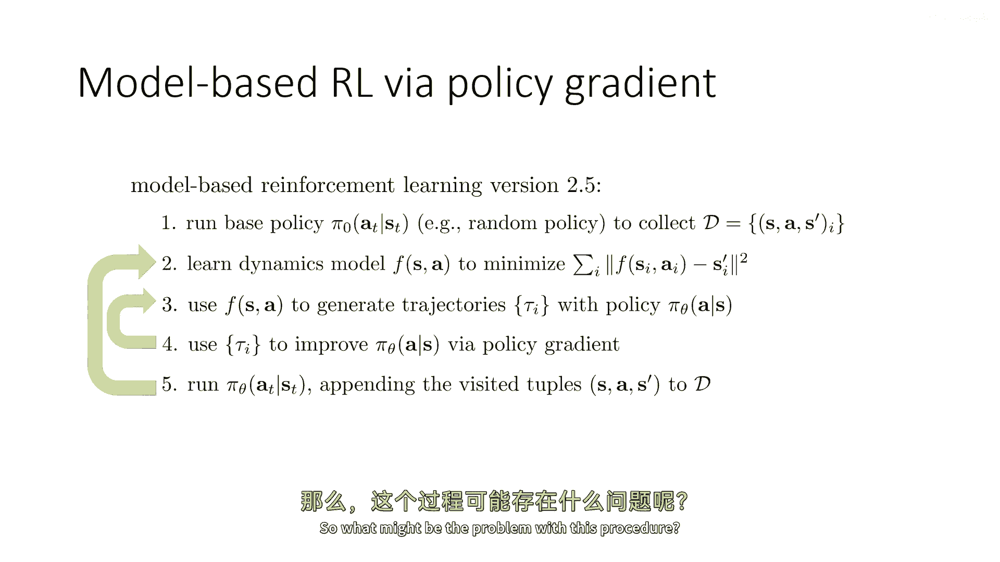

---

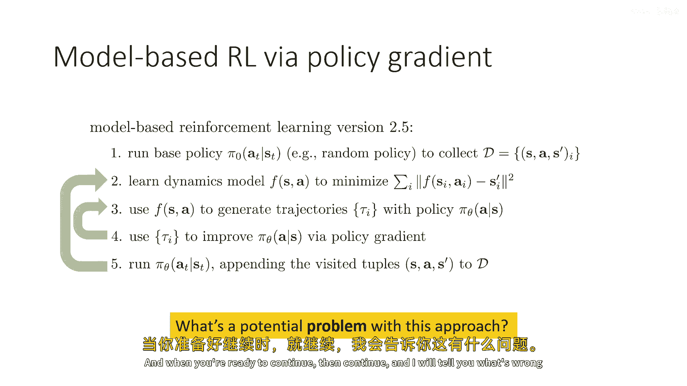

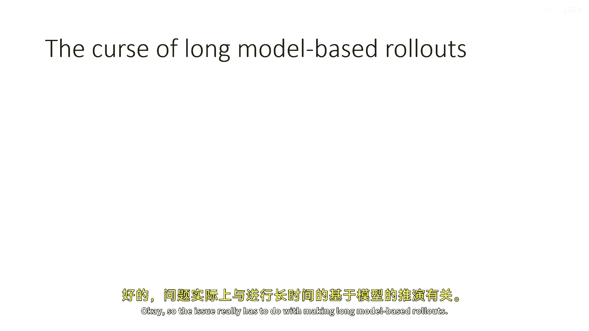

## 基于模型的RL算法 v2.5 🧪

基于以上分析，我们可以设计一个结合了学习模型和策略梯度的算法。以下是该算法的步骤：

1.  **运行策略收集数据**：在真实环境中执行当前策略，收集状态-动作-奖励数据。
2.  **学习动态模型**：利用收集到的数据，训练一个环境动态模型 `fφ(s, a)`。
3.  **模型内策略优化**：
    *   使用学习到的模型 `fφ` 和当前策略 `πθ` 采样生成大量模拟轨迹。
    *   利用这些模拟轨迹，通过策略梯度（或演员-评论家方法）更新策略参数 `θ`。
    *   此步骤可重复多次，无需与真实环境交互。
4.  **重复**：当模型内策略优化到一定程度后，返回步骤1，用更新后的策略在真实环境中收集新数据，并重新训练模型。

这个版本解决了路径导数梯度中的数值不稳定问题，但它仍然面临一个根本性挑战。

---

## 分布偏移与误差累积 ⚠️

上一节我们介绍了算法v2.5，但它存在一个关键问题：**分布偏移**。

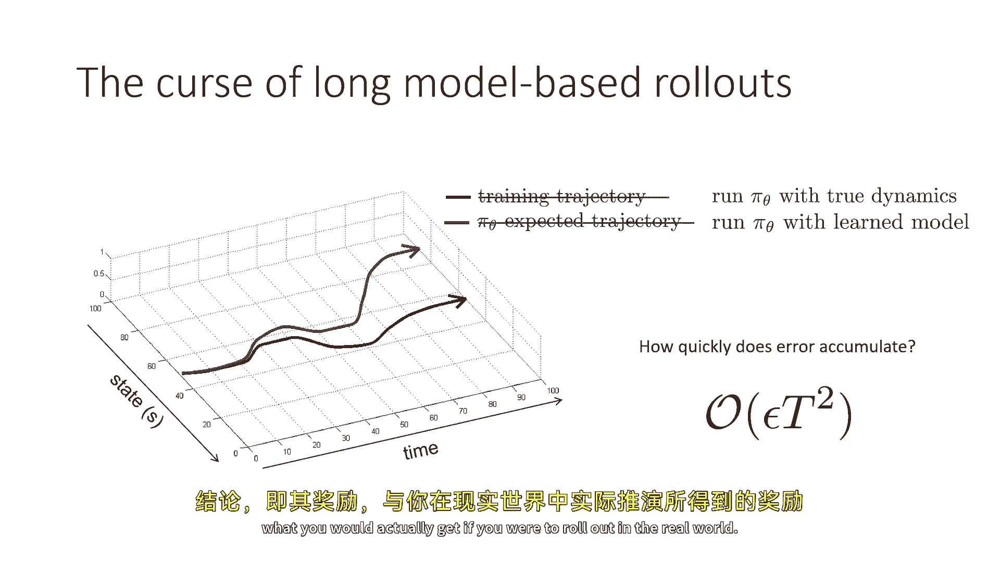

当我们在学习模型 `fφ` 中执行策略 `πθ` 时，模型微小的预测误差会导致下一个状态与真实情况略有偏差。策略在这个略有偏差的状态下会做出决策，进而导致更大的误差。这种误差会随着模拟步数（滚动范围）的增加而**累积增长**。

研究表明，在最坏情况下，误差随滚动步数 `t` 按 `O(εt²)` 的速度累积。这意味着：

*   **长滚动范围**：虽然能评估长期回报，但累积误差大，模拟结果不可信。
*   **短滚动范围**：累积误差小，但无法评估需要长周期才能完成的子任务。

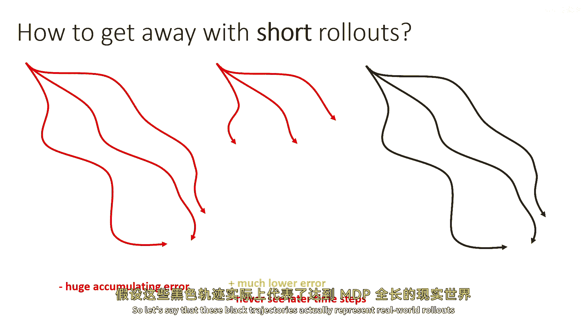

这形成了一个两难困境。

---

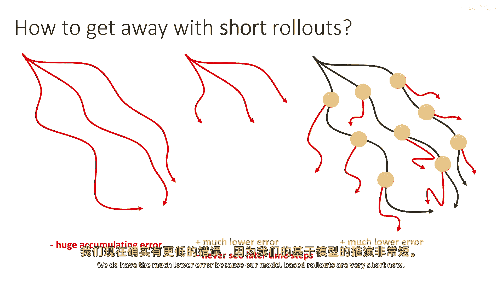

## 基于模型的RL算法 v3.0 🏆

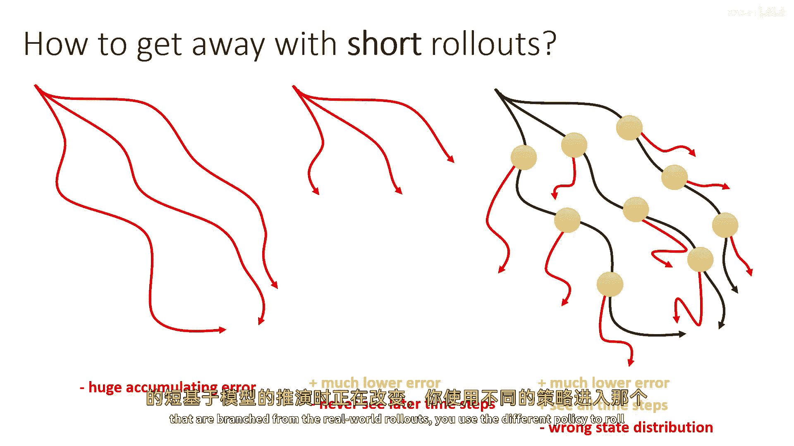

为了解决分布偏移和误差累积问题，现代基于模型的RL算法采用了一个核心技巧：**从真实数据中采样起始状态，然后进行短滚动模拟**。

以下是该算法的核心步骤：

1.  **收集真实数据**：在真实环境中运行策略，收集完整轨迹数据集 `D`。
2.  **训练动态模型**：使用数据集 `D` 训练模型 `fφ`。
3.  **生成模拟数据**：
    *   从真实数据集 `D` 中**均匀采样**一批状态 `s`。
    *   从每个采样状态 `s` 开始，使用当前策略 `πθ` 和学习模型 `fφ` 进行**短滚动模拟**（例如，1-10步）。
    *   将模拟得到的数据（状态、动作、奖励）存入模拟数据集 `Dmodel`。
4.  **策略优化**：混合使用真实数据 `D` 和模拟数据 `Dmodel`，通过**离线强化学习方法**（如Q-learning、演员-评论家）来优化策略和价值函数。模拟数据量通常远大于真实数据量。
5.  **重复**：用优化后的策略回到步骤1，收集新的真实数据。

**这种设计的优势**：
*   **控制误差**：极短的滚动范围将模型误差累积控制在很低水平。
*   **覆盖长期视野**：由于起始状态是从整个真实轨迹中均匀采样的，因此模拟数据也能反映任务中、后期的状态分布。
*   **高效利用数据**：在数据收集周期之间，可以利用模型生成大量数据，大幅提升策略优化效率。

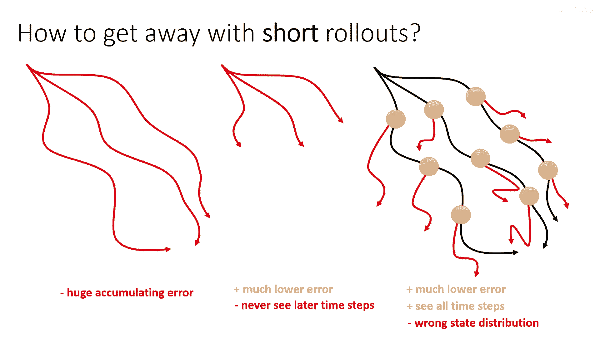

**需要注意**：在步骤4中，由于优化策略与收集真实数据的策略可能不同，会引入策略分布偏移。因此，通常需要配合使用能够处理分布偏移的离线RL算法。

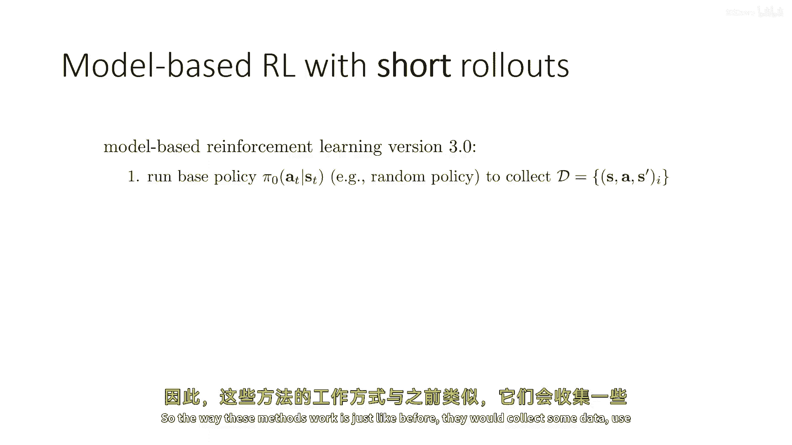

---

## 总结 🎯

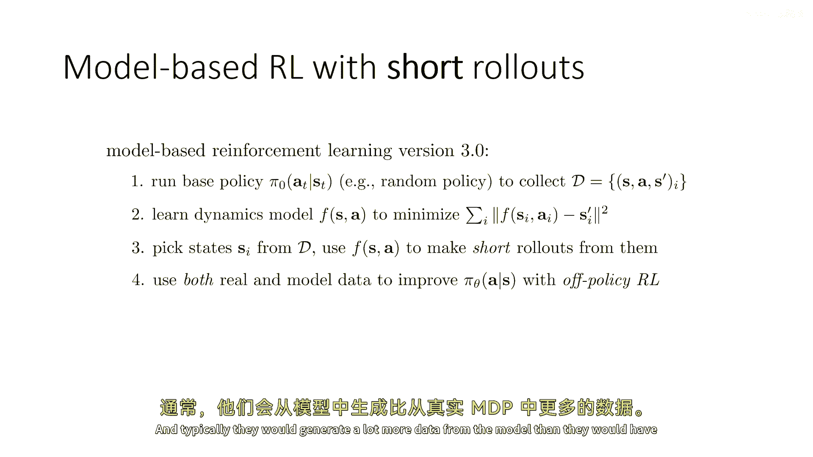

本节课我们一起学习了基于模型的强化学习中策略优化的核心思路：

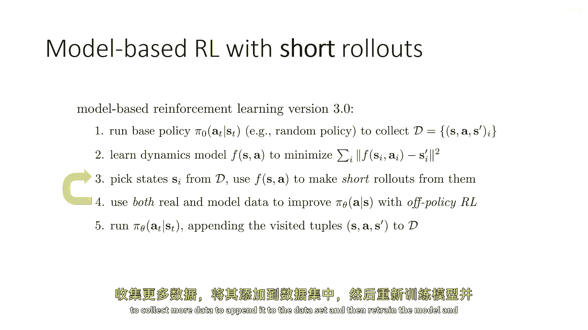

1.  我们比较了**策略梯度**和**路径导数梯度**，指出在基于模型的设定下，通过大量采样来避免雅可比连乘的策略梯度方法可能更稳定。
2.  我们发现了直接使用学习模型进行长周期规划会导致**分布偏移和误差累积**的关键问题。
3.  最终，我们介绍了现代高效的**基于模型的RL算法v3.0**，其核心是从真实数据中采样状态进行**短滚动模拟**，并结合**离线强化学习**方法进行策略优化，从而在控制误差的同时实现了数据的高效利用。

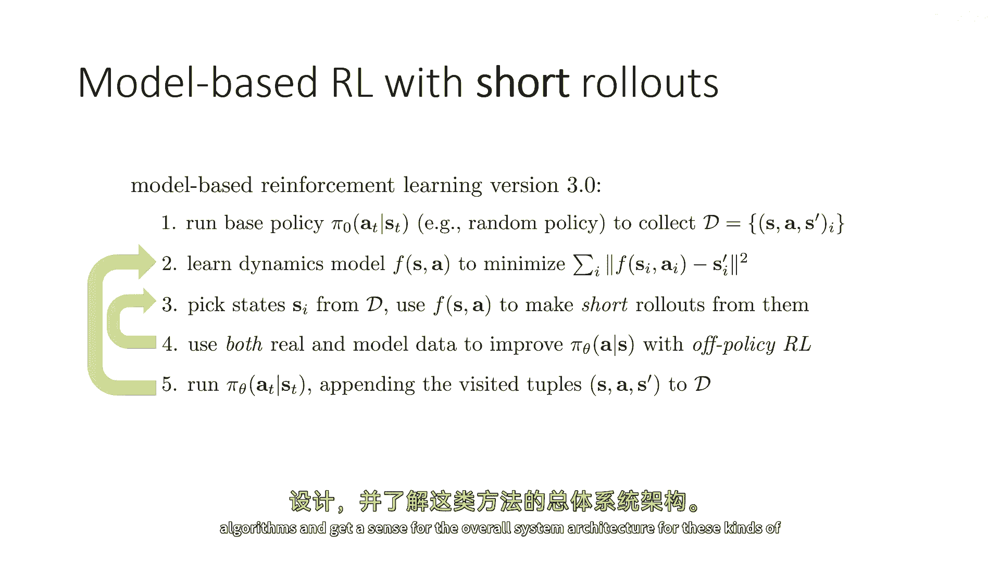

在接下来的课程中，我们将深入探讨这些算法的具体实现细节和系统架构。