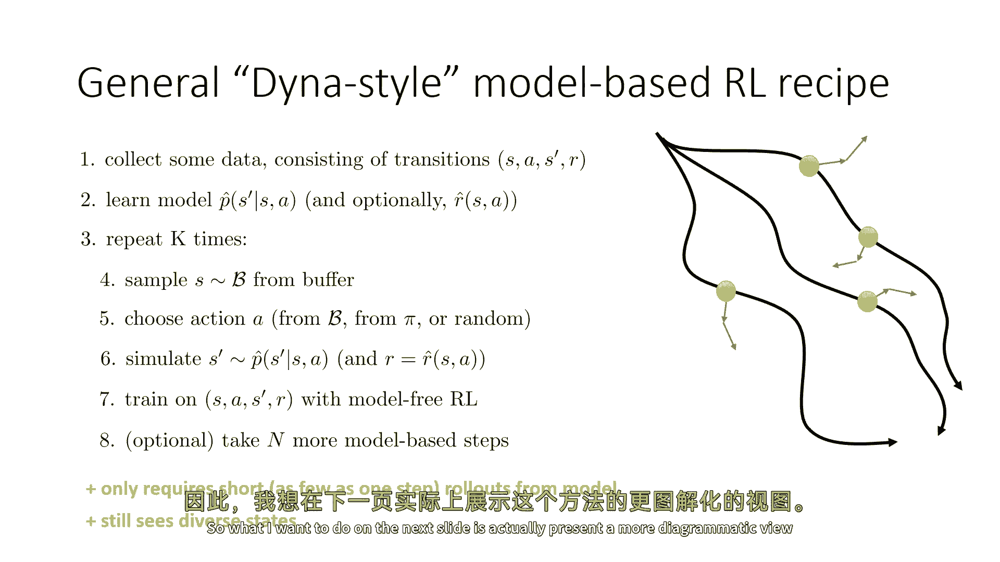
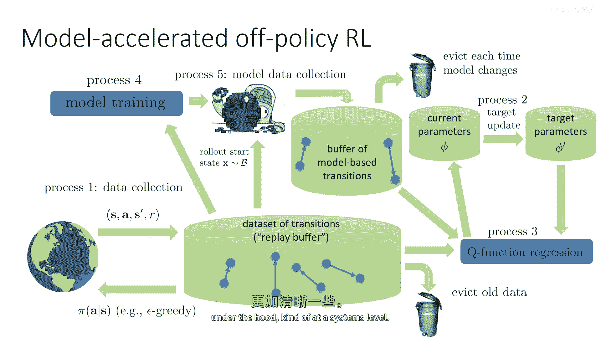
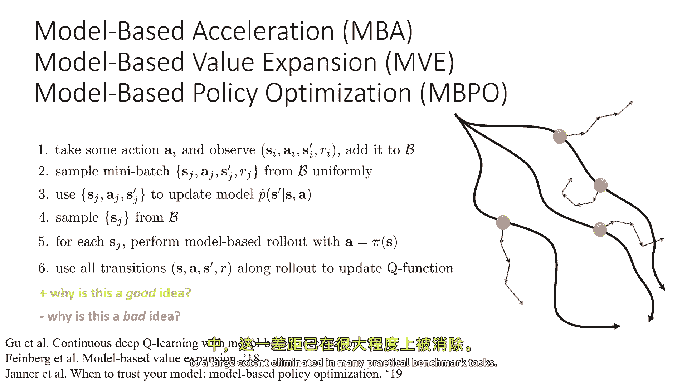

# 52：基于模型的策略强化学习 🧠

在本节课中，我们将学习如何构建基于模型的强化学习算法。我们将从一个经典算法 Dyna 开始，探讨其核心思想，并了解其现代变种如何通过结合模型生成的合成数据来提升样本效率。课程将涵盖算法的设计决策、工作流程以及潜在的优缺点。

---

## 1. 核心设计理念与算法概述

上一节我们介绍了基于模型强化学习的基本框架。本节中我们来看看如何将其转化为具体的算法。

我们有许多设计决策需要作出才能将这种方法转化为现实。对于这个讲座的部分讨论，我们将在第四个步骤中使用基于Q学习的特定离线策略。我想强调的是，我所要讨论的一切都可以用Q函数演员批评方法实现，并且它基本上以相同的方式工作。

我们可以通过回忆在讨论Q学习时，我们谈论了如何训练演员作为学习最大化者，这基本上看起来与Q学习相似。这就是我们在这里要遵循的逻辑。

经典的算法，据我所知，首先提出这个基本概念的方法是被称为 **Dyna** 的东西，由理查德·苏顿在九十年代描述的。Dyna 是这个种类食谱的特定版本，为在线Q学习实例化的，使用了非常短的基于模型的回滚。它使用了基于模型的回滚，长度正好是一步。即使这样，如果你能学习到一个好模型，这也将提供显著的好处。

所以本质上，Dyna 是在线Q学习，它通过模型进行无模型强化学习。

---

## 2. Dyna 算法详解

以下是 Dyna 算法的工作方式，它将非常遵循在线Q学习，但是稍作修改。

1.  **第一步**：使用探索策略选择动作 `a`。这与在线Q学习完全相同。
2.  **第二步**：观察导致下一个状态 `s'` 和奖励 `r` 的过渡元组 `(s, a, s', r)`。
3.  **第三步**：使用此过渡元组更新你的模型和奖励函数。在经典的 Dyna 中，模型和奖励函数都将以一步更新。如果是表格模型，你可能会删除表格中的旧值，以学习率的一些倍数更新为新值。
4.  **第四步**：执行经典的 Q 学习更新。这是对你刚刚观察到的过渡的 Q 学习更新。
5.  **第五步**：重复以下基于模型的程序 `k` 次（`k` 是超参数）：
    *   从缓冲区中采样一些旧的状态动作 `(s, a)`。
    *   使用学习到的模型模拟下一个状态 `s'` 和奖励 `r`。
    *   使用模拟出的 `(s, a, s', r)` 元组再次执行 Q 学习更新。

这里的表达式与以前更新的 Q 函数完全相同，除了 `s'` 和 `r` 现在来自学习模型 `P_hat` 和 `r_hat`。

---

## 3. 设计决策与 Dyna 的泛化

Dyna 过程经典地做出了一些设计选择，那些选择不一定要固定不变。

*   Dyna 使用缓冲区中的状态和动作。一个非常合理的替代方案是按照最新的策略（例如，那个 Q 函数的 `argmax` 策略）选择动作。
*   Dyna 只在模型上做一步。你现在可以做多步。
*   Dyna 在设计上稍微优化了高度随机的系统。对于确定性的系统，如果你将相同的状态和动作通过模型运行，你应该得到之前看到的 `s'`。但对于随机系统，这实际上会产生影响。

所以 Dyna 做出了一些可能稍微奇怪的决定，也许不能从模型的最大性能中挤出所有。这些决定对于预期模型对分布变化非常敏感的情况是好的，因为它实际上避免了所有分布变化问题。在某种统计意义上，这实际上是一个非常安全的算法。

但我们可以推导出 Dyna 的一般化版本，这更接近人们实际使用的。我们可以称它为 **Dyna 风格** 的方法，因为它遵循类似的哲学。

以下是其一般化的形式：

1.  收集包含过渡的数据。这可能只是一个步骤，或者你可能正在滚动许多轨迹。
2.  学习你的模型。可选择性地学习你的奖励模型。有时奖励模型是已知的，但是有时你需要学习它。
3.  进行大量的基于模型的学习。基于模型的学习的每一步都涉及：
    *   从缓冲区中采样一些你见过的状态。
    *   在这些状态下选择一些动作（你可以选择是否从那个缓冲区中选择这个动作，还是从你最新的策略中，甚至使用一些探索策略，甚至完全随机）。
    *   从你的模型中模拟下一个状态。如果你不知道奖励，然后模拟来自你奖励模型的奖励。并且有可能为多个步骤立即这样做。
    *   使用此模拟数据来训练你的无模型 RL 算法（例如，使用模拟数据训练你的 Q 学习算法）。

这是对 Dyna 程序的一种一般化。之前它只需要从模型中获取短滚动，也许只需要一步。因为它仍然访问各种类型的状态，因为你直接从缓冲区中采样那些滚动的起始状态。

存在一类基于现代模型的强化学习算法，所有这些算法本质上都是这种基本食谱的变种。

---

## 4. 系统架构与工作流程

当我以这种文本形式的方式描述这种食谱时，可能会很难理解所有成分都在做什么。所以我想展示这种方法的更直观的视图。

让我们回到深度 Q 学习的图表，作为一个并行过程的集合。我们有一个过程从环境中收集数据，并将数据推入缓冲区。有一个过程会从缓冲区中删除旧的数据。有一个过程会更新目标网络的参数。有一个过程通过从回放缓冲区加载批次数据来执行 Q 函数回归，并更新当前参数。

现在，我们可以将这个流程图和基于模型的加速添加到这个中。这就是前一张幻灯片上的基本过程，只是图形化它：

*   **模型训练过程**：从真实过渡的缓冲区中加载过渡，使用真实过渡来训练你的模型。
*   **模型数据收集过程**：从你的缓冲区中采样一个状态，使用你的训练模型，并运行一个基于模型的短期滚动。最常见的选择是使用你最新的策略（例如，执行 `argmax`）。然后，将从这些模型收集的过渡推入一个 **基于模型的转换缓冲区**。
*   **Q 函数训练过程**：当你在做你的 Q 函数回归时，你将从基于模型的缓冲区中采样一些数据，从真实缓冲区中采样一些数据。通常你将使用更多的合成数据，因为合成数据更加丰富。

我们添加的这个基于模型的额外过程，仅仅是一种方式，用来填充我们将要使用的额外缓冲区，以便为我们的 Q 学习过程加载批处理。

---

## 5. 现代算法变种与权衡

现在，已经在文献中提出了各种算法，这些算法利用这一思想。它们在一些设计决策上略有不同，尤其是在关于用于 Q 学习过程的数据实际上如何使用的问题上。

*   我描述的程序，可能最接近 **基于模型的策略优化 (MBPO)**。
*   你也可以想象使用基于模型的采样来获得更好的目标值估计，但不要用它们来训练 Q 函数本身。这就是例如 **基于模型的价值扩展 (MVE)** 所做的。

从高层次来看，它们全都有这个基本配方：采取一些行动并观察转变，将其添加到你的缓冲样本中；从缓冲中提取一个小批量，使用它来更新你的模型；从缓冲中的一些状态，执行基于模型的回滚，行动来自你的策略；然后使用部署中的所有过渡来更新你的 Q 函数，也许结合一些真实的世界过渡。

**为什么这是个好主意？**
这些方法的一般好处是它们确实更样本效率。模型被用来构建比你在真实 MDP 中收集的数据更多的数据。这些额外数据被包括在 Q 学习过程中。如果模型好，那么 Q 学习将会更好。

**为什么这可能是一个坏主意？**
这种方法有许多额外的偏差来源。最明显的一个是你的模型可能不正确。如果你的模型不正确，那么当你执行那些基于模型的滚动时，你的策略会优化错误的东西。

我们可以通过使用一些关于模型的想法来缓解这些问题。例如，如果你使用模型的集成，额外的随机性可以帮助平均线性误差并减少剥削。

还有一个原因：当我们从缓冲状态开始这些短滚动时，那个状态分布可能非常奇怪。它既不是收集数据的策略状态分布，也不是你当前使用的最新政策状态，它是一种两者的混合。从原则上来说，它可以给你一个非常奇怪的状态分布，而且非常远离你在实践中想要的。那通常意味着你不能太久不收集更多的数据。

我们通常在与这种基于模型的方法中获得的权衡是：它们通常能够显著更快地学习，因为它们使用了基于模型的加速；但它们有时会停滞在一个较低的性能水平，因为额外的模型偏差基本上设定了一个上限。尽管在部署周期较短和精心的设计决策下，这个差距已经到很大程度上。

---

## 总结

本节课中我们一起学习了基于模型的策略强化学习。我们从经典的 Dyna 算法入手，理解了其通过结合真实经验与模型模拟来加速 Q 学习的基本思想。随后，我们探讨了如何将 Dyna 泛化为更现代的 Dyna 风格算法，并了解了其在系统层面的工作流程，包括模型训练、合成数据生成和策略更新等并行过程。最后，我们讨论了这类方法的优势（更高的样本效率）与潜在挑战（模型偏差和状态分布偏移），并简要提及了如 MBPO 和 MVE 等现代变种。掌握这些核心概念，是理解和应用高效模型强化学习算法的关键。