# 53：基于策略的模型强化学习 🧠

在本节课中，我们将探讨一种不同于传统模型的强化学习方法。我们将学习如何通过预测未来状态的分布来评估策略，而不是直接预测下一个状态。这种方法被称为“继任表示”或“继任特征”，它提供了一种介于价值函数和模型之间的视角，有助于更高效地评估和改进策略。

---

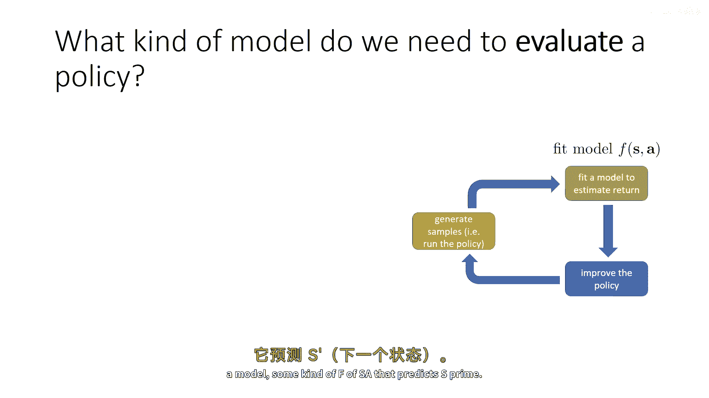

## 1. 从传统模型到策略评估模型 🔄

上一节我们介绍了经典的基于模型的强化学习，其核心是学习一个预测下一个状态 `s_{t+1}` 的模型。然而，从更宏观的算法框架来看，模型的核心作用是**评估策略的好坏**。只要能评估策略，我们就能改进它。

强化学习算法通常包含三个部分：
1.  生成样本（橙色部分）。
2.  拟合模型（绿色部分）。
3.  改进策略（蓝色部分）。

模型（绿色部分）的作用是让我们能够模拟策略的执行，从而估计策略的期望回报。只要我们能计算出策略的价值函数，改进策略就有了依据。

对于一个只依赖于状态的奖励函数 `r(s)`（为简化讨论），策略 `π` 在状态 `s_t` 下的价值函数 `V^π(s_t)` 可以表示为：

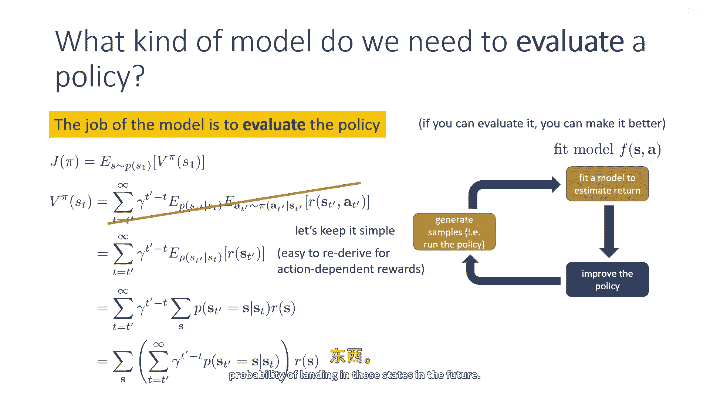

```
V^π(s_t) = E[ Σ_{t'=t}^{∞} γ^{t'-t} r(s_{t'}) | s_t, π ]
```

其中，`γ` 是折扣因子。这个公式表明，价值是未来所有可能状态下所获奖励的折扣总和。

---

## 2. 引入“未来状态分布” 🎯

为了更清晰地理解价值函数，我们可以对上述公式进行代数变换。最终，`V^π(s_t)` 可以重写为：

```
V^π(s_t) = (1 / (1-γ)) * Σ_s [ p^π(s_future = s | s_t) * r(s) ]
```

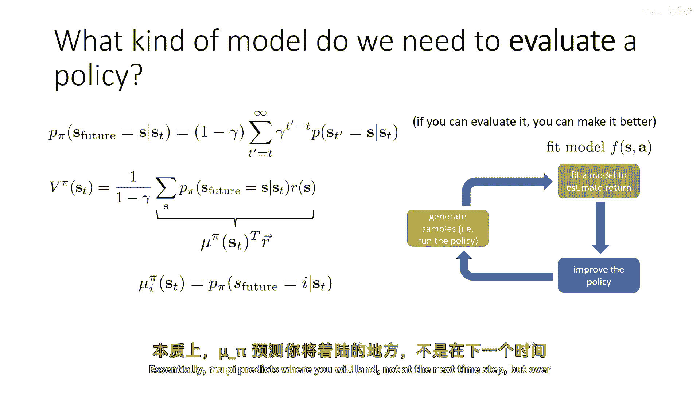

这里，我们定义了一个新的分布 `p^π(s_future | s_t)`。它表示：从状态 `s_t` 开始，遵循策略 `π`，在未来某个（由参数为 `γ` 的几何分布随机确定的）时间步，最终落在状态 `s` 的概率（或概率密度）。

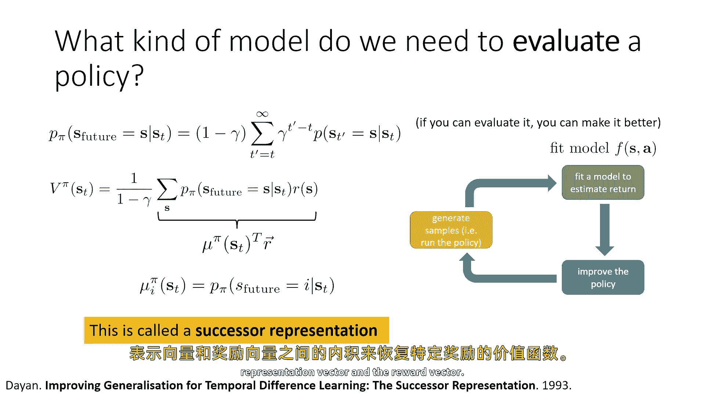

**核心概念：**
*   **继任表示 `μ^π(s_t)`**：这是一个向量，其第 `i` 个分量 `μ_i^π(s_t)` 就等于 `p^π(s_future = i | s_t)`。它预测了在折扣未来的状态下，你将落在每个状态的可能性。
*   **价值函数计算**：如果我们将所有状态的奖励也写成一个向量 `R`，那么价值函数就是 `μ^π(s_t)` 与 `R` 的点积（再乘以常数 `1/(1-γ)`）：
    ```
    V^π(s_t) = (1 / (1-γ)) * μ^π(s_t)^T · R
    ```

`μ^π` 是一种特殊的模型：它像模型一样预测未来状态，但又像价值函数一样进行了折扣平均。更重要的是，它**依赖于策略 `π`**，但**独立于奖励函数 `R`**。

---

## 3. 继任特征的贝尔曼方程与扩展 🧩

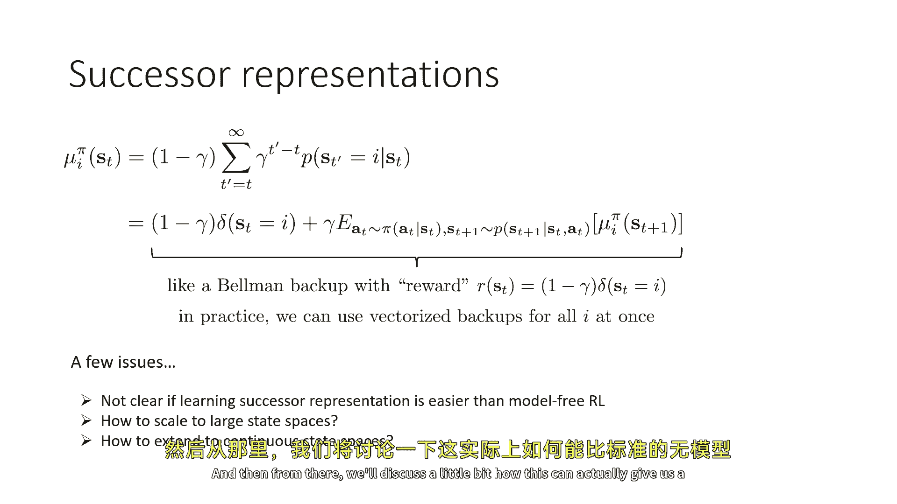

继任表示 `μ^π` 本身也服从一个贝尔曼方程，这使得我们可以用类似价值迭代的方法来学习它。其备份方程如下：

```
μ_i^π(s_t) = (1-γ) * 1_{s_t = i} + γ * E_{a_t∼π, s_{t+1}∼p}[ μ_i^π(s_{t+1}) ]
```

其中 `1_{s_t = i}` 是指示函数（当 `s_t` 等于状态 `i` 时为1，否则为0）。这可以看作是在一个“伪奖励”为 `(1-γ)*1_{s_t = i}` 的环境中进行向量化的值迭代。

然而，直接学习 `μ^π` 有两个挑战：
1.  在高维或连续状态空间中，为每个状态维护一个分量是不现实的。
2.  它可能并不比直接运行无模型RL更简单。

为了解决第一个问题，我们引入**继任特征**。

---

## 4. 降维：从继任表示到继任特征 📉

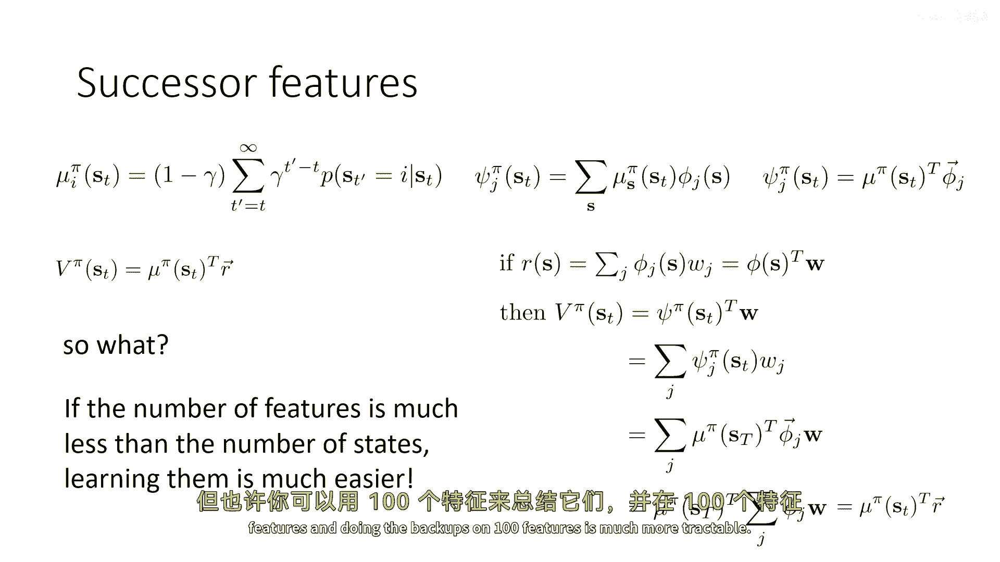

假设我们有一组手工设计或学习得到的特征函数 `φ(s) = [φ_1(s), φ_2(s), ..., φ_n(s)]^T`，其中 `n` 远小于状态总数。

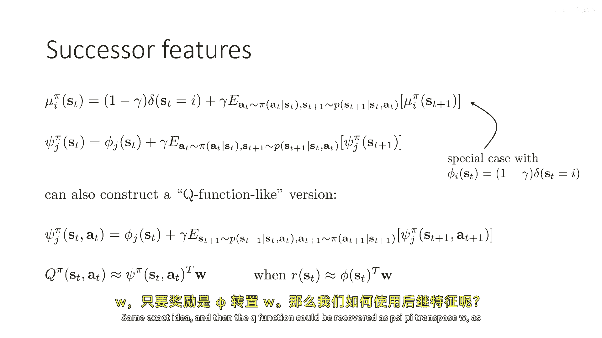

我们定义策略 `π` 的**继任特征 `ψ^π(s_t)`** 为：
```
ψ^π(s_t) = E[ Σ_{t'=t}^{∞} γ^{t'-t} φ(s_{t'}) | s_t, π ]
```
换句话说，`ψ^π(s_t)` 是未来特征值的折扣期望向量。它可以通过特征基 `φ` 将继任表示 `μ^π` 投影到低维空间得到。

**关键性质**：如果奖励函数 `r(s)` 可以表示为这组特征的线性组合，即存在权重向量 `w`，使得 `r(s) = φ(s)^T · w`，那么策略的价值函数可以非常简单地恢复：
```
V^π(s_t) = ψ^π(s_t)^T · w
```

以下是使用继任特征进行策略评估和改进的步骤：
1.  **学习继任特征**：使用数据（通过运行策略或离线获得）和贝尔曼备份方程来训练 `ψ^π`。
2.  **拟合奖励权重**：对于给定的奖励函数，通过线性回归（最小二乘法）求解权重 `w`，使得 `φ(s)^T · w ≈ r(s)`。
3.  **恢复价值函数**：计算 `Q^π(s, a) ≈ ψ^π(s, a)^T · w`（对于动作依赖的版本）。
4.  **改进策略**：根据近似的 `Q^π` 函数，选择 `argmax_a Q^π(s, a)` 来更新策略。注意，这相当于策略迭代的一步，生成的新策略 `π'` 会优于 `π`，但不一定是最优的。

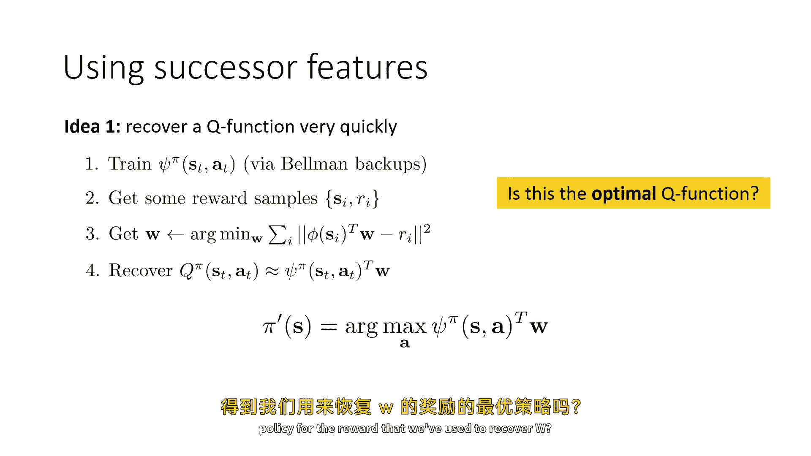

这种方法的优雅之处在于，一旦学好了 `ψ^π`，对于**任何**能由特征 `φ` 线性表示的奖励函数，我们都可以通过快速计算点积来评估策略，无需重新学习模型。

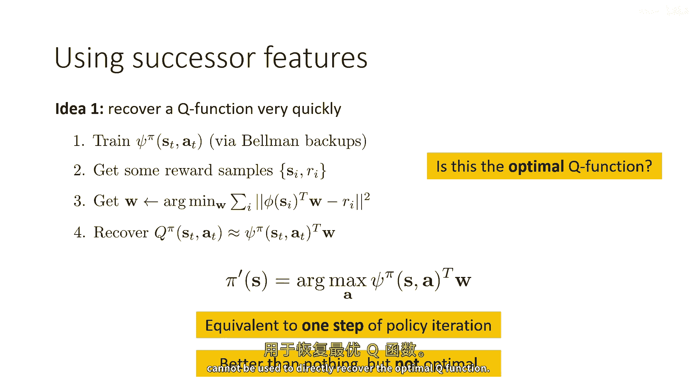

---

## 5. 处理连续状态空间：基于分类器的方法 🎲

在连续状态空间中，“落在某个确切状态的概率为零”，因此我们需要处理概率密度。一个巧妙的方法是训练一个二元分类器 `C(s, s_t, a_t)`。

**分类器任务**：判断一个状态 `s` 是否是来自“以 `(s_t, a_t)` 为起点的未来状态分布”（正例），还是来自整个状态空间的均匀分布（负例）。

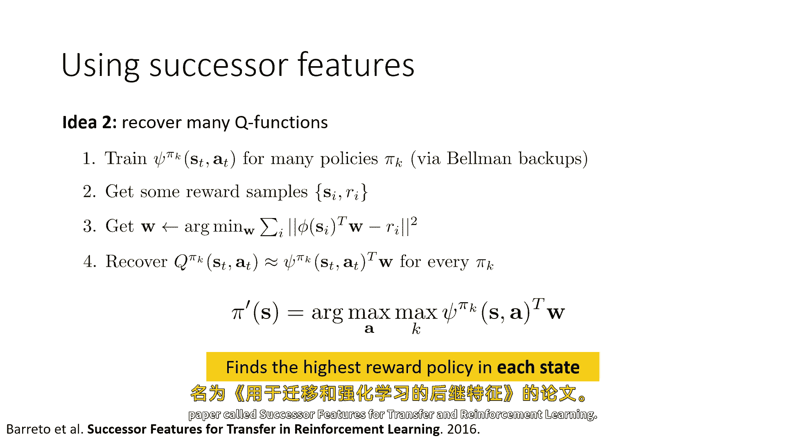

**理论洞察**：这个贝叶斯最优分类器的输出概率与我们需要的关键量——未来状态密度 `p^π(s_future = s | s_t, a_t)`——密切相关。具体来说，它们之间只相差一个与 `s_t, a_t` 无关的常数因子。在比较不同动作的价值以做出决策时，这个常数因子会被抵消。

**训练方法**：
1.  **正例**：从 `(s_t, a_t)` 开始运行策略，从几何分布中采样一个未来时间步，取该时刻的状态。
2.  **负例**：从策略访问过的所有状态中随机采样一个状态。
3.  **训练**：使用标准交叉熵损失训练分类器区分这两类样本。

通过这种方式，我们可以间接地估计出连续空间中的继任密度，进而用于策略评估。

---

## 总结 📚

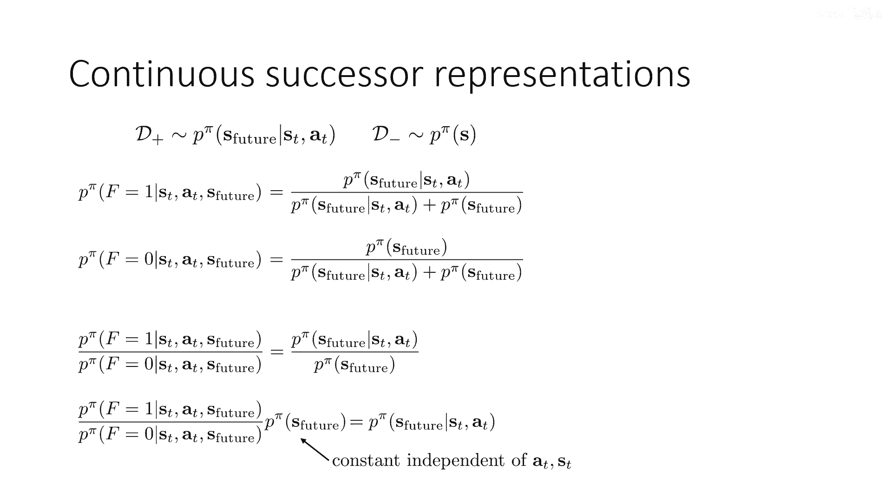

本节课我们一起学习了一种基于策略的模型强化学习前沿思路：
1.  **核心转变**：将模型的目标从预测“下一个状态”重新定义为预测“折扣未来状态分布”，即**继任表示 `μ^π`**。
2.  **核心公式**：价值函数可表示为 `V^π(s_t) ∝ μ^π(s_t)^T · R`。这揭示了模型评估策略的本质。
3.  **降维实践**：通过引入特征基 `φ`，我们将高维的 `μ^π` 投影为低维的**继任特征 `ψ^π`**。当奖励函数位于同一特征空间时，可快速计算价值：`V^π(s_t) = ψ^π(s_t)^T · w`。
4.  **连续空间扩展**：利用训练**二元分类器**来间接估计连续状态下的继任密度，解决了概率为零的难题。
5.  **应用与局限**：该方法能高效复用模型来评估不同奖励函数下的策略，但其产生的是策略 `π` 下的价值函数，用于策略改进时通常只能得到局部更优策略。一种改进方法是学习多个策略的继任特征，并在每个状态下选择价值最高的策略组合。

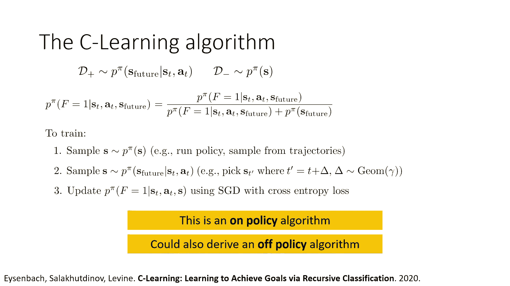

这种方法提供了模型学习的新视角，在迁移学习、快速任务适应等方面具有潜力，是当前强化学习研究中的一个活跃领域。