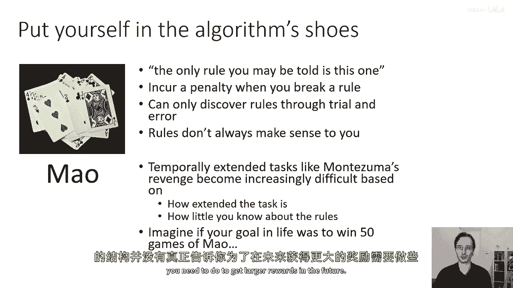
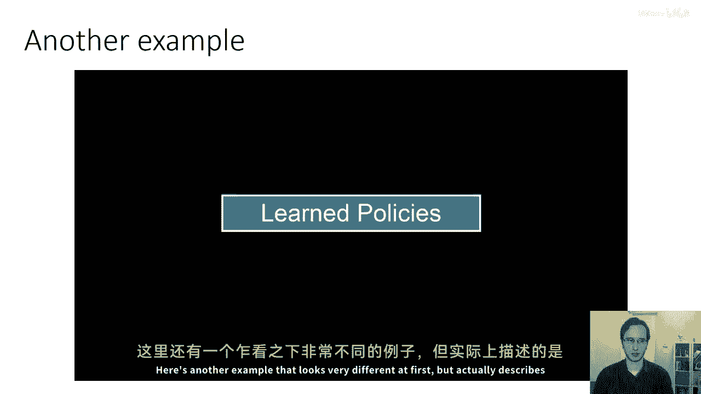
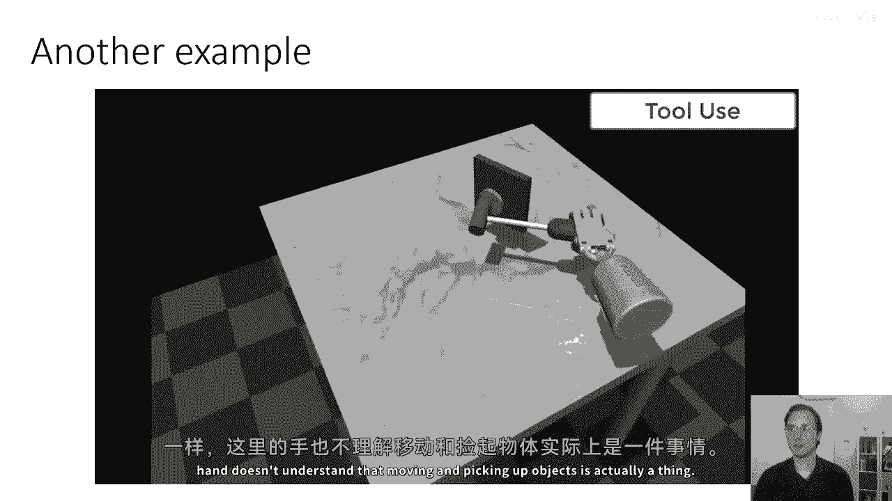
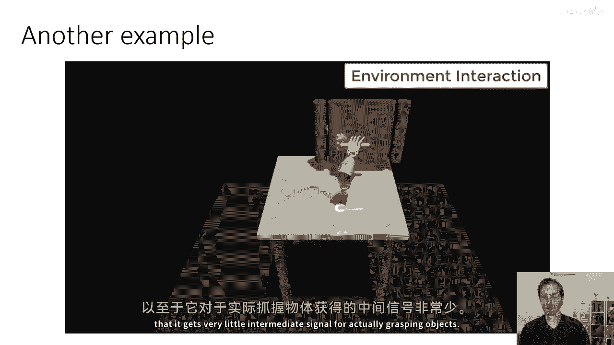
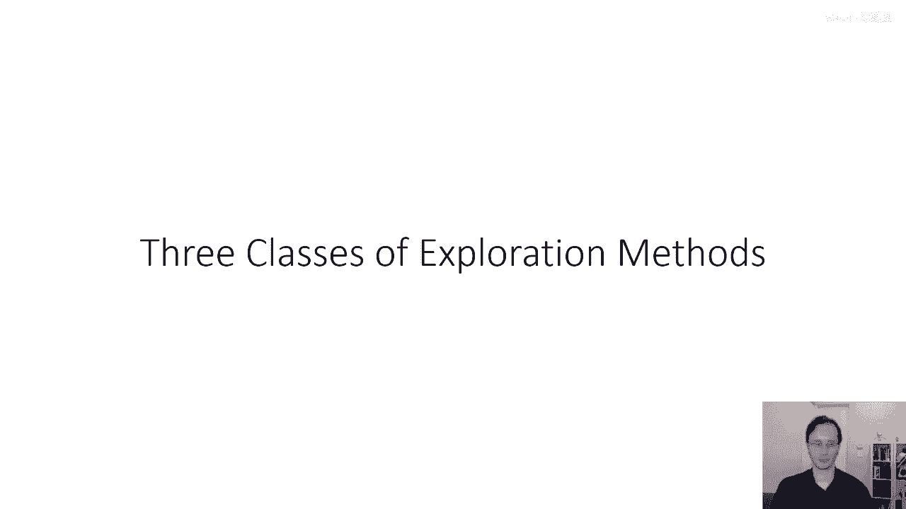

# 54：探索问题基础 🧭

在本节课中，我们将学习强化学习中的核心挑战之一：探索问题。我们将了解为什么在某些任务中，智能体难以学习到好的策略，并正式定义探索与利用的权衡。课程将从最简单的模型——多臂老虎机问题开始，逐步建立起对探索问题的理解。

## 概述：什么是探索问题？

上一节我们介绍了探索问题的背景，本节中我们来看看其正式定义。

探索问题与以下情况有关：任务的奖励信号稀疏或延迟，智能体必须通过尝试新行为来发现能带来高回报的动作序列。这与“利用”已知的高回报行为形成对比。

以下是探索问题的两个关键定义：
1.  智能体如何发现高奖励策略。
2.  智能体如何决定是尝试新行为（探索）以发现可能带来更高奖励的序列，还是继续执行已知的最佳行为（利用）。

它们本质上是同一个问题：为了发现能带来延迟高奖励的复杂行为序列，智能体必须决定何时进行探索。

## 探索为何困难？🤔

上一节我们定义了探索问题，本节中我们来看看它为何具有挑战性。

探索非常困难，无论是从实践上还是理论上。理论上，这是一个难以解决的问题。为了设计探索算法，我们首先需要理解“最优”探索的含义。

我们可以通过衡量策略的“遗憾”来定义探索策略的优劣。遗憾是指智能体的累积奖励与一个理论上知道环境模型的最优贝叶斯智能体所能获得的累积奖励之间的差距。

我们可以将问题设置置于一个谱系上，从理论上可解到理论上不可解：
*   **多臂老虎机问题**：理论上最可解。这是一步、无状态的强化学习问题。
*   **上下文老虎机问题**：像多臂老虎机，但包含一个状态（上下文）。
*   **小型有限MDPs**：可以被精确解决（如通过价值迭代），但理论可追溯性远不如老虎机问题。
*   **大型/无限MDPs**：深度RL真正关心的问题（如图像输入、连续状态空间）。对此，我们通常没有坚实的理论保证，但可以从简单问题的原则性方法中汲取灵感。

## 多臂老虎机：探索的“果蝇”模型 🎰

上一节我们了解了探索问题的难度谱系，本节中我们深入探讨其中最简单且理论最完备的模型：多臂老虎机。

多臂老虎机是探索问题的“果蝇”模型，是一种简单的模型生物。它源自赌场中的老虎机（单臂强盗）。在多臂老虎机中，你有N台老虎机（臂），每台机器在拉动时都会根据一个**未知的**概率分布给出随机奖励。

以下是其形式化定义：
*   每个动作（臂）`a_i` 的奖励服从一个由参数向量 `θ_i` 参数化的概率分布 `p(r | θ_i)`。
*   例如，在二元奖励情况下，`θ_i` 可能表示获得奖励1的概率：`p(r=1 | θ_i) = θ_i`。
*   我们对参数 `θ` 有一个先验信念 `p(θ)`。

智能体的目标是通过一系列尝试，最大化其累积奖励。这可以被视为一个部分可观察的马尔可夫决策过程（POMDP），其隐藏状态是真实的 `θ` 向量，而智能体维护的是对 `θ` 的信念分布 `p̂(θ)`。

## 如何评估探索策略？——遗憾 📉

上一节我们形式化了多臂老虎机问题，本节中我们来看看如何量化评估一个探索策略的好坏。

我们使用**遗憾** 作为核心评估指标。遗憾衡量了你的策略与“已知环境模型的最优策略”之间的性能差距。

遗憾 `R(T)` 的定义公式如下：

`R(T) = T * E[r | a*] - Σ_{t=1}^{T} E[r | a_t]`

其中：
*   `T` 是总时间步数。
*   `a*` 是真正具有最高期望奖励的最优动作。
*   `a_t` 是你的策略在第 `t` 步选择的动作。
*   `E[r | a]` 表示选择动作 `a` 时的期望奖励。

**遗憾的第一项 `T * E[r | a*]`**：表示一个“先知”最优策略在 `T` 步内能获得的期望总奖励（每次都选择最好的臂）。

**遗憾的第二项 `Σ E[r | a_t]`**：表示你的策略实际获得的期望总奖励。

因此，**遗憾 `R(T)`** 表示因未始终选择最优动作而损失的累积奖励。一个优秀的探索算法应能最小化遗憾的增长速度。

## 总结

本节课中，我们一起学习了强化学习中探索问题的基础。
1.  我们理解了探索问题的本质：在奖励稀疏或延迟的环境中，智能体需要在利用已知知识和探索未知可能之间做出权衡。
2.  我们认识到探索问题的理论难度，并引入了从**多臂老虎机**（最简单）到**大型MDP**（最复杂）的难度谱系。
3.  我们深入研究了**多臂老虎机**这一基础模型，将其形式化为一个具有未知参数的学习问题。
4.  我们引入了**遗憾** 作为评估探索策略的核心理论指标，它量化了智能体策略与理论最优性能之间的差距。

在接下来的课程中，我们将基于对遗憾的理解，开始介绍具体的最小化遗憾的探索算法。