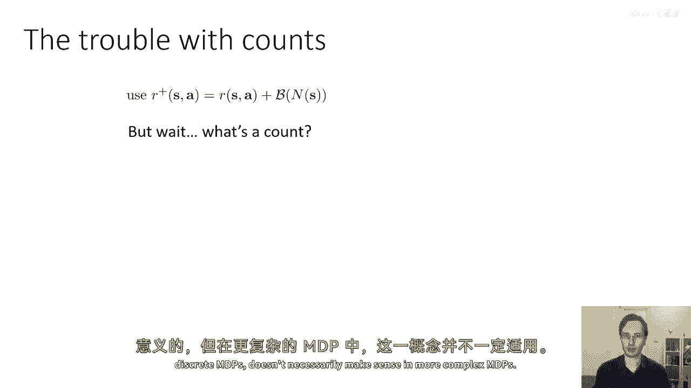
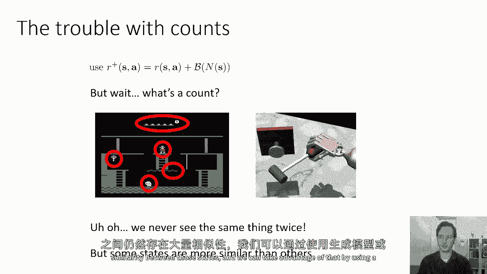
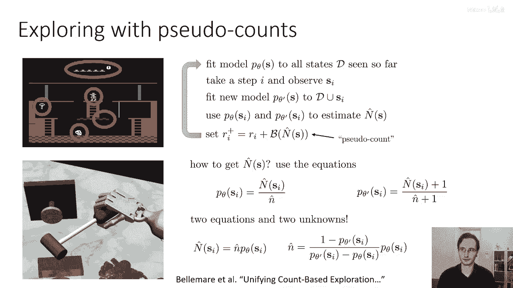
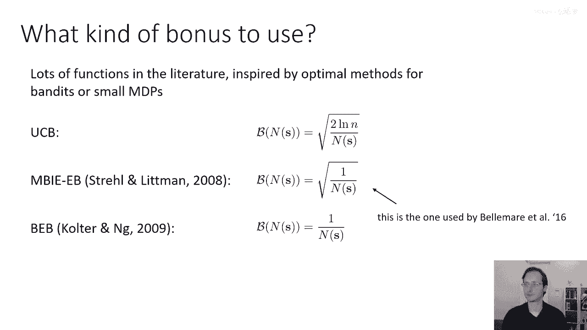
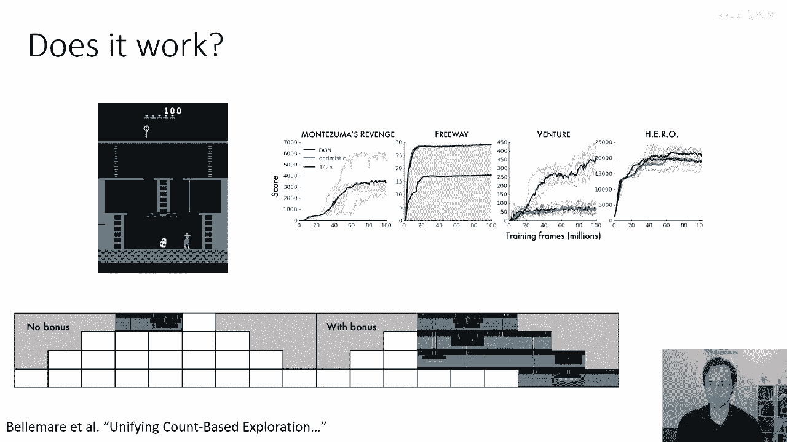
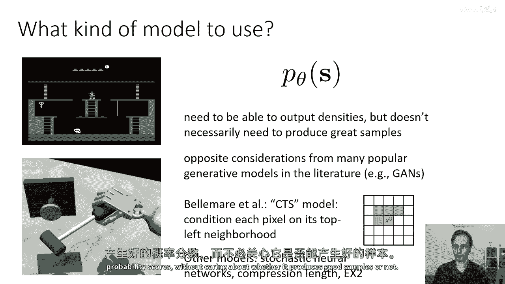

# 56：深度强化学习中的探索算法 🧭

在本节课中，我们将学习深度强化学习中几种实用的探索算法。我们将从多臂老虎机中的经典方法出发，探讨如何将其思想扩展到更复杂的马尔可夫决策过程（MDP）中，并解决在高维或连续状态空间中“计数”的难题。

---

## 探索算法类别概述

上一节我们介绍了探索的基本概念。本节中，我们来看看探索算法的几个主要类别。

1.  **乐观探索**：其核心思想是，访问新的状态是有益的。这通常需要估计某个状态的访问频率或新颖性，并通过探索奖励来实现。
2.  **基于汤普森采样的算法**：这类算法对模型、Q函数或策略的参数维持一个分布，然后根据从这个分布中采样的样本采取行动。
3.  **信息增益风格算法**：这类算法考虑从访问新状态中获得的信息量，并选择能带来高信息增益的状态转移。

接下来，我们将从**乐观探索**的方法开始深入探讨。

---

## 从多臂老虎机到MDP的乐观探索

在多臂老虎机问题中，我们学习过一种平衡探索与利用的规则：上置信界算法。其选择动作的公式为：

`动作 = argmax [ 估计的平均奖励 + sqrt(2 * log(t) / N(a)) ]`

其中，`N(a)`是拉动臂`a`的次数。公式中的第二项就是一种**探索奖励**，它随着`N(a)`的增加而减少。

在强化学习中，我们可以将这个思想扩展到MDP设置，创建**基于计数的探索**。我们不再计数动作，而是计数访问某个状态-动作对`(s, a)`或某个状态`s`的次数，记为`N(s)`，并据此添加探索奖励。

以下是具体做法：

我们定义一个新的奖励函数 `R+(s)`：
`R+(s) = R(s) + f( N(s) )`
其中`R(s)`是原始奖励，`f`是一个随`N(s)`增加而减少的函数，例如 `1 / sqrt(N(s))`。

然后，我们可以简单地使用`R+`作为新的奖励函数，并应用于任何强化学习算法。这种方法模块化程度高，但需要注意两个问题：一是需要调整探索奖励的权重，二是需要解决“如何计数”的问题。

---

## 复杂环境中的计数挑战

在简单的离散MDP中，直接计数是可行的。但在像《蒙特祖马的复仇》这样的复杂游戏或连续状态空间中，直接计数会失效。

问题在于：
*   在复杂环境中，由于许多因素（如物体位置）不断变化，几乎不可能再次访问**完全相同的**状态。
*   在连续状态空间中，任何两个状态在理论上都是不同的，使得`N(s)`几乎总是为1或0。

因此，我们需要一种能衡量状态**相似性**，而不仅仅是完全一致性的方法。核心思想是：即使从未见过完全相同的状态，但某些状态可能与其他状态非常相似。我们可以利用这一点，使用**生成模型**或**密度估计器**来获得一个“伪计数”。

---

## 伪计数与密度模型

我们不再直接计数状态`s`出现的次数，而是拟合一个密度模型 `p_θ(s)` 来估计看到状态`s`的“概率”或“似然”。一个训练良好的密度模型会对与常见状态相似的状态给出高概率，对新颖或异常的状态给出低概率。

我们可以利用密度模型输出的变化来推导一个**伪计数** `N̂(s)`。思路如下：
在直接计数中，观察到状态`s`后，其概率更新为：`p_new(s) = (N(s) + 1) / (总访问次数 + 1)`。
我们希望伪计数 `N̂(s)` 和模型概率 `p_θ(s)` 之间也遵守类似的关系。

假设我们有一个旧模型 `p_θ(s)`，在观察到新状态 `s_i` 后，我们更新参数得到新模型 `p_θ‘(s)`。我们有以下两个方程（其中 `n̂` 是总访问次数的估计）：
1.  `p_θ(s) = N̂(s) / n̂`
2.  `p_θ‘(s) = (N̂(s) + 1) / (n̂ + 1)`

我们已知 `p_θ(s)` 和 `p_θ‘(s)`，未知数是 `N̂(s)` 和 `n̂`。解这个方程组，可以得到伪计数的表达式：

`N̂(s) = n̂ * p_θ(s)`
`n̂ = (1 - p_θ‘(s)) / (p_θ‘(s) - p_θ(s))`

这样，每次遇到新状态，我们都可以通过计算两个密度模型的输出，来估算该状态的伪计数 `N̂(s)`。

---

## 奖励函数与模型选择

得到伪计数后，我们需要将其转化为探索奖励。以下是几种常见的选择（其中 `β` 是一个可调节的权重系数）：

*   **经典UCB风格**：`奖励加成 = β * sqrt( log(n̂) / N̂(s) )`
*   **更简单的形式**：`奖励加成 = β / sqrt( N̂(s) )`
*   **直接倒数形式**：`奖励加成 = β / N̂(s)`

在伪计数的原始论文中，使用了第二种形式 `β / sqrt( N̂(s) )`，并取得了良好效果。

关于密度模型 `p_θ(s)` 的选择，需要注意的是，我们**只需要它输出一个能反映状态常见程度的分数**，而不需要它能生成高质量的样本，甚至不需要分数是严格归一化的概率。因此，一些在生成任务中表现不佳的模型可能在这里很有效。

原始论文使用了一个非常简单的**条件概率模型**，它仅根据每个像素上方和左侧的像素来预测当前像素的值。其他研究也使用了**随机神经网络**、**基于压缩的模型**等方法。只要模型能对相似状态给出相似的高分，对新颖状态给出低分，就可以使用。

---

## 算法效果与总结

本节课中，我们一起学习了如何将乐观探索的思想从多臂老虎机推广到深度强化学习。

我们首先介绍了**基于计数的探索**，通过给访问次数少的状态添加奖励来鼓励探索。接着，我们指出了在复杂环境中直接计数不可行，进而引入了**伪计数**的概念。通过拟合一个**密度模型**并观察其更新前后的输出变化，我们可以估算出一个状态的伪计数，从而在高维连续空间中实现有效的探索。

这种方法（如伪计数方法）在《蒙特祖马的复仇》等难以探索的游戏中显示了显著效果，能帮助智能体访问更多不同的游戏区域，从而找到通往奖励的路径。

总结来说，**伪计数方法**的核心是：
1.  用密度模型 `p_θ(s)` 衡量状态新颖性。
2.  通过模型更新前后的概率差计算伪计数 `N̂(s)`。
3.  根据 `N̂(s)` 构造探索奖励，添加到原始奖励中。
这是一种强大且模块化的探索策略，可以灵活地与其他强化学习算法结合使用。