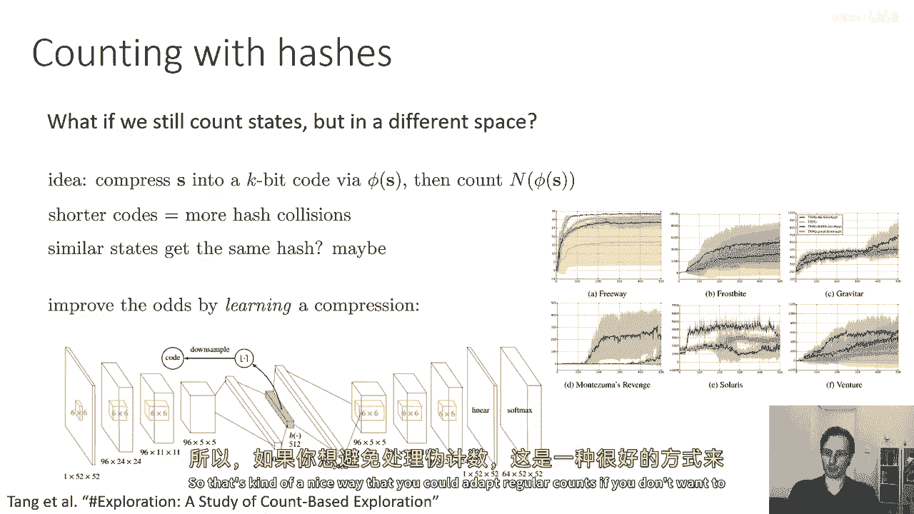
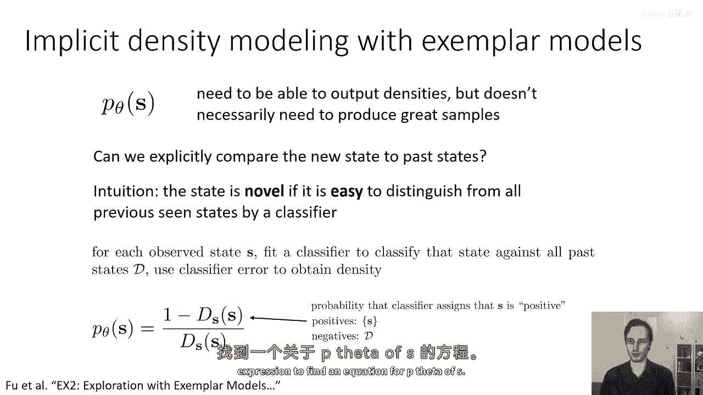
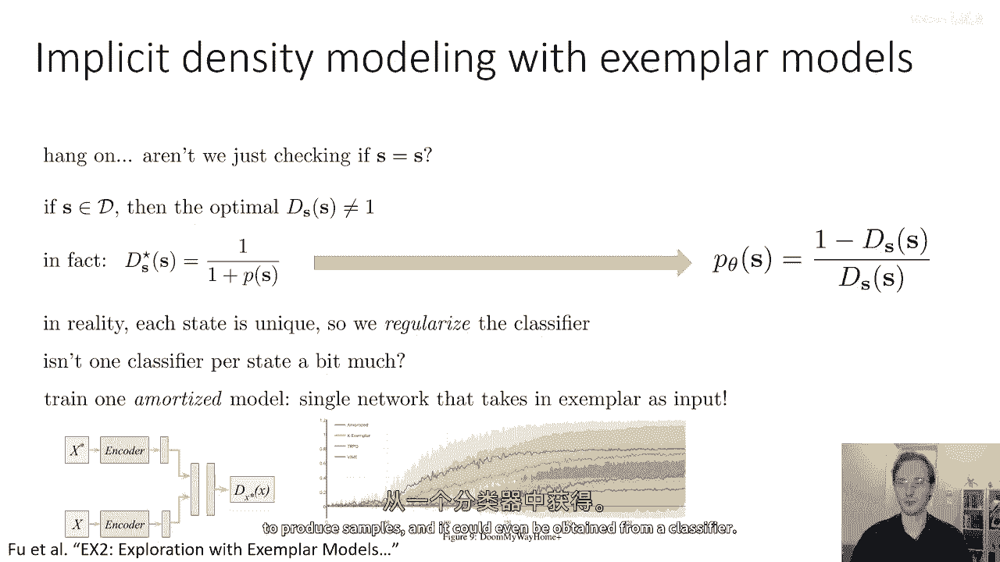
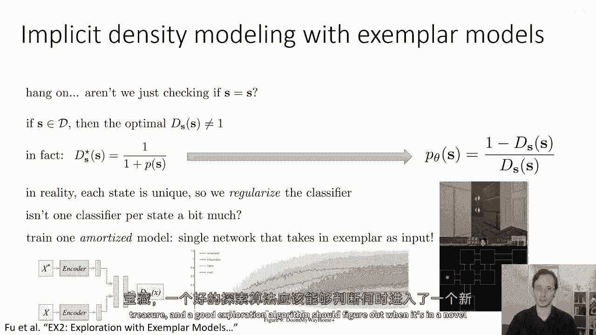
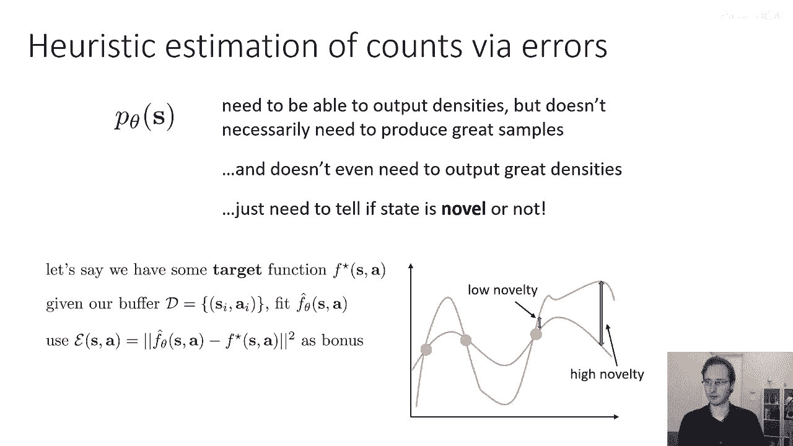
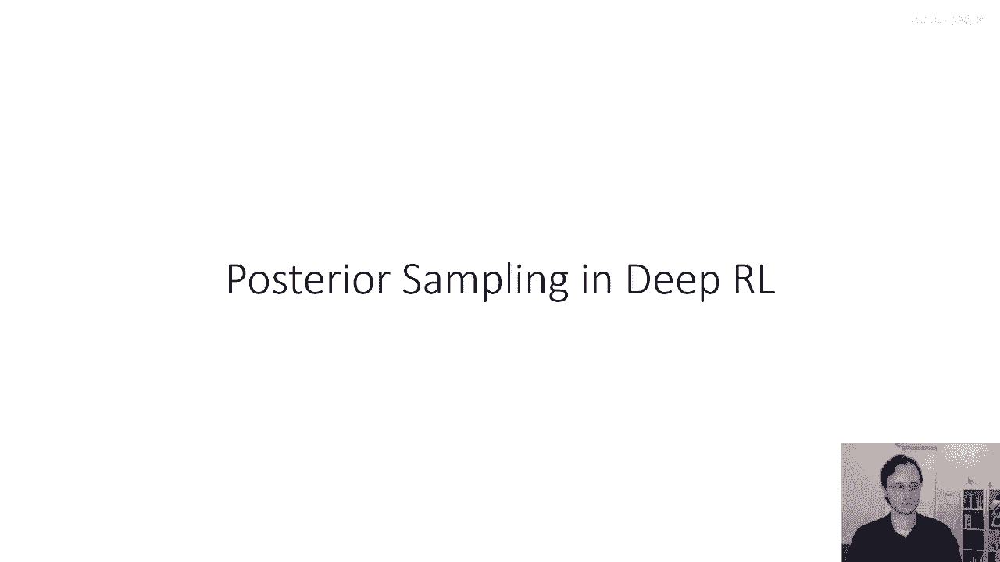

# 57：探索方法进阶 🧭

在本节课中，我们将学习几种基于“乐观主义”概念的创新探索方法。这些方法旨在通过不同的技术手段来估计状态的新颖性，从而鼓励智能体探索未知区域。我们将介绍基于哈希的计数、利用分类器估计密度以及使用预测误差作为新颖性度量等方法。

---

## 基于哈希的计数方法 🔢

上一节我们讨论了伪计数等探索方法。本节中，我们来看看一种基于哈希的计数方法，它使用更复杂的密度模型来改进探索。

这种方法的核心思想是：对状态进行哈希编码，然后在编码空间而非原始状态空间中进行计数。具体步骤如下：

以下是该方法的实现步骤：

1.  **状态压缩**：通过一个编码器 φ，将状态 `s` 压缩为一个 `k` 位的二进制代码。代码长度 `k` 应足够小，使得可能的状态总数远大于 `2^k`，这必然会导致不同的状态被映射到相同的哈希值（哈希碰撞）。
2.  **学习相似性驱动的哈希**：为了获得有意义的碰撞，不使用标准哈希函数，而是训练一个自编码器来重构状态。自编码器的瓶颈层（编码器输出）被用作哈希函数。这样，重构误差小的相似状态更可能被映射到相同的哈希码。
3.  **在哈希空间计数**：算法不再统计原始状态 `s` 出现的次数，而是统计其哈希码 `φ(s)` 出现的次数 `N(φ(s))`。
4.  **计算内在奖励**：新颖性奖励可以基于哈希码的计数来计算，例如使用公式 `r^i(s) = 1 / sqrt(N(φ(s)))`。

这种方法通过哈希碰撞将相似状态归为一类，提供了一种更灵活、更高效的计数方式。

---

## 利用分类器估计密度 🧠

如果你不想处理伪计数或密度模型，另一种思路是完全避免显式的密度建模，转而利用分类器来估计状态的“密度分数”。

其直觉是：如果一个状态很容易被分类器与过去见过的所有状态区分开，那么它就很新颖，应具有低“密度”；如果很难区分，则说明它与过去状态相似，应具有高“密度”。

以下是该方法的数学推导与步骤：

1.  **为每个状态训练分类器**：对于每个新观察到的状态 `s`，训练一个二元分类器 `D_s`。该分类器的任务是区分当前状态 `s`（正样本）和缓冲区中所有过去的状态（负样本）。
2.  **从分类器概率推导密度**：理论上，最优分类器 `D_s(s)` 给出状态 `s` 是“新”（正样本）的概率。状态 `s` 的密度 `p_θ(s)` 可以通过以下公式与之关联：
    `p_θ(s) = (1 - D_s(s)) / D_s(s)`
    这个公式可以通过写下贝叶斯最优分类器的表达式并重新排列项推导出来。
3.  **处理过拟合与摊销模型**：为每个状态训练独立分类器开销巨大。更实用的方法是训练一个**摊销模型**：一个单一的分类器网络 `D(x*, x)`，它以参考状态 `x*` 和待分类状态 `x` 作为输入。每次看到新状态时，都用它来更新这个共享的网络。
4.  **正则化**：为了防止分类器对单个状态过拟合（总是输出概率1），需要引入正则化技术，如权重衰减。

这种方法提供了一个新视角：用于探索的密度模型不一定需要能生成样本，甚至不一定需要是严格的概率密度，只要能给出一个反映新颖性的分数即可。

---

## 使用预测误差作为启发式新颖性度量 ⚙️

我们还可以使用一些启发式方法来估计新颖性，它们并非真正的计数，但在实践中能起到类似的作用，且通常效果很好。

其核心思想是：我们只需要一个能预测状态是否新颖的分数。我们可以通过测量某个目标函数的预测误差来得到这个分数。

以下是该方法的实现思路：

1.  **选择目标函数**：定义一个标量值函数 `f*(s, a)`。它可以是任何函数，常见选择有：
    *   **动态模型**：`f*(s, a) = s'`，即下一个状态。预测误差反映了对环境动态模型的不确定性，与信息增益有关。
    *   **随机网络**：`f*(s, a)` 是一个参数 φ 随机初始化且固定不变的神经网络。它提供了一个复杂、难以拟合的预测目标。
2.  **训练预测模型**：使用已收集的数据 `(s, a, f*(s,a))` 来训练一个模型 `f_θ(s, a)`，使其尽量拟合 `f*`。
3.  **用误差作为奖励**：在陌生（新颖）的状态-动作对 `(s, a)` 上，预测模型 `f_θ` 的误差会很大。因此，我们可以将预测误差作为内在奖励：
    `r^i(s, a) = || f_θ(s, a) - f*(s, a) ||²`
    误差高表示新颖性高，应鼓励探索。

这种方法非常灵活，甚至使用随机网络作为 `f*` 也能取得良好效果，因为它创造了一个非平凡且难以完美记忆的预测任务。

---

## 总结 📝

本节课我们一起学习了三种进阶的探索方法：
1.  **基于哈希的计数**：通过自编码器学习状态的低维哈希表示，在哈希空间进行计数，高效且能捕捉状态相似性。
2.  **分类器密度估计**：通过训练分类器区分当前状态与历史状态，巧妙地将分类器概率转化为密度估计，避免了显式密度建模。
3.  **预测误差启发式**：通过测量对某个目标函数（如动态模型或随机网络）的预测误差，来直接衡量状态-动作对的新颖性，方法简单且有效。

这些方法都共享“乐观主义”的核心思想，即对不确定性或预测误差高的区域给予额外奖励，驱动智能体进行探索。它们为解决稀疏奖励环境下的探索问题提供了多样化的工具。