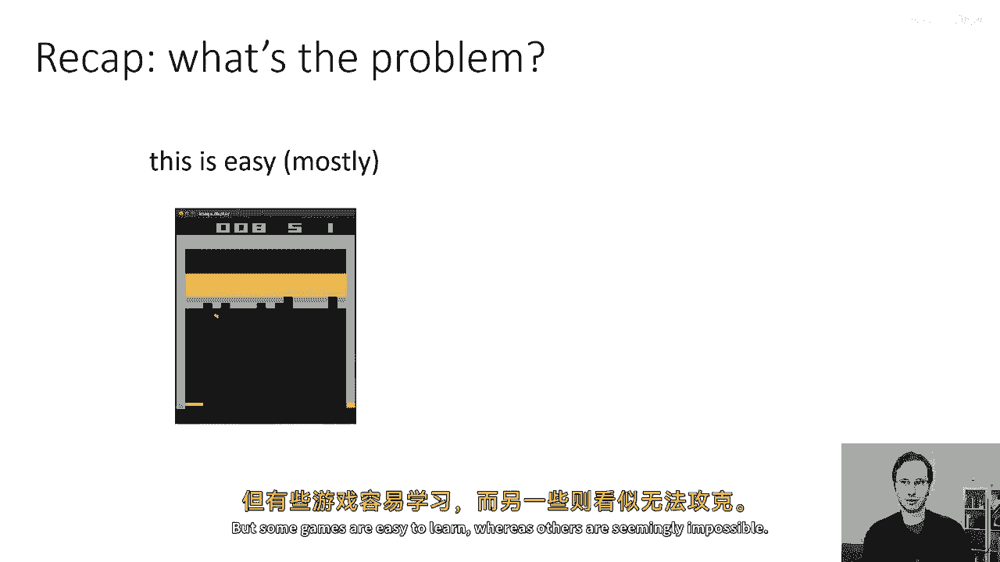
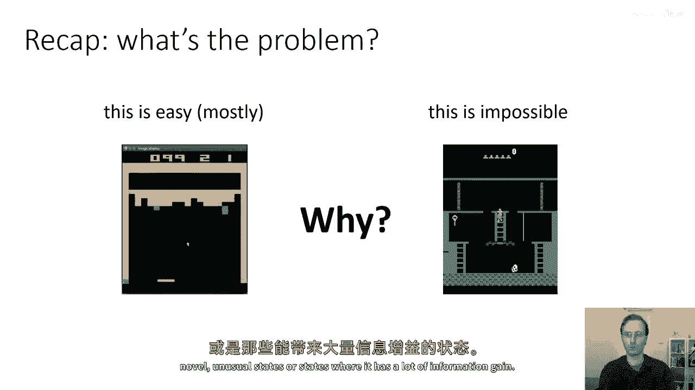
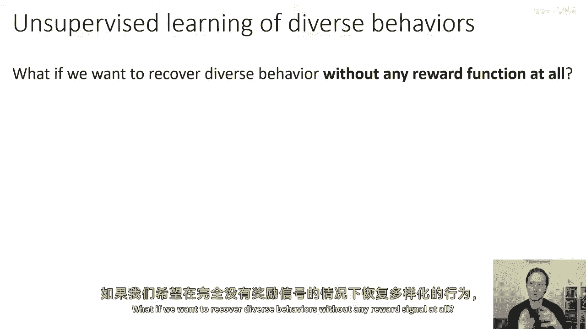
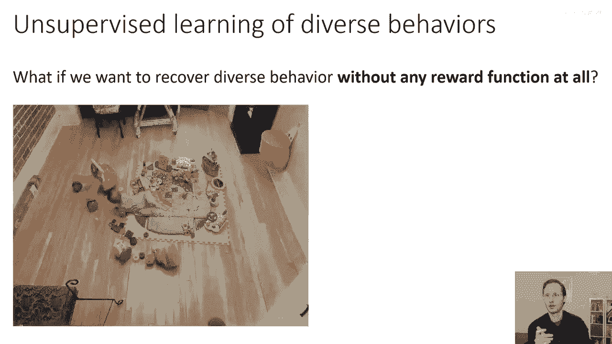
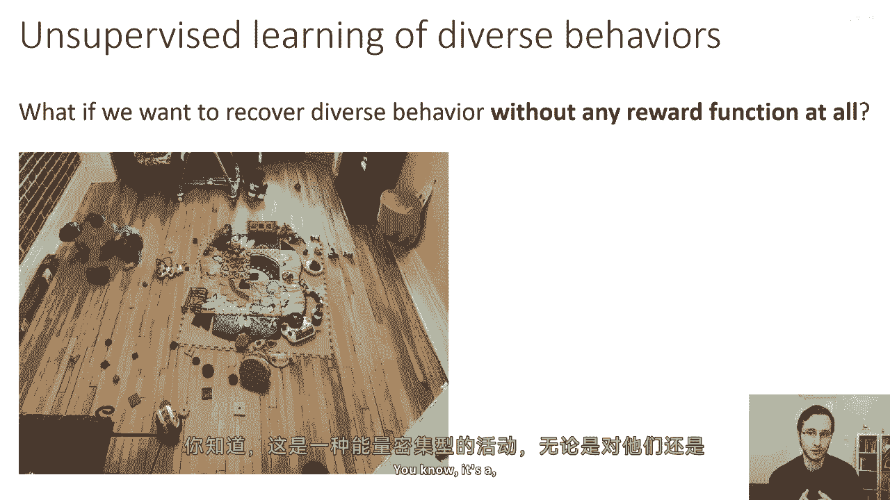
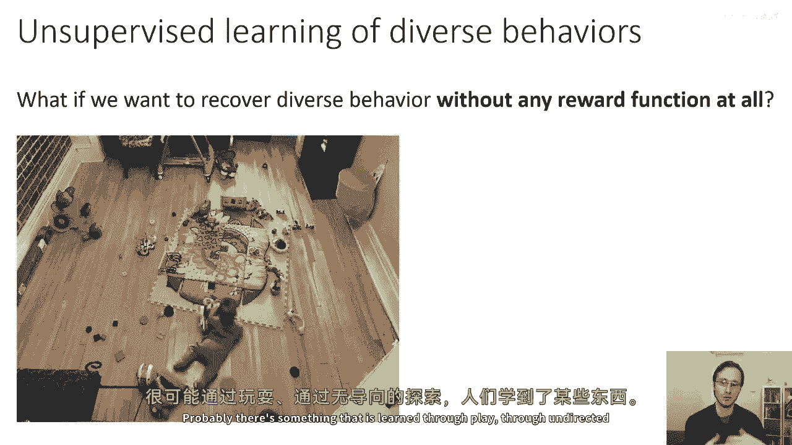
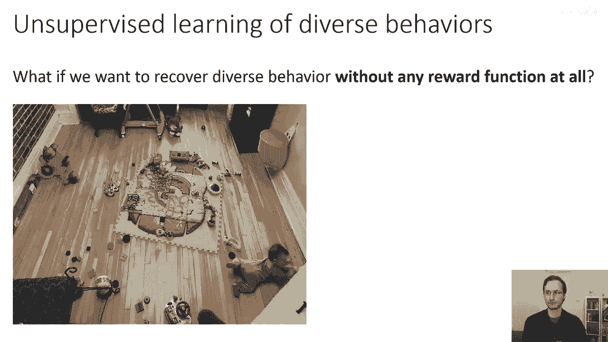
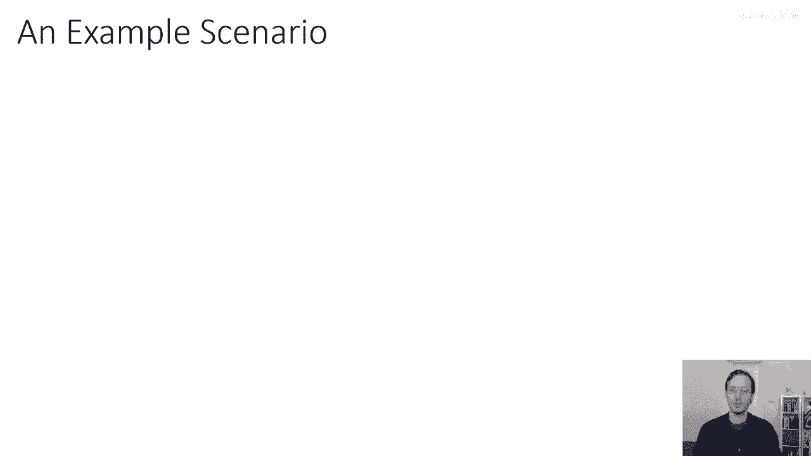
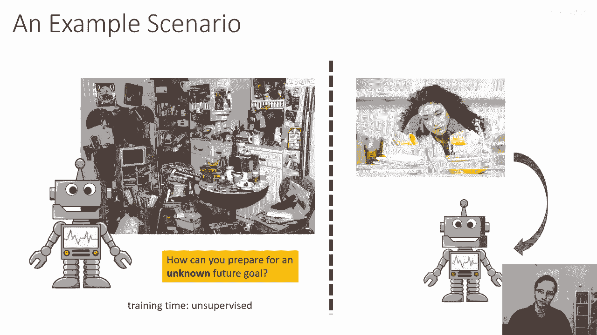
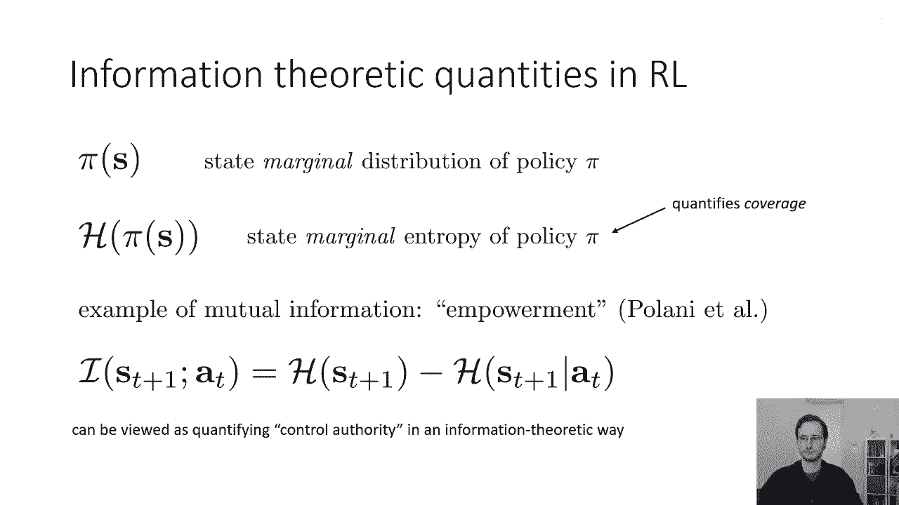

# 60：无监督探索与技能获取 🧠

在本节课中，我们将学习一种关于强化学习中“探索”问题的不同视角。与通常关注如何寻找奖励的探索不同，我们将探讨在完全没有外部奖励信号的情况下，如何通过自主探索来获取多样化的技能，并为未来的任务做准备。

---

上一节我们介绍了探索问题的传统视角，本节中我们来看看一种不同的思考方式。如果我们不仅仅考虑延迟或稀疏的奖励，而是考虑一个完全没有外部奖励信号的设置，会怎样？我们能否恢复出多样化的行为？

你可以从更宏观的人工智能或科学角度来想象。例如，人类儿童会花费大量时间在环境中玩耍。他们的行为并非完全随机，显然从这种无定向的探索中获得了某些东西。这背后可能涉及目标设定、目标完成的概念，以及通过这种活动从大脑中提取出的、非常有用的知识体系。

那么，为什么我们可能想要在没有奖励函数的情况下学习呢？原因可能包括：
*   我们可以在没有明确监督的情况下获得各种技能，创建技能目录，以便在未来被赋予新目标时快速调用。
*   我们可以探索行为空间，构建大型数据集（经验缓冲区），这些数据随后可用于学习其他任务。

这是一种完全不同的思考探索的方式。传统上，探索被视为寻找有奖励状态的问题。而我们正在考虑的，是将其视为一种可以后续被重新利用的技能获取问题。

举一个更实际的例子：想象你家中有一个机器人。你把它放在厨房里并启动它，它的任务就是在这个环境中找出它能做的所有事情。这样，当你晚上回家并命令它“洗碗”时，由于在无监督阶段已经进行了广泛的实践，它就能非常高效地学会如何清洁盘子。

所以，如果你能为一个未知的未来目标做好准备，那么当这个目标被赋予时，你就可以相当快地完成它。

好的，在今天的讲座中，我们将涵盖一些有助于我们开始思考这个问题的概念。这是一个广阔且开放的研究领域，没有固定且完美的解决方案。但我将讨论的一些概念，可能会帮助你思考如何将形式化的数学工具和强化学习算法应用到这类问题上。

---

首先，我们将讨论一些来自信息论的定义和概念。许多人可能已经熟悉，但复习这些概念对每个人都很重要，以便在我们讨论更复杂的算法时，大家能在同一层面上理解。

以下是一些有用的定义和恒等式：

*   **分布**：我们用 `p(x)` 表示一个分布。
*   **熵**：`H[p(x)]` 表示熵，定义为 `-E_{x~p(x)}[log p(x)]`。直观上，熵度量了分布的“宽度”或不确定性。均匀分布具有最大熵，而集中在单一值的分布具有最小熵。
*   **互信息**：`x` 和 `y` 之间的互信息写作 `I(x; y)`。它被定义为联合分布 `p(x, y)` 与边缘分布乘积 `p(x)p(y)` 之间的 KL 散度：`I(x; y) = D_KL( p(x, y) || p(x)p(y) )`。
    *   **直观理解**：互信息衡量了 `x` 和 `y` 之间的依赖程度。如果它们独立，互信息为 0；依赖越强，互信息越大。
    *   **另一种形式**：互信息也可以写成 `I(x; y) = H(y) - H(y|x)`。这可以解释为：观察 `x` 能为 `y` 带来多少信息增益（即减少了多少不确定性）。

现在，让我们将这些概念融入强化学习中。在今天的讨论中，以下信息论量将非常有用：

*   **状态边缘分布**：我们用 `π(s)` 表示策略 `π` 下的状态边缘分布（有时也写作 `p_θ(s)`）。
*   **状态边缘熵**：`H(π(s))` 指的是策略 `π` 的状态边缘熵。它量化了我们策略的覆盖范围。一个访问所有可能状态的随机策略，其 `H(π(s))` 会很大。

互信息在强化学习中一个经典的应用是定义 **“赋权”**。这个概念主要来自 Daniel Polani 等人的工作。赋权的一个简单版本被定义为下一个状态 `s_{t+1}` 与当前动作 `a_t` 之间的互信息：
`I(s_{t+1}; a_t) = H(s_{t+1}) - H(s_{t+1} | a_t)`

我们可以这样理解这个公式：你希望下一个状态的熵 `H(s_{t+1})` 很大，这意味着有许多可能的下一个状态（选项多）。同时，你希望给定当前动作后的下一个状态的条件熵 `H(s_{t+1} | a_t)` 很小，这意味着如果你知道采取了什么动作，就能很容易预测会到达哪个状态（控制力强）。同时满足这两点，意味着智能体处于一个拥有许多可选动作、且每个动作都能可靠地导向不同未来状态的位置，这正体现了“赋权”或“掌控力”的概念。

---

在介绍了信息论的基础后，接下来我们将探讨如何在没有奖励函数的情况下进行学习。核心思路是设计一个算法，能够自己提出目标、尝试达成目标，并在此过程中加深对世界的理解。

然后，我们将讨论**状态分布匹配**的强化学习形式。在这种形式下，我们可以尝试让智能体探索到的状态分布去匹配某个期望的状态分布，从而实现一种无监督的探索。

我们还将探讨**有效状态覆盖**的问题：仅仅追求访问新奇状态（基于计数的探索）本身是否是一个良好的探索目标？以及为什么可能是或不是。

最后，我们将讨论如何超越仅仅覆盖**状态空间**，进而覆盖**技能空间**。这两者之间有什么区别？覆盖技能空间可能是一种更强大、更高效的探索方式。

---

本节课中，我们一起学习了：
1.  一种不同于传统“探索-利用”权衡的探索视角：**无监督的技能获取**。
2.  支撑这一视角的**信息论基础概念**，包括熵、互信息及其在RL中的体现（如状态熵、赋权）。
3.  后续讲座将深入探讨的几个核心方向：无目标学习、状态分布匹配、以及覆盖技能空间与状态空间的区别。

这种将探索视为“为未知未来任务做准备”的范式，为构建更通用、更自主的智能体提供了新的思路。