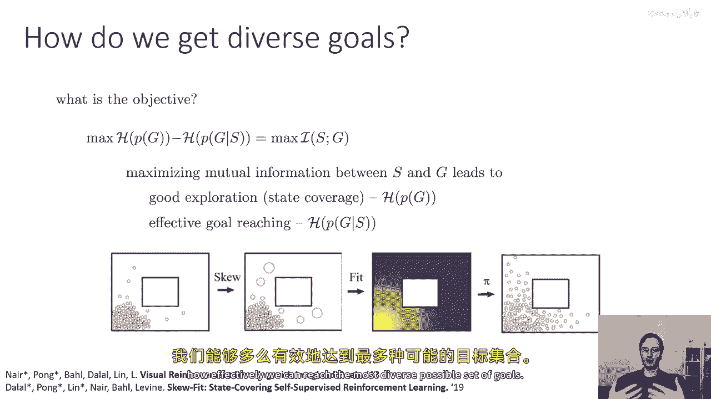
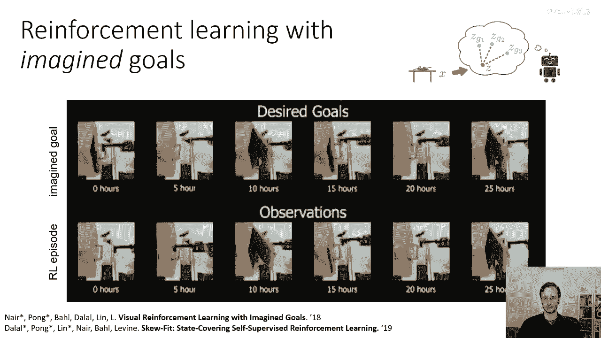

# 61：无监督探索与目标提议算法 🧠

在本节课中，我们将学习一种前沿的无监督探索方法。该方法使智能体（如机器人）能够在没有人类指定任务或奖励函数的情况下，通过自我提议目标并尝试达成来学习技能。我们将重点理解其核心思想、算法框架以及背后的数学原理。

---

## 概述：问题设定与核心思想

上一节我们介绍了无监督探索的基本概念。本节中，我们来看看一个具体的算法框架，它旨在解决“如何在没有奖励函数的情况下，通过自我提议和达成目标来学习”这一问题。

我们面临的典型场景是：将一个机器人置于新环境（如厨房）中，它需要花时间自主练习各种技能。之后，当人类下达具体任务指令（如做家务）时，它能利用之前积累的经验高效地完成任务。

首先，我们需要解决一个基本问题：如何向智能体传达任务目标？一个现实的方法是向智能体展示我们希望它达成的状态（或观察结果）。在强化学习术语中，这相当于提供一个构成任务目标的**状态**（例如一张期望结果图像）。因此，无监督学习阶段的目标是训练出一个**目标条件策略**，使其在后续能达成人类指定的任何目标状态。

---

## 技术细节：状态表示与生成模型

由于状态（如图像）可能非常复杂且高维，我们需要一种机制来比较不同状态的相似性。一个常见的解决方案是使用**生成模型**来学习状态的潜在表示。

我们将以**变分自编码器** 为例。该模型将高维状态 `s`（或图像 `x`）编码为一个低维的**潜在向量** `z`。其核心思想是：功能相似的状态在潜在空间 `z` 中的位置也相近。

**公式描述：**
*   生成过程：`p_θ(x | z)`，表示给定潜在变量 `z` 生成状态 `x` 的概率分布。
*   推断过程：`q_φ(z | x)`，表示给定状态 `x` 推断其潜在变量 `z` 的概率分布（编码器）。
*   潜在先验：`p(z)`，通常是标准正态分布。

---

## 算法框架：自我提议目标的循环

直觉上，智能体应利用潜在空间来提议可能的目标，尝试达成它们，并在此过程中改进策略。以下是该算法的基本循环：

1.  **提议目标**：从潜在先验 `p(z)` 中采样一个潜在目标 `z_g`，然后通过生成模型 `p_θ(x | z_g)` 解码，得到一个“想象”的目标状态 `x_g`。
2.  **执行策略**：使用**目标条件策略** `π(a | x, x_g)` 尝试从当前状态 `x` 达到目标 `x_g`。
3.  **收集结果**：策略执行后，智能体到达某个实际状态 `x̄`（可能与 `x_g` 不同）。
4.  **更新策略**：利用收集到的数据 `(x, a, x̄, x_g)`，通过诸如 Q-learning 等算法来更新策略 `π`，使其能更好地达成目标。
5.  **更新生成模型**：将新遇到的状态 `x̄` 加入数据集，用于更新生成模型 `p_θ`。

然而，这个基础流程存在一个问题：生成模型 `p_θ` 是在已见数据上训练的，因此它倾向于生成与已见数据相似的目标。这可能导致智能体反复探索已掌握的技能，而忽略了新区域。

---

## 关键改进：基于密度的目标多样化

为了解决上述问题，我们需要在更新生成模型时，鼓励其关注那些“罕见”或未被充分探索的状态。这借鉴了我们在探索讲座中讨论的“新奇性”思想。

具体做法是修改第5步（更新生成模型）。我们不使用标准的**最大似然估计**，而是采用**加权最大似然估计**。

**公式描述：**
原始最大似然目标：`max_θ E[log p_θ(x̄)]`
加权最大似然目标：`max_θ E[w(x̄) * log p_θ(x̄)]`

其中，权重函数 `w(x)` 被设计为当前生成模型对该状态概率密度的负幂次方：
`w(x) = p_θ(x)^(-α)`，其中 `α > 0`。

**核心解释**：`p_θ(x)` 低的状态是当前模型认为“新奇”或“罕见”的状态。赋予其更高的权重 `w(x)`，意味着在下次训练生成模型时，模型会尝试给这些罕见状态分配更高的概率。从而，当从更新后的模型中采样新目标时，这些罕见区域被选中的几率就会增加，实现了探索的多样化。

可以证明，这种加权方式能使得目标分布 `p_θ(x)` 的熵不断增加，最终促使智能体覆盖所有可能的有效状态。

---

## 统一视角：最大化互信息

我们可以为整个算法流程建立一个更优雅的数学目标。算法实际上是在优化两个分布：
1.  **目标分布** `p(g)`：我们希望其熵 `H(g)` **大**，以覆盖多样化的目标。
2.  **状态给定目标的分布** `p(s|g)`：对于策略达成目标后的最终状态 `s`，我们希望给定 `s` 能轻易推断出目标 `g`，即条件熵 `H(g|s)` **小**。

这两者的结合，等价于最大化**状态 `s`** 与**目标 `g`** 之间的**互信息** `I(s; g)`。

**公式描述：**
`I(s; g) = H(g) - H(g | s)`

最大化互信息 `I(s; g)` 完美地诠释了无监督探索的目标：既鼓励提出多样化的目标（`H(g)` 大），又要求策略能有效地达成这些目标（`H(g|s)` 小）。

---

## 实例演示：机器人开门

让我们通过一个真实的研究案例来直观理解该算法的效果。在一个实验中，机器人被放置在门前，但并未被告知“开门”这个任务。

以下是算法运行不同时间后的表现：
*   **0小时**：机器人行为随机，只是在门前晃动。
*   **10小时**：机器人开始触摸门把手，偶尔能打开门。
*   **25小时**：机器人能可靠地操纵门，并将其打开到不同角度。
*   **完全训练后**：我们可以给机器人一张门开至特定角度的图像作为新目标，它能利用之前无监督探索获得的技能，成功达成这个它从未被明确训练过的新目标。

---

## 总结

本节课中，我们一起学习了一种基于**自我提议目标**的无监督探索算法框架。其核心步骤包括：利用生成模型在潜在空间中提议目标、使用目标条件策略尝试达成、并通过**加权更新生成模型**（权重与状态概率密度的负幂次方相关）来鼓励探索新奇区域。我们从数学上揭示了该算法的本质是最大化**状态与目标之间的互信息** `I(s; g)`。这种方法使智能体能够在没有外部奖励的情况下，自主地学习广泛的基础技能，为后续快速适应特定任务打下坚实基础。