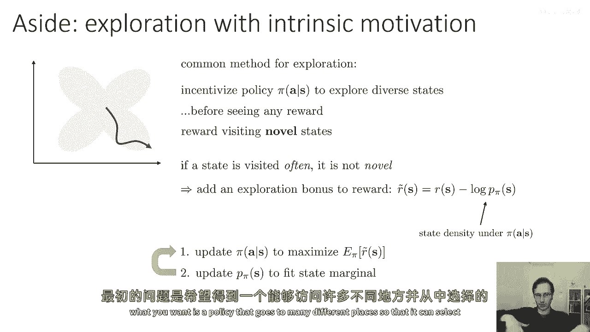
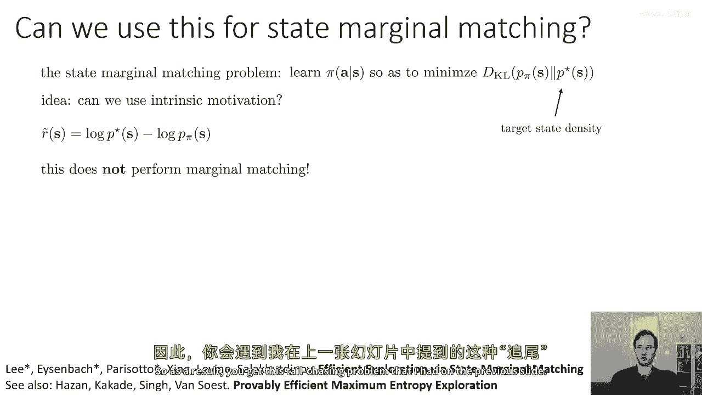
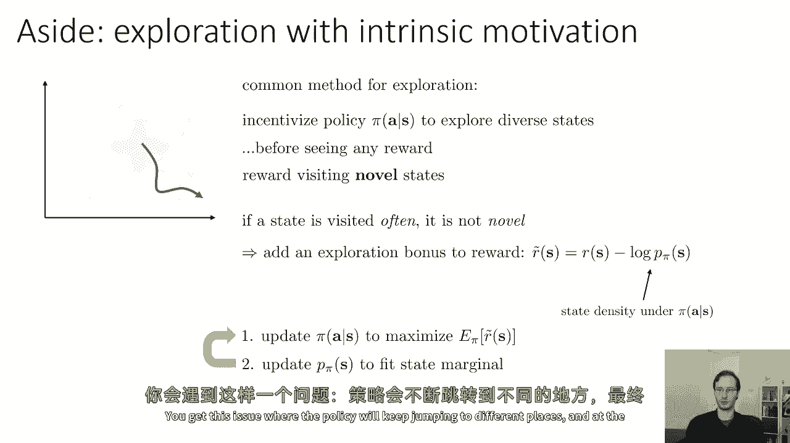
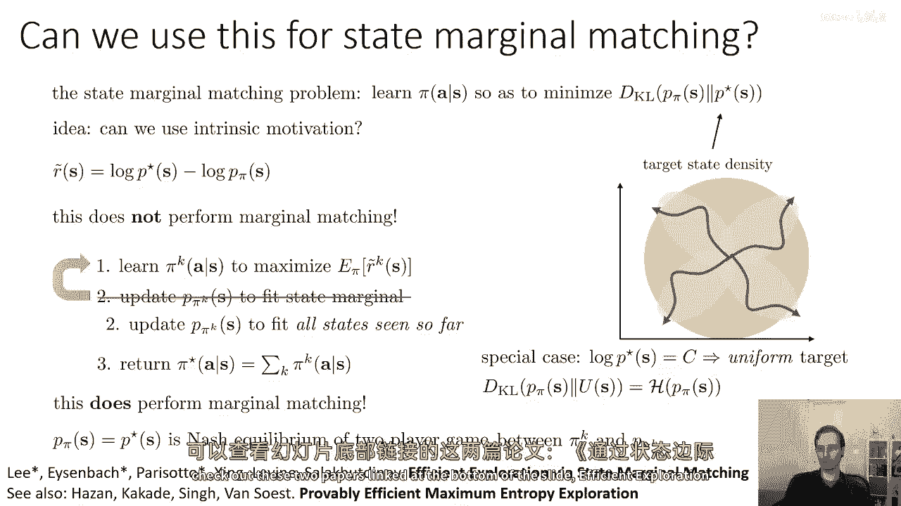
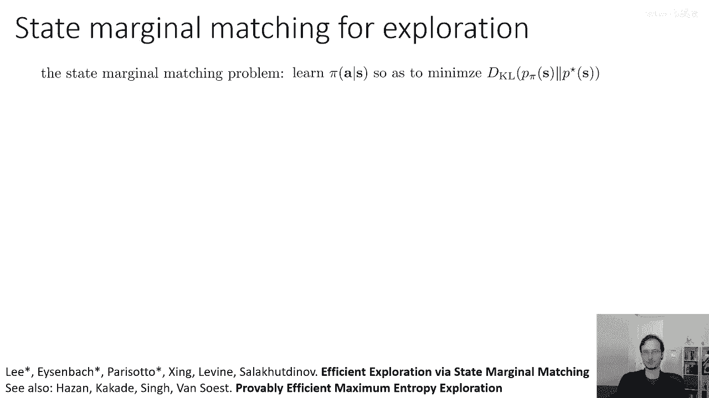
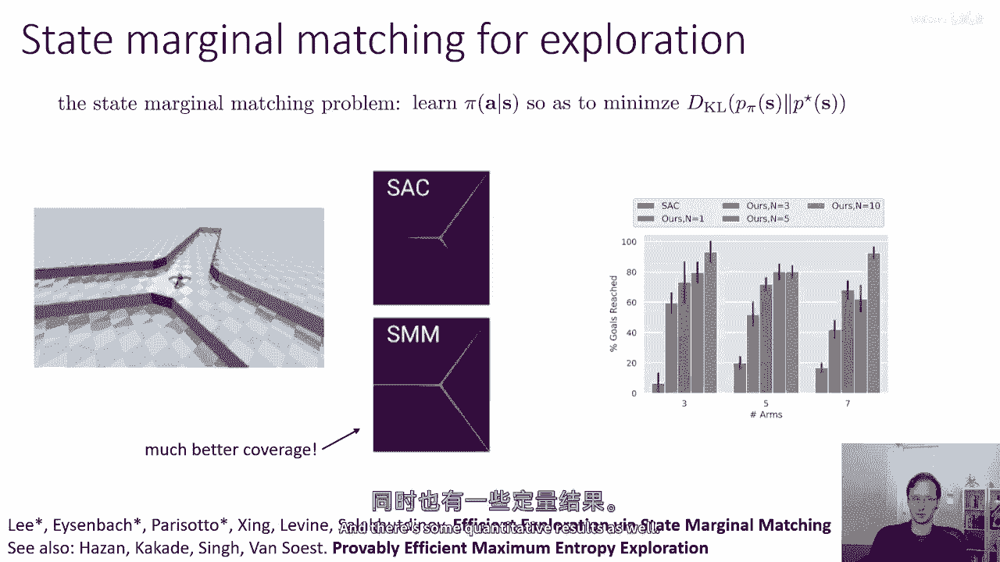
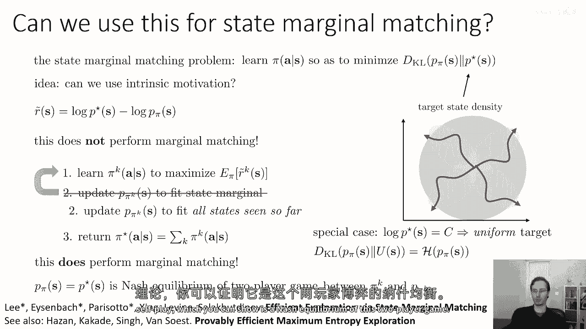
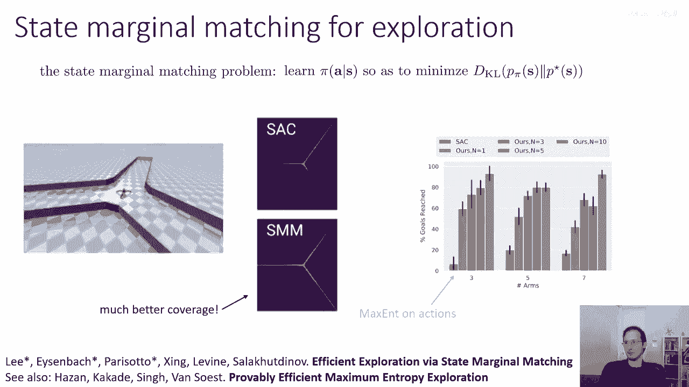
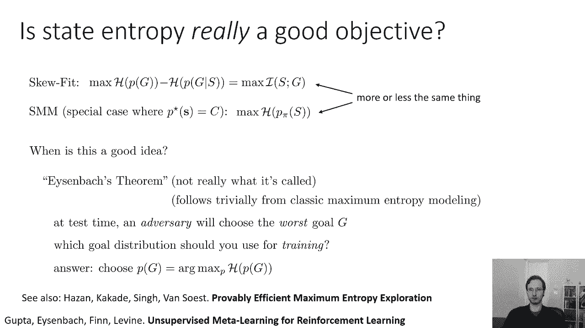

# 62：状态覆盖与边缘匹配 🎯

在本节课中，我们将深入探讨状态覆盖的概念，并学习如何通过最大化状态熵或匹配目标分布来引导策略进行探索。我们将看到这与之前讨论的探索概念之间的联系，并介绍一种通过内在动机实现无监督探索的方法。

---

## 无监督探索与内在动机 🧭

上一节我们介绍了探索的基本概念。本节中，我们来看看如何在没有外部奖励的情况下，仅通过内在动机引导智能体进行探索。

内在动机是用于指代“寻求新颖性”的另一个术语，例如我们之前见过的伪计数等方法。常见的探索方法是激励策略 **π** 去访问那些先前很少被访问的新状态 **s**。这甚至在奖励完全缺失的环境中也有效。

以下是实现内在动机的一种简单奖励形式：
```
r(s) = -log p(s)
```
其中 **p(s)** 是状态 **s** 的当前估计概率密度。如果某个状态被频繁访问，其概率 **p(s)** 会很高，那么奖励 **r(s)** 就会很低，从而鼓励策略去探索概率更低（即更新颖）的状态。

这个过程可以概括为以下步骤：
1.  更新策略 **π**，以最大化包含此内在奖励的总奖励。
2.  根据新策略产生的状态，更新状态密度估计器 **p(s)**。
3.  重复上述过程。



然而，这种方法存在一个问题：策略会不断追逐当前密度估计较低的区域，而密度估计器则会不断拟合策略的最新行为。最终，虽然密度估计器 **p(s)** 能覆盖广泛的状态（即对所有状态都赋予相对较高的概率），但策略本身的行为是随机的、不稳定的，并不会均匀地访问所有状态。

---

## 状态边缘匹配问题 🎯

如果我们不仅希望密度估计器有好的覆盖率，更希望策略本身能稳定地访问多样化的状态，该怎么办呢？这就引出了状态边缘匹配问题。

该问题的目标是学习一个策略 **π(a|s)**，使其产生的状态分布 **p_π(s)** 尽可能接近一个期望的目标分布 **p*(s)**。我们可以用 KL 散度来衡量两者的差异：
```
目标：最小化 KL( p_π(s) || p*(s) )
```
如果目标分布 **p*(s)** 是均匀分布，那么这个目标就等价于最大化策略的状态熵 **H(p_π(s))**。



我们可以利用内在动机的思想来构造奖励函数，以匹配目标分布：
```
r̃(s) = log p*(s) - log p_π(s)
```
有趣的是，策略 **π** 在此奖励下的期望回报，恰好等于 **p_π(s)** 和 **p*(s)** 之间的 KL 散度。这意味着强化学习的目标函数本身就是在优化状态边缘匹配。



但是，标准的强化学习算法并不知道奖励 **r̃(s)** 中的 **-log p_π(s)** 部分依赖于策略 **π** 本身。这会导致之前提到的“尾追”问题：策略和密度估计器相互追逐，无法稳定收敛到最优解。

---

## 解决方案：自我对弈与策略混合 🤝

为了解决上述问题，我们需要对算法进行两处关键修改。以下是修正后的算法框架：

我们用 **k** 来索引迭代轮次。

**在每一轮迭代 k 中：**
1.  学习一个策略 **π_k**，以最大化在 **π_k** 下预期的奖励 **r̃^k** 的回报。这里的奖励使用基于当前（第 k 轮）状态密度估计器 **p^k(s)** 计算得出的 **-log p^k(s)**。
2.  更新状态密度估计器 **p^{k+1}(s)**，使其拟合**迄今为止所有迭代中策略所访问过的所有状态**（例如，使用一个经验回放缓冲区），而不仅仅是当前策略 **π_k** 访问的状态。
3.  最终，我们返回的策略 **π*** 不是最后一轮的策略，而是**所有历史策略 {π_1, π_2, ..., π_K} 的混合模型**。在实际执行时，随机选择一个迭代轮次 **k**，然后使用对应的策略 **π_k** 来行动。

为什么这样做有效？状态边缘匹配问题可以形式化为一个两人博弈：玩家一是策略 **π**，玩家二是密度估计器 **p(s)**。该博弈的纳什均衡点正是 **p_π(s) = p*(s)** 的状态。

简单地让双方每轮都采取针对对手的最优响应（即算法的基础版本），通常无法收敛到纳什均衡。而通过计算历史策略的平均（即混合策略），正是博弈论中“自我对弈”求取纳什均衡的经典方法。因此，最终得到的混合策略 **π*** 能有效地最小化 **p_π(s)** 和 **p*(s)** 之间的 KL 散度。

> 关于此证明的更多细节，可参考关于“状态边缘匹配”和“最大熵探索”的相关论文。

---



## 实验验证与高层启示 🧪



实验表明，这种方法比标准的强化学习探索方法更有效。例如，在一个多分支的迷宫环境中，标准算法可能只探索部分区域，而状态边缘匹配算法则能更均匀地覆盖所有分支。



从这些结果中，我们可以得出高层启示：
*   仅使用内在动机进行单轮迭代，无法获得良好的状态覆盖，也无法匹配目标分布。
*   通过混合历史策略并利用自我对弈理论，可以引导策略收敛到能匹配目标状态分布的纳什均衡点。

---





## 为何追求均匀覆盖？ 🤔

最后，我们简要讨论一下：为什么追求均匀的状态覆盖（即最大化状态熵）是一个好主意？

考虑这样一个场景：在测试时，一个“对手”（或环境）可能会给你分配**最难**的任务，以挑战你的智能体。如果你在训练时不知道测试任务的具体内容，并假设最坏情况（即对手选择对你最不利的任务），那么最优的训练策略就是在训练时**均匀地覆盖所有可能的状态或目标**。

这源于经典的“最大熵”建模思想：在缺乏先验信息的情况下，最稳健的选择是假设所有可能性是等概率的，并据此进行准备。因此，最大化状态熵或目标熵，是在面对对抗性测试环境时一种理论上合理且稳健的策略。

> 这一观点在“无监督元学习”的相关工作中有所阐述。

---

## 总结 📚



本节课中，我们一起学习了：
1.  **无监督探索**：如何通过内在动机（如 `-log p(s)`）在无外部奖励的环境中进行探索。
2.  **状态边缘匹配问题**：将探索目标形式化为使策略的状态分布 **p_π(s)** 匹配一个目标分布 **p*(s)**，通常使用 KL 散度进行度量。
3.  **算法与挑战**：直接应用强化学习优化内在奖励会导致策略与密度估计器相互追逐的不稳定问题。
4.  **解决方案**：通过**维护所有历史状态的经验缓冲区**来更新密度估计器，并最终返回**历史策略的混合模型**，可以借助自我对弈理论收敛到纳什均衡，有效解决状态边缘匹配问题。
5.  **理论依据**：在对抗性测试环境的最坏情况假设下，追求均匀的状态覆盖（最大化熵）是一种理论上稳健的探索策略。