# 63：超越状态覆盖：学习多样化技能 🎯

在本节课中，我们将要学习如何超越简单的状态覆盖，去学习多种多样、彼此不同的技能。我们将探讨如何通过设计奖励函数来鼓励策略学习多样化的行为，并理解其背后的数学原理。

## 概述：从单一技能到多样化技能

上一节我们介绍了如何通过覆盖状态分布来进行探索。本节中我们来看看如何学习多种不同的技能，而不仅仅是达到不同的状态。

假设我们有一个策略 `π(a|s, z)`，其中 `z` 是一个任务索引。`z` 可以是一个类别变量，取 `N` 个不同的值。这代表我们拥有 `N` 种不同的技能。例如，在一个二维导航场景中，技能0可能代表向上移动，技能1代表向右移动。

## 为何需要多样化技能？

达到多样化的目标并不等同于执行多样化的任务。并非所有行为都能被“达到某个目标状态”这一概念所捕获。

例如，考虑一个任务：智能体需要到达绿色圆圈，同时避开红色圆圈。一个仅以目标状态为条件的策略可以去绿色圆圈，但无法同时被“告知”要避开红色圆圈。因此，所有可能技能的空间，要大于“达到目标”的技能空间。

直觉是，不同的技能应该访问状态空间中**不同**的区域，而不仅仅是访问不同的单个状态。

## 如何学习多样化技能：基于判别器的奖励

我们可以设计一种能促进多样性的奖励函数。在强化学习中，我们通常将策略定义为某个奖励函数的最大化。我们打算做的是：奖励那些在给定技能 `z` 下很可能出现，但在其他技能下不太可能出现的状态。

换句话说，如果你正在运行技能 `z=0` 的策略，你应该访问那些对于 `z=1, 2, 3...` 等技能概率较低的状态。这确保了每个 `z` 都做一些独特的事情。

另一种表述是：观察策略访问的状态，你应该能够猜出它正在执行哪个技能 `z`。

以下是实现这一想法的一种方法：

1.  使用一个分类器（判别器） `D(z|s)`，它根据状态 `s` 预测技能 `z` 的概率。
2.  将奖励设置为该分类器预测的对数概率：`r(s, z) = log D(z|s)`。

因此，我们想要最大化 `log p(z|s)`，使得从状态 `s` 猜测技能 `z` 变得容易。策略因此会倾向于访问能清晰标识其技能的状态。

## 算法流程与可视化

我们如何具体实现这个算法？可以将其视为一个交替优化的过程：

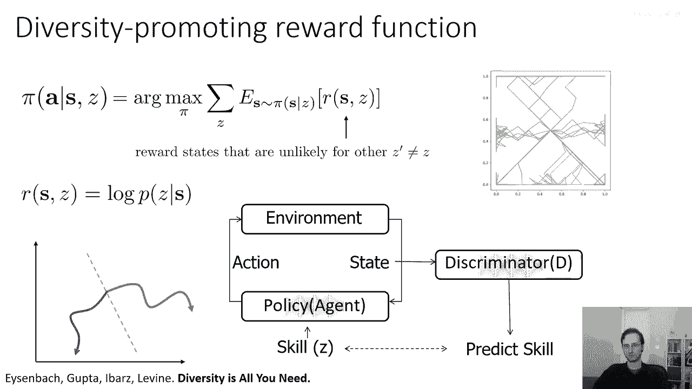

1.  **策略与环境交互**：策略 `π(a|s, z)` 在环境中运行，技能 `z` 在每轮开始时被指定。
2.  **训练判别器**：收集状态数据，更新判别器 `D(z|s)`，使其能更准确地从状态 `s` 预测出技能 `z`。
3.  **更新策略**：使用当前判别器输出的 `log D(z|s)` 作为奖励，通过强化学习算法更新策略，使其能最大化这个奖励。

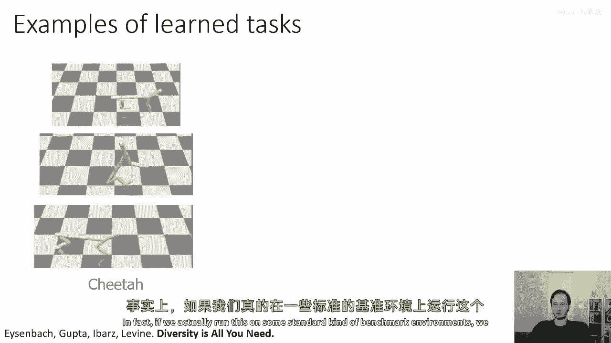

我们可以通过一个只有两个技能（绿色和蓝色）的简单例子来可视化这个过程：

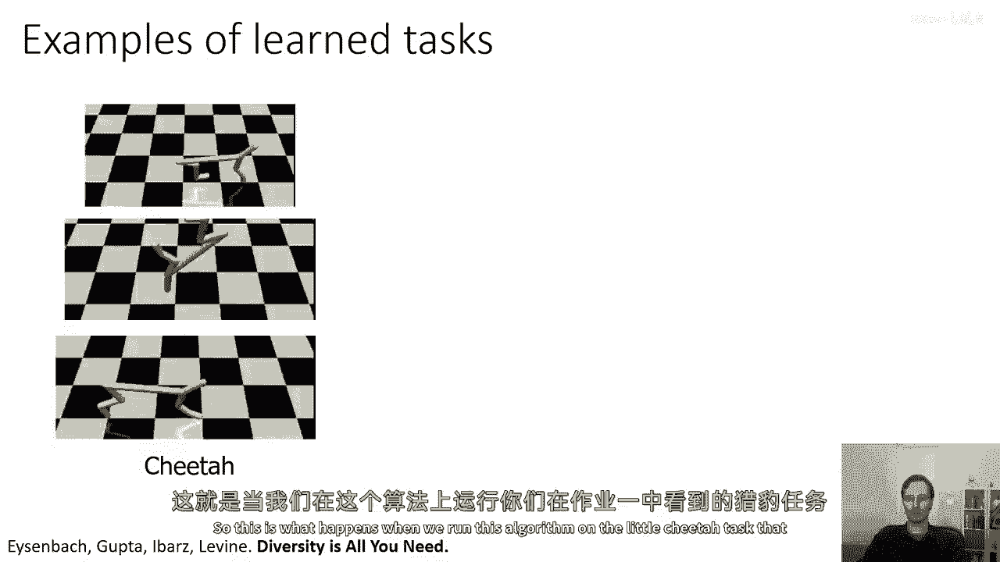

*   **初始**：策略是随机的，两个技能的行为相似，访问的状态分布略有重叠。
*   **训练判别器**：判别器会在状态空间中画出一条决策边界，将状态分为“更可能属于蓝色技能”和“更可能属于绿色技能”两类。
*   **更新策略**：策略为了获得更高奖励（即让判别器更容易猜对），会使蓝色技能更多地访问边界一侧的状态，绿色技能访问另一侧。
*   **循环迭代**：随着判别器和策略的交替更新，两个技能访问的状态区域会逐渐分离，行为差异变得明显。

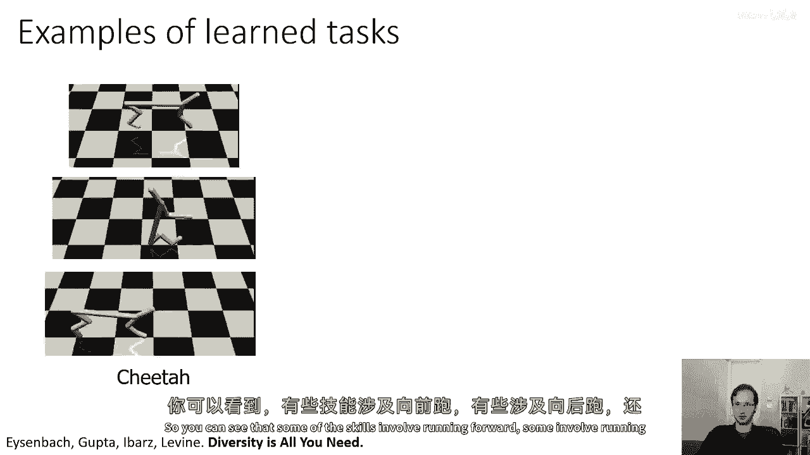

在实际应用中，我们可能使用数十甚至数百个技能，从而实现对状态空间的良好、多样化覆盖。

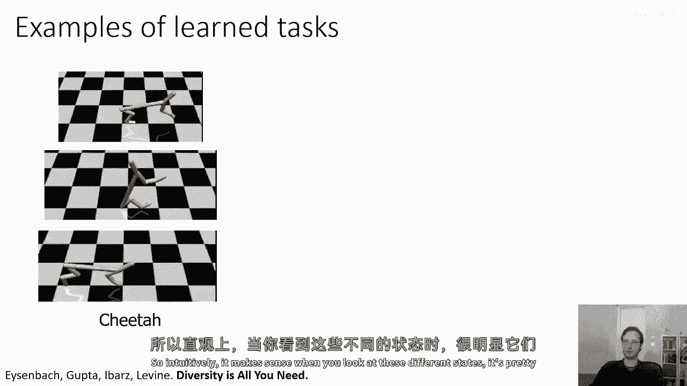

## 实际效果展示

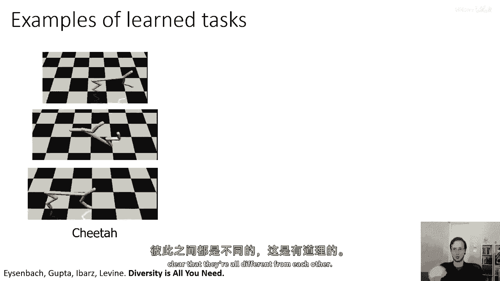

在标准基准环境（如作业一中出现的“小猎豹”任务）中运行此算法，会产生非常有趣的行为：

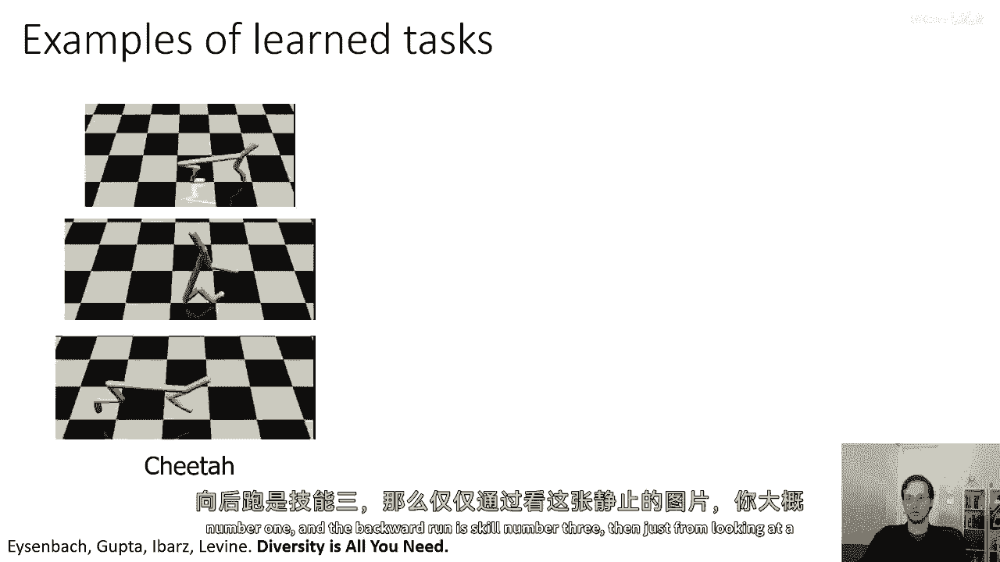

*   一些技能涉及向前奔跑。
*   一些技能涉及向后奔跑。
*   还有一些技能会做出酷炫的后空翻。

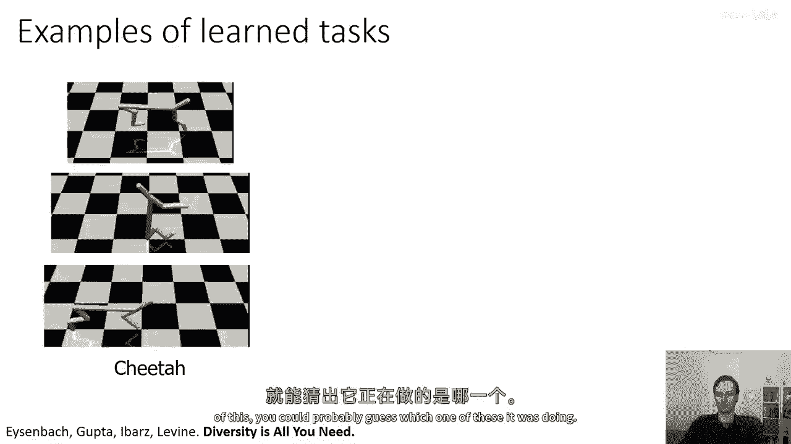

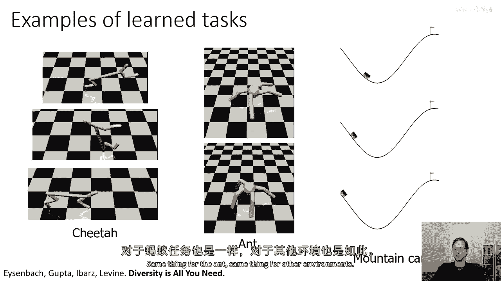

当你观察这些技能产生的状态序列时，直觉上它们都是有意义的，并且彼此明显不同。例如，仅看一张静态图片，你可能就能猜出智能体正在执行的是后空翻（技能2）、向前跑（技能1）还是向后跑（技能3）。在“蚂蚁”、“山地车”等其他环境中，该方法也能产生多样化的技能，其中一些技能甚至直接解决了任务。

这似乎是一种获取多样化技能的有效方法。

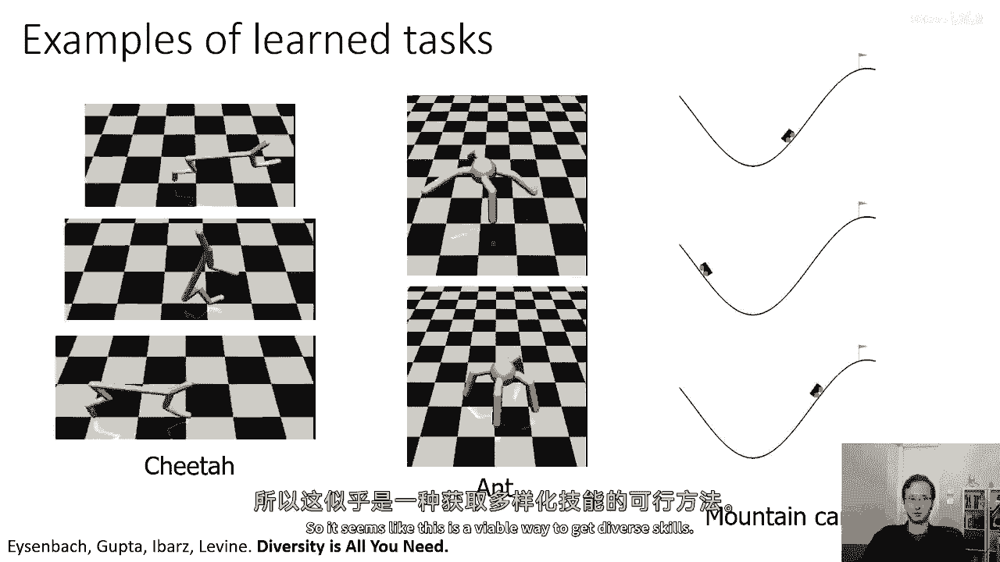

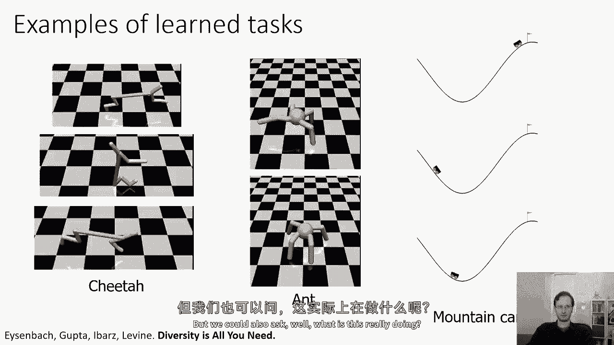

## 理论依据：最大化互信息

我们可能会问，这个方法到底在优化什么？它是否有一个明确的理论目标？

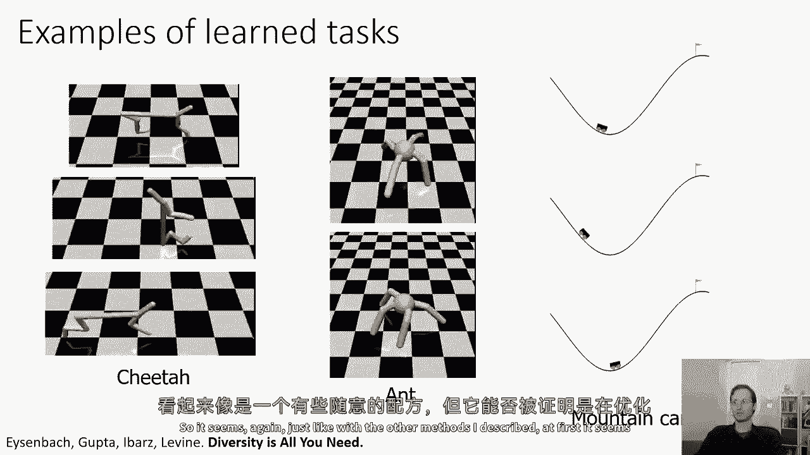

实际上，这种方法与**互信息**有着密切的联系。具体来说，它最大化了技能 `z` 和状态 `s` 之间的互信息 `I(z; s)`。

互信息可以分解为：
`I(z; s) = H(z) - H(z|s)`

*   **最大化 `H(z)`**：我们通过均匀地随机选择技能 `z`（即让每个技能有相等的概率被触发）来最大化技能本身的熵 `H(z)`。
*   **最小化 `H(z|s)`**：条件熵 `H(z|s)` 表示在已知状态 `s` 的情况下，技能 `z` 的不确定性。我们通过最大化 `log p(z|s)`（即让判别器准确预测）来最小化它。

因此，整个算法（均匀选择 `z` 并最大化 `log D(z|s)`）实际上是在最大化技能 `z` 与状态 `s` 之间的互信息 `I(z; s)`。

## 总结与主题回顾

本节课中我们一起学习了如何通过基于判别器的奖励函数来学习多样化技能。

让我总结一下本讲第3、4部分出现的共同主题。我介绍了三种不同的方法（基于目标的后验、最大熵探索、多样化技能学习），它们都非常相关。

所有这些方法基本上都以某种形式，最终归结为最大化**结果**（可能是最终状态或任何状态）与**任务/目标**（可能是目标状态或技能 `z`）之间的互信息。

我们看到，最大化结果与任务之间的互信息，是无监督强化学习中一种进行有效探索和学习的方式。此外，从最坏情况分析的角度看，如果你在测试时不知道自己会被分配什么任务，那么假设对手会给你分配最难的任务时，最大化互信息实际上是最优的策略。

我希望这次讨论能为你提供一种关于探索的不同视角，即如何在无监督的通用设置中思考探索，并开始应用一些能提供明确优化目标的强大数学工具。

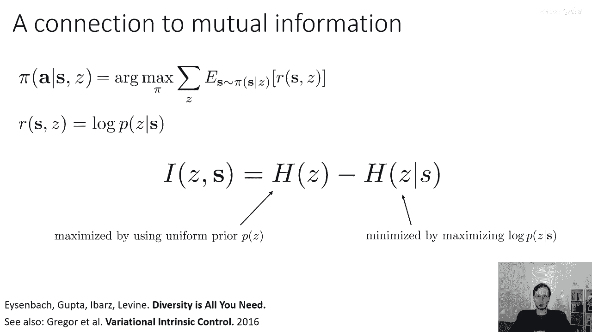

---
**相关阅读**：
*   *Diversity is All You Need*
*   *Variational Intrinsic Control*