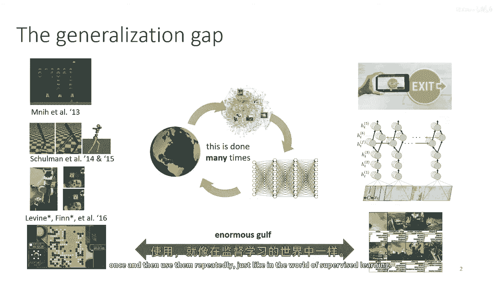
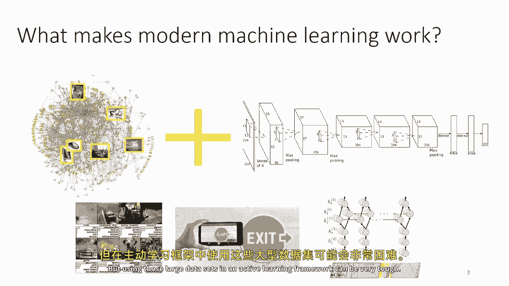
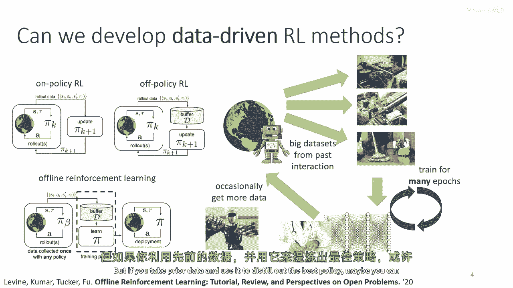
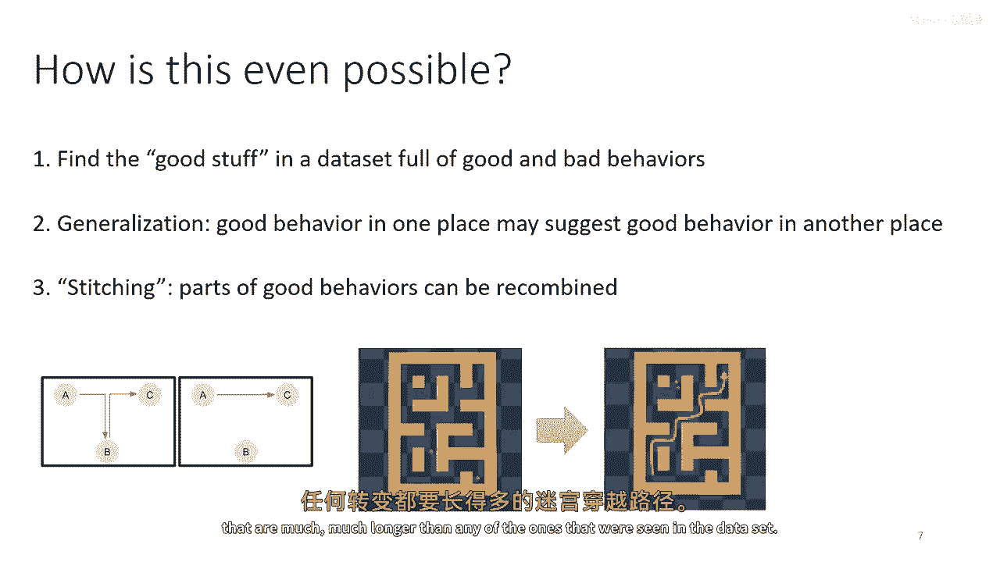
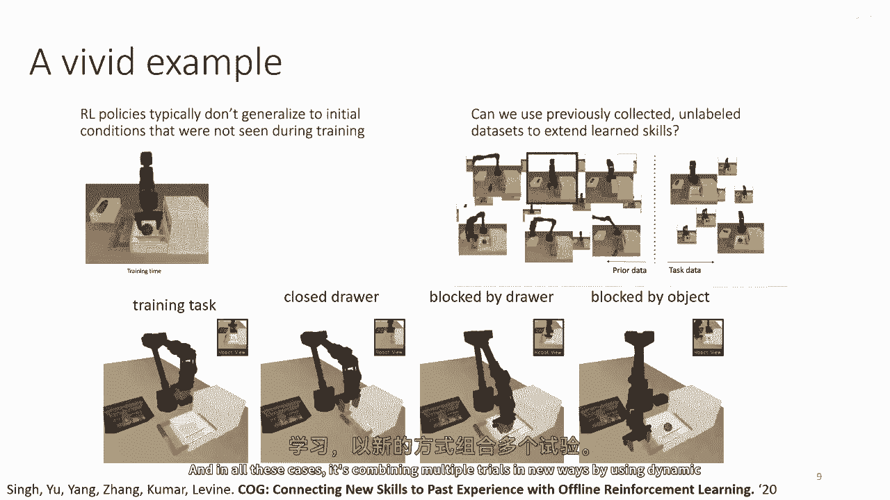
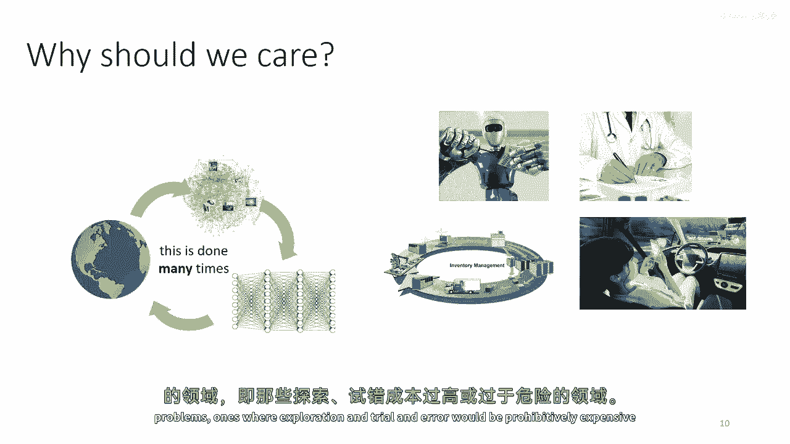
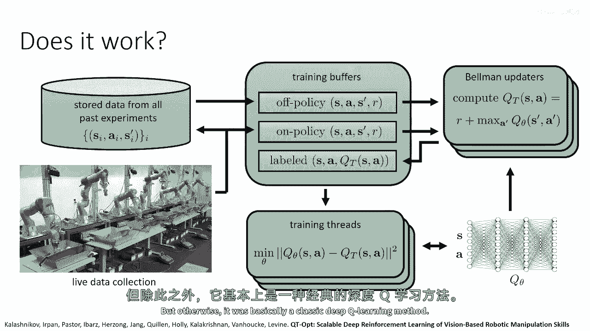
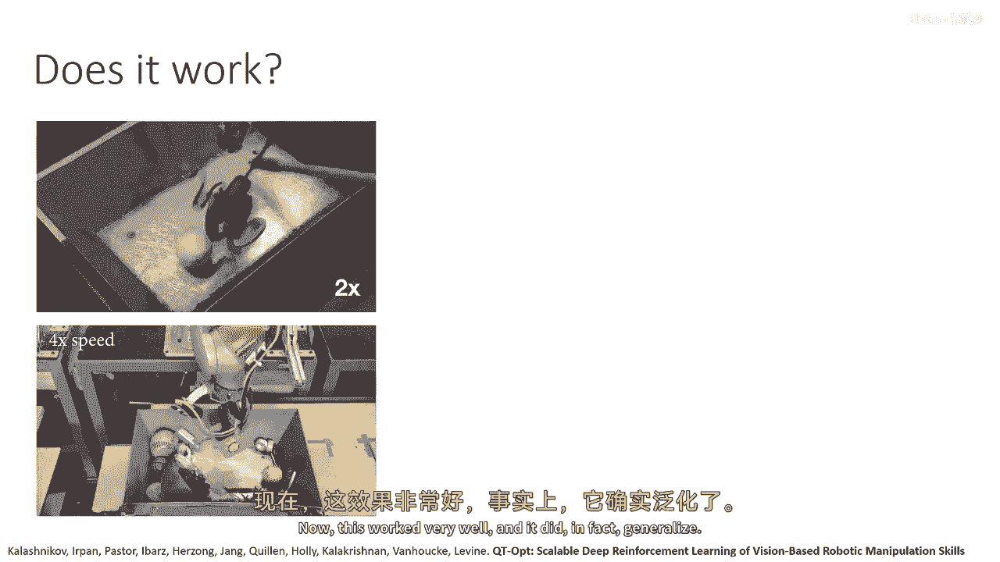
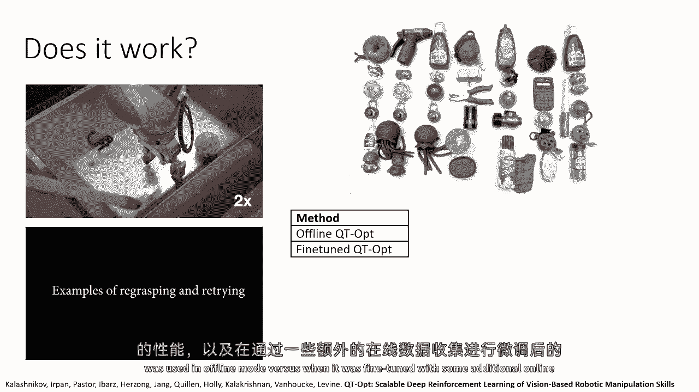
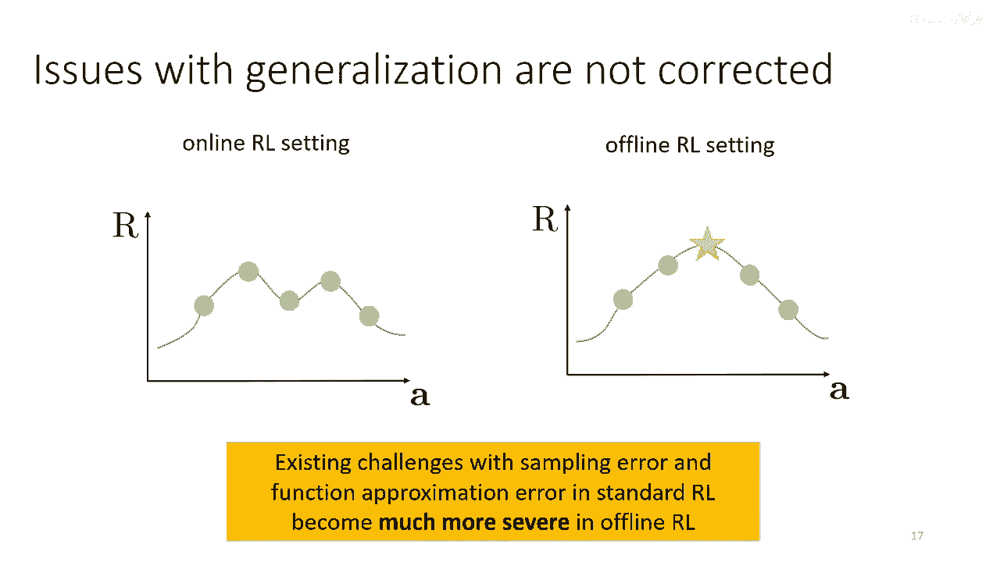

# 64：离线强化学习基础 📚

在本节课中，我们将要学习离线强化学习。我们将从动机出发，探讨其核心概念、面临的挑战，并分析为何直接应用传统的在线强化学习方法会失败。





## 概述与动机 🎯

上一节我们介绍了课程主题，本节中我们来看看为何需要离线强化学习。

当前强化学习方法在特定领域表现出色，但其应用场景与监督学习方法大相径庭。强化学习本质上是一个主动、在线的过程，无论是同策略还是异策略算法，都需要与环境持续交互、收集数据、改进策略。然而，监督学习方法（如图像识别）的成功依赖于从海量、多样的数据中学习并实现泛化。



若想使强化学习方法获得类似的泛化能力，就需要同样规模的海量数据。但在经典的在线或异策略框架下，这意味着每次迭代或每次训练都需要收集一个“ImageNet规模”的数据集，这在实际中非常困难且不切实际。

离线强化学习的基本原理是开发能够**重用先前收集的数据集**的强化学习方法，从而创建一个数据驱动的强化学习框架。这类似于监督学习：给定一个数据集，训练出最佳模型，然后部署使用，期间没有主动探索或在线交互阶段。

## 核心概念与问题定义 🔍

上一节我们讨论了离线RL的动机，本节中我们来明确其正式定义和核心概念。



我们有一个数据集 **D**，它由转移元组 **(s, a, s', r)** 构成，通常按轨迹组织。这些数据由某个未知的**行为策略 π_β** 收集。我们的目标是利用数据集 **D**，学习出**在数据支持下可能的最佳策略**，而不是整个MDP中的全局最优策略（因为数据可能未覆盖所有状态）。

以下是离线RL相关的两类主要问题：

*   **离策略评估**：给定数据集 **D**，评估某个（非行为）策略 **π** 的预期回报 **J(π)**。
*   **离线强化学习**：给定数据集 **D**，学习最佳策略 **π***。离策略评估常作为其内部子步骤。





一个关键直觉是，离线RL不仅能找出数据集中最好的行为，还能通过**泛化**和**组合**创造出比数据集中任何单一轨迹都更好的行为。例如，通过“缝合”从A到B和从B到C的轨迹，可以学会从A到C，即使从未见过完整的A到C轨迹。







## 为何离线RL具有挑战性？⚠️

上一节我们看到了离线RL的潜力，本节中我们来看看实践中直接应用已有方法会遇到什么问题。

如果我们尝试简单地运行一个标准的异策略Q学习或演员-评论家算法，但停止收集新数据（即完全离线），性能往往会急剧下降。实验表明，即使使用质量不错的离线数据，完全离线训练的策略性能也显著低于进行少量在线微调后的策略。

其根本问题在于**分布偏移**和**反事实查询**。在训练Q函数时，我们最小化的是在**行为策略 π_β** 分布下的误差。然而，当我们改进策略（例如取argmax或训练演员网络）时，我们是在**新策略 π_new** 的分布下查询并最大化Q值。**π_new** 会主动寻找能使Q值最大的动作，这类似于为神经网络制造**对抗样本**。如果某个动作在数据集中从未出现或很少出现（即**分布外动作**），Q函数对其价值的估计可能极不准确，但策略却可能选择它，导致严重的价值高估和策略性能崩溃。

简而言之，离线RL需要在**利用泛化改进策略**和**避免对分布外动作的盲目乐观**之间取得微妙的平衡。在线RL可以通过试错来纠正错误估计，而离线RL则没有这个机会。

## 总结 📝

本节课中我们一起学习了离线强化学习的基础。我们了解了其核心动机：通过重用大型静态数据集来提高数据效率、安全性并迈向更好的泛化。我们明确了离线RL的目标是学习数据支持下的最佳策略，并能通过组合与泛化超越数据集中现有的最佳行为。同时，我们也认识到直接应用在线RL算法会因分布偏移和分布外动作的价值高估问题而失败。在接下来的课程中，我们将探讨解决这些挑战的具体方法。

```python
# 示例：离线RL与在线RL的数据流对比（概念性代码）
# 在线RL (如DQN)
def online_rl_training():
    while not converged:
        # 必须持续与环境交互
        new_data = env.interact(current_policy)
        replay_buffer.add(new_data)
        # 从缓冲区采样（包含新旧数据）进行训练
        batch = replay_buffer.sample()
        update_policy(batch)



# 离线RL
def offline_rl_training(static_dataset_D):
    # 仅使用预先收集的静态数据集，无环境交互
    for batch in static_dataset_D:
        update_policy(batch)
    # 训练完成后直接部署策略
    deployed_policy = current_policy
```