# 65：离线强化学习（第二部分）——经典方法 🧠

在本节课中，我们将学习离线强化学习的经典方法，特别是基于重要性采样的技术。这些方法是该领域早期发展的基石，虽然现代方法已有改进，但理解它们有助于我们把握离线强化学习思想的演变脉络。

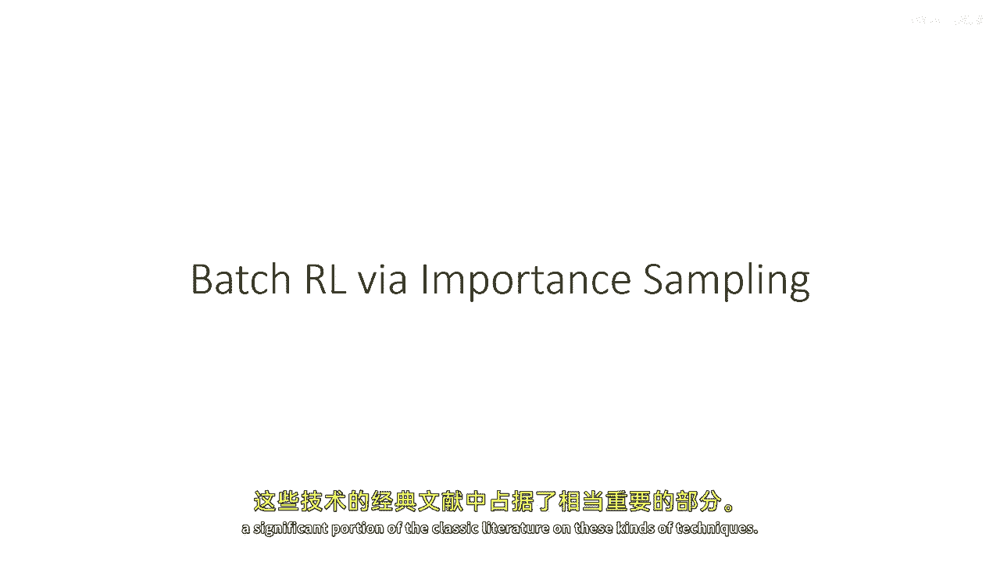

## 概述 📋

我们将首先回顾重要性采样的基本概念，并指出其在离线强化学习中直接应用时面临的核心挑战——方差爆炸问题。接着，我们将探讨一些旨在缓解该问题的技术，包括双重稳健估计器和边际重要性采样。这些方法主要用于离线策略评估，但其中的思想也为后续的策略学习算法提供了启发。

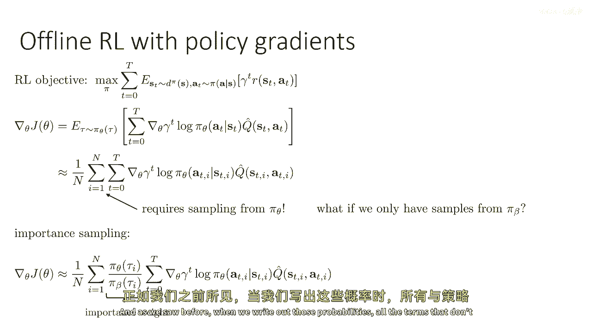

---

## 重要性采样与离线强化学习 🔄

上一节我们介绍了离线强化学习的基本设定。本节中，我们来看看如何将我们熟悉的重要性采样技术应用于此场景。

我们从强化学习的目标和策略梯度开始。策略梯度的基本形式为：

`∇θ J(θ) = Eτ∼πθ [∇θ log πθ(τ) * Q(τ)]`

估计此梯度需要从目标策略 `πθ` 中采样轨迹。然而，在离线强化学习中，我们只有从行为策略 `πβ` 收集的数据集。解决方案是使用重要性权重进行重新加权：

`∇θ J(θ) ≈ Eτ∼πβ [ (πθ(τ) / πβ(τ)) * ∇θ log πθ(τ) * Q(τ) ]`

当我们展开轨迹概率时，与策略无关的初始状态分布和状态转移概率会相互抵消，最终只剩下每个时间步动作概率的比值：

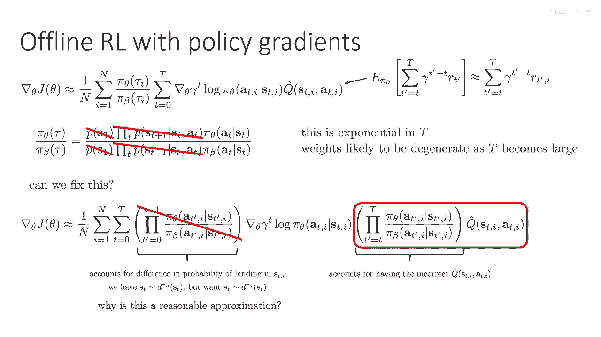

`πθ(τ) / πβ(τ) = ∏_{t=0}^{T} (πθ(at|st) / πβ(at|st))`

虽然这个估计量是无偏的，但它存在一个严重问题：重要性权重是 `T` 个比值的连乘。当轨迹长度 `T` 较大时，权重的方差会呈指数级增长。这意味着少数样本的权重会极大，而大多数样本的权重近乎为零，导致估计极不稳定，需要海量数据才能获得准确估计。

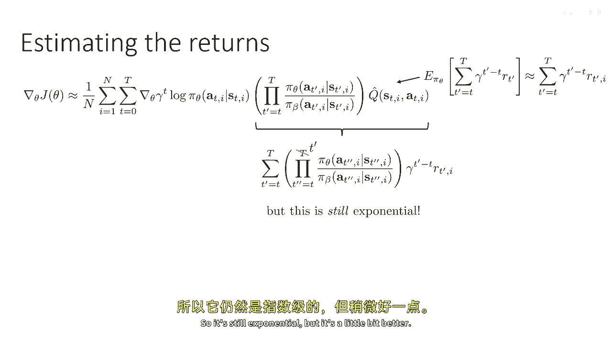

---

## 改进思路：分解与近似 🛠️

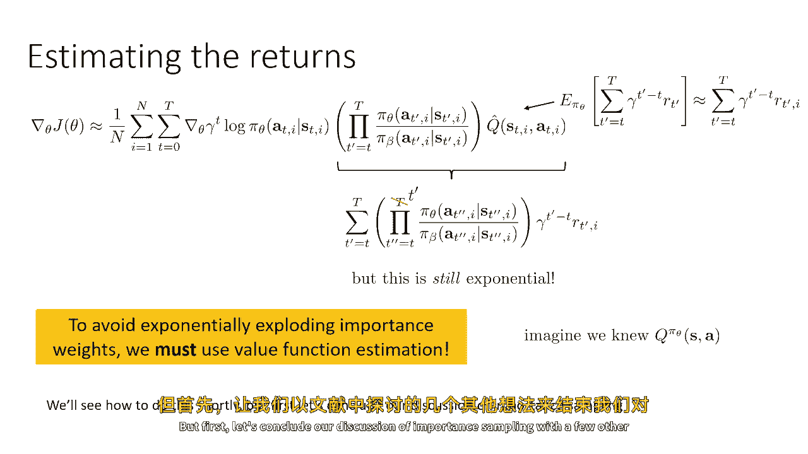

面对指数级方差，我们能否进行改进呢？一个关键的思路是将重要性权重进行分解。

我们可以将权重分为两部分：到达当前状态 `st` 之前的动作概率乘积，以及之后动作概率的乘积。前一部分反映了两种策略访问状态 `st` 的概率差异，后一部分则反映了在状态 `st` 之后，基于 `πβ` 采样的奖励与基于 `πθ` 的期望奖励之间的差异。

在诸如PPO之类的现代策略梯度方法中，通常会忽略前一部分权重。这种近似在行为策略 `πβ` 与目标策略 `πθ` 足够接近时是合理的，正如我们在高级策略梯度课程中讨论的那样。然而，在离线强化学习中，我们的目标恰恰是学习一个优于行为策略的新策略，因此这个假设通常不成立，我们不能简单地忽略这部分权重。

另一种思路是针对每个时间步的奖励进行更精细的重要性加权。对于 `t` 时刻的奖励 `rt`，理论上只需乘以从当前时刻到获得该奖励时刻之间的动作概率比值，而不是乘到轨迹结束。这略微降低了方差，但问题在根本上仍未解决——只要涉及多个时间步的连乘，方差就难以控制。

**核心结论是**：若不引入价值函数估计，则无法完全避免重要性权重带来的指数级方差问题。

---

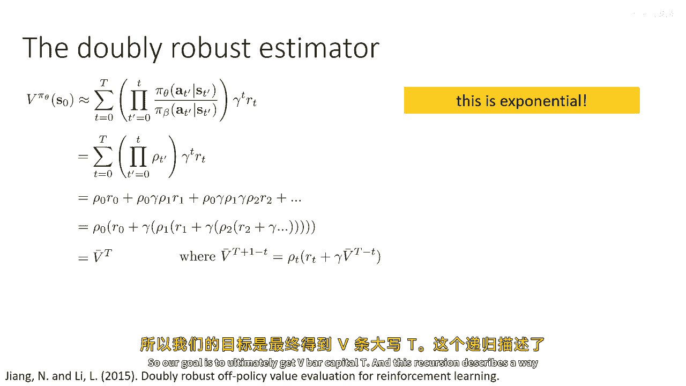

## 双重稳健估计器 🛡️

为了更有效地降低方差，我们可以借鉴上下文赌博机中的双重稳健估计器思想。

以下是双重稳健估计器的构建思路：

1.  **基本设定**：假设我们有一个对动作价值函数 `Q^πθ(s, a)` 的估计 `q_hat(s, a)`，以及由此推导出的状态价值函数估计 `v_hat(s) = E_{a∼πθ(·|s)}[q_hat(s, a)]`。
2.  **估计器形式**：对于单步（赌博机）情况，双重稳健估计器为：
    `V_DR = ρ * (r - q_hat(s, a)) + v_hat(s)`
    其中 `ρ = πθ(a|s) / πβ(a|s)` 是重要性权重。
3.  **性质**：只要 `v_hat(s)` 是 `q_hat(s, a)` 在策略 `πθ` 下的正确期望（即 `v_hat(s) = E_{a∼πθ}[q_hat(s, a)]`），该估计器对 `V^πθ(s)` 就是无偏的。同时，如果 `q_hat` 接近真实的 `Q` 函数，那么高方差的 `ρ * (r - q_hat)` 项会趋近于零，从而显著降低整体方差。

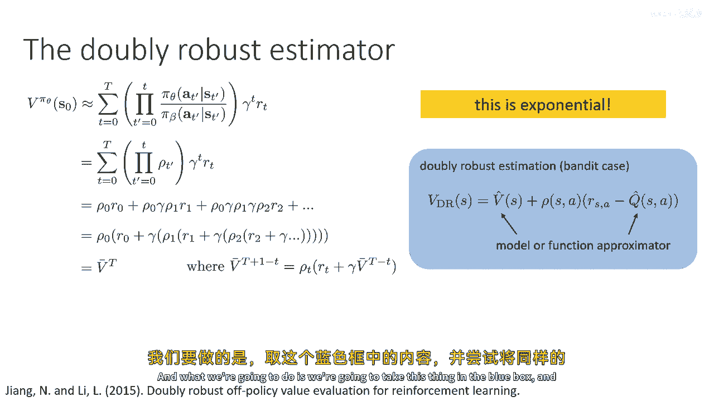

我们可以将这一思想递归地扩展到多步强化学习问题中。定义 `V_bar_DR^{T-t}` 为从时刻 `t` 开始的双重稳健价值估计，其递归形式为：

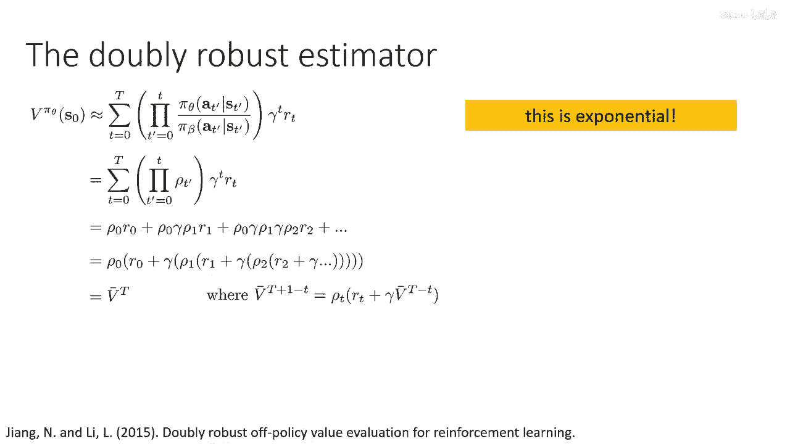

`V_bar_DR^{T-t} = ρ_t * ( r_t + γ * V_bar_DR^{T-(t+1)} - q_hat(s_t, a_t) ) + v_hat(s_t)`

通过从最后一步反向递归计算，我们可以得到初始状态的双重稳健价值估计 `V_bar_DR^T(s0)`。这种方法将重要性权重的连乘限制在单步内，并结合了函数逼近器的稳定性，从而实现了比朴素重要性采样更优的方差控制。

---

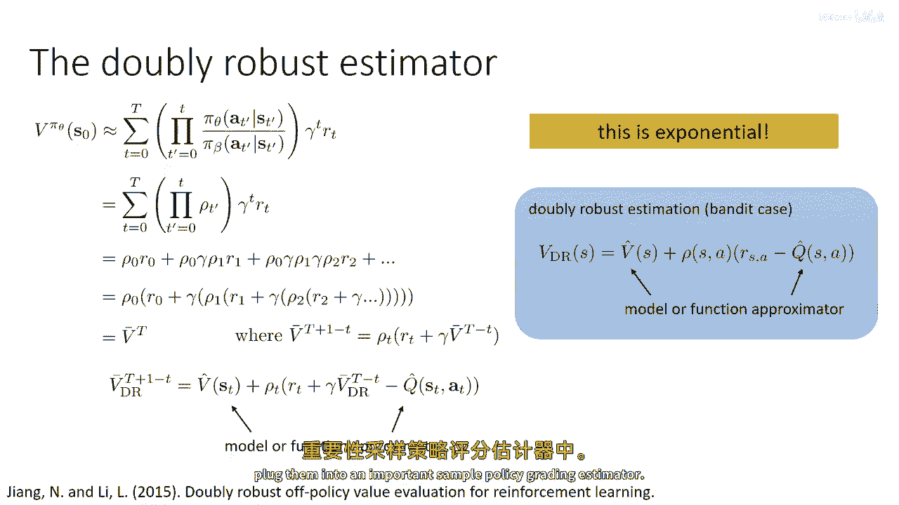

## 边际重要性采样 📊

最后，我们简要介绍另一种经典方法——边际重要性采样。其核心思想与之前有根本不同。

之前的方**法计算的是轨迹或动作的重要性权重**。而边际重要性采样试图直接估计**状态分布**或**状态-动作分布**的重要性权重：
`w(s) = d^{πθ}(s) / d^{πβ}(s)` 或 `w(s, a) = d^{πθ}(s, a) / d^{πβ}(s, a)`
其中 `d^{π}(s)` 表示策略 `π` 下的状态访问分布。

一旦估计出权重 `w(s, a)`，离线策略评估就变得非常简单：
`V^{πθ} ≈ (1/N) * Σ_{i=1}^{N} w(s_i, a_i) * r_i`

主要的挑战在于如何估计 `w(s, a)`。由于我们不知道真实的分布 `d^{πβ}` 或 `d^{πθ}`，通常的做法是为 `w` 建立一个类似于贝尔曼方程的**一致性条件**。例如，一个常见的条件是：
`d^{πβ}(s‘, a’) * w(s‘, a’) = (1-γ) d0(s’) πθ(a‘|s’) + γ * Σ_{s,a} d^{πβ}(s, a) * w(s, a) * p(s‘|s, a) * πθ(a‘|s’)`

这个方程表明，加权后的行为策略分布应等于目标策略的分布。在实践中，我们将该等式转化为一个损失函数（如最小化左右两边的均方误差），并利用数据集中的样本来近似关于 `d^{πβ}` 的期望，从而训练一个神经网络来拟合 `w(s, a)`，而无需显式建模状态分布本身。

---

## 总结 🎯

本节课我们一起学习了离线强化学习的经典方法，重点聚焦于基于重要性采样的技术。

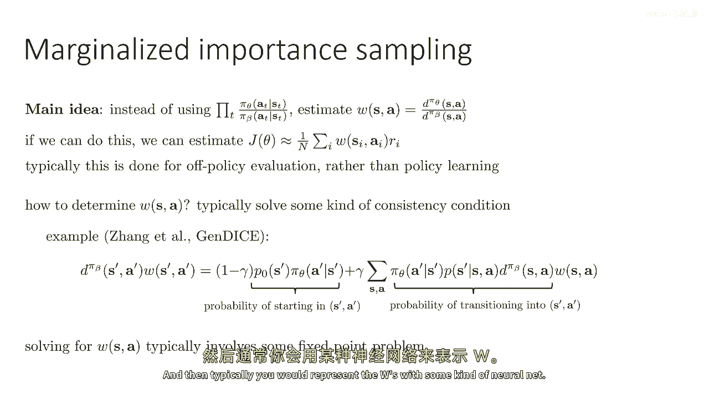

*   我们首先分析了将重要性采样直接用于离线策略梯度时面临的**指数级方差**挑战。
*   接着，我们探讨了**双重稳健估计器**，它通过引入价值函数估计并利用递归形式，在保持无偏性的同时显著降低了方差。
*   最后，我们简介了**边际重要性采样**，它通过直接估计状态分布的重要性权重来进行离线评估。

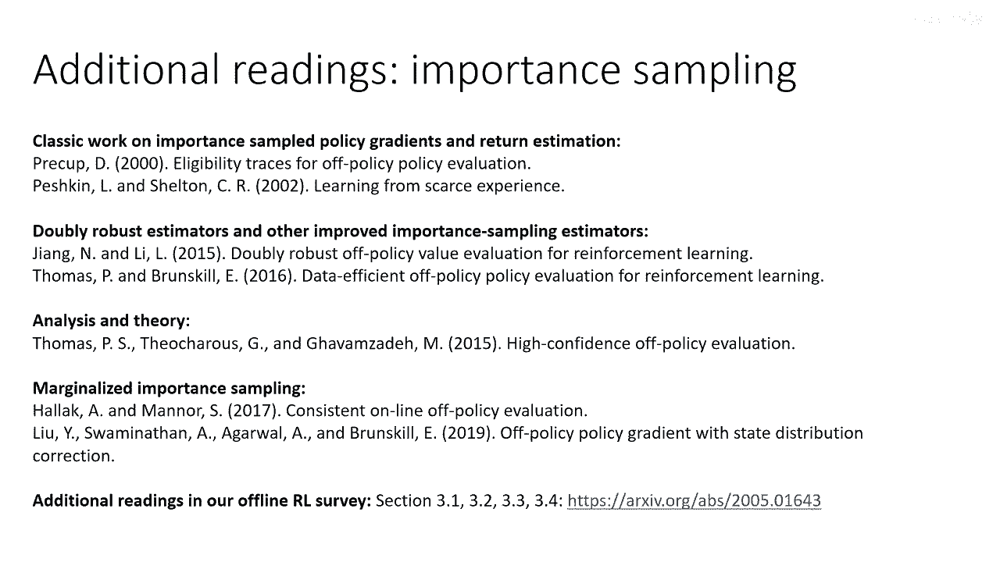

这些经典方法虽然在样本效率上可能不如现代基于动态规划的离线RL算法，但它们奠定了重要的理论基础，并且其中的思想（如双重稳健性）仍在持续影响新的研究。对于希望深入理解离线评估或处理小规模问题的研究者来说，这些技术仍然具有重要的参考价值。