# 66：离线强化学习 - 线性拟合价值函数方法 📚

在本节课中，我们将学习离线强化学习中一类经典的方法：使用线性拟合价值函数的方法。虽然现代方法通常使用深度神经网络，但理解线性方法的工作原理依然很有价值。它们不仅能提供分析工具，其闭式解也能为未来开发更有效的深度强化学习方法提供启示。

上一节我们介绍了离线强化学习的背景与核心挑战，本节中我们来看看基于线性函数近似的经典方法。

## 🔍 经典方法与现代视角

人们过去如何思考离线价值估计？经典思路是将现有的近似动态规划和Q学习思想扩展到离线设置，并使用线性函数近似器等简单近似器来推导可处理的解决方案。

人们现在如何思考？当前的研究主要致力于使用神经网络等高表达能力函数近似器来推导近似解，而主要的挑战变成了分布偏移问题。

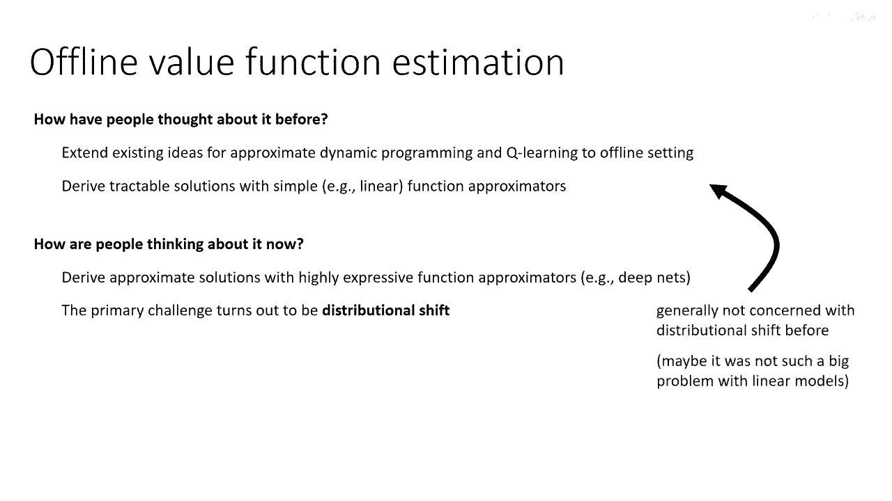

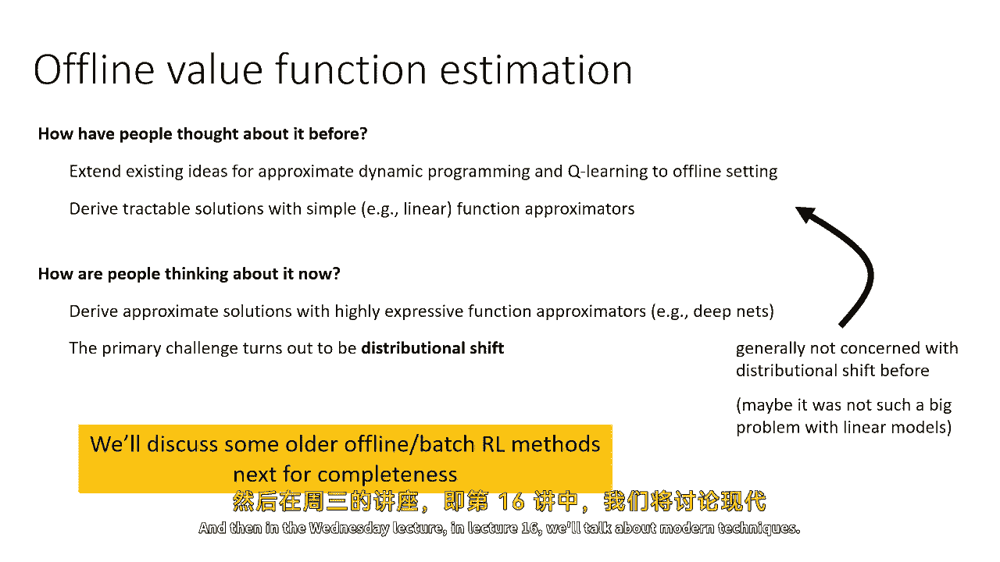

这里存在一个脱节：更经典的工作并未真正处理分布偏移。原因在于它们假设函数近似器非常简单。因此，在给定一组良好特征的情况下，分布偏移的负面影响不会太严重。而对于深度网络，由于其强大的表达能力，分布偏移的负面影响会非常大。所以，让这些方法表现更好的因素，也加剧了分布偏移的挑战。

这意味着接下来讨论的技术不会以任何有意义的方式解决分布偏移问题。它们只是直接解决如何从批量数据中估计价值函数的问题。因此，如果将这些技术与深度网络一起使用，由于本讲座第一部分提到的原因，它们将无法正常工作。

接下来，为了内容的完整性，我将讨论这些较旧的方法。然后在第16讲中，我们将讨论现代技术。

## 📊 热身：线性模型与特征矩阵

让我们先做个热身，谈谈线性模型。这看似有点跑题，但我很快会将其与基于价值的方法联系起来。

假设你有一个特征矩阵。这个特征矩阵的维度是 `S x K`，其中 `S` 是状态的数量（我们讨论的是离散状态MDP），`K` 是特征的数量。你可以将其视为一个向量值函数 `Φ(s)`，对于每个状态 `s` 给出一个 `K` 维特征向量。你也可以将其视为一个有 `K` 列的矩阵，每列对应一个特征在所有状态上的取值。

我们能在特征空间中做离线基于模型的强化学习吗？做基于模型的强化学习需要什么？我们需要根据特征来估计奖励和转移，然后恢复价值函数，再用其改进策略。

我们将使用线性函数近似来完成所有事情。这意味着我们假设奖励可以合理地表示为特征的线性函数：存在某个权重向量 `w_r`，使得 `Φ * w_r` 近似于真实奖励 `R`。`Φ` 是一个行数等于状态数的矩阵。`R` 是长度等于状态数的向量。`w_r` 是长度等于特征数 `K` 的权重向量。

以下是 `w_r` 的最小二乘解。这只是基础统计学中的正规方程：
`w_r = (Φ^T Φ)^{-1} Φ^T R`

我们还需要一个转移模型。转移模型描述了当前的特征如何变成下一时刻的特征。就像我们可以通过乘以权重 `w_r` 将 `Φ` 变为 `R` 一样，我们可以通过乘以某个转移概率矩阵 `P_Φ` 将 `Φ` 变为未来的 `Φ`。

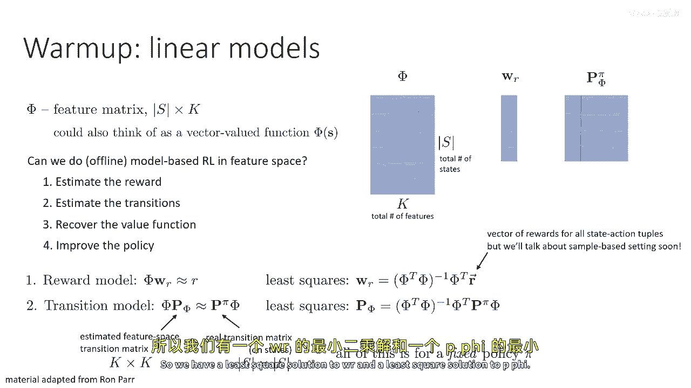

我们试图近似的是真实转移矩阵 `P^π` 对 `Φ` 的影响。真实状态转移矩阵 `P^π` 是 `S x S` 的，它描述了状态之间的转移。`P^π` 依赖于策略 `π`。我们希望找到一个特征空间转移矩阵 `P_Φ`（大小为 `K x K`），使得 `Φ * P_Φ` 尽可能接近 `P^π * Φ`。`P^π * Φ` 给出了在策略 `π` 下，下一时刻状态的期望特征。

求解 `P_Φ` 的方法与之前相同，也是最小二乘，只是目标值现在是 `P^π * Φ` 而非 `R`。

## 🧮 从模型到价值函数估计

现在，我们有了奖励模型和转移模型，接下来尝试估计价值函数。

假设我们的价值函数也是 `Φ` 的线性函数。这意味着价值函数 `V^π` 可以写成 `Φ * w_v`，其中 `w_v` 是某个权重向量。

这里有一个有用的公式。我们可以将贝尔曼方程写成向量形式：`V^π = R + γ P^π V^π`。这是一个线性方程组。通过移项，我们可以得到：
`V^π = (I - γ P^π)^{-1} R`
其中 `I` 是单位矩阵。可以证明 `(I - γ P^π)` 总是可逆的，因此解存在且唯一。

我们可以将同样的思想应用到特征空间。在特征空间中，我们可以写出特征空间的贝尔曼方程，并通过相同的逻辑得到：
`w_v = (I - γ P_Φ)^{-1} w_r`
我们用 `w_r` 替换了 `R`，用 `P_Φ` 替换了 `P^π`。

现在，让我们把之前推导出的 `w_r` 和 `P_Φ` 的方程代入到这个 `w_v` 的方程中。经过一些代数简化（此处不展开），我们得到了一个著名的公式，称为**最小二乘时序差分**：
`w_v = (Φ^T (Φ - γ Φ'))^{-1} Φ^T R`
其中 `Φ'` 对应下一时刻的特征。LSTD公式将特定策略 `π` 的转移、奖励向量 `R` 以及特征矩阵 `Φ` 与策略 `π` 的价值函数权重联系起来。

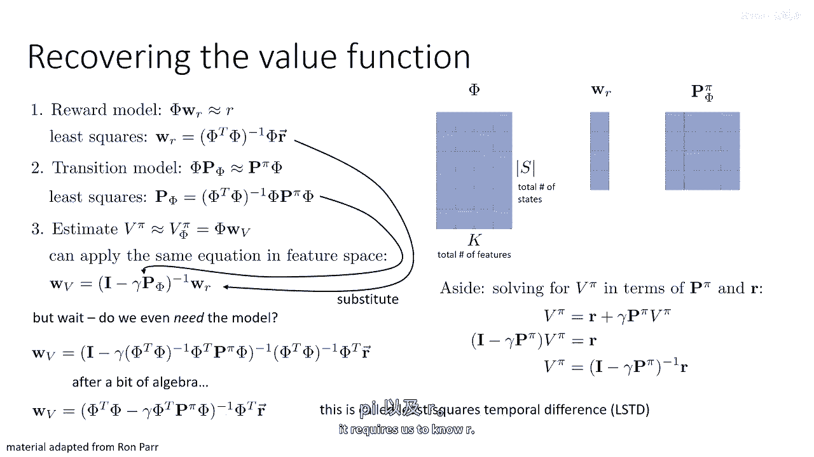

## 🎯 基于样本的估计与LSPI算法

上述方法需要知道 `P^π` 和 `R`。接下来，我们将用样本来替换这一切，从而得到一种完全免模型的方法来求解 `w_v`。

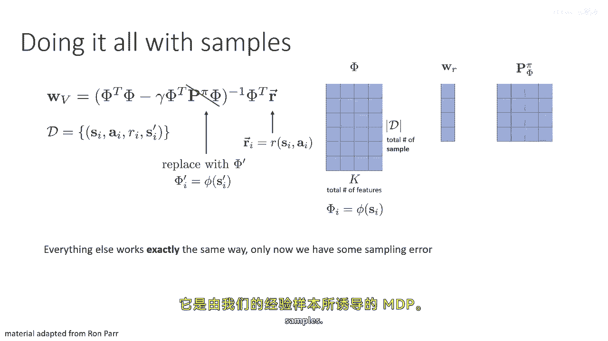

我们的样本由一组转移 `(s, a, r, s')` 构成，即离线数据集。我们要做的是用样本集替换状态集。以前矩阵 `Φ` 的每一行对应一个状态，现在每一行对应一个样本。我们用下一时刻状态 `s'` 的特征 `φ(s')`（记作 `Φ'`）来替换 `P^π Φ`。同样，我们用样本奖励向量替换奖励向量 `R`。

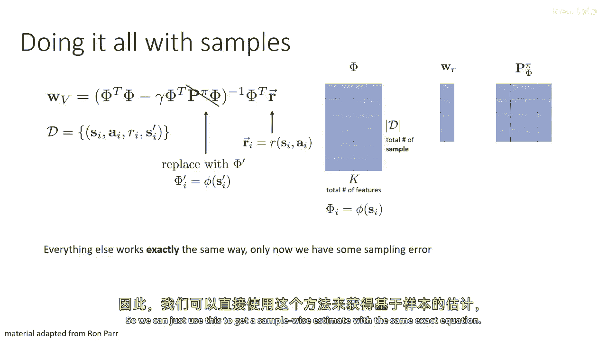

这样，一切仍然以完全相同的方式工作，只是现在我们会引入一些采样误差。我们可以使用这个方法来获得基于样本的估计，方程形式完全相同。

现在，让我们将其转化为一个完整的算法。之前我们说估计奖励、估计转移、恢复价值函数然后改进策略。但现在，我们将直接用这个LSTD方程来完成前三步。

但这里有个问题：LSTD估计的是收集数据所用策略 `π` 的价值函数。而我们想评估的是我们正在学习的另一个策略。为了解决这个问题，我们转向估计Q函数，而不是价值函数。

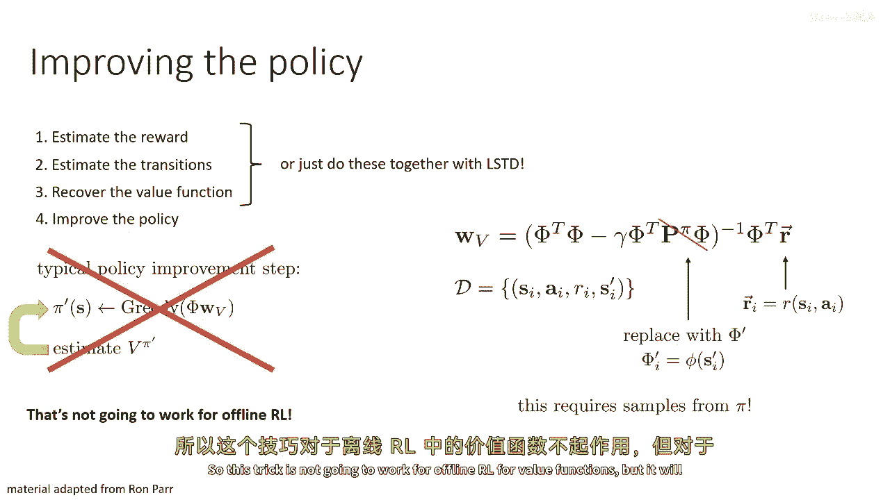

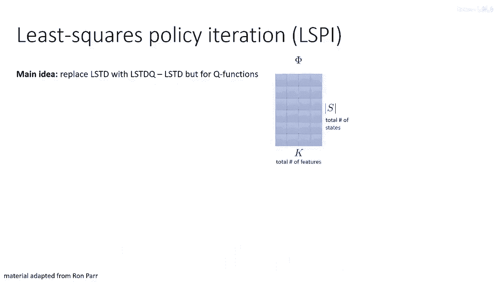

这就引出了**最小二乘策略迭代**（LSPI），这是一种我们可以仅使用先前收集的数据进行的实际离线强化学习方法。主要思想是将LSTD扩展到Q函数，称为LSTD-Q。

现在，我们拥有的是状态-动作特征，而不是状态特征。特征矩阵 `Φ` 的行数变为 `S x A`。我们可以为每个可能的动作设置不同的特征副本。其他所有步骤都完全保持不变。

以下是LSPI算法的步骤：
1.  对于当前策略 `π_k`，使用LSTD-Q公式计算其Q函数的权重 `w_q`。
2.  计算一个新策略 `π_{k+1}`，它是相对于 `w_q` 所代表的Q函数的贪婪策略。
3.  将 `Φ'` 更新为使用新策略 `π_{k+1}` 在下一状态 `s'` 所采取动作的特征。
4.  重复步骤1-3。

## ⚠️ 线性方法的局限与总结

那么，这一切在实践中有什么问题呢？问题在于我们之前讨论过的**分布偏移问题**。这种线性方法（当然可以将其重新推导用于非线性系统并进行某种迭代）并没有解决分布偏移问题。

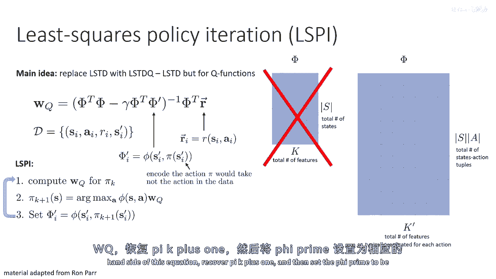

因为它本质上只是在训练集上进行经验风险最小化（最小二乘）。这意味着我们之前谈到的所有问题，例如通过最大化策略来发现对抗样本，仍然会影响你。具体影响在算法的第二步（取argmax）中体现。

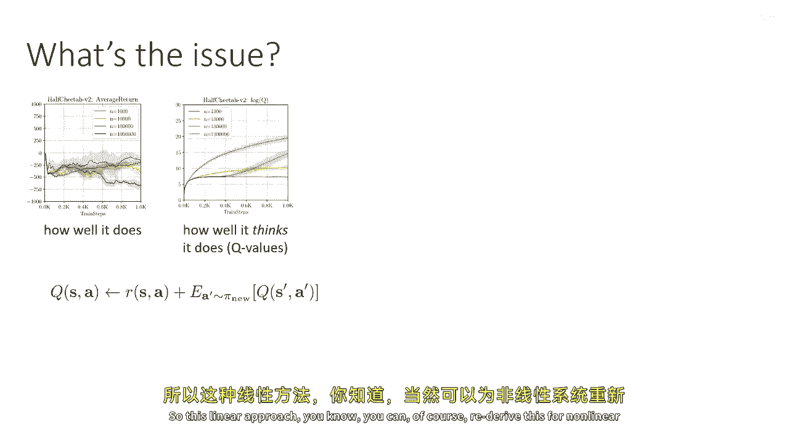

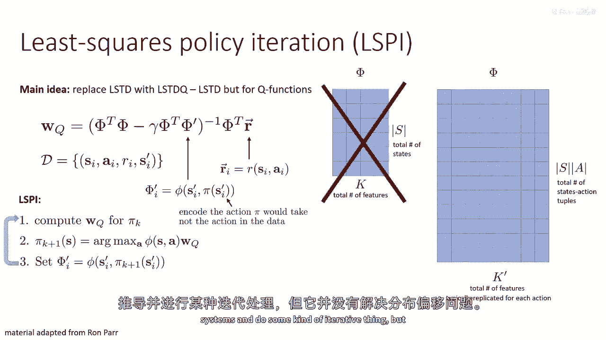

总的来说，所有近似动态规划方法（拟合价值迭代、Q迭代等）都会受到这种动作分布偏移的影响，我们必须修复它。

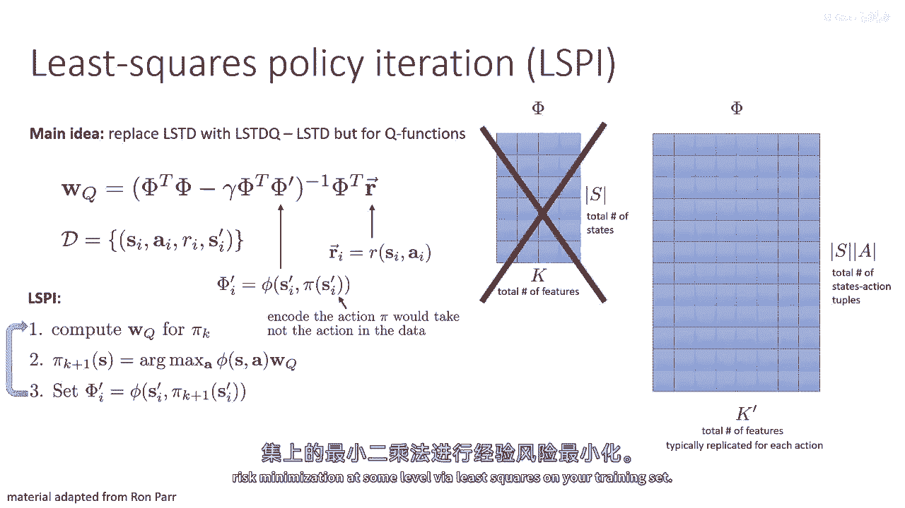

理解这些线性方法是有益的，因为它们为分析提供了有用的工具，并为我们如何发展到今天的技术提供了良好的视角。但它们本身并没有为我们提供在实际深度强化学习设置中进行离线强化学习的强大工具。如何正确地做到这一点，将是下一讲的内容。

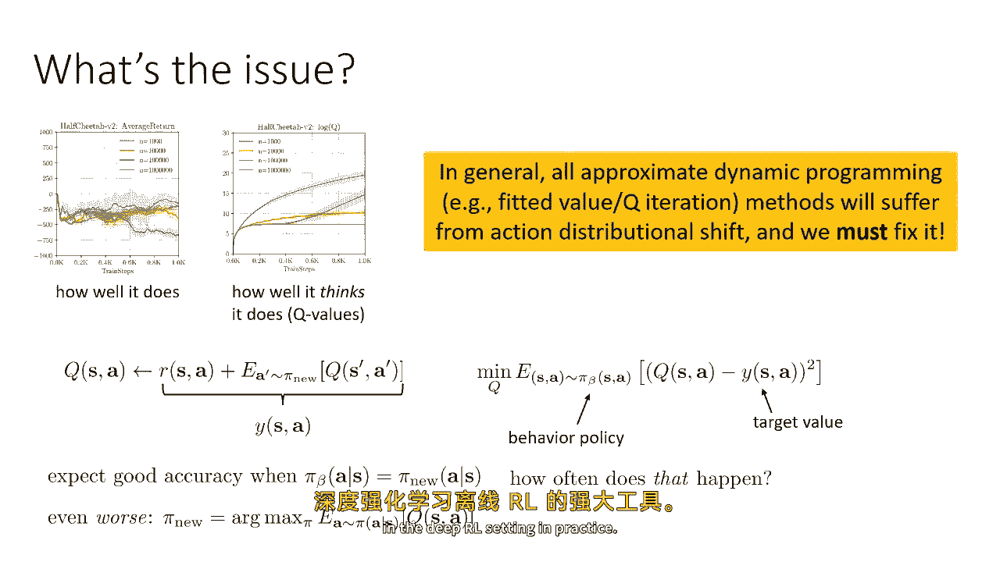

**本节课总结**：我们一起学习了离线强化学习中经典的线性拟合价值函数方法，包括从特征空间模型推导到LSTD和LSPI算法。我们看到了如何用样本实现免模型估计，也明确了这些经典方法因未处理分布偏移问题而在深度网络应用中受限。这为后续学习现代离线强化学习技术奠定了基础。